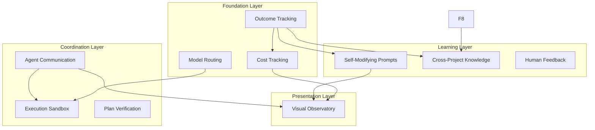

## Aether 2.0 - Paradigm Shift Implementation Plan

### Executive Summary

Transform Aether from "fancy prompt templates" into a "learning autonomous system" by implementing 10 paradigm-shifting features. This plan establishes a research directory, phases each feature, and defines integration with the existing system.

---

## Phase 0: Research Infrastructure

### 0.1 Create Research Directory Structure

```
.aether/
├── research/                          # NEW: Research and development
│   ├── 2.0-roadmap/                   # Master roadmap
│   │   ├── ROADMAP.md                 # Overall plan
│   │   ├── DEPENDENCIES.md            # Feature dependencies
│   │   └── PROGRESS.md                # Tracking progress
│   │
│   ├── F1-model-routing/              # Feature 1: Actual model routing
│   │   ├── RESEARCH.md                # Findings and decisions
│   │   ├── IMPLEMENTATION.md          # Implementation plan
│   │   └── prototype/                 # Working prototypes
│   │
│   ├── F2-outcome-learning/           # Feature 2: RL from outcomes
│   ├── F3-self-modifying-prompts/     # Feature 3: Evolving prompts
│   ├── F4-agent-communication/        # Feature 4: Message bus
│   ├── F5-execution-sandbox/          # Feature 5: Real tooling
│   ├── F6-cross-project-knowledge/    # Feature 6: Knowledge transfer
│   ├── F7-cost-optimization/          # Feature 7: Cost tracking
│   ├── F8-human-feedback/             # Feature 8: RLHF
│   ├── F9-visual-observatory/          # Feature 9: Dashboard
│   └── F10-plan-verification/         # Feature 10: Formal verification
│
└── v2/                                # NEW: Version 2 implementation
    ├── core/                          # New core modules
    ├── agents/                        # Enhanced agent system
    └── integrations/                  # External integrations
```

---

## Feature 1: Actual Model Routing Infrastructure

### Research Questions

1. How does LiteLLM proxy handle request routing?
2. What header/parameter patterns work for agent-type routing?
3. How do we track per-agent costs and latency?
4. What's the minimal viable proxy configuration?

### Research Tasks

- Study LiteLLM proxy documentation and source code
- Test routing with custom headers (`X-Agent-Type`)
- Benchmark latency for different routing strategies
- Design telemetry collection schema
- Compare: header-based vs model-alias vs custom proxy

### Implementation Plan

**Phase 1A: Proxy Configuration (2 days)**

```yaml
# .aether/v2/proxy/routing.yaml
router:
  - agent_type: builder
    model: kimi-k2.5
    timeout: 120s
    
  - agent_type: oracle
    model: glm-5
    timeout: 300s
    
  - agent_type: scout
    model: minimax-2.5
    timeout: 60s
```

**Phase 1B: Request Interceptor (3 days)**

```javascript
// bin/v2/request-router.js
class RequestRouter {
  route(request) {
    const agentType = request.headers['x-agent-type'];
    const model = this.config.getMapping(agentType);
    const startTime = Date.now();
    
    // Route request
    const response = await this.proxy.forward(request, model);
    
    // Record telemetry
    await this.telemetry.record({
      agent_type: agentType,
      model: model,
      latency_ms: Date.now() - startTime,
      tokens_used: response.usage,
      success: response.ok
    });
    
    return response;
  }
}
```

**Phase 1C: Integration with Task Tool (2 days)**

- Modify build.md to set agent-type header
- Update spawn-with-model.sh to use new router
- Add telemetry display to /ant:status

### Integration Points

- `.aether/model-profiles.yaml` → becomes routing config
- `bin/lib/telemetry.js` → enhanced for per-agent tracking
- `.claude/commands/ant/build.md` → set agent headers

---

## Feature 2: Reinforcement Learning from Outcomes

### Research Questions

1. What data schema captures task outcomes effectively?
2. How do we measure "success" for different task types?
3. What ML approach works with limited training data?
4. How do we avoid bias from user ratings?

### Research Tasks

- Survey RL approaches for small datasets
- Design outcome schema with all relevant features
- Research bandit algorithms for model selection
- Study transfer learning from code completion models
- Design A/B testing framework for agent selection

### Implementation Plan

**Phase 2A: Outcome Schema (1 day)**

```javascript
// bin/v2/outcome-tracker.js
const OutcomeSchema = {
  task_id: String,
  task_type: ['implement', 'refactor', 'debug', 'test', 'research'],
  agent_type: String,
  model_used: String,
  
  // Estimates vs actuals
  estimated_complexity: Number,  // 1-10
  actual_complexity: Number,
  estimated_time_ms: Number,
  actual_time_ms: Number,
  
  // Results
  result: ['success', 'partial', 'failed'],
  files_changed: Number,
  tests_added: Number,
  tests_passed: Number,
  bugs_introduced: Number,
  
  // Feedback
  user_rating: Number,  // 1-5 or null
  user_feedback: String,  // optional text
  
  // Context
  codebase_size: Number,  // lines of code
  tech_stack: [String],
  timestamp: Date
};
```

**Phase 2B: Data Collection (2 days)**

```javascript
// Integrate into continue.md verification step
async function recordOutcome(phase, tasks, results) {
  for (const task of tasks) {
    await outcomeTracker.record({
      task_id: task.id,
      task_type: classifyTask(task.description),
      agent_type: task.assigned_agent,
      model_used: task.model,
      actual_complexity: inferComplexity(results),
      result: results.success ? 'success' : 'partial',
      // ... other fields
    });
  }
}
```

**Phase 2C: Learning Model (3 days)**

```python
# bin/v2/agent-recommender.py
class AgentRecommender:
    def recommend(self, task_type, complexity, tech_stack):
        # Query historical outcomes
        outcomes = self.query_outcomes(task_type)
        
        # Compute success rates per agent/model
        scores = {}
        for agent in ['builder', 'scout', 'oracle']:
            agent_outcomes = filter(lambda o: o.agent_type == agent, outcomes)
            success_rate = sum(o.result == 'success' for o in agent_outcomes) / len(agent_outcomes)
            avg_time = mean(o.actual_time_ms for o in agent_outcomes)
            
            # Weighted score: 70% success rate, 30% speed
            scores[agent] = 0.7 * success_rate + 0.3 * (1 / avg_time)
        
        return max(scores, key=scores.get), scores
```

### Integration Points

- `.aether/data/outcomes.json` → new data file
- `.claude/commands/ant/continue.md` → record after verification
- `.claude/commands/ant/build.md` → query for agent selection

---

## Feature 3: Self-Modifying Prompts

### Research Questions

1. How do we safely modify prompt templates?
2. What patterns are learnable from execution history?
3. How do we version and rollback prompt changes?
4. What's the review process for auto-modifications?

### Research Tasks

- Design prompt template versioning system
- Research pattern extraction from logs
- Study prompt optimization techniques
- Design human review workflow for changes
- Test A/B comparison of prompt variants

### Implementation Plan

**Phase 3A: Pattern Detection (2 days)**

```javascript
// bin/v2/pattern-learner.js
class PatternLearner {
  async learnFromHistory(outcomes) {
    // Find patterns in successful/failed tasks
    const patterns = [];
    
    // Pattern: trigger phrases → better approaches
    const triggerPhrases = this.extractTriggers(outcomes);
    for (const phrase of triggerPhrases) {
      const withPhrase = outcomes.filter(o => o.description.includes(phrase));
      const successRate = withPhrase.filter(o => o.result === 'success').length / withPhrase.length;
      
      if (successRate > 0.8 && withPhrase.length >= 5) {
        patterns.push({
          trigger: phrase,
          recommendation: this.extractCommonApproach(withPhrase),
          confidence: successRate,
          learned_from: withPhrase.length
        });
      }
    }
    
    return patterns;
  }
}
```

**Phase 3B: Pattern Storage (1 day)**

```yaml
# .aether/v2/learned-patterns.yaml
version: 1
patterns:
  - id: "react-tests"
    trigger: "React component tests failing"
    action: "Use @testing-library/react, check for async updates"
    confidence: 0.89
    learned_from: 12
    last_updated: "2026-02-15"
    
  - id: "auth-rate-limit"
    trigger: "authentication API"
    action: "Always add rate limiting to auth endpoints"
    confidence: 0.95
    learned_from: 8
    source: "user_feedback"
```

**Phase 3C: Prompt Injection (2 days)**

```javascript
// Modify prompt templates to include learned patterns
function buildWorkerPrompt(basePrompt, task, learnedPatterns) {
  const relevantPatterns = learnedPatterns.filter(p => 
    task.description.toLowerCase().includes(p.trigger.toLowerCase())
  );
  
  if (relevantPatterns.length > 0) {
    return `${basePrompt}

--- LEARNED PATTERNS (auto-detected as relevant) ---
${relevantPatterns.map(p => `- ${p.action} (confidence: ${p.confidence})`).join('\n')}
--- END LEARNED PATTERNS ---`;
  }
  
  return basePrompt;
}
```

### Integration Points

- `.aether/v2/learned-patterns.yaml` → new config
- `.claude/commands/ant/build.md` → inject patterns into worker prompts
- `.aether/workers.md` → reference pattern system

---

## Feature 4: Agent-to-Agent Communication Protocol

### Research Questions

1. What message bus architecture fits Claude Code constraints?
2. How do agents discover each other's capabilities?
3. What's the addressing scheme for agents?
4. How do we handle agent failures in the communication chain?

### Research Tasks

- Study message bus patterns (pub/sub, request/reply)
- Design agent addressing and discovery
- Research offline message handling
- Design capability advertisement protocol
- Test message ordering guarantees

### Implementation Plan

**Phase 4A: Message Bus Core (3 days)**

```javascript
// bin/v2/colony-bus.js
class ColonyBus {
  constructor() {
    this.channels = new Map();  // channel → [handlers]
    this.messageLog = [];       // for debugging/replay
  }
  
  // Agent subscribes to a channel
  subscribe(channel, agentId, handler) {
    if (!this.channels.has(channel)) {
      this.channels.set(channel, []);
    }
    this.channels.get(channel).push({ agentId, handler });
  }
  
  // Agent publishes a message
  async publish(channel, message) {
    const logged = {
      id: uuid(),
      channel,
      from: message.from,
      to: message.to || 'broadcast',
      payload: message.payload,
      timestamp: Date.now()
    };
    this.messageLog.push(logged);
    
    const handlers = this.channels.get(channel) || [];
    for (const { handler } of handlers) {
      await handler(logged);
    }
  }
}

// Predefined channels
const CHANNELS = {
  'colony.tasks.available': 'New tasks ready for pickup',
  'colony.tasks.completed': 'Task finished',
  'colony.research.needed': 'Scout needed for research',
  'colony.verification.request': 'Watcher requested',
  'colony.errors.critical': 'Error needs attention',
  'colony.state.changed': 'State updated'
};
```

**Phase 4B: Agent Discovery (2 days)**

```javascript
// Agents register their capabilities
const agentRegistry = {
  'builder-hammer-42': {
    type: 'builder',
    capabilities: ['implement', 'refactor', 'debug'],
    status: 'available',
    current_task: null,
    depth: 1,
    parent: 'queen'
  },
  'scout-quest-17': {
    type: 'scout', 
    capabilities: ['research', 'explore', 'document'],
    status: 'busy',
    current_task: 'task-123',
    depth: 2,
    parent: 'builder-hammer-42'
  }
};
```

**Phase 4C: Coordination Protocol (2 days)**

```markdown
# Example: Builder requests research

1. Builder publishes to 'colony.research.needed':
   {
     from: 'builder-hammer-42',
     payload: {
       topic: 'JWT refresh token best practices',
       urgency: 'high',
       context: 'Building auth module'
     }
   }

2. Available scouts receive message
3. First scout to respond claims the task
4. Scout publishes result to 'colony.research.completed'
5. Builder receives and continues
```

### Integration Points

- `.aether/v2/colony-bus.js` → new module
- `.claude/commands/ant/build.md` → use bus for coordination
- `.aether/data/message-log.json` → message history

---

## Feature 5: Execution Sandbox with Real Tooling

### Research Questions

1. What containerization approach works best? (Docker, Firecracker, gVisor)
2. How do we limit resource usage safely?
3. How do agents interact with the sandbox?
4. What's the security model for file system access?

### Research Tasks

- Compare container runtimes for safety
- Design resource limit enforcement
- Research file system mapping strategies
- Design API for sandbox interaction
- Test security boundaries

### Implementation Plan

**Phase 5A: Sandbox Configuration (2 days)**

```yaml
# .aether/v2/sandbox/config.yaml
runtime: docker  # or firecracker, gvisor

defaults:
  cpu_limit: "0.5"
  memory_limit: "512MB"
  timeout_seconds: 300
  network: none  # no network by default
  
  tools:
    - git
    - npm
    - node
    - python3
    - pytest
    
  mount_points:
    - host: "${PROJECT_ROOT}/src"
      container: "/workspace/src"
      mode: "rw"
      
    - host: "${PROJECT_ROOT}/tests"
      container: "/workspace/tests"
      mode: "rw"
```

**Phase 5B: Sandbox Manager (3 days)**

```javascript
// bin/v2/sandbox/manager.js
class SandboxManager {
  async createSandbox(taskId, config) {
    const container = await docker.createContainer({
      Image: 'aether-sandbox:latest',
      Cmd: ['/bin/bash', '-c', 'sleep infinity'],
      HostConfig: {
        CpuQuota: config.cpu_limit * 100000,
        Memory: config.memory_limit,
        NetworkMode: config.network,
        Binds: config.mount_points.map(m => `${m.host}:${m.container}:${m.mode}`)
      },
      Env: [
        `TASK_ID=${taskId}`,
        `TIMEOUT=${config.timeout_seconds}`
      ]
    });
    
    await container.start();
    return new Sandbox(container, taskId);
  }
}

class Sandbox {
  async execute(command) {
    const exec = await this.container.exec({
      Cmd: command.split(' '),
      AttachStdout: true,
      AttachStderr: true
    });
    
    const stream = await exec.start();
    return this.collectOutput(stream);
  }
  
  async writeFile(path, content) {
    // Write file into container
  }
  
  async readFile(path) {
    // Read file from container
  }
}
```

**Phase 5C: Agent Sandbox Interface (2 days)**

```javascript
// Agents interact with sandbox through this API
const sandbox = await sandboxManager.createSandbox(task.id, config);

// Write initial code
await sandbox.writeFile('/workspace/src/auth.ts', code);

// Run tests
const result = await sandbox.execute('npm test');
if (result.exitCode !== 0) {
  // Agent sees real test failure
  // Can iterate until tests pass
}

// Read back modified files
const finalCode = await sandbox.readFile('/workspace/src/auth.ts');

// Cleanup
await sandbox.destroy();
```

### Integration Points

- `.aether/v2/sandbox/` → new sandbox module
- `.claude/commands/ant/build.md` → use sandbox for builders
- `Dockerfile` → sandbox image definition

---

## Feature 6: Cross-Project Knowledge Transfer

### Research Questions

1. What embedding model works best for code patterns?
2. How do we store and query vector embeddings efficiently?
3. What knowledge should transfer vs stay project-specific?
4. How do we handle knowledge conflicts between projects?

### Research Tasks

- Compare vector databases (Pinecone, Weaviate, Chroma, pgvector)
- Test code embedding models
- Design knowledge schema and categories
- Research knowledge conflict resolution
- Design privacy controls for shared knowledge

### Implementation Plan

**Phase 6A: Knowledge Schema (2 days)**

```javascript
// bin/v2/knowledge/schema.js
const KnowledgeSchema = {
  id: String,
  type: ['pattern', 'anti-pattern', 'preference', 'correction', 'insight'],
  
  content: {
    description: String,      // What the knowledge is
    code_example: String,     // Optional code
    applies_to: [String],     // Tech stacks, languages
  },
  
  provenance: {
    source_project: String,
    learned_date: Date,
    times_applied: Number,
    success_rate: Number,
    user_confirmed: Boolean
  },
  
  embedding: {
    vector: [Number],         // 1536 dimensions for OpenAI
    model: String,            // Which embedding model
    text_hash: String         // For deduplication
  }
};
```

**Phase 6B: Knowledge Store (3 days)**

```javascript
// bin/v2/knowledge/store.js
class KnowledgeStore {
  constructor(vectorDb) {
    this.db = vectorDb;
  }
  
  async addKnowledge(knowledge) {
    // Generate embedding
    const embedding = await this.embed(knowledge.description);
    
    // Store with metadata
    await this.db.upsert({
      id: knowledge.id,
      values: embedding,
      metadata: {
        type: knowledge.type,
        applies_to: knowledge.applies_to.join(','),
        success_rate: knowledge.provenance.success_rate,
        source_project: knowledge.provenance.source_project
      }
    });
  }
  
  async findRelevant(query, techStack, topK = 5) {
    const queryEmbedding = await this.embed(query);
    
    const results = await this.db.query({
      vector: queryEmbedding,
      topK: topK,
      filter: {
        applies_to: { $in: techStack }
      }
    });
    
    return results.matches.map(m => this.hydrate(m.id));
  }
}
```

**Phase 6C: Knowledge Transfer Protocol (2 days)**

```javascript
// When starting a new project, transfer relevant knowledge
async function initializeProjectKnowledge(goal, techStack) {
  const store = new KnowledgeStore();
  
  // Find relevant patterns from other projects
  const patterns = await store.findRelevant(goal, techStack, 10);
  
  // Seed the new project with these
  for (const pattern of patterns) {
    if (pattern.provenance.success_rate > 0.7) {
      await injectPattern(pattern);
    }
  }
  
  return {
    transferred_count: patterns.length,
    high_confidence: patterns.filter(p => p.provenance.success_rate > 0.7).length
  };
}
```

### Integration Points

- `.aether/v2/knowledge/` → new knowledge module
- `.claude/commands/ant/init.md` → query knowledge store
- `.claude/commands/ant/continue.md` → save learnings to store

---

## Feature 7: Cost/Performance Optimization Engine

### Research Questions

1. What cost metrics should we track?
2. How do we attribute costs to specific decisions?
3. What optimization strategies are most effective?
4. How do we present cost tradeoffs to users?

### Research Tasks

- Design cost attribution model
- Research optimization strategies
- Design cost reporting UI
- Study pricing across model providers
- Design cost prediction model

### Implementation Plan

**Phase 7A: Cost Tracking (2 days)**

```javascript
// bin/v2/cost/tracker.js
class CostTracker {
  constructor() {
    this.pricing = {
      'kimi-k2.5': { input: 0.0003, output: 0.0015 },  // per 1K tokens
      'glm-5': { input: 0.0005, output: 0.002 },
      'minimax-2.5': { input: 0.0001, output: 0.0005 }
    };
  }
  
  calculateCost(model, usage) {
    const rates = this.pricing[model];
    return (usage.input_tokens / 1000 * rates.input) +
           (usage.output_tokens / 1000 * rates.output);
  }
  
  record(sessionId, agentType, model, usage, phase, task) {
    const cost = this.calculateCost(model, usage);
    
    return {
      session_id: sessionId,
      timestamp: Date.now(),
      agent_type: agentType,
      model: model,
      phase: phase,
      task: task,
      input_tokens: usage.input_tokens,
      output_tokens: usage.output_tokens,
      cost_usd: cost,
      latency_ms: usage.latency_ms
    };
  }
}
```

**Phase 7B: Cost Analysis (2 days)**

```javascript
// bin/v2/cost/analyzer.js
class CostAnalyzer {
  analyzeSession(sessionData) {
    const totalCost = sum(sessionData.map(e => e.cost_usd));
    const byAgent = groupBy(sessionData, 'agent_type');
    const byPhase = groupBy(sessionData, 'phase');
    const byModel = groupBy(sessionData, 'model');
    
    return {
      total_cost: totalCost,
      total_tokens: sum(sessionData.map(e => e.input_tokens + e.output_tokens)),
      avg_latency_ms: mean(sessionData.map(e => e.latency_ms)),
      
      breakdown: {
        by_agent: mapValues(byAgent, entries => ({
          cost: sum(entries.map(e => e.cost_usd)),
          count: entries.length
        })),
        by_phase: mapValues(byPhase, entries => ({
          cost: sum(entries.map(e => e.cost_usd)),
          count: entries.length
        })),
        by_model: mapValues(byModel, entries => ({
          cost: sum(entries.map(e => e.cost_usd)),
          count: entries.length
        }))
      },
      
      recommendations: this.generateRecommendations(sessionData)
    };
  }
  
  generateRecommendations(data) {
    const recs = [];
    
    // Check for expensive agents
    const agentCosts = groupBy(data, 'agent_type');
    for (const [agent, entries] of Object.entries(agentCosts)) {
      if (entries.length > 5 && mean(entries.map(e => e.cost_usd)) > 0.10) {
        recs.push({
          type: 'agent_optimization',
          message: `${agent} has high per-task cost ($${mean(entries.map(e => e.cost_usd)).toFixed(2)} avg)`,
          suggestion: 'Consider using a cheaper model for this agent type'
        });
      }
    }
    
    return recs;
  }
}
```

**Phase 7C: Cost Display (1 day)**

```markdown
# Add to /ant:status output

Cost This Session:
  Total: $0.87 (23,456 tokens)
  
  By Agent:
    Builder:  $0.54 (62%)
    Scout:    $0.23 (26%)
    Watcher:  $0.10 (12%)
    
  By Phase:
    Planning: $0.18
    Building: $0.61
    Verify:   $0.08
    
  Optimization Tips:
    - Scout could use minimax-2.5 (save ~$0.08)
```

### Integration Points

- `.aether/v2/cost/` → new cost module
- `.claude/commands/ant/status.md` → display costs
- `bin/lib/telemetry.js` → enhanced with cost data

---

## Feature 8: Human-in-the-Loop RLHF

### Research Questions

1. What feedback granularity works best?
2. How do we avoid feedback fatigue?
3. How do we weight feedback vs automated metrics?
4. What's the UI for collecting feedback?

### Research Tasks

- Study RLHF best practices
- Design minimal-friction feedback collection
- Research feedback weighting algorithms
- Design feedback aggregation across sessions
- Test feedback integration with outcome tracking

### Implementation Plan

**Phase 8A: Feedback Schema (1 day)**

```javascript
// bin/v2/feedback/schema.js
const FeedbackSchema = {
  id: String,
  session_id: String,
  phase: Number,
  task_id: String,
  
  // Quick rating (primary signal)
  rating: ['great', 'good', 'ok', 'poor', 'bad'],
  
  // Optional details
  issues: [{
    type: ['wrong_approach', 'incomplete', 'slow', 'confusing', 'other'],
    description: String
  }],
  
  // What worked (for positive reinforcement)
  what_worked: String,
  
  // What to change (for improvement)
  suggestion: String,
  
  timestamp: Date
};
```

**Phase 8B: Feedback Collection UI (2 days)**

```markdown
# Add to continue.md after phase completion

--- FEEDBACK ---
How did Phase 3 go?

[1] Great - learned something new
[2] Good - met expectations  
[3] OK - needed some fixes
[4] Poor - had to redo myself
[5] Bad - made things worse

(You can also describe what worked or what to improve)
----------------
```

**Phase 8C: Feedback Integration (2 days)**

```javascript
// bin/v2/feedback/integrator.js
class FeedbackIntegrator {
  async processFeedback(feedback) {
    // Store feedback
    await this.store.save(feedback);
    
    // If negative, extract learnings
    if (['poor', 'bad'].includes(feedback.rating)) {
      const patterns = await this.extractPatterns(feedback);
      for (const pattern of patterns) {
        // Create anti-pattern
        await this.knowledgeStore.addKnowledge({
          type: 'anti-pattern',
          content: pattern,
          provenance: {
            source_project: feedback.session_id,
            user_confirmed: true
          }
        });
      }
    }
    
    // If positive, reinforce
    if (['great', 'good'].includes(feedback.rating)) {
      const patterns = await this.extractPatterns(feedback);
      for (const pattern of patterns) {
        await this.knowledgeStore.incrementSuccess(pattern.id);
      }
    }
  }
}
```

### Integration Points

- `.aether/v2/feedback/` → new feedback module
- `.claude/commands/ant/continue.md` → collect feedback
- `.aether/data/feedback.json` → feedback storage

---

## Feature 9: Visual Colony Observatory

### Research Questions

1. What framework for real-time dashboard? (React, Vue, vanilla)
2. How do we efficiently watch state file changes?
3. What metrics should be displayed?
4. How do we handle large spawn trees?

### Research Tasks

- Compare dashboard frameworks
- Research file watching performance
- Design responsive layout for different terminals
- Study real-time visualization patterns
- Design accessibility for dashboard

### Implementation Plan

**Phase 9A: Dashboard Core (3 days)**

```javascript
// bin/v2/observatory/server.js
const express = require('express');
const WebSocket = require('ws');
const chokidar = require('chokidar');

class ObservatoryServer {
  constructor() {
    this.app = express();
    this.wss = new WebSocket.Server({ port: 7331 });
    
    // Watch state files for changes
    this.watcher = chokidar.watch([
      '.aether/data/COLONY_STATE.json',
      '.aether/data/activity.log',
      '.aether/data/spawn-tree.txt'
    ]);
    
    this.watcher.on('change', (path) => this.broadcastUpdate(path));
  }
  
  broadcastUpdate(changedFile) {
    const update = this.parseUpdate(changedFile);
    this.wss.clients.forEach(client => {
      client.send(JSON.stringify(update));
    });
  }
}
```

**Phase 9B: Dashboard UI (4 days)**

```javascript
// bin/v2/observatory/ui/src/App.jsx
function ColonyDashboard() {
  const [state, setState] = useState(null);
  
  useEffect(() => {
    const ws = new WebSocket('ws://localhost:7331');
    ws.onmessage = (event) => {
      setState(JSON.parse(event.data));
    };
  }, []);
  
  return (
    <div className="dashboard">
      <Header 
        goal={state?.goal}
        phase={state?.current_phase}
        status={state?.state}
      />
      
      <div className="main">
        <SpawnTree agents={state?.agents} />
        <ActivityLog entries={state?.recent_activity} />
        <CostPanel costs={state?.costs} />
      </div>
      
      <StatusBar 
        lastUpdate={state?.last_update}
        cost={state?.session_cost}
      />
    </div>
  );
}
```

**Phase 9C: Terminal Fallback (2 days)**

```bash
# For users without browser access
aether observatory --terminal

# Shows live-updating terminal view
┌─────────────────────────────────────────────────────────────┐
│  COLONY STATUS: Building Phase 3                            │
│  Elapsed: 4m 23s  |  Cost: $0.34  |  Tokens: 23,456         │
├─────────────────────────────────────────────────────────────┤
│   Queen                                                      │
│    │                                                        │
│    ├── Builder-1 ████████████░ DONE (auth.ts)              │
│    ├── Builder-2 ██████░░░░░░░ WORKING (api.ts)            │
│    └── Scout-1    ████████████ DONE (docs found)           │
└─────────────────────────────────────────────────────────────┘
```

### Integration Points

- `.aether/v2/observatory/` → new dashboard module
- `bin/cli.js` → add `aether observatory` command
- `.claude/commands/ant/watch.md` → enhanced with observatory

---

## Feature 10: Formal Plan Verification

### Research Questions

1. What constraints can we statically verify?
2. How do we detect circular dependencies?
3. What's the schema for plan validation?
4. How do we estimate plan feasibility?

### Research Tasks

- Study constraint satisfaction for planning
- Research dependency graph analysis
- Design plan schema and validation rules
- Study effort estimation models
- Design plan repair suggestions

### Implementation Plan

**Phase 10A: Plan Schema (2 days)**

```yaml
# .aether/v2/planning/schema.yaml
Plan:
  required:
    - phases: Phase[]
    - dependencies: Dependency[]
    - estimates: Estimate[]
    
Phase:
  required:
    - id: String
    - name: String
    - tasks: Task[]
  optional:
    - depends_on: String[]  # Phase IDs
    
Task:
  required:
    - id: String
    - description: String
    - type: TaskType
  optional:
    - depends_on: String[]  # Task IDs
    - estimated_complexity: Number
    - files_to_modify: String[]
    
TaskType:
  enum: [implement, refactor, test, document, research]
  
ValidationRules:
  - no_circular_dependencies
  - files_must_exist_when_referenced
  - complexity_sum_must_match_phase
  - all_dependencies_resolvable
```

**Phase 10B: Verification Engine (3 days)**

```javascript
// bin/v2/planning/verifier.js
class PlanVerifier {
  verify(plan) {
    const errors = [];
    const warnings = [];
    
    // 1. Check circular dependencies
    const cycles = this.detectCycles(plan);
    if (cycles.length > 0) {
      errors.push({
        code: 'CIRCULAR_DEPENDENCY',
        message: `Circular dependency detected: ${cycles.join(' -> ')}`,
        severity: 'error'
      });
    }
    
    // 2. Check file references
    for (const task of plan.getAllTasks()) {
      for (const file of task.files_to_modify || []) {
        if (!fs.existsSync(file)) {
          warnings.push({
            code: 'FILE_NOT_FOUND',
            message: `Task ${task.id} references file that doesn't exist: ${file}`,
            severity: 'warning',
            suggestion: `Create the file first or verify the path`
          });
        }
      }
    }
    
    // 3. Check effort estimates
    const totalComplexity = plan.phases.reduce((sum, p) => 
      sum + p.tasks.reduce((s, t) => s + (t.estimated_complexity || 0), 0), 0
    );
    
    if (totalComplexity > 50) {
      warnings.push({
        code: 'HIGH_COMPLEXITY',
        message: `Total complexity ${totalComplexity} suggests this may be too large`,
        suggestion: 'Consider breaking into multiple colonies'
      });
    }
    
    return { valid: errors.length === 0, errors, warnings };
  }
  
  detectCycles(plan) {
    // Build dependency graph
    const graph = new Map();
    for (const phase of plan.phases) {
      graph.set(phase.id, phase.depends_on || []);
      for (const task of phase.tasks) {
        graph.set(task.id, task.depends_on || []);
      }
    }
    
    // DFS cycle detection
    return this.findCycles(graph);
  }
}
```

**Phase 10C: Plan Repair (2 days)**

```javascript
// bin/v2/planning/repair.js
class PlanRepair {
  suggestRepairs(verificationResult, plan) {
    const repairs = [];
    
    for (const error of verificationResult.errors) {
      switch (error.code) {
        case 'CIRCULAR_DEPENDENCY':
          repairs.push({
            type: 'reorder',
            description: 'Break cycle by reordering tasks',
            actions: this.suggestReorderings(plan, error.cycle)
          });
          break;
          
        case 'FILE_NOT_FOUND':
          repairs.push({
            type: 'create_or_remove',
            description: 'Create missing file or remove reference',
            actions: [
              { action: 'create', file: error.file },
              { action: 'remove_reference', task: error.task }
            ]
          });
          break;
      }
    }
    
    return repairs;
  }
}
```

### Integration Points

- `.aether/v2/planning/` → new planning module
- `.claude/commands/ant/plan.md` → run verifier after planning
- `.claude/commands/ant/build.md` → verify before building

---

## Implementation Priority and Dependencies




### Recommended Implementation Order


| Phase | Features                                     | Duration | Why This Order                       |
| ----- | -------------------------------------------- | -------- | ------------------------------------ |
| 1     | F1 (Model Routing), F2 (Outcomes), F7 (Cost) | 3 weeks  | Foundation - enables everything else |
| 2     | L8 (Feedback), L3 (Self-Modifying)           | 2 weeks  | Learning starts immediately          |
| 3     | C10 (Plan Verification), C4 (Communication)  | 2 weeks  | Improves coordination                |
| 4     | L6 (Cross-Project Knowledge)                 | 2 weeks  | Requires accumulated data            |
| 5     | C5 (Sandbox), P9 (Observatory)               | 3 weeks  | Advanced features                    |
| 6     | Integration and polish                       | 2 weeks  | Make it cohesive                     |


**Total estimated time: 14 weeks**

---

## Research Directory Creation

After plan approval, create the research directory structure:

```bash
mkdir -p .aether/research/{2.0-roadmap,F1-model-routing,F2-outcome-learning,F3-self-modifying-prompts,F4-agent-communication,F5-execution-sandbox,F6-cross-project-knowledge,F7-cost-optimization,F8-human-feedback,F9-visual-observatory,F10-plan-verification}

mkdir -p .aether/v2/{core,agents,integrations,sandbox,knowledge,cost,feedback,observatory,planning}
```

---

## Next Steps After Approval

1. Create research directory structure
2. Create ROADMAP.md with detailed phases
3. Begin F1 (Model Routing) research
4. Set up tracking in PROGRESS.md

