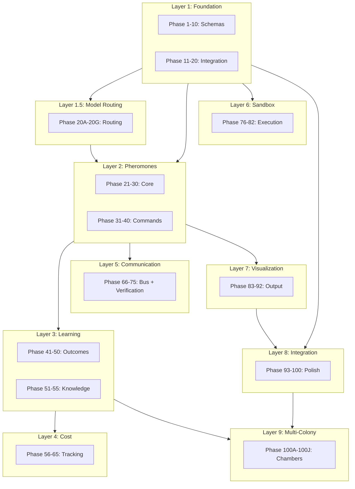

## Aether 2.0 Complete Implementation - 117 Phase Master Plan

### Document References

This plan synthesizes the following documentation:

**Core Architecture:**
- [QUEEN_ANT_ARCHITECTURE.md](.aether/QUEEN_ANT_ARCHITECTURE.md) - True emergence architecture
- [2.0 Paradigm Shift Plan](.cursor/plans/aether_2.0_-_paradigm_shift_implementation_plan_6253235b.plan.md) - All 10 paradigm-shifting features

**Pheromone System:**
- [PHEROMONE-SYSTEM-DESIGN.md](.aether/docs/PHEROMONE-SYSTEM-DESIGN.md) - Complete pheromone architecture
- [PHEROMONE-INTEGRATION.md](.aether/docs/PHEROMONE-INTEGRATION.md) - Auto-injection via existing commands
- [PHEROMONE-INJECTION.md](.aether/docs/PHEROMONE-INJECTION.md) - Mid-work injection system
- [pheromones.md](.aether/docs/pheromones.md) - User guide for pheromone signals

**Multi-Colony System:**
- [chamber-utils.sh](.aether/utils/chamber-utils.sh) - Chamber lifecycle management
- [chamber-compare.sh](.aether/utils/chamber-compare.sh) - Chamber comparison tools

**Model Routing:**
- [model-profiles.yaml](.aether/model-profiles.yaml) - Caste-to-model mappings
- [archive/model-routing/](.aether/archive/model-routing/) - Previous routing research

**Output and Visualization:**
- [VISUAL-OUTPUT-SPEC.md](.aether/docs/VISUAL-OUTPUT-SPEC.md) - Clean worker output format
- [progressive-disclosure.md](.aether/docs/progressive-disclosure.md) - Compact output with expansion

**Cross-Cutting:**
- [pathogen-schema.md](.aether/docs/pathogen-schema.md) - Error pattern detection schema
- [biological-reference.md](.aether/docs/biological-reference.md) - 40+ research sources, naming taxonomy
- [namespace.md](.aether/docs/namespace.md) - Command namespace isolation
- [command-sync.md](.aether/docs/command-sync.md) - Cross-platform sync strategy

---

## LAYER 1: Foundation Infrastructure (Phases 1-20)

### Phase 1: Research Directory Structure Creation

**Agent Task:** Research best practices for multi-module project structure
**Implementation:** Create `.aether/research/2.0-roadmap/` and `.aether/v2/` directories
**Cross-Reference:** Current `.aether/` structure, QUEEN_ANT_ARCHITECTURE.md state layout

### Phase 2: Eternal Memory Directory Structure

**Agent Task:** Research global vs per-colony persistence patterns
**Implementation:** Create `~/.aether/eternal/` with subdirectories
**Cross-Reference:** PHEROMONE-SYSTEM-DESIGN.md lines 39-66

### Phase 3: Pheromone JSON Schema Implementation

**Agent Task:** Research JSON schema validation tools for Node.js
**Implementation:** Create `pheromones.json` schema with all fields
**Cross-Reference:** PHEROMONE-SYSTEM-DESIGN.md lines 69-84

### Phase 4: Pheromone Queue System

**Agent Task:** Research message queue patterns for async processing
**Implementation:** Create `pheromone-queue.json` with status tracking
**Cross-Reference:** PHEROMONE-INJECTION.md lines 56-74

### Phase 5: Midden Pile (Expired Pheromones)

**Agent Task:** Research waste management patterns in distributed systems
**Implementation:** Create `.aether/data/midden/` for faded pheromones
**Cross-Reference:** PHEROMONE-SYSTEM-DESIGN.md lines 203-206

### Phase 6: Colony State v4.0 Schema

**Agent Task:** Research state machine patterns for colony lifecycle
**Implementation:** Extend COLONY_STATE.json with pheromone fields
**Cross-Reference:** QUEEN_ANT_ARCHITECTURE.md lines 330-356

### Phase 7: Stack Profile Schema

**Agent Task:** Research tech stack detection patterns
**Implementation:** Create `~/.aether/eternal/stack-profile/` structure
**Cross-Reference:** PHEROMONE-SYSTEM-DESIGN.md lines 43-47

### Phase 8: Pattern Storage Schema

**Agent Task:** Research knowledge base schema patterns
**Implementation:** Create `~/.aether/eternal/patterns/` structure
**Cross-Reference:** PHEROMONE-SYSTEM-DESIGN.md lines 47-51

### Phase 9: Lineage Chamber Schema

**Agent Task:** Research inheritance patterns in knowledge systems
**Implementation:** Create `~/.aether/eternal/lineage/` structure
**Cross-Reference:** PHEROMONE-SYSTEM-DESIGN.md lines 52-56

### Phase 10: Pathogen Schema Integration

**Agent Task:** Research existing error pattern detection in Aether
**Implementation:** Validate `pathogens.json` integrates with pheromones
**Cross-Reference:** pathogen-schema.md full document

### Phase 11: Outcome Tracking Schema

**Agent Task:** Research RL outcome schemas for ML systems
**Implementation:** Create `outcomes.json` schema
**Cross-Reference:** 2.0 Plan Feature 2 lines 184-215

### Phase 12: Cost Tracking Schema

**Agent Task:** Research API cost tracking patterns
**Implementation:** Create `costs.json` schema
**Cross-Reference:** 2.0 Plan Feature 7 lines 756-790

### Phase 13: Feedback Collection Schema

**Agent Task:** Research RLHF feedback schemas
**Implementation:** Create `feedback.json` schema
**Cross-Reference:** 2.0 Plan Feature 8 lines 897-924

### Phase 14: Knowledge Store Schema

**Agent Task:** Research vector database schemas for code patterns
**Implementation:** Create knowledge schema with embeddings
**Cross-Reference:** 2.0 Plan Feature 6 lines 633-659

### Phase 15: Agent Registry Schema

**Agent Task:** Research agent discovery protocols
**Implementation:** Create agent registry for communication
**Cross-Reference:** 2.0 Plan Feature 4 lines 436-455

### Phase 16: Sandbox Configuration Schema

**Agent Task:** Research container security configuration
**Implementation:** Create sandbox config schema
**Cross-Reference:** 2.0 Plan Feature 5 lines 506-531

### Phase 17: Plan Verification Schema

**Agent Task:** Research constraint satisfaction schemas
**Implementation:** Create plan validation schema
**Cross-Reference:** 2.0 Plan Feature 10 lines 1122-1158

### Phase 18: Observatory Data Schema

**Agent Task:** Research real-time dashboard data patterns
**Implementation:** Create observatory state schema
**Cross-Reference:** 2.0 Plan Feature 9 lines 1006-1037

### Phase 19: Namespace Isolation Verification

**Agent Task:** Research command collision prevention
**Implementation:** Verify ant namespace is isolated from cds/mds
**Cross-Reference:** namespace.md full document

### Phase 20: Command Sync Verification

**Agent Task:** Research hash-based sync mechanisms
**Implementation:** Verify Claude/OpenCode sync is working
**Cross-Reference:** command-sync.md full document

---

## LAYER 1.5: Model Routing Infrastructure (Phases 20A-20G)

### Phase 20A: LiteLLM Proxy Research

**Agent Task:** Research LiteLLM proxy documentation and source code
**Implementation:** Document routing patterns and header support
**Cross-Reference:**
- [.cursor/plans/aether_2.0_-_paradigm_shift_implementation_plan_6253235b.plan.md](.cursor/plans/aether_2.0_-_paradigm_shift_implementation_plan_6253235b.plan.md) lines 87-103
- [.aether/model-profiles.yaml](.aether/model-profiles.yaml) - existing caste-to-model mappings
- [.aether/workers.md](.aether/workers.md) lines 59-62 - environment inheritance limitation

### Phase 20B: Proxy Configuration File

**Agent Task:** Research YAML configuration for model routing
**Implementation:** Create `.aether/v2/proxy/routing.yaml`
**Cross-Reference:**
- [.cursor/plans/aether_2.0_-_paradigm_shift_implementation_plan_6253235b.plan.md](.cursor/plans/aether_2.0_-_paradigm_shift_implementation_plan_6253235b.plan.md) lines 106-122
- [.aether/model-profiles.yaml](.aether/model-profiles.yaml) - existing configuration pattern

### Phase 20C: Request Router Implementation

**Agent Task:** Research HTTP request interception patterns
**Implementation:** Create `bin/v2/request-router.js`
**Cross-Reference:**
- [.cursor/plans/aether_2.0_-_paradigm_shift_implementation_plan_6253235b.plan.md](.cursor/plans/aether_2.0_-_paradigm_shift_implementation_plan_6253235b.plan.md) lines 124-149
- [.aether/aether-utils.sh](.aether/aether-utils.sh) - existing utility patterns

### Phase 20D: Telemetry Collection

**Agent Task:** Research telemetry collection for API calls
**Implementation:** Enhance `bin/lib/telemetry.js` for per-agent tracking
**Cross-Reference:**
- [.cursor/plans/aether_2.0_-_paradigm_shift_implementation_plan_6253235b.plan.md](.cursor/plans/aether_2.0_-_paradigm_shift_implementation_plan_6253235b.plan.md) lines 137-144
- [.aether/aether-utils.sh](.aether/aether-utils.sh) lines 1704-1738 - existing chamber utilities

### Phase 20E: Task Tool Integration

**Agent Task:** Research Task tool environment variable passing
**Implementation:** Modify build.md to set agent-type header
**Cross-Reference:**
- [.cursor/plans/aether_2.0_-_paradigm_shift_implementation_plan_6253235b.plan.md](.cursor/plans/aether_2.0_-_paradigm_shift_implementation_plan_6253235b.plan.md) lines 151-161
- [.claude/commands/ant/build.md](.claude/commands/ant/build.md) - worker spawn points
- [.aether/archive/model-routing/README.md](.aether/archive/model-routing/README.md) - documented limitation

### Phase 20F: spawn-with-model.sh Update

**Agent Task:** Research shell script model selection
**Implementation:** Update spawn-with-model.sh to use router
**Cross-Reference:**
- [.cursor/plans/aether_2.0_-_paradigm_shift_implementation_plan_6253235b.plan.md](.cursor/plans/aether_2.0_-_paradigm_shift_implementation_plan_6253235b.plan.md) line 154
- [.aether/archive/model-routing/PITFALLS.md.bak](.aether/archive/model-routing/PITFALLS.md.bak) lines 107-120 - known issues

### Phase 20G: Status Command Telemetry Display

**Agent Task:** Research cost/latency display patterns
**Implementation:** Add telemetry display to /ant:status
**Cross-Reference:**
- [.cursor/plans/aether_2.0_-_paradigm_shift_implementation_plan_6253235b.plan.md](.cursor/plans/aether_2.0_-_paradigm_shift_implementation_plan_6253235b.plan.md) line 155
- [.claude/commands/ant/status.md](.claude/commands/ant/status.md) - existing status format

---

## LAYER 2: Pheromone Core Implementation (Phases 21-40)

### Phase 21: Pheromone Types Enum

**Agent Task:** Research all pheromone types from biological reference
**Implementation:** Define FOCUS, REDIRECT, PHILOSOPHY, STACK, PATTERN, DECREE types
**Cross-Reference:** PHEROMONE-SYSTEM-DESIGN.md lines 26-34, biological-reference.md

### Phase 22: Pheromone Decay Calculator

**Agent Task:** Research TTL decay algorithms
**Implementation:** Implement decay calculation with timestamps
**Cross-Reference:** PHEROMONE-SYSTEM-DESIGN.md lines 77-80

### Phase 23: Pheromone Strength Normalization

**Agent Task:** Research signal strength normalization
**Implementation:** Normalize strength values to 0.0-1.0 range
**Cross-Reference:** PHEROMONE-SYSTEM-DESIGN.md pheromone structure

### Phase 24: Pheromone Deposition Function

**Agent Task:** Research atomic write patterns for JSON
**Implementation:** Implement `depositPheromone()` in aether-utils.sh
**Cross-Reference:** PHEROMONE-INJECTION.md lines 17-34

### Phase 25: Pheromone Pickup Function

**Agent Task:** Research concurrent read patterns
**Implementation:** Implement `pickupPheromone()` for workers
**Cross-Reference:** PHEROMONE-INJECTION.md lines 76-91

### Phase 26: Pheromone Queue Processor

**Agent Task:** Research checkpoint polling patterns
**Implementation:** Implement queue processing at worker breakpoints
**Cross-Reference:** PHEROMONE-INJECTION.md lines 42-55

### Phase 27: Auto-Deposition at /ant:init

**Agent Task:** Research auto-deposition triggers
**Implementation:** PHILOSOPHY pheromones deposited on init
**Cross-Reference:** PHEROMONE-INTEGRATION.md lines 8-25

### Phase 28: Auto-Deposition at /ant:plan

**Agent Task:** Research pattern detection during planning
**Implementation:** Pattern detection and PATTERN deposition
**Cross-Reference:** PHEROMONE-INTEGRATION.md lines 27-36

### Phase 29: Auto-Deposition at /ant:build

**Agent Task:** Research worker trail deposition
**Implementation:** Workers deposit trails during work
**Cross-Reference:** PHEROMONE-INTEGRATION.md lines 39-45

### Phase 30: Auto-Deposition at /ant:seal

**Agent Task:** Research wisdom extraction patterns
**Implementation:** Extract and archive patterns on seal
**Cross-Reference:** PHEROMONE-INTEGRATION.md lines 47-59

### Phase 31: Auto-Deposition at /ant:swarm

**Agent Task:** Research fix pattern extraction
**Implementation:** REDIRECT + PATTERN on bug fix
**Cross-Reference:** PHEROMONE-INTEGRATION.md lines 61-69

### Phase 32: Enhanced /ant:focus

**Agent Task:** Research existing focus command
**Implementation:** Add visible deposition signal
**Cross-Reference:** PHEROMONE-INTEGRATION.md lines 75-84

### Phase 33: Enhanced /ant:redirect

**Agent Task:** Research existing redirect command
**Implementation:** Add visible deposition signal
**Cross-Reference:** PHEROMONE-INTEGRATION.md lines 86-94

### Phase 34: Enhanced /ant:status

**Agent Task:** Research existing status command
**Implementation:** Add pheromone trails section
**Cross-Reference:** PHEROMONE-INTEGRATION.md lines 96-113

### Phase 35: Worker Spawn-Time Priming

**Agent Task:** Research worker context injection
**Implementation:** Workers inhale pheromones at spawn
**Cross-Reference:** PHEROMONE-SYSTEM-DESIGN.md lines 167-184

### Phase 36: Pheromone Context Header

**Agent Task:** Research compact context representation
**Implementation:** Single-line pheromone summary in worker prompt
**Cross-Reference:** PHEROMONE-INJECTION.md lines 227-229

### Phase 37: Pheromone Sniff Command

**Agent Task:** Research display formatting for pheromone lists
**Implementation:** Create `/ant:sniff` command for viewing trails
**Cross-Reference:** PHEROMONE-INJECTION.md lines 115-145

### Phase 38: Pheromone Emit Command

**Agent Task:** Research manual pheromone injection
**Implementation:** Create `/ant:emit` command
**Cross-Reference:** PHEROMONE-INJECTION.md lines 96-113

### Phase 39: First Colony Onboarding

**Agent Task:** Research onboarding UX patterns
**Implementation:** Auto-detect and signal first colony
**Cross-Reference:** PHEROMONE-INJECTION.md lines 149-172

### Phase 40: Pattern Suggestion System

**Agent Task:** Research pattern detection algorithms
**Implementation:** Suggest pheromones from worker behavior
**Cross-Reference:** PHEROMONE-INJECTION.md lines 175-191

---

## LAYER 3: Learning and Memory (Phases 41-55)

### Phase 41: Outcome Tracking Implementation

**Agent Task:** Research RL outcome tracking
**Implementation:** Record task outcomes after verification
**Cross-Reference:** 2.0 Plan Feature 2 lines 217-235

### Phase 42: Outcome Classification

**Agent Task:** Research task type classification
**Implementation:** Classify tasks as implement/refactor/debug/test/research
**Cross-Reference:** 2.0 Plan Feature 2 lines 188-189

### Phase 43: Complexity Inference

**Agent Task:** Research code complexity metrics
**Implementation:** Infer actual complexity from results
**Cross-Reference:** 2.0 Plan Feature 2 lines 195-196

### Phase 44: Agent Recommender Model

**Agent Task:** Research bandit algorithms for agent selection
**Implementation:** Build agent recommender based on outcomes
**Cross-Reference:** 2.0 Plan Feature 2 lines 239-257

### Phase 45: Pattern Learner

**Agent Task:** Research pattern mining algorithms
**Implementation:** Extract patterns from outcome history
**Cross-Reference:** 2.0 Plan Feature 3 lines 287-313

### Phase 46: Learned Patterns Storage

**Agent Task:** Research pattern persistence
**Implementation:** Store learned patterns in YAML
**Cross-Reference:** 2.0 Plan Feature 3 lines 317-335

### Phase 47: Prompt Injection with Patterns

**Agent Task:** Research prompt template modification
**Implementation:** Inject relevant patterns into worker prompts
**Cross-Reference:** 2.0 Plan Feature 3 lines 339-356

### Phase 48: Cross-Project Knowledge Store

**Agent Task:** Research vector database integration
**Implementation:** Implement knowledge store with embeddings
**Cross-Reference:** 2.0 Plan Feature 6 lines 663-701

### Phase 49: Knowledge Transfer Protocol

**Agent Task:** Research knowledge transfer patterns
**Implementation:** Transfer knowledge on new colony init
**Cross-Reference:** 2.0 Plan Feature 6 lines 705-726

### Phase 50: Lineage Inheritance

**Agent Task:** Research inheritance from sealed chambers
**Implementation:** Inherit patterns from lineage on new colony
**Cross-Reference:** PHEROMONE-SYSTEM-DESIGN.md lines 300-316

### Phase 51: Stack Profile Updates

**Agent Task:** Research tech stack detection
**Implementation:** Update stack profiles at milestones
**Cross-Reference:** PHEROMONE-SYSTEM-DESIGN.md lines 279-295

### Phase 52: Trophallaxis Implementation

**Agent Task:** Research food sharing in ant colonies
**Implementation:** Implement `/ant:mentor` for knowledge sharing
**Cross-Reference:** PHEROMONE-SYSTEM-DESIGN.md lines 196-199

### Phase 53: Trail Following Algorithm

**Agent Task:** Research pheromone trail following
**Implementation:** Workers follow strongest trails
**Cross-Reference:** PHEROMONE-SYSTEM-DESIGN.md lines 206-211

### Phase 54: Stimulus-Driven Assignment

**Agent Task:** Research stimulus-response in ants
**Implementation:** Spawn specialists based on pheromone gradients
**Cross-Reference:** PHEROMONE-SYSTEM-DESIGN.md lines 189-194

### Phase 55: Midden Pile Integration

**Agent Task:** Research waste management
**Implementation:** REDIRECT pheromones point to midden
**Cross-Reference:** PHEROMONE-SYSTEM-DESIGN.md lines 200-205

---

## LAYER 4: Cost and Feedback (Phases 56-65)

### Phase 56: Cost Tracker Implementation

**Agent Task:** Research API pricing models
**Implementation:** Implement cost calculation per model
**Cross-Reference:** 2.0 Plan Feature 7 lines 756-790

### Phase 57: Cost Analyzer

**Agent Task:** Research cost analytics
**Implementation:** Analyze costs by agent/phase/model
**Cross-Reference:** 2.0 Plan Feature 7 lines 793-846

### Phase 58: Cost Display in Status

**Agent Task:** Research cost visualization
**Implementation:** Display costs in `/ant:status`
**Cross-Reference:** 2.0 Plan Feature 7 lines 849-868

### Phase 59: Optimization Recommendations

**Agent Task:** Research cost optimization strategies
**Implementation:** Generate optimization recommendations
**Cross-Reference:** 2.0 Plan Feature 7 lines 828-844

### Phase 60: Feedback Collection UI

**Agent Task:** Research minimal-friction feedback
**Implementation:** Implement feedback prompt after phase
**Cross-Reference:** 2.0 Plan Feature 8 lines 927-942

### Phase 61: Feedback Integration

**Agent Task:** Research RLHF integration
**Implementation:** Integrate feedback into knowledge store
**Cross-Reference:** 2.0 Plan Feature 8 lines 945-977

### Phase 62: Negative Feedback Processing

**Agent Task:** Research anti-pattern extraction
**Implementation:** Extract anti-patterns from negative feedback
**Cross-Reference:** 2.0 Plan Feature 8 lines 954-967

### Phase 63: Positive Feedback Reinforcement

**Agent Task:** Research reinforcement learning
**Implementation:** Strengthen patterns from positive feedback
**Cross-Reference:** 2.0 Plan Feature 8 lines 969-976

### Phase 64: Feedback Aggregation

**Agent Task:** Research feedback aggregation across sessions
**Implementation:** Aggregate feedback for pattern validation
**Cross-Reference:** 2.0 Plan Feature 8 lines 887-894

### Phase 65: Feedback Fatigue Prevention

**Agent Task:** Research UX fatigue patterns
**Implementation:** Limit feedback prompts to avoid fatigue
**Cross-Reference:** 2.0 Plan Feature 8 lines 883-884

---

## LAYER 5: Communication and Coordination (Phases 66-75)

### Phase 66: Colony Bus Implementation

**Agent Task:** Research message bus patterns
**Implementation:** Implement pub/sub message bus
**Cross-Reference:** 2.0 Plan Feature 4 lines 385-431

### Phase 67: Channel Definitions

**Agent Task:** Research communication channels
**Implementation:** Define standard channels
**Cross-Reference:** 2.0 Plan Feature 4 lines 422-430

### Phase 68: Agent Discovery

**Agent Task:** Research agent capability discovery
**Implementation:** Implement agent registry
**Cross-Reference:** 2.0 Plan Feature 4 lines 436-455

### Phase 69: Coordination Protocol

**Agent Task:** Research agent coordination
**Implementation:** Implement builder-scout coordination
**Cross-Reference:** 2.0 Plan Feature 4 lines 457-476

### Phase 70: Plan Verification Engine

**Agent Task:** Research constraint satisfaction
**Implementation:** Implement plan verifier
**Cross-Reference:** 2.0 Plan Feature 10 lines 1161-1222

### Phase 71: Cycle Detection

**Agent Task:** Research cycle detection algorithms
**Implementation:** Detect circular dependencies in plans
**Cross-Reference:** 2.0 Plan Feature 10 lines 1209-1221

### Phase 72: Plan Repair Suggestions

**Agent Task:** Research plan repair
**Implementation:** Generate repair suggestions
**Cross-Reference:** 2.0 Plan Feature 10 lines 1225-1258

### Phase 73: Effort Estimation

**Agent Task:** Research effort estimation models
**Implementation:** Estimate plan feasibility
**Cross-Reference:** 2.0 Plan Feature 10 lines 1193-1204

### Phase 74: File Reference Validation

**Agent Task:** Research file existence checks
**Implementation:** Validate file references in plans
**Cross-Reference:** 2.0 Plan Feature 10 lines 1179-1191

### Phase 75: Integration with /ant:plan

**Agent Task:** Research plan workflow
**Implementation:** Run verifier after planning
**Cross-Reference:** 2.0 Plan Feature 10 lines 1261-1265

---

## LAYER 6: Execution and Sandbox (Phases 76-82)

### Phase 76: Sandbox Configuration

**Agent Task:** Research Docker security
**Implementation:** Create sandbox config
**Cross-Reference:** 2.0 Plan Feature 5 lines 506-531

### Phase 77: Sandbox Manager

**Agent Task:** Research container orchestration
**Implementation:** Implement sandbox manager
**Cross-Reference:** 2.0 Plan Feature 5 lines 535-580

### Phase 78: Sandbox Execution Interface

**Agent Task:** Research sandbox API design
**Implementation:** Agent-sandbox interface
**Cross-Reference:** 2.0 Plan Feature 5 lines 584-603

### Phase 79: Resource Limit Enforcement

**Agent Task:** Research container resource limits
**Implementation:** Enforce CPU/memory limits
**Cross-Reference:** 2.0 Plan Feature 5 lines 510-515

### Phase 80: File System Mounting

**Agent Task:** Research secure mount patterns
**Implementation:** Mount project files in sandbox
**Cross-Reference:** 2.0 Plan Feature 5 lines 524-531

### Phase 81: Tool Availability

**Agent Task:** Research development tool requirements
**Implementation:** Ensure tools available in sandbox
**Cross-Reference:** 2.0 Plan Feature 5 lines 517-522

### Phase 82: Sandbox Cleanup

**Agent Task:** Research container cleanup
**Implementation:** Cleanup after execution
**Cross-Reference:** 2.0 Plan Feature 5 line 602

---

## LAYER 7: Visualization and Output (Phases 83-92)

### Phase 83: Worker Output Cleanup

**Agent Task:** Research output formatting
**Implementation:** Remove template sections from worker output
**Cross-Reference:** VISUAL-OUTPUT-SPEC.md lines 189-203

### Phase 84: Spawn Notification Format

**Agent Task:** Research notification UX
**Implementation:** Implement spawn notification
**Cross-Reference:** VISUAL-OUTPUT-SPEC.md lines 43-50

### Phase 85: Complete Notification Format

**Agent Task:** Research completion UX
**Implementation:** Implement completion notification
**Cross-Reference:** VISUAL-OUTPUT-SPEC.md lines 47-51

### Phase 86: Activity Stream Format

**Agent Task:** Research activity log formatting
**Implementation:** Implement compact activity stream
**Cross-Reference:** VISUAL-OUTPUT-SPEC.md lines 31-39

### Phase 87: Worker Tree Display

**Agent Task:** Research tree visualization
**Implementation:** Implement hierarchical worker tree
**Cross-Reference:** VISUAL-OUTPUT-SPEC.md lines 15-28

### Phase 88: Progress Bar Standardization

**Agent Task:** Research progress visualization
**Implementation:** Standardize progress bar format
**Cross-Reference:** VISUAL-OUTPUT-SPEC.md lines 137-147

### Phase 89: Caste Emoji Mapping

**Agent Task:** Research emoji consistency
**Implementation:** Map castes to emojis
**Cross-Reference:** VISUAL-OUTPUT-SPEC.md lines 94-109

### Phase 90: No Scroll Rule Implementation

**Agent Task:** Research in-place updates
**Implementation:** Implement in-place display updates
**Cross-Reference:** VISUAL-OUTPUT-SPEC.md lines 149-157

### Phase 91: Observatory Server

**Agent Task:** Research WebSocket for real-time
**Implementation:** Implement observatory server
**Cross-Reference:** 2.0 Plan Feature 9 lines 1007-1037

### Phase 92: Observatory Dashboard

**Agent Task:** Research dashboard frameworks
**Implementation:** Implement real-time dashboard
**Cross-Reference:** 2.0 Plan Feature 9 lines 1040-1074

---

## LAYER 8: Integration and Polish (Phases 93-100)

### Phase 93: Progressive Disclosure Integration

**Agent Task:** Research compact output patterns
**Implementation:** Implement progressive disclosure across commands
**Cross-Reference:** progressive-disclosure.md full document

### Phase 94: Namespace Verification

**Agent Task:** Research command isolation
**Implementation:** Verify ant namespace isolation
**Cross-Reference:** namespace.md lines 141-149

### Phase 95: Cross-Platform Command Sync

**Agent Task:** Research sync mechanisms
**Implementation:** Verify Claude/OpenCode sync
**Cross-Reference:** command-sync.md lines 45-64

### Phase 96: Documentation Update

**Agent Task:** Research documentation patterns
**Implementation:** Update all documentation for 2.0
**Cross-Reference:** All documentation files

### Phase 97: Testing Infrastructure

**Agent Task:** Research testing patterns
**Implementation:** Create test suite for 2.0 features
**Cross-Reference:** existing test patterns

### Phase 98: Migration Guide

**Agent Task:** Research migration patterns
**Implementation:** Create migration guide from 1.0 to 2.0
**Cross-Reference:** QUEEN_ANT_ARCHITECTURE.md changes

### Phase 99: Performance Benchmarking

**Agent Task:** Research benchmarking patterns
**Implementation:** Benchmark all 2.0 features
**Cross-Reference:** existing patterns

### Phase 100: Final Integration and Release

**Agent Task:** Research release patterns
**Implementation:** Final integration, testing, and release
**Cross-Reference:** All documentation

---

## LAYER 9: Multi-Colony Architecture (Phases 100A-100J)

### Phase 100A: Chamber System Research

**Agent Task:** Research chamber management patterns
**Implementation:** Document chamber lifecycle from existing code
**Cross-Reference:**
- [.aether/utils/chamber-utils.sh](.aether/utils/chamber-utils.sh) lines 73-148 - chamber_create
- [.aether/utils/chamber-utils.sh](.aether/utils/chamber-utils.sh) lines 164-218 - chamber_verify
- [.aether/utils/chamber-utils.sh](.aether/utils/chamber-utils.sh) lines 218-285 - chamber_list

### Phase 100B: Colony Sealing Implementation

**Agent Task:** Research /ant:seal command
**Implementation:** Create /ant:seal command for colony archival
**Cross-Reference:**
- [.aether/docs/PHEROMONE-SYSTEM-DESIGN.md](.aether/docs/PHEROMONE-SYSTEM-DESIGN.md) lines 259-271 - seal flow
- [.aether/docs/PHEROMONE-INJECTION.md](.aether/docs/PHEROMONE-INJECTION.md) line 13 - seal triggers
- [.aether/docs/biological-reference.md](.aether/docs/biological-reference.md) lines 265-272 - milestone names

### Phase 100C: Lineage Directory Structure

**Agent Task:** Research inheritance directory patterns
**Implementation:** Create `~/.aether/eternal/lineage/{chamber}/` structure
**Cross-Reference:**
- [.aether/docs/PHEROMONE-SYSTEM-DESIGN.md](.aether/docs/PHEROMONE-SYSTEM-DESIGN.md) lines 52-56 - lineage structure
- [.aether/docs/PHEROMONE-SYSTEM-DESIGN.md](.aether/docs/PHEROMONE-SYSTEM-DESIGN.md) lines 301-316 - inheritance flow

### Phase 100D: Wisdom Extraction System

**Agent Task:** Research knowledge extraction from completed colonies
**Implementation:** Extract PATTERN pheromones on seal
**Cross-Reference:**
- [.aether/docs/PHEROMONE-SYSTEM-DESIGN.md](.aether/docs/PHEROMONE-SYSTEM-DESIGN.md) lines 301-306
- [.aether/docs/PHEROMONE-INTEGRATION.md](.aether/docs/PHEROMONE-INTEGRATION.md) lines 47-59

### Phase 100E: Egg Laying with Inheritance

**Agent Task:** Research /ant:lay-eggs command
**Implementation:** Create /ant:lay-eggs with --inherit flag
**Cross-Reference:**
- [.aether/docs/PHEROMONE-SYSTEM-DESIGN.md](.aether/docs/PHEROMONE-SYSTEM-DESIGN.md) lines 309-316
- [.aether/QUEEN_ANT_ARCHITECTURE.md](.aether/QUEEN_ANT_ARCHITECTURE.md) lines 369-378

### Phase 100F: Chamber Comparison Tool

**Agent Task:** Research chamber comparison algorithms
**Implementation:** Enhance chamber-compare.sh for knowledge diff
**Cross-Reference:**
- [.aether/utils/chamber-compare.sh](.aether/utils/chamber-compare.sh) lines 30-139 - existing compare

### Phase 100G: Cross-Colony Communication

**Agent Task:** Research inter-colony message passing
**Implementation:** Enable chambers to share patterns
**Cross-Reference:**
- [.aether/docs/PHEROMONE-SYSTEM-DESIGN.md](.aether/docs/PHEROMONE-SYSTEM-DESIGN.md) lines 196-199 - trophallaxis
- [.cursor/plans/aether_2.0_-_paradigm_shift_implementation_plan_6253235b.plan.md](.cursor/plans/aether_2.0_-_paradigm_shift_implementation_plan_6253235b.plan.md) Feature 4 lines 366-476 - agent communication

### Phase 100H: Colony History Browser

**Agent Task:** Research history visualization patterns
**Implementation:** Create `/ant:history` command
**Cross-Reference:**
- [.aether/utils/chamber-utils.sh](.aether/utils/chamber-utils.sh) lines 218-285 - chamber_list
- [.aether/docs/biological-reference.md](.aether/docs/biological-reference.md) line 272 - New Nest Founded

### Phase 100I: Colony Switching

**Agent Task:** Research multi-colony state management
**Implementation:** Enable switching between active colonies
**Cross-Reference:**
- [.planning/phases/10-entombment-egg-laying/10-RESEARCH.md](.planning/phases/10-entombment-egg-laying/10-RESEARCH.md) line 177 - single colony limitation
- [.planning/phases/10-entombment-egg-laying/10-CONTEXT.md](.planning/phases/10-entombment-egg-laying/10-CONTEXT.md) line 50 - multi-colony future

### Phase 100J: Colony Isolation Verification

**Agent Task:** Research colony isolation patterns
**Implementation:** Verify chambers don't leak state
**Cross-Reference:**
- [.aether/utils/chamber-utils.sh](.aether/utils/chamber-utils.sh) lines 164-218 - chamber_verify
- [.aether/data/COLONY_STATE.json](.aether/data/COLONY_STATE.json) - state isolation

---

## Execution Strategy

Each phase follows this pattern:

1. **Agent Research Task** - Deep dive into documentation + external research
2. **Cross-Reference Check** - Validate against existing docs
3. **Implementation** - Build the feature
4. **Verification** - Test against spec

### Priority Layers

| Layer                   | Priority | Timeline  |
| ----------------------- | -------- | --------- |
| Layer 1 (Foundation)    | CRITICAL | Weeks 1-2 |
| Layer 1.5 (Model Routing) | CRITICAL | Week 2-3 |
| Layer 2 (Pheromones)    | CRITICAL | Weeks 3-5 |
| Layer 3 (Learning)      | HIGH     | Weeks 5-7 |
| Layer 4 (Cost/Feedback) | HIGH     | Weeks 7-8 |
| Layer 5 (Communication) | MEDIUM   | Weeks 8-9 |
| Layer 6 (Sandbox)       | MEDIUM   | Weeks 9-10 |
| Layer 7 (Visualization) | HIGH     | Weeks 5-6 |
| Layer 8 (Integration)   | CRITICAL | Week 11   |
| Layer 9 (Multi-Colony)  | HIGH     | Week 12   |

---

## Dependencies

---

## Feature Coverage Summary

This plan implements all 10 paradigm-shifting features from the 2.0 Plan:

| Feature | Name | Phases | Status |
|---------|------|--------|--------|
| F1 | Model Routing Infrastructure | 20A-20G | INCLUDED |
| F2 | Reinforcement Learning from Outcomes | 11, 41-44 | INCLUDED |
| F3 | Self-Modifying Prompts | 45-47 | INCLUDED |
| F4 | Agent-to-Agent Communication | 66-69 | INCLUDED |
| F5 | Execution Sandbox | 76-82 | INCLUDED |
| F6 | Cross-Project Knowledge | 48-50 | INCLUDED |
| F7 | Cost/Performance Optimization | 12, 56-59 | INCLUDED |
| F8 | Human-in-the-Loop RLHF | 13, 60-65 | INCLUDED |
| F9 | Visual Colony Observatory | 91-92 | INCLUDED |
| F10 | Formal Plan Verification | 17, 70-75 | INCLUDED |
| - | Multi-Colony Architecture | 100A-100J | INCLUDED |

**Total Phases: 117** (100 original + 7 model routing + 10 multi-colony)

