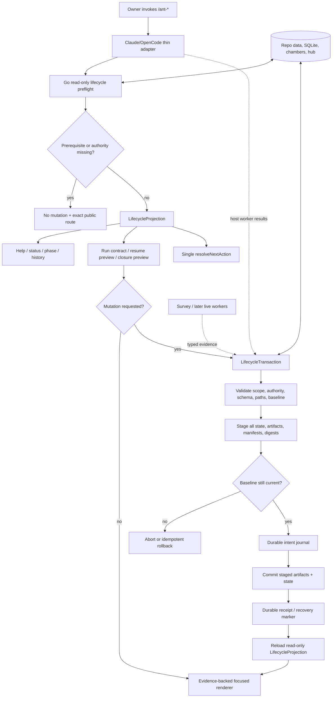

# Phase 199: Front Door and Classic Contract - Research

**Researched:** 2026-09-03
**Domain:** Claude Code/OpenCode lifecycle UX over an authoritative Go runtime
**Confidence:** HIGH

<user_constraints>
## User Constraints (from CONTEXT.md)

### Locked Decisions

### Entry Commands

- **D-01:** Claude Code and OpenCode expose the colony through `/ant-*` commands. Raw `aether ...` commands are runtime plumbing, not the ordinary user vocabulary.
- **D-02:** `/ant-init` begins the guided colony journey. After initialization and an accepted plan, `/ant-build 1` and `/ant-run` are equal choices; neither is preselected or labelled recommended. Guided operation is an option, not a mandatory default.
- **D-03:** `/ant-run` is the optional Autopilot and may begin only after initialization and plan acceptance. If invoked too early, it performs no work, names the missing prerequisite, and routes to the exact `/ant-init` or `/ant-plan` command.
- **D-04:** A valid `/ant-run` first shows a short operating contract containing the goal, intended phase range, active pheromones, and pause conditions, then starts automatically. Invoking the command is already consent to run.

### Autopilot Boundaries

- **D-05:** `/ant-run` aims to finish every remaining accepted phase. It performs safely bounded repairs automatically, accumulates non-blocking warnings and debt for the final report, and pauses only when continuing would be unsafe or dishonest: safety failure, corrupt state, missing authority, a material owner decision, or a failed dependency that invalidates later work.
- **D-06:** Autopilot may revise tasks, dependencies, sequencing, and implementation details when evidence invalidates the accepted plan. It must pause before changing the goal, promised behavior, scope, risk authority, or owner acceptance criteria.
- **D-07:** FOCUS and FEEDBACK should steer active ants without stopping unrelated work where the host supports live delivery. The receiving ant acknowledges the signal, and runtime evidence records the decision it changed. REDIRECT stops only work that conflicts with it. Where live delivery is impossible, the product says so and applies the signal at the next safe boundary rather than claiming false influence. Phase 199 defines this contract; Phase 203 implements the causal pheromone mechanism.
- **D-08:** Invoking `/ant-swarm` during Autopilot is a localized intervention: checkpoint and pause only the affected job, let independent work continue, integrate the verified Swarm result, and resume the affected path. Phase 199 defines the front-door behavior; Phase 202 supplies the substantive Swarm and typed-event implementation.

### Orientation and Colony Voice

- **D-09:** `/ant-status` is the complete authoritative snapshot by default. It shows colony identity and goal, phase/task progress, active ants and lineage, pheromones, research and Dreams, memory, findings, verification, elapsed time and reported cost, recent history, blockers, and clear next choices without exposing raw protocol records. `/ant-status --compact` is the optional short view.
- **D-10:** Major commands end with focused rich closeouts: colony identity, participating ants, what happened, evidence and results, state and pheromone changes, unresolved issues, and next choices. They do not repeat the entire status dashboard.
- **D-11:** Queen-led voice and ceremony are strong at lifecycle moments—initialization, planning, build waves, Swarm, verification, recovery, seal, and entomb. Quick inspections remain shorter but retain colony identity and plain language. Presentation may never invent workers, activity, cost, evidence, or outcomes absent from runtime truth.
- **D-12:** `/ant-status` and `/ant-watch` remain complementary. Status is the authoritative snapshot; Watch is the live colony cockpit and falls back to the latest status plus activity history when idle. Phase 202 owns the real typed-event live implementation.

### Pause, Resume, Seal, and Entomb

- **D-13:** Expose exactly one intentional pause command and one return command: `/ant-pause` and `/ant-resume`. The useful historical `pause-colony` and `resume-colony` behavior moves into those canonical commands. The suffixed names disappear from help, documentation, and installed command files; any short-lived parser redirect is invisible migration plumbing, not product vocabulary.
- **D-14:** `/ant-pause` stops at a safe boundary and writes one structured, validated handoff that preserves partial work, attempt identity, scoped decisions, context, and worker lineage exactly once.
- **D-15:** `/ant-resume` is the only recovery front door. It validates and restores a clean handoff when present; after an unclean interruption, it inspects durable state, worker activity, repository changes, and other runtime evidence to reconstruct the safest honest recovery point. Confirmed and reconstructed facts remain visibly distinct. Do not add a separate public `/ant-recover` command.
- **D-16:** `/ant-seal` is normal honest completion. `/ant-seal --force --reason "..."` is an explicit owner-only escape hatch for an incomplete colony; it durably records unfinished phases, failed or skipped gates, evidence, rollback information, and the reason, and is never rendered as successful completion. No ant, wrapper, or Autopilot path may add or invoke `--force` autonomously. `/ant-abandon` is not part of the ordinary public workflow.
- **D-17:** Seal and entomb remain distinct because they guard different transitions. `/ant-seal` crowns the colony, writes the durable Crowned Anthill record, and retains active state for review; it does not perform the entomb/archive-and-clear transition or reset active state. `/ant-entomb` is an optional post-seal operation that copies the colony into chambers, verifies archive integrity, retains memory and tombstone evidence, and only then clears active state for a new colony. It refuses unsealed or inconsistent state. Help describes it plainly as “archive and clear the sealed colony.” A forced seal remains visibly forced after entombment.

### the agent's Discretion

No owner-visible behavior was delegated. Research and planning may choose internal schemas, rendering composition, compatibility-redirect duration, and code organization provided they preserve the locked command vocabulary, platform order, runtime authority, truthfulness, and lifecycle boundaries above.

### Deferred Ideas (OUT OF SCOPE)

- Implement Codex-native `$ant-init`, `$ant-run`, `$ant-swarm`, and the complete matching `$ant-*` skill family only after the Claude/OpenCode contract is stable. This is a later milestone, not Phase 199.
- Substantive live Swarm/Watch event machinery belongs to Phase 202; causal pheromone delivery and measured influence belong to Phase 203. Phase 199 records only their public front-door contracts.

### Reviewed Todos (not folded)

- `2026-08-20-spec-builder-feature.md` — The readable specification capability belongs to Phase 200's owner-readable specification and accepted-plan work.
- `2026-08-27-worker-turnaround-is-too-slow.md` — Worker turnaround and one-job cost belong to Phase 201's Queen-led work cycle and attempt model.
- `2026-08-01-ts-host-preflight-hardcoded-timeout.md` — Platform preflight and timeout handling remain routed to Phase 203 by the approved milestone contract. The keyword-only Phase 199 todo match does not change ownership.
</user_constraints>

<phase_requirements>
## Phase Requirements

| ID | Description | Research Support |
|---|---|---|
| `SYNTH-01` | Reconstruct the exact Classic setup, help, init, colonize, orientation, pause/resume, and closure mechanisms; trace current Go; decide keep/restore/replace/retire. [VERIFIED: `.planning/REQUIREMENTS.md:23`] | Sections 1-6 below cite the four historical refs, current paths, all 34 routed `CAP-*` rows, and ten synthesis decisions. [VERIFIED: historical refs + live source audit] |
| `CEC-01` | Ordinary lifecycle screens identify colony, goal/episode, phase, and acting castes from runtime truth. [VERIFIED: `.planning/REQUIREMENTS.md:33`] | `SYN-199-03` defines one typed lifecycle projection and evidence-backed renderers. [VERIFIED: D-09..D-11 + `cmd/status.go`] |
| `CEC-02` | Every ordinary entry shows state, active/blocking work, and one canonical safe next action. [VERIFIED: `.planning/REQUIREMENTS.md:34`] | `SYN-199-03` retains the current resolver but feeds every view the same read-only facts. [VERIFIED: `cmd/next_action.go`; `cmd/next_action_input.go`] |
| `CEC-04` | The owner can steer, pause, resume, stop, answer, and inspect without corruption or repeat questions. [VERIFIED: `.planning/REQUIREMENTS.md:36`] | `SYN-199-04`, `SYN-199-05`, and `SYN-199-06` define truthful steering contracts, authority boundaries, and exactly-once handoff recovery. [VERIFIED: D-05..D-08, D-13..D-15] |
| `CEC-08` | Closure distinguishes verified work, risk, owner evidence, and future ideas, preserving one honest summary and next action. [VERIFIED: `.planning/REQUIREMENTS.md:40`] | `SYN-199-07` and `SYN-199-08` separate honest seal from optional archive-and-clear. [VERIFIED: D-16..D-17 + live seal/entomb audit] |
| `LIFE-01` | Help, first-run setup, lay-eggs, and init present one normal goal journey while advanced/internal surfaces remain inspectable and separate. [VERIFIED: `.planning/REQUIREMENTS.md:44`] | `SYN-199-01` restores progressive help and makes setup/registry/survey prerequisites lifecycle-owned. [VERIFIED: Classic help/init + current command census] |
| `LIFE-02` | The lifecycle decides when survey refresh is needed, displays freshness, and feeds territory evidence into planning. [VERIFIED: `.planning/REQUIREMENTS.md:45`] | `SYN-199-02` turns the existing advisory heuristic and survey manifest/finalizer into an automatic, transaction-safe gate. [VERIFIED: `cmd/survey_staleness.go`; `cmd/codex_colonize.go`; `cmd/codex_plan_finalize.go`] |
| `LIFE-03` | Status, phase, history, health/maturity, activity, research/Dreams, flags, and Next Up agree. [VERIFIED: `.planning/REQUIREMENTS.md:46`] | `SYN-199-03` defines the shared projection, full and compact status, and focused derived views. [VERIFIED: current status/phase/history audit] |
| `LIFE-04` | Pause, stop, staleness, resume, recovery, and compatibility preserve partial work, attempts, decisions, context, and lineage exactly once. [VERIFIED: `.planning/REQUIREMENTS.md:47`] | `SYN-199-06` defines canonical `/ant-pause` and `/ant-resume`, invisible aliasing, reconstruction provenance, and one transaction. [VERIFIED: `cmd/session_flow_cmds.go`] |
| `LIFE-05` | Seal/archive/entomb preserve findings, learning, signals, checkpoints, and rollback while refusing malformed or incomplete truth. [VERIFIED: `.planning/REQUIREMENTS.md:48`] | `SYN-199-07` and `SYN-199-08` specify fail-closed closure, visibly forced closure, digest-verified chambers, and post-verification clearing. [VERIFIED: current seal/entomb audit] |
| `LIFE-06` | Migration, update, cleanup, registry, chamber/context integrity, generated artifacts, and compatibility validate, checkpoint, roll back, and report through expert/internal surfaces. [VERIFIED: `.planning/REQUIREMENTS.md:49`] | `SYN-199-09` prescribes a progressive maintenance surface and shared transaction protocol. [VERIFIED: maintenance source audit + D-01] |
| `PROOF-01` | Build a versioned executable corpus proving outcomes, behavior, and experience; snapshots/names alone do not prove causality. [VERIFIED: `.planning/REQUIREMENTS.md:105`] | `SYN-199-10` defines fixture schema, black-box execution, durable pre/post assertions, failure injection, and generated-surface parity. [VERIFIED: current black-box/golden test audit] |
</phase_requirements>

## Summary

Classic did not work because it had more commands. It worked because each consequential entry point repeated a stable orientation grammar: Queen identity, goal and current phase, named castes doing understandable work, evidence or state changes, and a precise next choice. The February ref supplies the strongest identity and simple journey, `v5.0.0` supplies visible multi-worker emergence, and `v5.4`/`v5.4.0` supply the mature setup, pause/resume, seal/entomb, and Autopilot boundaries. Those mechanisms were largely prompt- and shell-governed, so their visible value should return without restoring their duplicated write authority or honor-system failure handling. [VERIFIED: `git show 3a5b81c2:.claude/commands/ant/{help,init}.md`; `git show v5.0.0:.claude/commands/ant/build.md`; `git show v5.4:.aether/commands/{help,init,pause-colony,resume,seal,entomb}.yaml`; `git show v5.4.0:.aether/commands/run.yaml`]

The current Go runtime already contains the right raw materials: typed state, per-file locking and replacement, a shared next-action resolver, deterministic worker identities, bounded Autopilot policy, attempt evidence, survey manifests/finalization, seal review and owner-force controls, archive code, and an isolated binary-level test harness. The missing contract is across those parts. Status, phase, history, run, resume, seal, and entomb load or derive different facts; some inspection paths repair state; and lifecycle operations commit multiple files in an order that can leave partial truth after failure. [VERIFIED: `pkg/storage/storage.go`; `cmd/next_action*.go`; `cmd/status.go`; `cmd/phase.go`; `cmd/history.go`; `cmd/compatibility_cmds.go`; `cmd/session_flow_cmds.go`; `cmd/codex_workflow_cmds.go`; `cmd/entomb_cmd.go`; `cmd/blackbox_harness_test.go`]

Planning should therefore begin with two foundations: a read-only `LifecycleProjection` shared by every ordinary view, and a recoverable lifecycle transaction/journal shared by init, survey publication, pause/resume, seal, entomb, update, migration, and cleanup. Build the `/ant-*` help, ceremony, and focused closeouts on those foundations, then lock them with a versioned semantic corpus that checks visible beats **and** durable pre/post facts. [VERIFIED: synthesis of D-01..D-17, live failure windows, and PROOF-01]

**Primary recommendation:** Preserve the current Go safety kernels, replace fragmented projections and multi-file write sequences, and restore the Classic orientation/ceremony as evidence-backed Claude/OpenCode renderings. [VERIFIED: `SYN-199-01`..`SYN-199-10` below]

**For dummies:** keep the modern engine, give every dashboard the same speedometer, and make risky lifecycle actions use one receipt-backed checkout. Then restore the friendly Queen-led signs at the front door. [VERIFIED: plain-English restatement of the selected architecture]

## Architectural Responsibility Map

| Capability | Primary Tier | Secondary Tier | Rationale |
|---|---|---|---|
| Ordinary `/ant-*` vocabulary, guidance, and ceremony | Claude/OpenCode host adapter | Go renderer | Wrappers present host-native commands and may orchestrate host workers, but all claims must come from a Go result envelope. [VERIFIED: D-01, D-11; `.aether/docs/wrapper-host-contract.md`] |
| Lifecycle truth and canonical Next Up | Go API/runtime | Storage | One read-only typed projection must own identity, progress, blockers, evidence, recovery, and next-action inputs. [VERIFIED: D-09; `cmd/next_action*.go`; current projection gaps] |
| Init, pause/resume, seal, entomb, migration, and cleanup mutations | Go API/runtime | Database/storage | These are authoritative, multi-artifact transitions and cannot be written by prompt wrappers. [VERIFIED: project `AGENTS.md`; `.aether/docs/wrapper-host-contract.md`; current mutation paths] |
| Territory freshness decision | Go API/runtime | Host survey workers | Go decides whether evidence is missing/stale and validates final output; host workers produce the survey reports. [VERIFIED: LIFE-02; `cmd/codex_colonize.go`; `cmd/codex_plan_finalize.go`] |
| Autopilot pause/authority policy | Go API/runtime | Claude/OpenCode host adapter | Go must decide whether continuation is safe; the host applies later live steering only to the degree it can prove. [VERIFIED: D-05..D-08; `cmd/autopilot_policy.go`] |
| Command grouping and default help | Go/Cobra command tree | Generated `/ant-*` help wrappers | Cobra supports groups, aliases, hidden commands, and custom help; generated wrappers mirror the selected public contract. [CITED: https://cobra.dev/docs/how-to-guides/working-with-commands/] |
| Archive bytes, manifests, digests, tombstones | Database/storage | Go runtime | Storage owns contained durable bytes; Go owns schema, cross-reference validation, commit/rollback, and owner-facing result. [VERIFIED: D-17; `cmd/entomb_cmd.go`; `pkg/storage/storage.go`] |
| Classic corpus execution | Go tests | Generated wrapper contract checks | Binary-level tests prove state and output; static/generated checks prove Claude/OpenCode names and thin delegation. [VERIFIED: PROOF-01; `cmd/blackbox_harness_test.go`; `cmd/golden_workflow_test.go`] |

## Project Constraints (from AGENTS.md)

- Treat the Go binary and `aether --help` as runtime truth; wrappers are the Codex/Claude/OpenCode presentation and orchestration layer, not a second state authority. [VERIFIED: `AGENTS.md` “How Aether Works” and “UX Architecture”; `cmd/AGENTS.md`]
- Keep Claude Code and OpenCode as the primary user surfaces for this milestone; Codex direct lifecycle support is secondary and native `$ant-*` skills are deferred. [VERIFIED: `AGENTS.md` “Platform Policy”; Phase 199 D-01; Deferred Ideas]
- Edit canonical wrapper YAML under `.aether/commands/`, regenerate both `.claude/commands/ant/` and `.opencode/commands/ant/`, and verify publish/install/update parity. [VERIFIED: `AGENTS.md` “Editing System Files”; `RUNTIME UPDATE ARCHITECTURE.md`]
- Put Go command logic in `cmd/`, shared persistence logic in `pkg/`, and co-locate tests with implementations. [VERIFIED: `AGENTS.md` “Architecture Overview”; `cmd/AGENTS.md`]
- Preserve visual/JSON separation: both are renderings of one authoritative result and visuals may not invent actors, cost, evidence, or outcomes. [VERIFIED: D-11; `AGENTS.md` “Output Modes”; `.aether/docs/wrapper-host-contract.md`]
- Keep the published-source contract aligned across YAML, Claude/OpenCode wrappers, Codex skill/guide surfaces when a shared intelligent command changes; do not edit managed installed mirrors as the source. [VERIFIED: `AGENTS.md` “Codex Orchestration Layer” and “Publishing Changes”]
- Verify Go changes proportionately with formatted source, focused tests, `go test ./...`, and `go test ./... -race`, after repairing the unsafe test cleanup precondition documented below. [VERIFIED: `AGENTS.md` Quick Reference; `cmd/AGENTS.md`; `cmd/testing_main_test.go:220-257`]
- Explain owner-facing behavior in plain English before implementation detail. [VERIFIED: root `AGENTS.md` Communication Style]

## Evidence Method and Scope

The research inspected the historical source at `3a5b81c2` (2026-02-15), `v5.0.0` (2026-02-20), `v5.4` (2026-04-04), and `v5.4.0` (2026-04-05), rather than treating screenshots or remembered command names as evidence. [VERIFIED: `git show -s --format='%H %cI' 3a5b81c2 v5.0.0 v5.4 v5.4.0`]

The current audit followed public command registration and wrappers into state loading, mutation, dispatch/finalization, rendering, tests, and installed distribution mirrors. Catalogue presence alone was not counted as delivered behavior. [VERIFIED: synthesis template section 3; live source and installed-surface audit]

Context7 was unavailable both as MCP and as the `ctx7` CLI, so only first-party project sources plus official Cobra and Go documentation were used for external API claims. [VERIFIED: `command -v ctx7` returned no executable; available-tool inventory]

# Required Classic-to-Go Mechanism Study

## 1. Outcome under investigation

- **Owner-visible outcome:** A new owner can state one goal, see who and what the colony is doing, choose guided build or Autopilot after accepting a plan, steer or pause safely, resume after clean or unclean interruption, and close or archive the work without learning internal plumbing. [VERIFIED: D-01..D-17; CEC-01/02/04/08; LIFE-01..06]
- **Operational outcome:** Every public screen derives from one runtime projection, every authoritative transition is validated and recoverable, and generated Claude/OpenCode surfaces agree with the binary contract. [VERIFIED: project runtime-authority rule + requirements]
- **Why Phase 199 owns it:** The roadmap assigns the front door, lifecycle orientation, pause/resume, closure, maintenance separation, and Classic corpus to Phase 199, together with exactly 34 routed ledger rows. [VERIFIED: `.planning/ROADMAP.md` Phase 199; `.planning/research/v1.28-classic-capability-ledger.md` Phase 199 mappings]
- **Non-goals:** Phase 200 owns substantive planning, Phase 201 the work-cycle/attempt implementation, Phase 202 live Swarm/Watch/Oracle events, Phase 203 causal pheromone delivery, Phase 204 learning governance, and Phase 205 final parity/acceptance. [VERIFIED: Phase Boundary and Deferred Ideas in `199-CONTEXT.md`]

## 2. Classic mechanism reconstruction

| Mechanism ID | Historical evidence | Actors and control loop | State and information flow | Stop/failure/recovery behavior | Owner-visible effect | Why it worked |
|---|---|---|---|---|---|---|
| `OLD-01` Help and front door | February help placed `init → colonize → plan → build → continue` first, then signals, status/session, lifecycle, and advanced commands; April added lay-eggs and seal→entomb. [VERIFIED: `git show 3a5b81c2:.claude/commands/ant/help.md:13-112`; `git show v5.4:.aether/commands/help.yaml:12-165`] | Queen narrated one lifecycle and named castes; the wrapper itself selected and printed commands. [VERIFIED: same sources] | Help read little state and computed Next Up separately in April with shell/JQ. [VERIFIED: `v5.4:.aether/commands/help.yaml:158-165`] | Missing prerequisites routed to the next command, but there was no shared typed projection. [VERIFIED: `v5.4` help/init wrappers] | A beginner saw a short normal path and could still discover advanced tools. [VERIFIED: historical help grouping] | Stable information order reduced “what now?” cost while retaining Ant identity. [VERIFIED: comprehensive restoration brief + historical output] |
| `OLD-02` Setup, init, charter, and territory | February init conditionally bootstrapped system files; April init required setup, scanned the repo, showed prior context/charter/context/pheromone suggestions, and waited for approval before its main writes. [VERIFIED: `3a5b81c2:.claude/commands/ant/init.md:38-59`; `v5.4:.aether/commands/init.yaml:70-235`] | Queen gathered intent, derived an editable charter, and connected territory facts to the goal. [VERIFIED: `v5.4` init lines 156-235] | February prompt wrote `COLONY_STATE.json` and constraints directly; April wrapper invoked shell utilities and then wrote lifecycle artifacts. [VERIFIED: `3a5b81c2` init lines 99-176; `v5.4` init] | February validation happened after writes; April promised cleanup/retry but used several best-effort/non-blocking operations. [VERIFIED: `3a5b81c2` init lines 169-176; `v5.4` init lines 22-40, 91-131] | The goal became a visible colony intention grounded in the repository instead of a bare config field. [VERIFIED: `v5.4` init approval and closeout] | The approval card joined “what you asked,” “what exists,” and “how the colony should behave” at one decision boundary. [VERIFIED: historical init flow] |
| `OLD-03` Identity and Worker Emergence | February output used Queen/colony banners and caste descriptions; `v5.0.0` build instructed the Queen to spawn multiple workers directly and required independent Watcher verification. [VERIFIED: `3a5b81c2` help lines 76-96; `v5.0.0:.claude/commands/ant/build.md:3-37`] | Queen → parallel named specialists → independent Watcher was visible in the command flow. [VERIFIED: `v5.0.0` build wrapper] | Worker results and state updates were coordinated by the host prompt and shell helpers, not one runtime transaction. [VERIFIED: `v5.0.0` build source] | The wrapper named wave failure, partial-write, and state-corruption responses, but enforcement remained instruction-driven. [VERIFIED: `v5.0.0` build lines 12-29] | Work felt like a living colony rather than a silent subprocess. [VERIFIED: comprehensive restoration brief + historical presentation] | Caste, task, stage, and independent verification were shown together, so ceremony explained real work. [VERIFIED: historical build grammar] |
| `OLD-04` Orientation | Classic status showed goal, phase/tasks, focus, instincts, flags, milestone, Dreams, state, and Next Up; phase/history provided focused drill-downs. [VERIFIED: `git show 3a5b81c2:.claude/commands/ant/status.md:78-192`; `v5.4` help/status/phase/history sources] | Queen summarized state, then gave one recommendation and alternatives. [VERIFIED: historical status] | Each wrapper independently read JSON/log files and assembled its own display. [VERIFIED: historical command sources] | Some “inspection” auto-upgraded state and removed handoff data, so reading could mutate. [VERIFIED: `3a5b81c2:.claude/commands/ant/status.md:26-72`] | The owner could re-enter after a break and immediately understand the episode. [VERIFIED: status/resume outputs] | Repetition of identity → progress → evidence → Next Up formed a dependable navigation grammar. [VERIFIED: comprehensive restoration brief + source comparison] |
| `OLD-05` Owner agency | FOCUS, REDIRECT, and FEEDBACK were presented as first-class steering verbs and injected into worker context. [VERIFIED: `3a5b81c2` help lines 27-31, 98-100; `v5.4` help lines 28-35] | Owner wrote a signal; later workers were instructed to sense it. [VERIFIED: historical pheromone wrappers and build context] | Signals were JSON data passed into prompts; causal acknowledgement/effect was not independently proven. [VERIFIED: historical signal/write and build wrapper audit] | TTL/priority existed as conventions, but live delivery could be claimed without a typed acknowledgement chain. [VERIFIED: historical wrappers; D-07 identifies the required correction] | The owner had memorable verbs for attraction, repulsion, and calibration. [VERIFIED: historical help] | Agency was exposed at the same conceptual level as work, not buried in configuration. [VERIFIED: historical command grouping] |
| `OLD-06` Autopilot | `v5.4.0` `/ant-run` chained the build and continue playbooks, defaulted to all remaining phases, exposed dry-run/headless/max/replan options, and enumerated pause triggers. [VERIFIED: `git show v5.4.0:.aether/commands/run.yaml:1-229`] | Queen looped build → pause check → continue/gates → advance/replan. [VERIFIED: `v5.4.0` run lines 61-201] | Cross-stage variables lived in wrapper execution; it logged progress and updated session state through runtime helpers. [VERIFIED: `v5.4.0` run lines 75-88, 165-225] | Verification, critical findings, blockers, runtime evidence, completion, and periodic replan caused pauses; headless mode sometimes queued prompts and continued. [VERIFIED: `v5.4.0` run lines 90-161] | One command could carry a colony across phases while still explaining why it stopped. [VERIFIED: `v5.4.0` run purpose and final summary] | The loop reused the same stage language as guided work and made boundaries visible. [VERIFIED: `v5.4.0` run] |
| `OLD-07` Pause and resume | April pause wrote a handoff with state/signals/phase/tasks/next; resume displayed a full recovery dashboard and then cleared paused state. [VERIFIED: `git show v5.4:.aether/commands/pause-colony.yaml`; `git show v5.4:.aether/commands/resume-colony.yaml`; `git show v5.4:.aether/commands/resume.yaml`] | Queen captured the episode and later reoriented the owner. [VERIFIED: historical pause/resume wrappers] | State, handoff, session, and context were separate files updated by shell commands. [VERIFIED: same sources] | Retry guidance existed, but exactly-once cross-file commit and unclean reconstruction were not enforced by one runtime authority. [VERIFIED: historical implementation + D-14/D-15 delta] | `/clear` or a session break did not mean losing the story. [VERIFIED: historical help lines 90-92 and pause/resume output] | The handoff carried not only a status code but the narrative needed to continue. [VERIFIED: historical handoff fields] |
| `OLD-08` Seal | April seal kept a distinct owner-visible ceremony, reviewed wisdom, checkpointed state, wrote Crowned Anthill evidence, and retained the colony for review. [VERIFIED: `git show v5.4:.aether/commands/seal.yaml`] | Queen + Sage/wisdom review → owner boundary → Crowned record. [VERIFIED: `v5.4` seal] | Seal changed milestone/state and wrote a human record plus memory effects. [VERIFIED: historical seal source] | It warned about some incompleteness rather than uniformly refusing it, and several memory effects could occur before the final state transition. [VERIFIED: `v5.4` seal audit] | Completion felt deliberate and preserved a readable bookend. [VERIFIED: historical seal ceremony] | The ceremony was tied to a durable summary and a distinct lifecycle state. [VERIFIED: historical seal] |
| `OLD-09` Entomb | April entomb required a Crowned milestone and report, copied colony artifacts to a chamber, verified required paths, then reset active state. [VERIFIED: `git show v5.4:.aether/commands/entomb.yaml:71-121,235-338`] | Owner explicitly confirmed archive-and-clear after seal. [VERIFIED: `v5.4` entomb lines 92-121] | State, memory, signals, Dreams, session, seal report, and XML were copied to a named chamber. [VERIFIED: `v5.4` entomb lines 235-320] | Source clearing was ordered after existence verification; copy steps used best-effort shell branches and integrity was path-oriented rather than a full content contract. [VERIFIED: `v5.4` entomb lines 260-338] | “Close the book” and “file it away” remained two understandable choices. [VERIFIED: historical help lines 94-97 + D-17] | The two-stage boundary let owners inspect a sealed colony before destructive clearing. [VERIFIED: historical flow + D-17] |
| `OLD-10` Maintenance | Classic exposed update, migration, cleanup, registry, skills, and chamber helpers as many discrete commands. [VERIFIED: `v5.4` command inventory; CAP-008/019/052/053/062/064/065] | Owner or wrapper selected a helper; shell utilities performed mutations. [VERIFIED: historical command sources and ledger evidence] | State and installation paths were manipulated command by command. [VERIFIED: historical utilities] | Several commands checkpointed or validated locally, but no uniform cross-artifact transaction governed the family. [VERIFIED: historical maintenance audit] | Expert capabilities were inspectable. [VERIFIED: historical help/inventory] | Discoverability was useful, but the large flat surface made internal mechanics look like ordinary journey steps. [VERIFIED: historical help + current requirement LIFE-06] |

### Causal conclusions from Classic

- Restore the **information grammar**, not byte-for-byte screens: identity → goal/standing → actors/stage → evidence/state change → unresolved truth → one next action. [VERIFIED: comparison of `3a5b81c2`, `v5.0.0`, `v5.4`, and the comprehensive restoration brief]
- Preserve real host worker dispatch where a command needs agents, but never let a wrapper’s prose constitute proof that an ant ran, a cost occurred, or an outcome passed. [VERIFIED: D-11; `.aether/docs/wrapper-host-contract.md`; historical honor-system gap]
- Do not restore direct prompt writes, inline shell read/modify/write, silent best-effort bookkeeping, inspection-time migration, or status-specific Next Up logic. [VERIFIED: historical failure modes + modern Go authority rule]
- Treat the target as a composite: February supplies the clearest identity/front door, `v5.0.0` the visible specialist loop, and April the mature lifecycle and Autopilot. [VERIFIED: source comparison across the four canonical refs]

## 3. Current Go mechanism audit

| Mechanism ID | Current public path and evidence | Current actors/control loop | Durable authority/state | Safer or better now | Thinner, missing, or disconnected |
|---|---|---|---|---|---|
| `NOW-01` Public surface/help | `.aether/commands/help.yaml` delegates to runtime help; observed root help lists 353 commands. The embedded catalogue has 388 rows: 22 `public_lifecycle`, 343 `public_utility`, 4 `internal_runtime`, 9 aliases, and 10 unclassified. [VERIFIED: live `go run ./cmd/aether --help`; `cmd/testdata/command_catalog.json`] | Cobra root renders a flat command set; output translation maps allow-listed raw names to `/ant-*`. [VERIFIED: root registration; `cmd/codex_visuals.go:436-465`; `cmd/wrapper_command_names.go`] | Go command tree is runtime truth. [VERIFIED: project `AGENTS.md`] | One runtime owns help and executable availability. [VERIFIED: live command tree] | Classification does not currently produce progressive default help; ordinary and internal operations are visually mixed. [VERIFIED: live help + catalogue audit] |
| `NOW-02` Init/setup | Guided YAML asks questions and calls Go `init`; Go validates goal/scope, backs up re-init state, writes colony/session/context/recovery/registry artifacts. [VERIFIED: `.aether/commands/init.yaml`; `cmd/init_cmd.go:60-446`] | Host guides intent; Go persists. [VERIFIED: wrapper-host contract + source] | `COLONY_STATE.json` is primary, with session/context/handoff/recovery siblings. [VERIFIED: `cmd/init_cmd.go`] | Runtime validation and mandatory state backup are stronger than Classic direct writes. [VERIFIED: `cmd/init_cmd.go:180-300`; `cmd/ceremony_restoration_test.go`] | Setup remains a separate owner choice; confirmed re-init can replace an active colony; cleanup happens before backup/state save; later artifact failures can leave partial initialization. [VERIFIED: `cmd/init_cmd.go:73-197,262-410`; D-16 conflict] |
| `NOW-03` Orientation | Status builds a large result and calls the shared closer; phase and history independently load/format their own slices. [VERIFIED: `cmd/status.go:669+`; `cmd/phase.go`; `cmd/history.go`; `cmd/next_action*.go`] | Runtime reads state, flags, attempts, workers, guided actions, and next action. [VERIFIED: `cmd/status.go`] | Next-action input deliberately has a read-only loader, while status still uses the active-state loader that may repair and persist. [VERIFIED: `cmd/next_action_input.go`; active-state loader call graph] | Candidate commands are gated against the live Cobra tree, and JSON/visual closings can share one resolved answer. [VERIFIED: `cmd/next_action.go`; `cmd/next_action_card.go`] | No single typed projection covers Dreams, survey freshness, history, elapsed/reported cost, phase dependencies/success criteria, and recovery provenance. Sealed Next Up currently calls entomb “the last step,” and no-plan/build alternatives conflict with D-02/D-17. [VERIFIED: `cmd/status.go`; `cmd/phase.go`; `cmd/next_action.go:560-610`] |
| `NOW-04` Territory | Go has a 25-commit freshness heuristic, real surveyor manifests, four caste specs, output ownership checks, symlink refusal, finalizer age/root checks, compatibility JSON, and plan digest injection. [VERIFIED: `cmd/survey_staleness.go`; `cmd/codex_colonize.go`; `cmd/codex_plan_finalize.go`; `cmd/brief_digest_198_2_test.go`] | Runtime prepares/validates; host surveyors produce reports; finalizer publishes facts. [VERIFIED: survey dispatch/finalizer sources] | Survey docs and compatibility JSON live under `.aether/data/survey/`; timestamp is copied into colony state. [VERIFIED: `cmd/codex_colonize.go:882-1135`] | Ownership, containment, stale-manifest, and future-skew checks are materially stronger than Classic shell scans. [VERIFIED: current source/tests] | Freshness is advisory and tells the owner to run `/ant-colonize`; writing multiple survey files before state update is not an all-or-nothing publication. [VERIFIED: `cmd/survey_staleness.go:40-65`; `cmd/codex_colonize.go:882-1124`] |
| `NOW-05` Autopilot | `runCompatibilityAutopilot` executes build/continue loops and consults a typed pause-policy catalogue. [VERIFIED: `cmd/compatibility_cmds.go:706+`; `cmd/autopilot_policy.go`] | Go performs READY→build→policy→continue/gates→policy→advance/replan. [VERIFIED: same sources] | State, attempt evidence, last report, warnings, and pending decisions are durable. [VERIFIED: Autopilot source/tests] | Provider errors, corrupt state, cancellation, timeouts, owner checkpoints, blocker movement, and gate failures have explicit dispositions; whole-build retries are bounded/disabled. [VERIFIED: `cmd/autopilot_policy.go`; `cmd/autopilot_*_test.go`] | Preflight loads through a potentially mutating compatibility loader; early errors name raw prerequisites; the engage line omits pheromones and pause conditions; the outer loop does not implement the policy text’s promised bounded repair/debt accounting. [VERIFIED: `cmd/compatibility_cmds.go`; run renderer; `cmd/autopilot_policy.go`] |
| `NOW-06` Pause/resume | Runtime exposes `pause` with alias `pause-colony`, but canonical Cobra `Use` is `resume-colony` with alias `resume`; source/generated/installed wrappers expose duplicates. [VERIFIED: `cmd/session_flow_cmds.go:76-179`; wrapper and installed-surface inventory] | Pause marks state then syncs artifacts; resume validates freshness, loads state/handoff, clears pause/spawn state, syncs session/context, and garbage-collects worktrees. [VERIFIED: `cmd/session_flow_cmds.go`] | Colony state, handoff, session, context, build attempt, spawn data, and repo/worktree facts are separate. [VERIFIED: current data schemas and source] | Goal mismatch, stale sessions, live build process, legacy handoff, and worktree preservation have dedicated checks. [VERIFIED: session/recovery tests] | Pause commits paused state before handoff; resume saves state/session/context in several steps; unclean recovery does not reconcile all evidence into confirmed-vs-reconstructed facts; command grammar violates D-13. [VERIFIED: `cmd/session_flow_cmds.go:76-300`; installed wrapper audit] |
| `NOW-07` Seal | Go enforces readiness/blocker/final-review gates, requires owner force reason, and logs forced closure details. [VERIFIED: `cmd/codex_workflow_cmds.go`; `cmd/seal_final_review.go`; `cmd/seal_confirmation.go`; `cmd/force_seal_test.go`] | Final review/wisdom → owner confirmation → state/report/registry/ceremony. [VERIFIED: seal call flow] | Colony state, Crowned report, signals, reviews, memory/Hive, session, registry, and ceremony records participate. [VERIFIED: seal source] | Force is explicit and tested; Crowned art is preserved from April; completed count helpers exist. [VERIFIED: force/ceremony tests; `cmd/codex_visuals.go`] | Wisdom effects can occur before confirmation; state becomes Crowned before report write; forced rendering still says every planned phase completed and uses ordinary success language; entomb is presented as mandatory. [VERIFIED: `cmd/codex_workflow_cmds.go:772+`; `cmd/codex_visuals.go:3299+`; `cmd/next_action.go:560-585`] |
| `NOW-08` Entomb | Go refuses unsealed/missing Crowned report, creates a chamber, writes a manifest, copies artifacts, exports XML, verifies required paths, resets state, clears files, updates registry, and writes recovery docs. [VERIFIED: `cmd/entomb_cmd.go:20-190`; `cmd/entomb_cmd_test.go`] | Runtime owns archive-and-clear. [VERIFIED: current source] | Active state plus chamber, XML, tombstone/recovery, memory/shelf, registry, and session data. [VERIFIED: `cmd/entomb_cmd.go`] | Seal-first enforcement and “verify before reset” intent are present. [VERIFIED: code/tests] | A legacy session mirror and temp sweep can mutate before preflight completes; verification checks presence rather than digest/cross-reference integrity; reset and clearing are sequential; forced status is not a permanent manifest invariant; help wording differs from D-17. [VERIFIED: `cmd/entomb_cmd.go:23-180`; verifier source] |
| `NOW-09` Maintenance | `migrate-state` has validation, exact backup, rollback, path containment, and symlink tests; update, data-clean, temp cleanup, backup pruning, registry, and chamber helpers remain separate root commands. [VERIFIED: migration implementation/tests; update/cleanup command sources; live help] | Runtime helpers perform each operation independently. [VERIFIED: command sources] | Repo `.aether/`, global hub, installed host paths, registry, chambers, state, and generated wrappers can all change. [VERIFIED: `RUNTIME UPDATE ARCHITECTURE.md`; maintenance source] | Migration provides the best existing reversible pattern and live skill scanning already supersedes a cache rebuild. [VERIFIED: black-box migration tests; `cmd/skills.go`] | Update synchronizes multiple destinations before later failures are known; cleanup can delete before a later parse/write failure; expert plumbing crowds default help; the family lacks a shared journal/receipt. [VERIFIED: update/cleanup source audit; live help] |
| `NOW-10` Proof infrastructure | Current tests have three normalized text goldens, many snapshot JSON files, and a binary harness that builds the CLI/adapter once while isolating HOME, repo, temp, `CODEX_HOME`, and data root per test. [VERIFIED: `cmd/testdata/`; `cmd/golden_workflow_test.go`; `cmd/blackbox_harness_test.go:36-168`] | Tests can execute actual binary transactions and deterministic workers. [VERIFIED: black-box harness] | Fixtures live in `cmd/testdata`; test repos are temporary. [VERIFIED: test source] | The harness is suitable for public behavior and durable postcondition tests. [VERIFIED: black-box tests] | No versioned Classic contract corpus exists; output goldens normalize wording but do not by themselves prove state transitions. Full-suite cleanup broadly deletes worktrees and branches matching `phase-*` or one-segment `feature/*`. [VERIFIED: `cmd/testdata` inventory; `cmd/testing_main_test.go:220-257`] |

### Current command-path conclusions

- Keep `resolveNextAction` as the only decision engine, but change its input from command-specific reads to one `LifecycleProjection` and correct D-02/D-03/D-13/D-17 branches. [VERIFIED: current shared-resolver strength + locked decision conflicts]
- Split read-only fact loading from explicit migration/reconciliation. `status`, `phase`, `history`, help, and dry-run must never call a loader that repairs or writes. [VERIFIED: `cmd/next_action_input.go` already models read-only loading; status/init/run gaps]
- Treat per-file `Store.AtomicWrite` as a building block, not a lifecycle transaction. It locks and replaces one file; the transitions above span many files and destinations. [VERIFIED: `pkg/storage/storage.go` + lifecycle call flows]
- Do not describe `os.Rename` as universally atomic: official Go documentation says replacement may be non-atomic on non-Unix platforms even within one directory. Use a durable intent/receipt and idempotent recovery around multi-file commits. [CITED: https://pkg.go.dev/os#Rename]

## 4. Comparative synthesis matrix

| Decision ID | Desired outcome/value | Classic mechanism | Current mechanism | Options considered | Selected disposition | Evidence and rationale | Safety/compatibility consequence |
|---|---|---|---|---|---|---|---|
| `SYN-199-01` | One understandable front door | Queen-led grouped help; init joined goal and repository context. [VERIFIED: `OLD-01/02`] | Flat root help; separate setup; guided YAML + Go init. [VERIFIED: `NOW-01/02`] | keep flat; copy Classic; combine modern primitives | **restore-modern** | Restore the grouped Queen-led journey, but have `/ant-init` safely ensure setup/registry and route survey/plan without wrapper writes. [VERIFIED: D-01/D-02; LIFE-01] | Hide internal commands from default help using Cobra grouping/Hidden while retaining expert discoverability; generated surfaces remain thin. [CITED: https://pkg.go.dev/github.com/spf13/cobra] |
| `SYN-199-02` | Automatic territory understanding | Init scan connected context to charter, while colonize remained a named step. [VERIFIED: `OLD-02`] | Good manifest/finalizer and 25-commit heuristic, but owner must invoke colonize. [VERIFIED: `NOW-04`] | manual colonize; always resurvey; freshness gate | **replace-better** | Let lifecycle preflight classify `missing`, `fresh`, `stale`, or `unavailable`; refresh automatically only when required and publish the whole survey artifact set transactionally. [VERIFIED: LIFE-02 + current assets/gaps] | Existing `/ant-colonize` remains expert/manual refresh, not a normal prerequisite choice. [VERIFIED: D-01 + LIFE-02] |
| `SYN-199-03` | One truthful orientation model | Repeated rich grammar across status/resume/phase/history. [VERIFIED: `OLD-04`] | Shared Next Up exists but fact collection/rendering is fragmented. [VERIFIED: `NOW-03`] | duplicate renderers; status-only expansion; typed projection | **replace-better** | Introduce one read-only typed projection; derive full/compact status and focused phase/history/recovery/closeouts from it. [VERIFIED: D-09..D-12; CEC-01/02; LIFE-03] | Inspection becomes zero-mutation; unknown/unavailable facts stay explicit instead of being guessed. [VERIFIED: D-11 + current repair-on-read risk] |
| `SYN-199-04` | Immediate owner agency | Memorable signal verbs were visible but causal influence was honor-system. [VERIFIED: `OLD-05`] | Durable signal writes/injection exist; causal live acknowledgements are Phase 203. [VERIFIED: current signal code + D-07] | claim live delivery; remove signals; contract+truthful fallback | **restore-modern** | Keep FOCUS/FEEDBACK/REDIRECT as ordinary vocabulary and define acknowledgement/effect/fallback fields now without pretending Phase 203 exists. [VERIFIED: D-07; CAP-013] | Corpus must prove unsupported hosts say “next safe boundary”; no fabricated worker acknowledgement. [VERIFIED: D-07/D-11] |
| `SYN-199-05` | Optional safe Autopilot | April wrapper executed a visible build/continue loop. [VERIFIED: `OLD-06`] | Typed Go loop and pause policy exist; entry contract/repair/debt/authority details are incomplete. [VERIFIED: `NOW-05`] | keep current; copy wrapper; complete Go contract | **restore-modern** | Retain the Go loop, add read-only prerequisite preflight, exact `/ant-init`/`/ant-plan` routes, contract card, bounded repair receipts, debt ledger, and D-06 authority fence. [VERIFIED: D-03..D-06] | Invocation remains consent; no extra prompt; invalid entry hashes prove zero mutation. [VERIFIED: D-03/D-04] |
| `SYN-199-06` | One safe pause and return | Rich handoff and resume dashboard preserved the story. [VERIFIED: `OLD-07`] | Good freshness/worktree kernels, duplicate names, partial multi-file commits, incomplete reconstruction provenance. [VERIFIED: `NOW-06`] | retain aliases visibly; simple rename; transactional recovery | **replace-better** | Make `resume` canonical; keep any parser redirect invisible; write one versioned handoff/receipt containing attempt, decisions, context, lineage, repo/worktree evidence; reconcile confirmed vs reconstructed facts before commit. [VERIFIED: D-13..D-15] | Retry/replay is idempotent and cannot duplicate a decision, attempt, worker, or cleanup; no public recover command. [VERIFIED: LIFE-04] |
| `SYN-199-07` | Honest, ceremonial closure | Explicit Queen/Sage Crowned boundary and readable record. [VERIFIED: `OLD-08`] | Strong gates/force reason, but effects are ordered unsafely and forced output can claim success. [VERIFIED: `NOW-07`] | flatten closure; keep current; transactional honest seal | **restore-modern** | Keep normal Crowned ceremony and current evidence gates; stage all effects after confirmation and give forced closure a distinct non-success type/render/report with exact residuals. [VERIFIED: D-16; CEC-08; LIFE-05] | Seal retains active state; normal and forced closure cannot share a success discriminator or completed count. [VERIFIED: D-16/D-17] |
| `SYN-199-08` | Optional archive-and-clear after seal | Separate entomb copied, checked, then reset. [VERIFIED: `OLD-09`] | Separate Go command exists, but verification and clearing are not one recoverable transaction. [VERIFIED: `NOW-08`] | merge into seal; remove entomb; strengthen separate transition | **restore-modern** | Preserve the owner-locked distinction despite the ledger’s earlier combined-transaction hypothesis; stage a digest manifest, validate cross-references, publish chamber+tombstone, then clear with journaled recovery. [VERIFIED: D-17 overrides CAP-006/007 pre-discussion target] | Forced seal marker survives every archive view; unsealed/inconsistent input and any digest failure cause zero active-state clearing. [VERIFIED: D-17] |
| `SYN-199-09` | Safe inspectable maintenance | Many helpers exposed useful mechanisms but fragmented the journey. [VERIFIED: `OLD-10`] | Migration is relatively reversible; update/cleanup/integrity remain independent and flat. [VERIFIED: `NOW-09`] | leave flat; delete helpers; expert namespace + shared transaction | **replace-better** | Group update, migrate, clean, integrity, archives, registry, and generated-surface checks under an expert maintenance view; reuse migration/live-scan kernels and a common validate→stage→commit→receipt/rollback protocol. [VERIFIED: LIFE-06; CAP mappings] | No useful behavior is retired without corpus proof; raw plumbing stays inspectable but outside the ordinary journey. [VERIFIED: D-01; synthesis retirement rule] |
| `SYN-199-10` | Executable restoration proof | Historical text and fixtures describe experience. [VERIFIED: canonical refs] | Binary harness exists, but goldens/snapshots are not a causal journey corpus. [VERIFIED: `NOW-10`] | snapshots only; unit tests only; versioned semantic corpus | **replace-better** | Add `cmd/testdata/classic-contract/v1/` cases tying historical anchors to public invocation, semantic output, durable pre/post facts, and failure injection on Claude/OpenCode. [VERIFIED: PROOF-01 + existing harness] | Corpus becomes the ratchet for command vocabulary, zero-mutation failures, exactly-once recovery, and truthful forced closure. [VERIFIED: D-03/D-13..D-17] |

**Routed ledger coverage:** `SYN-199-01` covers `CAP-016`, `CAP-017`, `CAP-068`; `SYN-199-02` covers `CAP-049`, `CAP-059`; `SYN-199-03` covers `CAP-015`, `CAP-018`, `CAP-020`, `CAP-027`, `CAP-028`, `CAP-050`; `SYN-199-04` covers `CAP-013`; `SYN-199-06` covers `CAP-032`, `CAP-033`, `CAP-034`, `CAP-035`, `CAP-060`; `SYN-199-07` covers `CAP-026`, `CAP-036`, `CAP-037`, `CAP-038`, `CAP-039`, `CAP-040`, `CAP-041`, `CAP-042`; `SYN-199-08` covers `CAP-006`, `CAP-007`; and `SYN-199-09` covers `CAP-008`, `CAP-019`, `CAP-052`, `CAP-053`, `CAP-062`, `CAP-064`, `CAP-065`. This accounts for all 34 Phase 199 rows with no retirement. [VERIFIED: `.planning/research/v1.28-classic-capability-ledger.md`]

## 5. Selected architecture

### System architecture diagram



This flow makes the Go runtime the sole authority, keeps inspection read-only, sends every renderer the same facts, and gives each multi-artifact transition an explicit recovery point. [VERIFIED: project authority rules + `SYN-199-01`..`SYN-199-09`]

### Authoritative components and contracts

1. **`LifecycleFacts` loader — read only.** Read state, plan, attempts, session/handoff, worker activity/lineage, signals, survey metadata, research/Dreams metadata, memory, findings/gates, time/cost receipts, recent events, chambers, and installed-surface capability without migration or repair. Each field must carry `available`, provenance, and any parse/error detail. [VERIFIED: D-09/D-11 + the current command-specific gaps]
2. **`LifecycleProjection` — pure derivation.** Normalize facts into identity, goal/episode, standing, phase/tasks/dependencies/success criteria, actors/lineage, signals, territory freshness, research/Dreams, memory, findings, verification, elapsed/reported cost, recent history, blockers/debt, attempt/recovery, closure/archive, and the existing `NextActionAnswer`. [VERIFIED: CEC-01/02; LIFE-02/03; D-09]
3. **`resolveNextAction` — one decision engine.** Preserve live-command gating, but make `build 1` and `run` peers after plan acceptance, return exact `/ant-init` or `/ant-plan` for invalid run entry, hide suffixed session names, and present entomb as optional after seal. [VERIFIED: D-02/D-03/D-13/D-17 + `cmd/next_action.go`]
4. **`LifecycleTransaction` — recoverable mutation protocol.** It owns preflight, baseline digest, staging, cross-artifact validation, lifecycle lock, compare-and-swap recheck, intent journal, commit, receipt, and idempotent rollback/resume. It composes the existing store rather than replacing it. [VERIFIED: cross-file failure audit + `pkg/storage/storage.go`]
5. **Focused renderers over one projection.** Full status gets every D-09 field; compact status is a subset; phase/history/help/recovery/run/seal/entomb closeouts select relevant fields but cannot recompute truth or Next Up. [VERIFIED: D-09/D-10 + current duplication]
6. **Thin platform adapters.** YAML chooses Claude/OpenCode host syntax and performs real host dispatch where required; it passes typed worker completion data to a Go finalizer and renders only returned facts. [VERIFIED: `.aether/docs/wrapper-host-contract.md`; existing colonize/plan manifest-finalizer pattern]
7. **Versioned Classic corpus.** One manifest relates each case to historical anchor, synthesis decision, requirement/CAP IDs, public platform, input state, expected semantics, required/forbidden beats, pre/post digest, and fault/replay scenario. [VERIFIED: PROOF-01 + `SYN-199-10`]

### Front-door state flow

The normal path should be `/ant-init "goal"` → safe setup detection/bootstrap → guided intent/charter approval → automatic survey freshness decision → accepted plan → equal `/ant-build 1` and `/ant-run` choices. Help should teach this path first, then “Steer and inspect,” then “Expert maintenance”; raw `aether` commands remain available as plumbing and internal commands are hidden from default help. [VERIFIED: D-01/D-02; LIFE-01/LIFE-02; Cobra grouping/Hidden support]

`/ant-run` must perform a read-only preflight. With no colony it returns `/ant-init`; with a colony but no accepted plan it returns `/ant-plan`; neither case writes welcome, repair, session, or state files. A valid run renders goal, first-to-last remaining accepted phase, active pheromones, and pause/authority conditions, then begins without a second confirmation. [VERIFIED: D-03/D-04 + current preflight gap]

The Autopilot repair policy should issue a monotonically identified repair receipt bound to phase, attempt, failing check, permitted scope, action, verification, and remaining budget. Non-blocking debt should accumulate in the final report; any proposed change to goal, promised behavior, scope, risk authority, or acceptance criteria becomes a material-decision pause rather than an automatic replan. [VERIFIED: D-05/D-06 + current policy/loop mismatch]

Phase 199 should define `delivery = live | next_safe_boundary | unsupported`, `acknowledgement`, and `changed_decision_evidence` fields for signals, but it must only populate live acknowledgement when a host supplies evidence. Phase 203 owns the causal transport. Likewise, the Swarm contract may reserve an affected-job checkpoint/result link without implementing Phase 202’s event machinery. [VERIFIED: D-07/D-08 and explicit phase boundary]

### Pause/resume transaction

The handoff should be a versioned record, not a narrative-only Markdown file. It should include transaction ID, state/plan revision, phase/task, attempt/run ID, worker lineage and statuses, scoped owner decisions with validity scope, context capsule digest, repository HEAD/dirty diff digest, worktree identities, known partial artifacts, blockers, signal snapshot, last verified evidence, and intended safe boundary. A human view may be rendered from that record. [VERIFIED: D-14/D-15 + missing current evidence inventory]

Pause should wait for or establish the declared safe boundary, stage the handoff and paused state together, validate their cross-references, then commit one receipt. Resume should first classify facts as `confirmed`, `reconstructed`, `conflicting`, or `unknown`; it must not make the colony runnable until conflicts are resolved or safely quarantined. Replaying either command with the same transaction must return the existing receipt and never duplicate state, decisions, workers, or cleanup. [VERIFIED: LIFE-04 + current sequential-write/replay risks]

Make Cobra `Use: "resume"`; retain `resume-colony` only as an optional hidden parser alias for a bounded migration interval chosen during planning. Delete `pause-colony`/`resume-colony` wrapper sources and generated/installed command files, remove them from help/docs/ordinary Next Up, and add distribution tests that prove absence. [VERIFIED: D-13 + current duplicate surface inventory]

### Seal and entomb transactions

Seal preflight must gather closure truth before any wisdom promotion, signal expiry, state change, registry update, or report write. Normal seal requires complete phases and required gates/evidence/checkpoints. Forced seal requires direct owner invocation plus non-empty reason and writes a distinct forced-closure result containing incomplete phases/tasks, failed/skipped gates, missing evidence, residual risks, queued owner evidence, rollback/checkpoint data, and reason. [VERIFIED: D-16 + current ordering/rendering gaps]

Commit the Crowned record, state milestone, signal/wisdom receipts, review references, registry effect, and session closeout under one recoverable transaction. Normal closeout may use the preserved Crowned art; forced closeout must not use “all completed,” “goal achieved,” “final form,” or the normal success discriminator. Both retain active state for review and show status as the canonical next action, with entomb as an optional alternative. [VERIFIED: D-16/D-17; `cmd/codex_visuals.go:3299+`]

Entomb should first validate sealed state, the Crowned record, all referenced evidence, and forced status consistency. It should stage a sibling chamber, write a versioned manifest with per-entry SHA-256 digest/size/type/provenance plus cross-record IDs, validate XML and manifest semantics, durably publish the chamber and tombstone, and only then clear active state through the journal. A restart must deterministically finish or roll back from intent/receipt; it must never guess from directory existence alone. [VERIFIED: D-17; CAP-052/064/065; current existence-only/sequential gap]

### Maintenance architecture

Expose a concise expert landing page such as `aether maintenance --help` with grouped update, migrate, clean, integrity, archives, registry, and generated-surface checks. Exact subcommand naming is an implementation discretion; the contract is that default `/ant-help` does not make these look like normal journey steps and that raw operations remain inspectable. [VERIFIED: D-01; LIFE-06; the agent’s discretion]

All maintenance mutations should use the same protocol: resolve contained targets without following unsafe symlinks, load/validate current schema, preview/dry-run, snapshot baseline and checkpoint, stage replacements, validate digests and generated parity, commit with journal, write an actionable receipt, and roll back automatically on any commit failure. `filepath.IsLocal` is useful lexical validation, but official docs explicitly say it is lexical and therefore it does not replace symlink resolution checks. [CITED: https://pkg.go.dev/path/filepath#IsLocal]

Keep the current `migrate-state` exact-backup/rollback behavior and live skill scan as kernels. Replace cache-rebuild and metaphor-only chamber checks only after the corpus demonstrates the successor; never delete stored historical events merely because they mention an old command name. [VERIFIED: migration black-box tests; `cmd/skills.go`; synthesis retirement rule]

### Recommended project structure

```text
cmd/
├── lifecycle_facts.go                 # read-only source collection
├── lifecycle_projection.go            # pure normalized snapshot + views
├── lifecycle_transaction.go           # journal/stage/commit/rollback protocol
├── lifecycle_projection_test.go       # field/provenance/zero-write tests
├── lifecycle_transaction_test.go      # failure injection and replay tests
├── classic_contract_test.go           # versioned corpus runner
├── help*.go / status.go / phase.go / history.go
├── init_cmd.go / compatibility_cmds.go / session_flow_cmds.go
├── codex_workflow_cmds.go / entomb_cmd.go
└── testdata/classic-contract/v1/
    ├── manifest.json
    ├── front-door/
    ├── orientation/
    ├── autopilot/
    ├── pause-resume/
    ├── closure/
    └── maintenance/
pkg/
├── colony/                            # durable schema additions
└── storage/                           # reusable transaction primitives if cmd-independent
.aether/commands/                       # canonical thin wrapper YAML
.claude/commands/ant/                   # generated Claude surface
.opencode/commands/ant/                 # generated OpenCode surface
```

This mapping follows the existing repository boundary: command orchestration in `cmd/`, reusable persistence/schema in `pkg/`, canonical wrapper YAML in `.aether/commands/`, and generated host surfaces in their platform directories. [VERIFIED: project `AGENTS.md`; `.planning/codebase/ARCHITECTURE.md`]

### Rejected alternatives

| Alternative | Why considered | Why rejected | Evidence that would reopen it |
|---|---|---|---|
| Copy the February/April wrappers verbatim | They contain the desired voice and journey. [VERIFIED: Classic audit] | They also directly write state or coordinate multi-file shell mutations, creating a second authority and honor-system safety. [VERIFIED: `OLD-02`..`OLD-10`] | None under the locked Go-authority rule. [VERIFIED: project `AGENTS.md`] |
| Treat this as renderer-only polish | Much current logic exists. [VERIFIED: current audit] | Projection disagreement and partial persistence can make polished output confidently wrong. [VERIFIED: `NOW-02`..`NOW-09`] | Only if failure-injection tests prove current transitions are already atomic, which the source order contradicts. [VERIFIED: current call flows] |
| Make status the canonical implementation and have others copy it | Status already has the broadest view. [VERIFIED: `cmd/status.go`] | Its loader can repair/write and its result still omits required fields; copying it preserves side effects and command-specific truth. [VERIFIED: `NOW-03`] | A refactor that first makes status consume a pure shared projection is the selected design, not this alternative. [VERIFIED: `SYN-199-03`] |
| Merge entomb into seal | The pre-discussion ledger proposed one canonical closure/archive transaction. [VERIFIED: CAP-006/007 mapping] | D-17 explicitly locks separate transitions so a sealed colony remains reviewable before optional clearing. [VERIFIED: `199-CONTEXT.md` D-17] | Only a new owner decision could reopen it. [VERIFIED: context authority] |
| Add public `/ant-recover` | Recovery is complex enough to seem deserving of a command. [VERIFIED: current evidence inventory] | D-15 makes `/ant-resume` the sole recovery front door. [VERIFIED: D-15] | Only a new owner decision could reopen it. [VERIFIED: context authority] |
| Use SQLite as a new lifecycle source of truth | The repo already has `colony.db`. [VERIFIED: runtime-state audit] | A second truth store would add migration/consistency work; existing JSON/artifact contracts and consumers remain authoritative. [VERIFIED: codebase architecture + current storage paths] | A later explicit storage-migration phase with full consumer inventory and owner scope. [VERIFIED: current phase boundary] |
| Add an external workflow/state-machine dependency | Transactions and state machines are complex. [VERIFIED: current failure audit] | Existing Go/storage primitives are sufficient, and a new dependency adds supply-chain and migration surface without evidence of need. [VERIFIED: go.mod + selected bounded protocol] | A proven requirement that cannot be expressed/tested with current primitives. [VERIFIED: package-minimization recommendation] |
| Rely on golden output snapshots | Existing tests make this easy. [VERIFIED: `cmd/golden_workflow_test.go`] | PROOF-01 requires behavior and outcome; text equality cannot prove mutation, rollback, or replay semantics. [VERIFIED: PROOF-01] | Never as sole proof; goldens remain useful as one experience assertion. [VERIFIED: `SYN-199-10`] |

## 6. Research-to-plan linkage

| Decision ID | Requirement IDs | CAP rows | Planned implementation task(s) | Public-path test/evaluation | Expected owner-visible change |
|---|---|---|---|---|---|
| `SYN-199-10` | `PROOF-01`, all CEC/LIFE as cross-cutting proof | — | **Wave 0:** create corpus schema/runner; add state/output/hash helpers; confine test cleanup to registry-owned test worktrees/branches before any full suite. [VERIFIED: current harness + unsafe cleanup] | Run initial failing cases for both `AETHER_PLATFORM=claude` and `opencode`; prove invalid paths hash-identical. [VERIFIED: PROOF-01] | No immediate product change; later work has executable acceptance criteria. [VERIFIED: test-first plan recommendation] |
| `SYN-199-03` | `CEC-01`, `CEC-02`, `LIFE-03`, `CEC-08` | `015,018,020,027,028,050` | Build read-only facts/projection/provenance; route Next Up, status full/compact, phase, history, health, research/Dreams through it. [VERIFIED: current gaps] | `status`, `status --compact`, `phase`, `history`, help/closeout cases agree on revision and next key; read-only tree digest unchanged. [VERIFIED: D-09 + LIFE-03] | Every inspection tells the same true story and one safe next step. [VERIFIED: selected design] |
| `SYN-199-09` foundation | `LIFE-06`, supports `LIFE-01/02/04/05` | `008,019,052,053,062,064,065` | Implement lifecycle journal/stage/receipt primitives and failure-injection seam; preserve migration compatibility. [VERIFIED: cross-transition audit] | Inject failure before stage, after intent, mid-commit, before receipt, and during rollback; restart converges without loss/duplication. [VERIFIED: selected transaction contract] | Failed maintenance/lifecycle actions report a recoverable result instead of leaving ambiguous state. [VERIFIED: LIFE-06] |
| `SYN-199-01` | `LIFE-01`, `CEC-01`, `CEC-02` | `016,017,068` | Group/hide Cobra help; restore Queen-led help; make guided init ensure setup/registry and preserve active-colony boundary; regenerate host surfaces. [VERIFIED: Classic/current comparison] | Fresh repo `/ant-init`; existing active/sealed repo; help vocabulary; no internal default entries; source/generated/installed parity. [VERIFIED: D-01/D-02/D-16] | One goal starts one understandable journey; advanced plumbing no longer overwhelms it. [VERIFIED: LIFE-01] |
| `SYN-199-02` | `LIFE-02` | `049,059` | Add freshness enum/policy; automatic missing/stale survey gate; transactional survey publication; projection field and plan input. [VERIFIED: current survey assets] | Never/fresh/stale/unavailable/future timestamp/changed baseline/symlink/finalizer replay cases. [VERIFIED: existing survey tests + gaps] | The lifecycle handles territory understanding and says how fresh it is. [VERIFIED: LIFE-02] |
| `SYN-199-05` | `CEC-04`, `LIFE-01`, `CEC-02` | — | Make run preflight read-only; add operating contract; align accepted-range semantics; implement bounded repair receipt, debt summary, and D-06 authority fence. [VERIFIED: D-03..D-06] | Too-early zero mutation and exact route; valid contract fields before first mutation; bounded repair exhaustion; nonblocking debt; material-change pause. [VERIFIED: locked decisions] | Autopilot is an equal, predictable choice rather than a mysterious loop. [VERIFIED: D-02..D-06] |
| `SYN-199-04` | `CEC-04` | `013` | Add honest signal delivery/ack/effect contract fields and unsupported-host fallback; do not implement Phase 203 transport. [VERIFIED: D-07 boundary] | Live-capable fixture accepts typed evidence; incapable fixture explicitly says next safe boundary; no fabricated effect. [VERIFIED: D-07/D-11] | Steering remains visible and honest about when it takes effect. [VERIFIED: selected design] |
| `SYN-199-06` | `CEC-04`, `LIFE-04` | `032,033,034,035,060` | Canonicalize pause/resume; implement structured handoff + transaction; evidence reconciliation/provenance; hidden compatibility parser; remove generated duplicates. [VERIFIED: D-13..D-15] | Clean pause/resume, crash at each boundary, dirty repo, live/dead worktree, conflicting facts, replay, old alias invisible/functional during window. [VERIFIED: selected recovery contract] | One pause and one return command recover the episode without doing work twice. [VERIFIED: LIFE-04] |
| `SYN-199-07` | `CEC-08`, `LIFE-05` | `026,036,037,038,039,040,041,042` | Move all seal effects after preflight/confirmation into transaction; model normal vs forced result; truthful renderer/report/Next Up. [VERIFIED: D-16/D-17] | Normal closure; incomplete refusal; missing/malformed evidence; force reason/owner provenance; no autonomous force; failure/replay; forced forbidden wording. [VERIFIED: force tests + current gaps] | Normal closure is celebratory; forced closure is unmistakably incomplete and honest. [VERIFIED: D-16] |
| `SYN-199-08` | `CEC-08`, `LIFE-05` | `006,007` | Add versioned digest manifest/cross-checks; stage/publish chamber+tombstone; transactionally clear; retain active sealed state until success. [VERIFIED: D-17] | Unsealed/inconsistent refusal, byte corruption, XML mismatch, partial publish, clear failure, replay, forced marker retention, optional Next Up. [VERIFIED: selected archive contract] | Seal closes the book; optional entomb safely files it away and clears the desk. [VERIFIED: D-17] |
| `SYN-199-09` surface | `LIFE-06` | `008,019,052,053,062,064,065` | Add expert maintenance grouping/results; stage/rollback update and cleanup; chamber/context/generated parity integrity; retire only corpus-proven cache commands. [VERIFIED: maintenance audit] | Dry-run/live parity, corrupt source, destination failure, symlink escape, interrupted update, rollback, installed-wrapper prune, historical-event preservation. [VERIFIED: LIFE-06] | Experts can inspect and repair internals without presenting them as normal lifecycle steps. [VERIFIED: D-01] |
| `SYN-199-10` completion | `PROOF-01`, all Phase 199 requirements | all 34 Phase 199 rows | Fill corpus with passing semantic journeys; retain selected text goldens; generate traceability report showing every decision/requirement/CAP covered. [VERIFIED: PROOF-01 + synthesis gate] | One corpus command executes Claude/OpenCode contract cases and validates durable state/evidence plus required/forbidden experience beats. [VERIFIED: selected proof contract] | Regressions cannot silently erase the restored journey while leaving command names behind. [VERIFIED: PROOF-01] |

### Recommended plan/wave order

1. **Wave 0 — proof safety and fixture skeleton:** fix test cleanup ownership, add corpus schema/runner and failing fixtures. This must precede broad tests because the current package cleanup can delete real `phase-*` and one-segment `feature/*` branches. [VERIFIED: `cmd/testing_main_test.go:220-257`]
2. **Wave 1 — read-only truth foundation:** implement facts/projection/Next Up and zero-mutation inspection tests. This unblocks every visible command. [VERIFIED: dependency analysis of `SYN-199-03`]
3. **Wave 2 — transaction foundation:** implement journal/stage/commit/receipt/recovery with fault injection. This unblocks every mutating lifecycle path. [VERIFIED: dependency analysis of `SYN-199-09`]
4. **Wave 3 — front door and territory:** integrate help/init/setup/registry/survey and generated surfaces atop Waves 1-2. [VERIFIED: `SYN-199-01/02` dependencies]
5. **Wave 4 — Autopilot contract and agency placeholders:** complete run preflight/contract/repair/debt/authority and truthful Phase 202/203 boundaries. [VERIFIED: `SYN-199-04/05`]
6. **Wave 5 — pause/resume:** migrate aliases and implement exactly-once handoff/reconstruction using the shared transaction/projection. [VERIFIED: `SYN-199-06`]
7. **Wave 6 — closure:** make seal and entomb independently transactional and truthful; preserve forced status. [VERIFIED: `SYN-199-07/08`]
8. **Wave 7 — maintenance/distribution/corpus closure:** route maintenance, stage update, regenerate/prune installed wrappers, finish all corpus cases and traceability. [VERIFIED: `SYN-199-09/10`]

### Targeted revision: current-vocabulary closure inventory

The owner-authorized checker retry found current instructions and emitted Go suggestions outside the original D-13/D-15 inventory. These are in scope because they actively teach or emit lifecycle actions; they are not historical evidence. Canonical sources remain authoritative and generated files remain derived. [VERIFIED: checker findings + D-01/D-13/D-15]

| Current surface | Authority and observed risk | Bounded implementation/proof |
|---|---|---|
| `README.md` | Public guide; lifecycle diagram/table still teaches suffixed pause/resume names. | Plan 199-31 replaces current rows with `/ant-pause` and `/ant-resume`; `TestCurrentVocabularyDocs199` and the final inventory ratchet prove the exact path. |
| `AGENTS.md` | Current Codex guide; advertises the `resume-colony` compatibility alias. | Plan 199-31 teaches raw `aether pause`/`aether resume` only and preserves the D-01 platform boundary. |
| `cmd/.opencode/OPENCODE.md` | Generated project guidance derived from `.aether/templates/opencode-md-template.md`; stale generated output can reinstall old names. | Plan 199-31 regenerates through the production project-doc path and proves dry-run equality rather than editing it as an authority. |
| `docs/phase3-section-commands.md` | Active standalone command reference; still lists suffixed command names. | Plan 199-31 migrates both rows and tests semantic agreement with the public guide. |
| `bench/RUNBOOK.md` | Current benchmark instruction; scripts `/ant-recover` after resume. | Plan 199-31 reduces the ordinary Aether sequence to exactly one `/ant-resume`; explicit conflict inspection, if needed, is logged and returns to resume. |
| `bench/harness/permitted-inputs.md` | Executable benchmark input policy can authorize the retired second door. | Plan 199-31 makes its Aether lane byte/semantic-parity checked against the runbook and task. |
| `bench/tasks/03-interrupted-execution.md` | Canonical interruption benchmark task scripts the retired route. | Plan 199-31 makes `/ant-resume` the sole normal action and leaves the GSD lane unchanged. |
| `cmd/codex_visuals.go` | Active human/JSON renderer emits recovery guidance. | Plan 199-32 executes visual, `NO_COLOR`, and JSON fixtures and rejects retired command-shaped suggestions. |
| `cmd/init_cmd.go` | Init refusal/failure output points to `aether recover`. | Plan 199-32 routes lifecycle restoration to exact raw `aether resume`. |
| `cmd/entomb_cmd.go` | Entomb failure/preserved-work output exposes the retired mutator. | Plan 199-32 separates lifecycle resume from read-only `aether maintenance recovery-inspect`. |
| `cmd/clash.go` | Clash preservation output suggests `aether recover`. | Plan 199-32 keeps all preserved-work evidence while naming only the read-only maintenance inspection route. |
| `cmd/worktree_safety.go` | Dirty/unproven worktree output suggests the retired route. | Plan 199-32 executes the message builder and proves inspection never claims lifecycle restoration. |
| `cmd/codex_build_worktree.go` | Cancellation/preservation guidance can redirect owners to the old door. | Plan 199-32 replaces only the emitted command while preserving branch/path and non-copy/non-delete truth. |
| `cmd/worktree_reap.go` | Reap retention output suggests `aether recover`. | Plan 199-32 uses explicit maintenance inspection and retains resume as the sole later restoration door. |

Plan 199-28 owns an independent exact current-path inventory plus bounded discovery over named production roots. It must fail for an omitted inventory row, an unclassified current lifecycle surface, forbidden command-shaped spelling, generated output that differs from a production dry run, or an executed suggestion that reaches a retired recovery door. The only compatibility exception is the exact-token normalizer in `cmd/normalize_args.go`, with a machine-checked 1.29 expiry. Historical evidence and fixtures require individually enumerated exact paths and reasons; broad directory or glob exclusions are not valid. [VERIFIED: D-13/D-15 + targeted checker recommendation]

The same retry found that exact `go test -run` selectors can succeed when no test matches. Plan 199-02 therefore defines the meaningful aggregate `TestCommandSourceHygiene` before every consuming plan. Plan 199-29 independently proves source definitions exist for corpus, parity, coverage, current vocabulary, document vocabulary, runtime recovery routes, gate schema, aggregate source hygiene, retired-alias pruning, cleanup ownership, and `pkg/colony` lifecycle families before it starts the focused lane. [VERIFIED: Go `-run` zero-match behavior + targeted checker recommendation]

### Planning gate

- [x] Every in-scope requirement has a synthesis decision. [VERIFIED: phase requirement and linkage tables]
- [x] Every routed CAP row has a disposition backed by old/current evidence. [VERIFIED: 34-row coverage statement]
- [x] No task is justified only by a Classic name or screenshot. [VERIFIED: source-backed mechanism tables]
- [x] No current Go safety behavior is replaced without a comparative reason. [VERIFIED: synthesis matrix]
- [x] Genuine owner choices are separated from engineering discretion. [VERIFIED: verbatim User Constraints + Open Questions]

## 7. Verification contract

| Dimension | What must be true | Evidence and public path | Failure/negative case |
|---|---|---|---|
| Outcome | A new owner can start one goal, orient, choose guided/Autopilot, pause/resume, seal honestly, optionally entomb, and use expert maintenance without implementation docs. [VERIFIED: phase success criteria] | Execute the versioned journey cases through both Claude and OpenCode public names and assert projection/result/state. [VERIFIED: PROOF-01] | Missing setup, missing plan, stale survey, crash recovery, incomplete seal, corrupt archive, and update failure never strand or falsely close the colony. [VERIFIED: LIFE-01..06] |
| Behavior | One resolver/projection controls orientation; mutators use preflight→journal→commit→receipt; retries are idempotent. [VERIFIED: selected architecture] | Binary black-box tests inspect JSON envelopes, visual output, files, SQLite rows where relevant, events, receipts, and hashes. [VERIFIED: existing harness capability] | A fault at every mutation boundary either leaves the baseline intact or produces a recoverable journal that converges exactly once. [VERIFIED: LIFE-04..06] |
| Experience | Lifecycle moments show truthful Queen identity, goal/phase, actual actors, evidence/state changes, unresolved truth, and next choices; inspections are concise; default help is progressive. [VERIFIED: D-09..D-12 + Classic grammar] | Corpus asserts semantic beats and prohibited claims, with selective golden text for key ceremonies. [VERIFIED: PROOF-01 + current golden facility] | No output may invent a worker, cost, effect, verification, completion, or live delivery; forced closure must fail forbidden-success assertions. [VERIFIED: D-11/D-16] |
| Safety | Invalid, stale, replayed, malformed, conflicting, or out-of-scope input fails before mutation; post-intent failure recovers deterministically; archive clear follows content validation. [VERIFIED: D-14..D-17; LIFE-04..06] | Pre/post directory digests, transaction receipts, restart tests, symlink/path tests, and concurrent baseline-change tests. [VERIFIED: selected transaction contract] | Alias migration never broadens authority; inspection never repairs; archive corruption never clears active state; update failure restores every touched destination. [VERIFIED: current risk audit] |

### Versioned corpus contract

Each `cmd/testdata/classic-contract/v1/<case>/case.json` should contain the following fields; names may change during implementation, but none of these semantics should be lost. [VERIFIED: PROOF-01 requirements translated into test data]

```json
{
  "schema_version": "classic-contract/v1",
  "case_id": "pause-resume/unclean-reconstruction",
  "historical_evidence": [
    {"ref": "v5.4", "path": ".aether/commands/resume-colony.yaml", "anchor": "recovery dashboard"}
  ],
  "synthesis_decisions": ["SYN-199-06"],
  "requirements": ["CEC-04", "LIFE-04", "PROOF-01"],
  "cap_rows": ["CAP-032", "CAP-033", "CAP-034", "CAP-035", "CAP-060"],
  "platform": "claude|opencode",
  "fixture": "input/",
  "invocation": ["resume"],
  "expect": {
    "exit_class": "success|refusal|recoverable",
    "semantic_facts": {},
    "required_beats": [],
    "forbidden_beats": [],
    "pre_post": "unchanged|committed_once|recoverable_journal",
    "artifacts": [],
    "receipt": {}
  },
  "fault": {"point": "none|named-boundary", "replay": 0}
}
```

The runner should execute the real compiled binary under isolated repo/HOME/temp paths as `newCLIBlackBox` already does, use JSON mode for semantic assertions, rerun visual mode for required/forbidden beats, and statically verify canonical YAML generated the Claude/OpenCode command file. [VERIFIED: `cmd/blackbox_harness_test.go`; current generation architecture]

Do not normalize away actor identity, closure status, command vocabulary, evidence IDs, or Next Up semantics. Normalize only non-contractual values such as timestamps, temp paths, terminal colour, and measured duration, while separately asserting their type/presence. [VERIFIED: D-09..D-11 + lessons from `normalizeForGolden`]

### Minimum corpus cases

| Journey | Positive cases | Required negative/fault cases |
|---|---|---|
| Front door | first repo, initialized repo, accepted plan with equal build/run, progressive help [VERIFIED: D-01/D-02] | missing goal, setup failure, active-colony replacement refusal, hidden internal commands [VERIFIED: LIFE-01/D-16] |
| Territory | never surveyed, fresh survey, stale automatic refresh [VERIFIED: LIFE-02] | unavailable git age, future timestamp, stale manifest, symlink output, baseline change, partial publication [VERIFIED: current survey checks/gaps] |
| Orientation | full/compact status, phase detail/list, history, idle watch fallback contract [VERIFIED: D-09/D-12] | malformed optional source shown unavailable; every inspection hash-identical [VERIFIED: CEC-02/LIFE-03] |
| Autopilot | valid all-remaining contract, bounded repair success, warning/debt final report [VERIFIED: D-04/D-05] | no colony/no plan zero mutation, budget exhausted, unsafe dependency, material authority change [VERIFIED: D-03/D-06] |
| Agency | queued-boundary signal and typed live-capable fixture [VERIFIED: D-07] | unsupported host cannot claim live acknowledgement; Swarm affects only named job contract [VERIFIED: D-07/D-08] |
| Pause/resume | clean handoff, stale clean handoff, unclean reconstruction with labelled provenance, hidden legacy alias [VERIFIED: D-13..D-15] | crash at every journal boundary, fact conflict, dirty repo/worktree, repeated resume, duplicate installed alias absent [VERIFIED: LIFE-04] |
| Seal | verified normal Crowned closure and retained active state [VERIFIED: D-16/D-17] | incomplete refusal, malformed evidence, missing owner checkpoint, forced closure has reason/residuals and no success language, autonomous force absent [VERIFIED: D-16] |
| Entomb | normal and forced-seal chambers, valid digest/XML/tombstone, post-success clear [VERIFIED: D-17] | unsealed, state/report mismatch, corrupt byte, XML mismatch, publish/clear failure, replay; active source retained until proven archive [VERIFIED: LIFE-05] |
| Maintenance | migration round-trip, staged update, cleanup receipt, integrity view, installed prune [VERIFIED: LIFE-06] | symlink escape, corrupt input, destination write failure, interrupted commit/rollback, historical event untouched [VERIFIED: selected maintenance contract] |

### Verification gate

- [ ] Implemented behavior matches each selected synthesis decision, not merely the phase title. [VERIFIED: synthesis template gate]
- [ ] Tests cover public entry points, semantic output, and causal state transitions, not snapshots alone. [VERIFIED: PROOF-01]
- [ ] Negative cases prove direct wrapper writes, inspection mutation, partial lifecycle persistence, false live influence, and false forced success did not return. [VERIFIED: identified unsafe mechanisms]
- [ ] Every CAP disposition links to a delivered corpus case/test or remains explicitly unresolved. [VERIFIED: ledger traceability contract]
- [ ] The phase summary records where the final design differs from both Classic and pre-phase current behavior. [VERIFIED: synthesis template gate]

## 8. Open decisions and confidence

| Open item | Why evidence cannot decide it | Who has authority | Blocking? | Next evidence/action |
|---|---|---|---|---|
| Hidden `pause-colony`/`resume-colony` parser redirect duration | D-13 allows a short-lived invisible redirect but does not specify releases or telemetry threshold. [VERIFIED: D-13 + the agent’s discretion] | Planner/implementation discretion within the locked invisibility rule. [VERIFIED: context] | No | Select a bounded window and record removal criterion in the plan; corpus must prove the old names are absent from help/docs/installed files throughout. [VERIFIED: D-13] |
| Transaction journal’s exact file/schema placement | Requirements specify behavior, not the internal schema. [VERIFIED: the agent’s discretion] | Planner/implementation discretion. [VERIFIED: context] | No | Prefer a versioned `.aether/data/transactions/` record unless existing recovery-schema review finds a better canonical home. [VERIFIED: current data layout + selected architecture] |
| Whether default root `aether --help` or only `/ant-help` is progressive | D-01 makes raw commands plumbing while LIFE-06 requires internals inspectable; either root grouping or adapter filtering can satisfy that. [VERIFIED: D-01; LIFE-06] | Planner/implementation discretion, subject to generated parity. [VERIFIED: context] | No | Prefer Cobra command groups/Hidden so runtime and wrappers cannot diverge; prove expert discovery separately. [CITED: https://cobra.dev/docs/how-to-guides/working-with-commands/] |

**Synthesis confidence:** **HIGH** — every locked behavior has historical source evidence, a traced current Go seam, a selected disposition, CAP coverage, and a public-path proof strategy; remaining choices are internal and non-blocking. [VERIFIED: complete sections 1-8]

## Standard Stack

No new external package is needed or recommended for Phase 199. The work is an integration and contract refactor over the repository’s existing stack, so the package-legitimacy gate is not triggered. [VERIFIED: selected architecture + `go.mod`]

### Core

| Library/tool | Version | Purpose | Why standard here |
|---|---:|---|---|
| Go | `1.26.5` | Runtime, typed projection/transaction, tests | This is the module’s declared and installed toolchain. [VERIFIED: `go.mod`; `go version`] |
| `github.com/spf13/cobra` | `v1.10.2` | Command aliases, groups, hidden/expert help, flags | Existing command framework; official API supports aliases, `GroupID`, hidden commands, and custom help. [VERIFIED: `go.mod`; `go list -m`; CITED: https://pkg.go.dev/github.com/spf13/cobra] |
| `github.com/spf13/pflag` | `v1.0.9` | Existing CLI flags | Already paired with Cobra in the module; no replacement is needed. [VERIFIED: `go.mod`; `go list -m`] |
| Go `encoding/json`, `crypto/sha256`, `os`, `path/filepath` | Go `1.26.5` stdlib | Versioned records, digests, staging, file operations, containment | These cover the required internal schema and archive integrity without adding supply-chain surface. [VERIFIED: selected design; CITED: https://pkg.go.dev/crypto/sha256, https://pkg.go.dev/path/filepath, https://pkg.go.dev/os] |
| Existing `pkg/storage` | repository-local | Per-file locks, JSON validation, atomic replacement, read-modify-write | It is the established persistence primitive to compose beneath the lifecycle journal. [VERIFIED: `pkg/storage/storage.go`] |

### Supporting

| Library/tool | Version | Purpose | When to use |
|---|---:|---|---|
| `gopkg.in/yaml.v3` | `v3.0.1` | Canonical wrapper YAML generation/validation | Preserve current `.aether/commands/*.yaml` workflow and verify both generated host surfaces. [VERIFIED: `go.mod`; `go list -m`; runtime update architecture] |
| `modernc.org/sqlite` | `v1.50.0` | Existing typed run/decision/gate/memory records | Read existing lifecycle evidence where already authoritative; do not move JSON lifecycle truth into SQLite in this phase. [VERIFIED: `go.mod`; `go list -m`; live database schema audit] |
| Git | `2.55.0` installed | Repository HEAD, dirty/worktree evidence, checkpoints | Use argv-safe existing helpers and record evidence; never make destructive cleanup decisions from broad branch-name patterns. [VERIFIED: `git --version`; `cmd/testing_main_test.go:220-257`] |
| Existing deterministic adapter + black-box harness | repository-local | Real binary execution with isolated repo/HOME/temp | Use for corpus outcome and behavior cases. [VERIFIED: `cmd/blackbox_harness_test.go:36-168`] |

### Alternatives considered

| Instead of | Could use | Tradeoff |
|---|---|---|
| Existing Go state + journal | External workflow/state-machine package | Adds a dependency and migration boundary without an unmet capability demonstrated by this phase. [VERIFIED: selected bounded state machine] |
| SHA-256 content manifest | Existence-only archive check | Existence is cheaper but cannot detect truncation, replacement, or cross-record mismatch. [VERIFIED: current entomb gap + CAP-052/064] |
| Shared typed projection | Per-command maps/render logic | Per-command logic is initially smaller but is the current source of disagreement and repair-on-read. [VERIFIED: `NOW-03`] |
| Cobra groups/Hidden | Wrapper-only filtering | Wrapper filtering leaves raw help and generated surfaces free to drift. [VERIFIED: D-01/LIFE-06 + official Cobra support] |

**Installation:** none. [VERIFIED: no new package recommendation]

## Architecture Patterns

### Pattern 1: Read model before write model

**What:** Build a pure lifecycle projection from non-mutating loaders, and make all inspection/render paths consume it. [VERIFIED: `SYN-199-03`]

**When to use:** Help, status, phase, history, watch fallback, run preflight, resume preview, seal preview, entomb preview, and maintenance dry-run. [VERIFIED: LIFE-01..06]

**Rule:** A failed optional source becomes an explicit unavailable/error fact; it never triggers a repair during rendering. [VERIFIED: D-11 + current repair-on-read risk]

### Pattern 2: Prepare/commit/receipt lifecycle transaction

**What:** Validate and stage all affected artifacts, recheck the baseline under a lifecycle lock, durably write intent, commit, and write a receipt from which replay can finish or roll back. [VERIFIED: `SYN-199-09` foundation]

**When to use:** Init, survey publication, pause, resume, seal, entomb, update, migration, cleanup, generated-surface sync, and integrity repair. [VERIFIED: current multi-file mutation inventory]

**Rule:** Before intent, failure must make zero authoritative changes; after intent, restart/retry must converge to exactly one recorded outcome. [VERIFIED: LIFE-04..06]

### Pattern 3: Host prepare/finalize adapter

**What:** Go emits a manifest and immutable baseline; Claude/OpenCode spawn real host workers; Go finalizer validates identity, scope, outputs, and staleness before publishing. [VERIFIED: existing colonize/plan manifest-finalizer pattern]

**When to use:** Automatic survey now and later worker-backed flows; not for simple rendering or state writes. [VERIFIED: wrapper-host contract]

**Rule:** Host prose is not evidence. Finalizer input must be typed and bound to the manifest/attempt. [VERIFIED: D-11 + current finalizer safety]

### Pattern 4: Semantic closeout from one result

**What:** Keep machine JSON and visual ceremony as two views over the same typed outcome discriminator and lifecycle projection. [VERIFIED: project output-mode contract]

**When to use:** Every major lifecycle command. [VERIFIED: D-10/D-11]

**Rule:** Normal seal and forced closure must be distinct result variants, not one boolean plus shared success prose. [VERIFIED: D-16 + current rendering defect]

### Pattern 5: Versioned evidence corpus

**What:** A data-driven runner links source anchor → synthesis decision → public action → semantic/result/state assertions. [VERIFIED: `SYN-199-10`]

**When to use:** Every owner-visible mechanism and every safety boundary changed by the phase. [VERIFIED: PROOF-01]

**Rule:** A text snapshot can supplement a case but cannot satisfy it without durable outcome/behavior assertions. [VERIFIED: PROOF-01]

### Anti-patterns to avoid

- **Renderer as decider:** A view must not choose its own Next Up, completion state, active actors, or recovery outcome. [VERIFIED: current fragmentation + CEC-02]
- **Repair while reading:** Do not call migration/backfill/cleanup from help/status/phase/history/dry-run. [VERIFIED: current status/entomb compatibility side effects]
- **Many “atomic” writes mistaken for one transaction:** Per-file rename cannot make state+handoff+report+registry collectively atomic. [VERIFIED: `pkg/storage/storage.go` + lifecycle call flows]
- **Prompt-authoritative state:** Do not restore Classic Write/Bash instructions as lifecycle truth. [VERIFIED: historical unsafe shortcuts + project authority rule]
- **Success boolean plus warning:** Forced closure needs a different outcome variant so all renderers must handle it. [VERIFIED: D-16]
- **Archive-directory existence as proof:** Verify bytes, schema, IDs, references, and forced status before clearing. [VERIFIED: D-17; CAP-052/064]
- **Visible compatibility aliases:** Parser migration plumbing must not leak into help, docs, Next Up, generated files, or installed files. [VERIFIED: D-13]
- **Phase 202/203 theater:** Contract fields may exist now, but no UI may claim live events or causal signal influence without evidence. [VERIFIED: D-07/D-08/D-11]

## Don't Hand-Roll

| Problem | Don't build | Use instead | Why |
|---|---|---|---|
| Canonical next action | A second switch in status/help/resume | Existing `resolveNextAction` fed by `LifecycleProjection` | Live command gating and shared closing already exist; duplicate switches caused the current drift. [VERIFIED: `cmd/next_action*.go`] |
| Per-file locking/JSON replacement | Ad hoc temp-file and lock code in each command | Existing `pkg/storage.Store` | It already provides file locks, JSON validation, update-under-lock, and replacement. [VERIFIED: `pkg/storage/storage.go`] |
| Command grouping/alias hiding | String-filtered help in every wrapper | Cobra command groups, `Hidden`, aliases, custom help | These behaviors are supported by the command tree itself. [CITED: https://cobra.dev/docs/how-to-guides/working-with-commands/; https://pkg.go.dev/github.com/spf13/cobra] |
| Digest algorithm | Bespoke checksums or timestamps | Go `crypto/sha256` over canonical bytes | A standard deterministic digest detects content changes and is in the toolchain. [CITED: https://pkg.go.dev/crypto/sha256] |
| Path containment | Prefix tests on raw strings | Existing root resolvers + `filepath.IsLocal`/`Rel` + `Lstat`/symlink checks | Lexical containment alone does not govern symlink targets; combine existing tested patterns. [CITED: https://pkg.go.dev/path/filepath#IsLocal; VERIFIED: current migration/survey symlink tests] |
| Public binary harness | New shell fixtures invoking a developer install | `newCLIBlackBox` shared compiled binary/adapter | It already isolates repo, HOME, temp, Codex home, and data root. [VERIFIED: `cmd/blackbox_harness_test.go:36-168`] |
| Wrapper generation | Hand-editing three command copies | Canonical `.aether/commands/*.yaml` generation/publish path | Manual mirrors drift and are overwritten by update. [VERIFIED: `RUNTIME UPDATE ARCHITECTURE.md`; project `AGENTS.md`] |
| Recovery inference | Parsing prose-only handoffs | Versioned typed handoff + existing attempt/spawn/repo evidence | Prose cannot support conflict classification or exactly-once replay. [VERIFIED: D-14/D-15 + current evidence sources] |

**Key insight:** the difficult work is not parsing commands or drawing banners; it is keeping one truthful projection and one recoverable mutation outcome across files, databases, worktrees, generated surfaces, and archives. [VERIFIED: full current-path audit]

## Runtime State Inventory

This phase is a lifecycle refactor and command migration, so repository grep alone is insufficient. The inventory below answers what remains after source files are changed. [VERIFIED: rename/refactor inventory protocol + D-13/LIFE-06]

| Category | Items found | Action required |
|---|---|---|
| Stored data | Active state spans `.aether/data/COLONY_STATE.json`, session/context/handoff/recovery files, activity/events, pending decisions, pheromones, attempt/build/review records, spawn data, survey reports, spend data, and `colony.db`. A bounded search found no `pause-colony`/`resume-colony` string in current `.aether/data`; SQLite tables `decisions`, `gates`, `memories`, `runs`, `skills`, `trajectories`, and `workers` returned no matching text. `.aether/dreams/` contains historical prose but is non-authoritative. [VERIFIED: `rg` audit; `sqlite3 .aether/data/colony.db` schema/value audit; project data layout] | Add schema/version and transaction IDs to new projection/handoff/receipt data. On load, migrate only canonical suggested-command fields if discovered; preserve historical event/Dream prose. Distinguish data migration from renderer/code changes. [VERIFIED: D-13 + audit result] |
| Live service/config state | No external UI/database service carrying the renamed session commands was found in repo scope. The live hub at `~/.aether/system/commands/` and generated hub/platform mirrors contain pause/resume duplicates; `~/.config/opencode/commands/ant/` contains `pause`, `pause-colony`, `resume`, and `resume-colony`; no local `~/.claude/commands/ant/` directory was present in this environment. [VERIFIED: bounded filesystem inventory] | Publish from canonical source and run update/prune verification against hub plus installed Claude/OpenCode paths. Test absent retired files and present canonical files; do not mutate installations directly during implementation. [VERIFIED: distribution architecture] |
| OS-registered state | `/Users/callumcowie/.local/bin/aether` is installed at version `1.0.66`. No launchd/systemd/task-scheduler registration referencing the old session command names was found in the scoped audit. [VERIFIED: `command -v aether`; `aether version`; bounded registration search] | Rebuild/publish the binary through the documented channel after source verification; no OS service re-registration is required. [VERIFIED: publish runbook + inventory] |
| Secrets/env vars | Relevant selectors include `AETHER_OUTPUT_MODE`, `AETHER_PLATFORM`, `AETHER_ROOT`, provider/channel variables, `CODEX_HOME`, and `COLONY_DATA_DIR`; none embeds `pause-colony` or `resume-colony` as an environment key. No secret value was inspected. [VERIFIED: source-name search only] | No secret migration. Keep test environments isolated and preserve variable names. [VERIFIED: audit result] |
| Build/generated/installed artifacts | The Go binary, canonical YAML, generated Claude/OpenCode Markdown, hub mirrors, OpenCode installed commands, command catalogue/snapshots, and publish/update manifests can retain old names or old help grouping. There are 64 YAML files and 65 generated command files for each repo-local Claude/OpenCode surface at research time. [VERIFIED: file census; runtime update architecture] | Regenerate from YAML, update catalogue/fixtures, publish/prune installed mirrors, and verify content parity and absence of retired public files. Rebuild the binary; do not rely on source edits alone. [VERIFIED: project distribution rules] |

### Runtime migration contract

- **Code edit:** change Cobra canonical `Use`, shared candidate vocabulary, help grouping, rendering, YAML source, and generation rules. [VERIFIED: D-13 + current seams]
- **Data migration:** only transform active typed fields that semantically store a command recommendation or handoff route; do not rewrite append-only history/Dreams. Record old/new schema and receipt. [VERIFIED: lifecycle history preservation requirement]
- **Installation migration:** publish canonical files and prune obsolete managed `pause-colony`/`resume-colony` artifacts from hub and host installs after staging/parity checks. [VERIFIED: D-13 + installed inventory]
- **Recovery:** an interrupted migration/update must use its journal to restore the previous complete surface or finish the new complete surface; a mixed install is not success. [VERIFIED: LIFE-06]

## Common Pitfalls

### Pitfall 1: Polishing before unifying truth

**What goes wrong:** Rich status/ceremony makes disagreement harder to notice and more damaging. [VERIFIED: `NOW-03/NOW-07`]
**Why it happens:** The renderers are visible and easier to change than loaders and transactions. [VERIFIED: source topology]
**How to avoid:** Complete projection and zero-mutation tests before front-door rendering. [VERIFIED: recommended wave order]
**Warning signs:** A command adds direct file reads, calls `loadActiveColonyState` from an inspection path, or formats its own Next Up. [VERIFIED: current anti-patterns]

### Pitfall 2: Restoring Classic authority instead of Classic value

**What goes wrong:** A wrapper writes JSON, runs a shell mutation chain, or declares success based on instructions rather than runtime evidence. [VERIFIED: historical mechanisms]
**Why it happens:** The old source is concrete and visually complete. [VERIFIED: canonical historical wrappers]
**How to avoid:** Extract the causal UX grammar and implement all authority in Go prepare/finalize or transaction paths. [VERIFIED: project authority rule]
**Warning signs:** YAML mentions writing `COLONY_STATE.json`, deleting state, or synthesizing worker/cost facts. [VERIFIED: wrapper-host contract]

### Pitfall 3: Calling a sequence of atomic writes atomic

**What goes wrong:** State says paused/sealed/entombed while handoff/report/archive/receipt is absent. [VERIFIED: current write order]
**Why it happens:** `Store.SaveJSON` safely replaces each individual file, which can obscure the multi-file boundary. [VERIFIED: `pkg/storage/storage.go`]
**How to avoid:** Use a transaction ID, staged artifact set, intent journal, commit receipt, and replay tests. [VERIFIED: selected architecture]
**Warning signs:** More than one authoritative `SaveJSON`/`WriteFile` appears without a shared journal. [VERIFIED: current failure audit]

### Pitfall 4: Mutating during preflight or inspection

**What goes wrong:** An early `/ant-run`, status, resume preview, or failed entomb changes welcome markers, backfills, state, or temp data despite reporting no work. [VERIFIED: current loader/entomb/init audit]
**Why it happens:** Compatibility repair is embedded in general loaders. [VERIFIED: `next_action_input.go` comment and contrasting call paths]
**How to avoid:** Separate `ReadFacts` from explicit `Migrate/Reconcile`, and hash the tree in negative tests. [VERIFIED: D-03 + selected pattern]
**Warning signs:** A function named `load` calls `SaveJSON`, `Mkdir`, `Remove`, or mirror creation. [VERIFIED: current compatibility paths]

### Pitfall 5: Treating Autopilot policy text as implemented control flow

**What goes wrong:** The contract promises bounded repair/debt handling but the loop only pauses or continues. [VERIFIED: current `autopilot_policy.go` vs `runCompatibilityAutopilot`]
**Why it happens:** A trigger catalogue can look like executable behavior. [VERIFIED: source audit]
**How to avoid:** Bind every policy result to an action receipt, budget decrement, and final report entry. [VERIFIED: D-05]
**Warning signs:** “bounded repair” appears only in strings/tests and not in the run loop state machine. [VERIFIED: current gap]

### Pitfall 6: Shared success ceremony for forced seal

**What goes wrong:** An incomplete colony is rendered as all phases complete and “final form.” [VERIFIED: `cmd/codex_visuals.go:3299+`]
**Why it happens:** Force is stored as enrichment on the ordinary result. [VERIFIED: seal source]
**How to avoid:** Use exhaustively handled normal/forced outcome variants and forbidden-text corpus assertions. [VERIFIED: D-16]
**Warning signs:** Renderer counts `len(plan.phases)` or ignores the force discriminator. [VERIFIED: current defect]

### Pitfall 7: Verifying an archive by filenames

**What goes wrong:** A truncated or mismatched chamber passes, then active state is cleared. [VERIFIED: current verifier limitation]
**Why it happens:** Presence checks satisfy the old “expected files present” wording. [VERIFIED: Classic entomb source]
**How to avoid:** Digest canonical bytes and validate manifest/state/report/XML IDs, counts, and forced status before clear. [VERIFIED: D-17; CAP-052/064/065]
**Warning signs:** Verification uses only `Stat`, file count, or parse success. [VERIFIED: current audit]

### Pitfall 8: Removing aliases only in source

**What goes wrong:** Old commands remain in the hub or installed OpenCode/Claude directories and continue teaching the wrong vocabulary. [VERIFIED: runtime-state inventory]
**Why it happens:** Generated and installed state is outside a source grep. [VERIFIED: distribution architecture]
**How to avoid:** Test source, generated, hub, and installed prune manifests; keep only a hidden runtime parser alias if selected. [VERIFIED: D-13]
**Warning signs:** Repo tests pass while `aether update --force` leaves duplicate files. [VERIFIED: project publish notes]

### Pitfall 9: Snapshot-only Classic proof

**What goes wrong:** The screen looks right while state, rollback, aliasing, or recovery is wrong. [VERIFIED: PROOF-01]
**Why it happens:** Existing golden helpers make text updates convenient. [VERIFIED: `cmd/golden_workflow_test.go`]
**How to avoid:** Require semantic JSON, pre/post hashes, artifact cross-checks, replay, and selective visual beats in each corpus case. [VERIFIED: selected corpus contract]
**Warning signs:** A case passes after replacing only a `.txt` golden. [VERIFIED: proof design]

### Pitfall 10: Running the full suite before fixing test-owned cleanup

**What goes wrong:** Package teardown can force-remove worktrees whose paths match broad substrings and delete real branches named `phase-*` or one-segment `feature/*`. [VERIFIED: `cmd/testing_main_test.go:220-257`]
**Why it happens:** Test ownership is inferred from path/branch naming rather than an explicit registry. [VERIFIED: same source]
**How to avoid:** Make Wave 0 register exact test-created worktree paths/branch refs and delete only those; then run full/race gates. [VERIFIED: safety synthesis]
**Warning signs:** Cleanup enumerates repository-wide branches and calls `git branch -D`. [VERIFIED: same source]

### Pitfall 11: Absorbing later phases

**What goes wrong:** Phase 199 grows into planning, worker execution, live Swarm/events, causal pheromones, learning governance, or final acceptance. [VERIFIED: phase boundary]
**Why it happens:** Front-door contracts touch those concepts. [VERIFIED: D-07/D-08/D-12]
**How to avoid:** Define typed boundary fields and honest fallbacks only; defer substantive machinery to Phases 200-205. [VERIFIED: `199-CONTEXT.md`]
**Warning signs:** Phase 199 tasks add live event transport, learning promotion rules, or new planning loops. [VERIFIED: roadmap ownership]

## Code Examples

These are planning patterns derived from current project primitives and locked behavior; they are not drop-in implementations. [VERIFIED: selected architecture]

### Pure lifecycle projection

```go
// Source pattern: cmd/next_action_input.go (read-only loading),
// cmd/status.go (fact inventory), and D-09/LIFE-03.
type Fact[T any] struct {
	Value      T
	Available  bool
	Source     string
	ErrorClass string
}

type LifecycleProjection struct {
	Revision       string
	Identity       ColonyIdentity
	Goal           Fact[string]
	Progress       ProgressView
	Workers        Fact[[]WorkerView]
	Signals        Fact[[]SignalView]
	Territory      Fact[TerritoryFreshness]
	Research       Fact[ResearchView]
	Evidence       Fact[EvidenceView]
	Recovery       Fact[RecoveryView]
	Closure        Fact[ClosureView]
	Next           NextActionAnswer
}

func BuildLifecycleProjection(f LifecycleFacts) (LifecycleProjection, error) {
	// Pure normalization only: no SaveJSON, migration, mkdir, cleanup, or dispatch.
	p := normalizeLifecycleFacts(f)
	p.Next = resolveNextAction(nextInputFromProjection(p), f.ColonyState)
	return p, validateProjection(p)
}
```

The key contract is purity: repeated projection builds over unchanged bytes must be equivalent and leave the workspace digest unchanged. [VERIFIED: CEC-02/LIFE-03 + selected pattern]

### Recoverable lifecycle transaction

```go
// Source pattern: pkg/storage Store + migrate-state backup/rollback,
// extended for LIFE-04..06 multi-artifact semantics.
func ExecuteLifecycleTransaction(ctx context.Context, op Operation) (Receipt, error) {
	facts, baseline, err := ReadAndValidate(ctx, op)
	if err != nil {
		return Receipt{}, err // zero mutation before intent
	}

	staged, err := StageAll(ctx, op, facts)
	if err != nil {
		return Receipt{}, err
	}
	if err := ValidateStaged(staged); err != nil {
		return Receipt{}, err
	}

	return WithLifecycleLock(ctx, func() (Receipt, error) {
		if err := RecheckBaseline(baseline); err != nil {
			return Receipt{}, err
		}
		journal, err := WriteIntent(op, baseline, staged)
		if err != nil {
			return Receipt{}, err
		}
		return CommitOrRecover(journal) // idempotent after durable intent
	})
}
```

The plan must enumerate named fault points and expected restart behavior rather than hiding recovery inside generic `defer` cleanup. [VERIFIED: PROOF-01 + current partial-persistence risks]

### Truthful normal versus forced seal result

```go
// Source: D-16 and the current shared-rendering defect.
type SealOutcomeKind string

const (
	SealVerified SealOutcomeKind = "verified_completion"
	SealForced   SealOutcomeKind = "forced_incomplete_closure"
)

type SealOutcome struct {
	Kind              SealOutcomeKind
	CompletedPhases   []int
	IncompletePhases  []int
	FailedGates       []GateResult
	SkippedGates      []GateResult
	MissingEvidence   []EvidenceRef
	ResidualRisks     []Risk
	OwnerReason       string
	Rollback          RollbackRef
	Transaction       ReceiptRef
}
```

Renderers should switch on `Kind`; the forced branch should not share normal completion copy. [VERIFIED: D-16]

### Progressive Cobra help

```go
// Source: official Cobra command-group and hidden-command APIs.
rootCmd.AddGroup(
	&cobra.Group{ID: "journey", Title: "Normal Journey:"},
	&cobra.Group{ID: "agency", Title: "Steer and Inspect:"},
	&cobra.Group{ID: "expert", Title: "Expert Maintenance:"},
)

statusCmd.GroupID = "journey"
focusCmd.GroupID = "agency"
maintenanceCmd.GroupID = "expert"
internalFinalizeCmd.Hidden = true
```

Command groups and `Hidden` are official Cobra mechanisms; exact grouping should be corpus-tested rather than duplicated in wrapper prose. [CITED: https://cobra.dev/docs/how-to-guides/working-with-commands/; https://pkg.go.dev/github.com/spf13/cobra]

### Semantic corpus assertion

```go
// Source pattern: cmd/blackbox_harness_test.go + PROOF-01.
before := DigestAuthoritativeState(t, h.repo)
jsonResult := h.runWithEnv(t, map[string]string{
	"AETHER_PLATFORM":    tc.Platform,
	"AETHER_OUTPUT_MODE": "json",
}, tc.Invocation...)
AssertSemanticFacts(t, tc, jsonResult)

after := DigestAuthoritativeState(t, h.repo)
AssertTransition(t, tc.Expect.PrePost, before, after)
AssertArtifactsAndReceipt(t, tc, h.repo)

visualResult := h.runWithEnv(t, map[string]string{
	"AETHER_PLATFORM":    tc.Platform,
	"AETHER_OUTPUT_MODE": "visual",
}, tc.VisualReplay...)
AssertRequiredAndForbiddenBeats(t, tc, visualResult)
```

Use a non-mutating visual command or a fresh equivalent fixture for the second pass so the assertion itself does not accidentally replay a mutation. [VERIFIED: corpus replay requirement]

## State of the Art

| Old approach | Current/selected approach | When changed or selected | Impact |
|---|---|---|---|
| Prompt wrapper writes authoritative JSON/shell state | Go runtime owns validation and mutation; wrappers are thin host adapters | Current architecture, retained in Phase 199 [VERIFIED: project `AGENTS.md`; wrapper-host contract] | Restores Classic experience without two competing authorities. [VERIFIED: synthesis] |
| Per-command status/Next Up logic | Pure shared lifecycle projection + one existing resolver | Phase 199 selected design [VERIFIED: `SYN-199-03`] | Status/phase/history/recovery/closure cannot disagree by construction. [VERIFIED: selected design] |
| Existence-oriented archive verification | Versioned per-byte digest manifest with cross-record validation and journaled clear | Phase 199 selected design [VERIFIED: D-17; CAP-052/064/065] | Corruption is caught before active data is cleared. [VERIFIED: archive contract] |
| Visible `pause-colony` plus `resume-colony`/`resume` split | Exactly `/ant-pause` and `/ant-resume`; optional hidden parser migration | Owner decision 2026-09-02 [VERIFIED: D-13] | One intentional mental model and no installed duplicate vocabulary. [VERIFIED: D-13] |
| Autopilot wrapper loop | Typed Go loop with explicit entry contract, repair receipt, debt, and authority fence | Go loop already present; contract completed in Phase 199 [VERIFIED: `NOW-05`; D-03..D-06] | Long runs remain understandable and stop only at honest boundaries. [VERIFIED: locked behavior] |
| One shared success ceremony for normal/forced seal | Distinct verified and forced-incomplete result variants | Phase 199 selected design [VERIFIED: D-16] | Force remains an owner escape hatch without falsifying completion. [VERIFIED: D-16] |
| Flat hundreds-command help | Normal journey → steer/inspect → expert maintenance, with internals hidden | Phase 199 selected design [VERIFIED: LIFE-01/LIFE-06 + observed 353-command help] | New users see one path while experts retain access. [VERIFIED: selected design] |
| Golden wording as primary experience proof | Versioned semantic corpus plus selective goldens | Required by PROOF-01 [VERIFIED: `.planning/REQUIREMENTS.md:105`] | A command name or pretty screen cannot mask broken state or recovery. [VERIFIED: PROOF-01] |

**Deprecated/outdated:**

- Public `pause-colony` and `resume-colony` names are deprecated by D-13; only invisible, bounded parser compatibility may remain. [VERIFIED: D-13]
- The ledger’s pre-discussion suggestion to absorb entomb into closure is superseded by D-17’s locked two-stage seal/entomb contract. [VERIFIED: CAP-006/007 mapping + D-17]
- Manual colonize selection as a normal prerequisite is superseded by LIFE-02 automatic freshness; manual refresh remains expert behavior. [VERIFIED: LIFE-02]
- Skill cache rebuild as an ordinary operation is superseded by live scanning, subject to successor proof before removal. [VERIFIED: CAP-062; `cmd/skills.go`]
- Prompt/shell lifecycle authority is historical evidence, not an implementation pattern. [VERIFIED: project authority rule]

## Assumptions Log

| # | Claim | Section | Risk if wrong |
|---|---|---|---|
| — | No assumed claims are used. All factual findings are tied to owner-approved context, repository/history inspection, observed environment output, or official documentation. [VERIFIED: provenance audit of this document] | All | No user-confirmation checkpoint is required for the research conclusions. [VERIFIED: synthesis section 8] |

## Open Questions (RESOLVED)

1. **RESOLVED — How long should the hidden suffixed parser redirects remain?**
   - What we know: They must be invisible and short-lived; exact duration is delegated. [VERIFIED: D-13 + the agent’s discretion]
   - What is unclear: Release count or usage/removal threshold. [VERIFIED: no value in context]
   - Resolution: Hidden parser redirects expire in 1.29; the implementation includes an expiry test and never installs wrapper files for the old names. [RESOLVED: planning decision]

2. **RESOLVED — Where should lifecycle journals live?**
   - What we know: They must be durable, versioned, scoped, recoverable, and excluded from ordinary protocol views. [VERIFIED: LIFE-04..06]
   - What is unclear: Whether to extend an existing recovery schema or add `.aether/data/transactions/`. [VERIFIED: internal-schema discretion]
   - Resolution: The coordinator journal lives at `.aether/data/transactions/`, keyed by transaction ID and operation; per-root staging/pre-images live beside each allowed destination root so cross-filesystem recovery remains possible. [RESOLVED: planning decision]

3. **RESOLVED — How much expert help belongs at raw root versus `maintenance`?**
   - What we know: Ordinary `/ant-*` vocabulary must stay simple and raw plumbing must remain inspectable. [VERIFIED: D-01; LIFE-06]
   - What is unclear: The exact nesting/group titles. [VERIFIED: rendering discretion]
   - Resolution: Cobra groups root help behind the `maintenance` landing; `/ant-help` presents the normal journey and the landing remains the explicit expert discovery route with corpus coverage. [RESOLVED: planning decision]

None of these questions blocks planning because the owner-visible contract is already locked and all three are implementation discretion. [VERIFIED: `199-CONTEXT.md`]

## Environment Availability

| Dependency | Required by | Available | Version | Fallback |
|---|---|---:|---|---|
| Go | Runtime changes/tests | ✓ | `go1.26.5 darwin/arm64` | None needed. [VERIFIED: `go version`] |
| Git | Historical refs, repo/worktree evidence, checkpoints | ✓ | `2.55.0` | Tests can fixture non-git/unavailable cases. [VERIFIED: `git --version`] |
| Node.js | Existing generation/tooling paths | ✓ | `v26.7.0` | Use existing Go generator where applicable. [VERIFIED: `node --version`; project tooling inventory] |
| npm | Existing package/release metadata tooling | ✓ | `11.19.0` | No new package install required. [VERIFIED: `npm --version`] |
| SQLite CLI | Runtime-state audit/manual inspection | ✓ | `3.51.0` | Go `modernc.org/sqlite` is the application path. [VERIFIED: `sqlite3 --version`; `go.mod`] |
| `xmllint` | XML fixture/integrity diagnostics | ✓ | libxml `2.15.2` | Go `encoding/xml` remains the runtime parser; no runtime dependency should be added. [VERIFIED: `xmllint --version`; current `cmd/entomb_cmd.go`] |
| Installed Aether binary | Publish/install migration verification | ✓ | `1.0.66` | Build an isolated test binary before publishing. [VERIFIED: `command -v aether`; `aether version`; black-box harness] |
| Context7 | Library documentation lookup | ✗ | — | Official Cobra/Go docs were used. [VERIFIED: tool/CLI availability check] |

**Missing dependencies with no fallback:** none for implementation. [VERIFIED: environment audit]

**Missing dependencies with fallback:** Context7 is missing; official first-party documentation covers the only external API claims in this research. [VERIFIED: source list]

## Configuration Effects

`.planning/config.json` explicitly sets `workflow.nyquist_validation` and `workflow.security_enforcement` to `false`, so the template-specific `Validation Architecture` and `Security Domain` sections are omitted. Phase 199 still requires extensive executable proof and safety cases through PROOF-01, LIFE-04, LIFE-05, and LIFE-06; those are specified in the mechanism study’s verification contract. [VERIFIED: `.planning/config.json`; phase requirements]

## Sources

### Primary (HIGH confidence)

- `git show 3a5b81c2:.claude/commands/ant/{help,init,status}.md` — February identity, front door, init, orientation, and unsafe prompt-owned writes. [VERIFIED: git object database]
- `git show v5.0.0:.claude/commands/ant/build.md` — Worker Emergence, direct Queen dispatch, Watcher independence, and prompt-governed failure rules. [VERIFIED: git object database]
- `git show v5.4:.aether/commands/{help,init,pause-colony,resume-colony,resume,seal,entomb}.yaml` — mature April setup, session, closure, archive, and generated platform behavior. [VERIFIED: git object database]
- `git show v5.4.0:.aether/commands/run.yaml` — mature April Autopilot loop and pause catalogue. [VERIFIED: git object database]
- `.aether/dreams/2026-09-01-comprehensive-aether-colony-review.md` — owner restoration brief and evidence index, cross-checked against history. [VERIFIED: repository document + direct historical inspection]
- `.planning/research/v1.28-classic-capability-ledger.md` — 34 Phase 199 capability identities and pre-discussion routing. [VERIFIED: repository document]
- `.planning/research/v1.28-classic-synthesis-template.md` — required mechanism-study and verification structure. [VERIFIED: repository document]
- `199-CONTEXT.md`, `PROJECT.md`, `ROADMAP.md`, `REQUIREMENTS.md`, and `STATE.md` — locked decisions, scope, requirements, and milestone authority. [VERIFIED: planning documents]
- `AGENTS.md`, `cmd/AGENTS.md`, `.planning/codebase/{ARCHITECTURE,CONVENTIONS,STACK}.md`, `.aether/docs/wrapper-host-contract.md`, and `RUNTIME UPDATE ARCHITECTURE.md` — project constraints and current authority/distribution boundaries. [VERIFIED: repository documents]
- Current Go paths: `cmd/init_cmd.go`, `cmd/next_action*.go`, `cmd/status.go`, `cmd/phase.go`, `cmd/history.go`, `cmd/survey_staleness.go`, `cmd/codex_colonize.go`, `cmd/codex_plan_finalize.go`, `cmd/compatibility_cmds.go`, `cmd/autopilot_policy.go`, `cmd/session_flow_cmds.go`, `cmd/codex_workflow_cmds.go`, `cmd/seal_final_review.go`, `cmd/seal_confirmation.go`, `cmd/codex_visuals.go`, `cmd/entomb_cmd.go`, maintenance commands, and `pkg/storage/storage.go`. [VERIFIED: live source inspection]
- Current tests/data: `cmd/blackbox_harness_test.go`, `cmd/golden_workflow_test.go`, `cmd/testing_main_test.go`, seal/session/entomb/migration/survey/Autopilot tests, and `cmd/testdata/`. [VERIFIED: live test inspection]
- [Official Cobra command documentation](https://cobra.dev/docs/how-to-guides/working-with-commands/) — groups, aliases, hidden commands, help behavior. [CITED: https://cobra.dev/docs/how-to-guides/working-with-commands/]
- [Cobra API documentation](https://pkg.go.dev/github.com/spf13/cobra) — `Command`, `GroupID`, `Hidden`, `Aliases`. [CITED: https://pkg.go.dev/github.com/spf13/cobra]
- [Go `os.Rename` documentation](https://pkg.go.dev/os#Rename) — cross-platform atomicity limitation. [CITED: https://pkg.go.dev/os#Rename]
- [Go `filepath.IsLocal` documentation](https://pkg.go.dev/path/filepath#IsLocal) — lexical containment guarantee and limit. [CITED: https://pkg.go.dev/path/filepath#IsLocal]
- [Go SHA-256 documentation](https://pkg.go.dev/crypto/sha256) — standard digest implementation. [CITED: https://pkg.go.dev/crypto/sha256]

### Secondary (MEDIUM confidence)

- None. No community or secondary source is needed for the selected design. [VERIFIED: source audit]

### Tertiary (LOW confidence)

- None. [VERIFIED: source audit]

## Metadata

**Confidence breakdown:**

- Standard stack: **HIGH** — versions were read from `go.mod`, `go list -m`, and installed tool output; no new package is proposed. [VERIFIED: environment/stack audit]
- Classic reconstruction: **HIGH** — all four required refs were inspected at their actual tracked paths and cross-checked against the restoration brief. [VERIFIED: git history audit]
- Current architecture: **HIGH** — public paths were followed through live source, tests, command output, data, and installed mirrors. [VERIFIED: live audit]
- Selected architecture: **HIGH** — it preserves locked decisions and current safety kernels while directly addressing observed projection and transaction gaps. [VERIFIED: synthesis matrix]
- Pitfalls: **HIGH** — each is tied to a specific historical/current source or explicit requirement. [VERIFIED: pitfalls section]

**What might have been missed review:** External hosted Claude/OpenCode installations on other machines cannot be inspected from this workspace, so the plan must make publish/update pruning an executable general invariant rather than assuming this machine’s installed inventory is universal. This is an environment boundary, not an unresolved product decision. [VERIFIED: local-scope audit + distribution architecture]

**Research date:** 2026-09-03
**Valid until:** 2026-09-10 — this is a fast-moving runtime and wrapper surface, so re-check live paths, installed mirrors, and command census if planning begins after seven days. [VERIFIED: repository activity context + time-sensitive surface]
