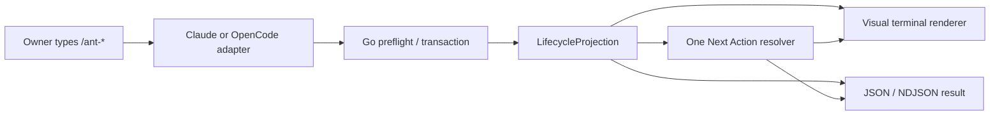

# Phase 199 — UI Design Contract

> Visual and interaction contract for the Claude Code and OpenCode `/ant-*` terminal experience. The terminal is the interface: information architecture, command choreography, state visibility, copy, ceremony, recovery, and visual/JSON parity are all UI concerns.

The plain-English contract is: make the normal journey obvious, make every claim traceable to runtime facts, and always leave the owner knowing what is true and what they can safely do next. This phase restores the useful Classic colony character without restoring prompt-owned state or shell-owned authority.

All owner-visible behavior in `199-CONTEXT.md` decisions D-01 through D-17 is locked. Choices marked **rendering default** below are limited to the internal composition freedom granted by that context; they do not change lifecycle policy.

---

## Design System

| Property | Value |
|----------|-------|
| Tool | Manual, compiled terminal design system in Go; no browser design system |
| Preset | Existing Aether house style: `renderBanner`, `renderStageMarker`, `renderNextUp`, command/caste emoji maps, ANSI role colors, and append-only scrollback |
| Component library | Cobra command groups plus existing Aether rendering primitives; no new UI dependency |
| Icon library | Existing compiled `commandEmojiMap` and `casteEmojiMap`; emoji are decorative and always paired with text |
| Font | Host terminal monospace; Aether bundles no font and emits no font-size escape sequences |
| State authority | Go runtime transactions and a read-only `LifecycleProjection` |
| Platform adapters | Canonical `.aether/commands/*.yaml`, generating synchronized Claude Code and OpenCode `/ant-*` surfaces |
| Machine surface | Existing JSON envelopes/NDJSON streams rendered from the same typed result as the visual surface |

### Authority and presentation flow



- Wrappers may add host-native interaction and ceremony, but may not infer completion, actors, cost, evidence, blockers, or state changes.
- Visual output is for people; JSON/NDJSON is for machines. Neither is derived by parsing the other.
- Raw `aether ...` commands remain runtime plumbing. Human-facing Claude Code and OpenCode copy uses `/ant-*` exclusively.
- shadcn initialization is not applicable: this repository is a Go/Cobra CLI, not React, Next.js, or Vite.

**Sources:** `199-CONTEXT.md` D-01/D-11, `199-RESEARCH.md` selected architecture, `.aether/docs/wrapper-host-contract.md`, and `cmd/codex_visuals.go`.

---

## Experience Principles

1. **Truth before theatre.** Ceremony amplifies typed runtime facts; it never supplies facts that are missing.
2. **One orientation model.** Help, status, phase, history, run, recovery, seal, and entomb consume the same projection and the same Next Action answer.
3. **Progressive disclosure.** The normal journey is first, steering and inspection second, expert maintenance third, and protocol internals hidden from default help.
4. **Strong moments, quiet inspections.** Initialization, planning, build waves, Swarm, verification, recovery, seal, and entomb carry Queen-led ceremony. Status, phase, history, and quick signal receipts are shorter.
5. **No ambiguous silence.** Missing facts render as `Unreported`, `Unavailable`, `Unknown`, or `Conflicting`; zero and blank are never substitutes.
6. **No mutation while looking.** Help, status, phase, history, previews, and failed preflights are read-only. Compatibility repair is an explicit transaction, not a loader side effect.
7. **A command ends with agency.** Every ordinary result states what changed, what remains open, and the next safe choice in exact `/ant-*` vocabulary.

---

## Spacing Scale

Values are terminal-cell column budgets, not CSS pixels. This is the closed scale for new Phase 199 layout calculations.

| Token | Value | Usage |
|-------|-------|-------|
| xs | 4 columns | First-level nested evidence and continuation alignment |
| sm | 8 columns | Second-level details beneath a receipt or finding |
| md | 16 columns | Stable label column in labeled-row views |
| lg | 24 columns | Compact field budget before values wrap |
| xl | 32 columns | Minimum useful content measure before narrow-mode stacking |
| 2xl | 48 columns | Default rich card/divider target |
| 3xl | 64 columns | Wide ritual and evidence-summary target |

Exceptions: existing list prefixes, identity delimiters, and one blank record separator are terminal grammar rather than spacing tokens and remain intact. Unicode display width must be measured as terminal cells, not byte or rune count. No view may require horizontal scrolling.

### Width behavior

- Below the `3xl` content measure, tables become ordered labeled rows; no required field disappears.
- At or above the `3xl` content measure, compact tables are allowed only when column labels and values remain readable.
- Long goals, paths, reasons, and findings wrap under their value, never under the label.
- Progress bars shrink before text is truncated. Critical words, counts, status, Next Up, and command arguments are never ellipsized.
- The current fixed divider and banner glyphs remain the visual vocabulary; Phase 199 may make their width responsive without changing their semantic role.

---

## Typography

Terminal typography deliberately uses one host-controlled cell size. Hierarchy comes from placement, whitespace, labels, weight, and rule glyphs—not fabricated pixel sizes.

| Role | Size | Weight | Line Height |
|------|------|--------|-------------|
| Body | Host terminal default (`1em`) | Regular | 1 terminal row |
| Label | Host terminal default (`1em`) | Bold | 1 terminal row |
| Heading | Host terminal default (`1em`) | Bold | 1 terminal row |
| Display | Host terminal default (`1em`) | Bold | 1 terminal row |

- **Size tokens:** exactly one, inherited from the host terminal.
- **Weight tokens:** exactly two—regular and bold. ANSI dim is not a text weight in this contract and must not carry required meaning.
- Body paragraphs are at most three terminal lines before a stage break or list.
- Top-level banners use the existing letter-spaced uppercase treatment. Stage markers use readable title case. Body copy uses sentence case.
- Uppercase is reserved for compact state tokens such as `BLOCKED`, `FORCED`, and `UNREPORTED`; it is not used for paragraphs.
- The Aether wordmark appears only at first-run/setup or an explicitly major lifecycle opening, never on routine status, phase, history, or signal receipts.

---

## Color

The 60/30/10 ratio describes visual emphasis in an ANSI-capable terminal, not fixed screen colors. Terminal themes own actual RGB values.

| Role | Value | Usage |
|------|-------|-------|
| Dominant (60%) | Terminal default foreground/background | All body copy, facts, paths, commands, and evidence |
| Secondary (30%) | ANSI neutral/bright-black role (`90`) with plain fallback | Dividers, timestamps, provenance, inactive metadata, and secondary labels |
| Accent (10%) | Existing semantic command/caste ANSI role map (`31–37`, `90–96`) | Current command banner, the acting caste label, current phase/state token, and the single Next Up anchor |
| Destructive | ANSI red (`31`/`91`) with `⛔`, `FORCED`, or `CONFLICT` text | Refusals, conflicting recovery facts, unsafe continuation, force-seal warning, and archive-clear warning only |

Accent reserved for: the command banner identity, actual acting caste labels, current phase/state, one Next Up anchor, and evidence-backed semantic status tokens. Do not color whole paragraphs, every command, paths, tables, or all interactive choices.

Semantic colors are justified status roles rather than competing decorative accents:

- Green (`32`/`92`): verified pass or completed transaction only.
- Yellow (`33`/`93`): non-blocking warning, debt, or owner attention.
- Red (`31`/`91`): blocked, failed, conflicting, destructive, or forced-incomplete state.
- Cyan (`36`/`96`): informational/current activity.
- Magenta (`35`/`95`): Queen or Crowned milestone identity when backed by state.
- Existing red caste colors identify a caste label only; they must never color its full row or imply that the ant failed.

Every semantic color is paired with a word and, where useful, a symbol. `NO_COLOR`, JSON mode, piping, or a terminal without ANSI must preserve the same information and ordering.

---

## Iconography and Colony Identity

Use the existing compiled maps; do not introduce a second emoji vocabulary.

| Concept | Required treatment |
|---------|--------------------|
| Command | One mapped emoji followed by the textual command/event title |
| Worker | `{caste emoji} {Caste} {deterministic name} — {task} [{status}]` from runtime records |
| Queen voice | Queen wording may frame a lifecycle moment; list `Queen` as a participant only when a runtime actor/event exists |
| Success | `✓` or `✅` plus `Verified`/`Completed`; never symbol alone |
| Warning | `⚠` plus `Warning` or the named debt |
| Block/refusal | `⛔` plus a specific reason and safe next action |
| Reconstructed fact | `≈ Reconstructed` plus provenance |
| Unknown fact | `? Unknown` plus why it cannot be established |

Model tags appear at dispatch time only, matching the current `casteIdentityWithModel` behavior. Routine status/history rows omit them unless the model itself is relevant evidence.

---

## Information Architecture

### Default `/ant-help` hierarchy

The default help screen is a journey map, not the current flat runtime command catalog.

| Order | Group | Visible purpose | Commands/entries |
|------:|-------|-----------------|------------------|
| 1 | **Normal journey** | Start, understand, continue, pause, return, finish, optionally archive | `/ant-init`, `/ant-plan`, `/ant-build`, `/ant-run`, `/ant-status`, `/ant-pause`, `/ant-resume`, `/ant-seal`, `/ant-entomb` |
| 2 | **Steer and inspect** | Influence live work or examine it without changing lifecycle state | `/ant-focus`, `/ant-feedback`, `/ant-redirect`, `/ant-watch`, `/ant-phase`, `/ant-history`, `/ant-swarm`, research/Dreams/memory/findings views |
| 3 | **Expert maintenance** | Inspect or repair Aether itself | `/ant-maintenance` landing view for update, migration, cleanup, integrity, generated surfaces, registry, and archives |
| — | Hidden protocol | Wrapper finalizers, event plumbing, low-level stores, generators | Absent from default help and ordinary Next Up; inspectable only from expert/raw runtime help |

Help descriptions use a verb plus outcome. In particular:

- `/ant-init`: `Start a guided colony for one goal.`
- `/ant-run`: `Autopilot the remaining accepted phases within the displayed safety contract.`
- `/ant-status`: `Show the complete authoritative colony snapshot.`
- `/ant-pause`: `Stop at a safe boundary and save one resumable handoff.`
- `/ant-resume`: `Validate and restore the safest honest recovery point.`
- `/ant-seal`: `Close a verified colony, or explicitly record an owner-forced incomplete closure.`
- `/ant-entomb`: `Archive and clear the sealed colony.`
- `/ant-maintenance`: `Inspect or repair Aether internals with preview and rollback.`

`pause-colony`, `resume-colony`, `/ant-recover`, and `/ant-abandon` are absent from default help, generated command files, documentation, examples, and ordinary suggestions. A temporary old-name parser redirect, if retained, is hidden migration plumbing and emits the canonical replacement.

### Normal journey states

| Runtime standing | What the owner sees first | Safe action contract |
|------------------|---------------------------|----------------------|
| No active colony | `No colony is active` plus the current repo | `/ant-init "goal"` |
| Initialized, no accepted plan | Goal, colony identity, survey freshness, planning prerequisite | `/ant-plan` |
| Accepted plan, ready | Goal, first remaining phase, blockers, two operating modes | `/ant-build 1` and `/ant-run` are visually equal; neither is recommended |
| Work active | Active phase/task, real ants and lineage, signals, latest evidence | Inspect with `/ant-status` or `/ant-watch`; steer or `/ant-pause` |
| Paused or interrupted | Safe boundary, handoff/reconstruction provenance, conflicts | `/ant-resume` is the only recovery front door |
| All required work verified | Completion evidence, gates, residuals | `/ant-seal` |
| Sealed and retained | Crowned record, normal or forced marker, active state retained | `/ant-status` is primary; `/ant-entomb` is an optional alternative |
| Entombed | Verified chamber/tombstone receipt and cleared-active-state fact | `/ant-init "next goal"` |

After plan acceptance, the single canonical Next Action is **choose an operating mode**. Its two command realizations are coequal by D-02; neither receives accent, ordering copy, or a “recommended” badge that implies preference.

---

## Shared Screen Grammar

Every ordinary lifecycle view uses this order, omitting a slot only when it truly does not apply:

1. **Command/event banner** — existing `━━ {emoji} L E T T E R - S P A C E D   T I T L E ━━` grammar.
2. **Identity strip** — colony name, current goal or episode, phase/standing, and actual acting castes. With no colony or actors, state that absence explicitly.
3. **Primary focal block** — the command-specific decision or outcome.
4. **Evidence and change** — what happened, which transaction/attempt it belongs to, and what state or signals changed.
5. **Open truth** — warnings, debt, blockers, unknowns, owner decisions, or residual risk.
6. **Closeout** — focused summary, not a duplicate full status dashboard.
7. **Next Up** — exact `/ant-*` command or the coequal operating-mode pair, followed by truly secondary alternatives.

Use existing stage markers (`── Title ──`) for blocks. One blank line separates records. Nested detail is capped with an honest `(+N more)` and a way to inspect the full set; critical blockers are never hidden behind the cap.

### Focal points

| View | Primary visual anchor | Secondary anchor |
|------|-----------------------|------------------|
| Help/init | Current standing and `Start a colony` journey | Grouped command map |
| Valid run | Operating contract card before any work begins | Current phase stream |
| Invalid run | `Autopilot did not start` and `State: unchanged` | Exact missing prerequisite command |
| Full status | Current standing plus phase/task progress | Blockers and Next Up |
| Compact status | One-line standing | One Next Up line |
| Pause/resume | Safe-boundary/recovery provenance | Receipt or named conflict |
| Normal seal | Verified completion and Crowned record | Status primary, entomb alternative |
| Forced seal | `FORCED — COMPLETION NOT VERIFIED` | Residuals, reason, rollback |
| Entomb | Archive verification before clear | Chamber receipt and forced marker |
| Error | Specific failed/refused action | State effect and recovery path |

---

## Command Interaction Contracts

### `/ant-help` and `/ant-init`

`/ant-help` begins with a compact standing line when a colony exists. When none exists, it begins with the empty-state copy in this spec. It then renders the three command groups above and no raw protocol inventory.

`/ant-init "goal"` is the only normal first door and runs this visible choreography:

1. Queen-led opening names the requested goal and repository.
2. Setup detection reports `Ready`, `Bootstrapped`, or an actionable setup failure. It does not teach a separate setup detour unless automatic bootstrap cannot proceed safely.
3. Intent/charter summary repeats the owner-approved goal and any material constraints in plain language.
4. Territory step reports survey freshness as `Fresh`, `Refreshed`, `Stale—refresh required`, or `Unavailable`, with timestamp/evidence when available. The owner is not asked to choose an internal colonize command.
5. Closeout names the colony, accepted goal, what was created, and the exact `/ant-plan` next step.

If an active colony already exists, initialization refuses without mutation: name the active colony and goal, then route to `/ant-status`, `/ant-seal`, or the already-applicable safe action. It never silently overwrites or abandons the colony.

### `/ant-run`

Run is optional Autopilot, not the default or superior mode.

#### Invalid entry

Preflight is read-only and renders exactly this semantic structure:

```text
⛔ Autopilot did not start
Missing: <an initialized colony | an accepted plan>.
State: unchanged.
Next: </ant-init "goal" | /ant-plan>
```

No welcome marker, migration, session backfill, repair, plan edit, or state file may be written on this path.

#### Valid entry

Before any phase starts, render this short operating contract:

```text
━━ ⚡ A U T O P I L O T ━━
Goal: <accepted goal>
Range: Phase <first> through Phase <last remaining accepted>
Active pheromones: <typed FOCUS / FEEDBACK / REDIRECT summaries, or none>
May revise: tasks, dependencies, sequencing, and implementation details when evidence requires it.
Will pause before changing: goal, promised behavior, scope, risk authority, or acceptance criteria.
Also pauses for: safety failure, corrupt state, missing authority, a material owner decision, or an invalidating failed dependency.
Starting now.
```

Invoking `/ant-run` is consent. Do not ask `Continue?`, show a second confirmation, or make the owner approve the displayed contract.

During the run:

- Emit append-only phase, wave, worker, verification, repair, warning/debt, and advancement blocks from typed events or transaction receipts.
- A bounded repair shows receipt ID, phase/attempt, failing check, permitted scope, action, verification, and remaining budget.
- Non-blocking warnings/debt remain visible in the final run report without stopping independent safe work.
- A pause card names the precise pause class, preserved work, affected dependency path, and Next Up.
- Finishing all accepted phases says that phases were built/verified and that sealing remains an explicit owner action; it does not auto-seal.

### Status, phase, history, and watch

#### `/ant-status` full view

The full dashboard is authoritative and orders sections as follows:

1. Colony identity, accepted goal/episode, state revision, and milestone.
2. Phase and task progress, dependency standing, and success criteria.
3. Active ants, deterministic names, tasks, statuses, and lineage; recent outcomes are distinct from active ants.
4. Active pheromones/standing instructions, delivery status, acknowledgement evidence, and measured changed-decision evidence when present.
5. Territory survey freshness plus research and Dreams summaries.
6. Memory/learning summary, findings, gates, verification, and attempt-bound evidence.
7. Elapsed time and **reported cost**. Missing cost renders `Unreported`, never `$0`.
8. Recent human-readable history.
9. Blockers, non-blocking debt, unknown/conflicting facts, and owner decisions.
10. Next Up and secondary safe choices.

Raw manifests, ledger rows, protocol IDs, and full event payloads remain behind detail/JSON views. Their conclusions are translated into plain language in the default dashboard.

#### `/ant-status --compact`

The compact view is a strict projection subset, not a separately computed dashboard. It contains:

- Colony + goal.
- Current phase/task counts and state.
- Active ant count or `No ants are active`.
- Highest-severity blocker/decision, if any.
- Survey freshness when it blocks planning.
- Elapsed/reported-cost summary when available.
- One Next Up line, or the coequal build/run pair after plan acceptance.

Target at most twelve non-wrapped lines. Compact mode may shorten descriptions, but never counts, status, blocking reason, or command arguments.

#### `/ant-phase` and `/ant-history`

- Phase is a focused view of one phase: objective, dependencies, tasks, success criteria, current attempt/ants, verification/evidence, blockers, and the shared Next Up answer.
- History is reverse chronological human activity with event, actor, result, and timestamp. It does not expose raw event envelopes by default.
- Both include a compact identity strip and remain read-only.

#### `/ant-watch`

- Active Watch is the live cockpit only when Phase 202 typed events exist. It must not infer liveness from processes, spinners, prose, or stale files.
- When idle, show `No ants are active right now`, the latest compact authoritative status, and recent actual activity. Do not present a blank screen or animate fake work.
- Status is the snapshot; Watch is the event stream. Watch may link to status but never replace its authority.

### Steering and Swarm boundary contracts

Every `/ant-focus`, `/ant-feedback`, or `/ant-redirect` result is a short receipt with:

| Field | Required values |
|-------|-----------------|
| Signal | Type, owner wording, scope, and durable signal ID |
| Delivery | `live`, `next safe boundary`, or `unsupported` |
| Acknowledgement | Named runtime actor/evidence, or `Not yet acknowledged` |
| Effect | Linked changed-decision evidence, or `No measured effect yet` |
| Work effect | Continued independent work, named conflicting job paused, or no active work |

- FOCUS and FEEDBACK do not stop unrelated work.
- REDIRECT pauses only work proven to conflict with it.
- Until Phase 203 supplies causal delivery, render `Delivery: next safe boundary` or `unsupported`; never claim live acknowledgement or influence.
- `/ant-swarm` during Autopilot localizes its effect to the affected job: checkpoint, pause that path, let independent work continue, integrate only a verified Swarm result, then resume the affected path. Until Phase 202 supplies typed machinery, show the limitation rather than simulating those events.

### `/ant-pause`

Pause is intentional and safe, not an abrupt state flip.

1. If work is active, report the named safe boundary being awaited or established.
2. Write one versioned handoff transaction containing partial work, phase/task/attempt identity, scoped decisions, context digest, repository/worktree evidence, actual worker lineage/status, blockers, signal snapshot, last verified evidence, and intended restart point.
3. Validate handoff/state cross-references, commit them together, and render one receipt.
4. Close with `/ant-resume`.

Replaying pause for the same transaction returns `Already paused; the existing validated handoff was retained.` It must not duplicate decisions, workers, artifacts, cleanup, or receipts.

### `/ant-resume`

Resume is the sole public recovery door and invocation is consent to restore when the evidence is consistent.

1. Show colony/goal/phase and the handoff or interruption being evaluated.
2. Group facts under explicit provenance labels:
   - `Confirmed` — validated handoff and matching durable evidence.
   - `Reconstructed` — inferred from state, activity, repository changes, or receipts; source named.
   - `Conflicting` — durable sources disagree; never silently select one.
   - `Unknown` — evidence is insufficient.
3. With no blocking conflict, restore the safest runnable point transactionally and show the resulting attempt/state plus receipt.
4. With a conflict, perform no runnable-state mutation. Name the decision or evidence needed, then ask the owner to resolve that named item and rerun `/ant-resume`.

Do not expose `/ant-recover`. Expert diagnostics may exist, but their ordinary recovery route always returns to `/ant-resume`.

### `/ant-seal`

Seal is a retained, reviewable closure—not archive-and-clear.

#### Verified seal

- Preflight lists completed phases/tasks, required gates, evidence, owner checkpoints, residual risk, rollback reference, and what the Crowned record will preserve.
- Confirmation copy: `Seal this verified colony and write its Crowned Anthill record? [y/N]`
- Only verified completion may use the Crowned art, green success treatment, `completed` language, or celebratory ceremony.
- The result states that active sealed state remains available for review.
- Primary Next Up is `/ant-status`; `/ant-entomb` is an optional alternative.

#### Forced incomplete seal

Only a direct owner invocation of `/ant-seal --force --reason "..."` may enter this branch. No worker, wrapper, recovery loop, or Autopilot path may construct, suggest as routine, or invoke `--force`.

- Focal heading: `⛔ FORCED SEAL — COMPLETION NOT VERIFIED`.
- Preflight names every unfinished phase/task, failed or skipped gate, missing evidence, queued owner evidence, residual risk, rollback/checkpoint reference, and the supplied reason.
- Confirmation copy: `Force-seal this incomplete colony with <N> unresolved item(s)? This records an owner override; it does not verify completion. [y/N]`
- Result copy: `The colony was force-sealed for recordkeeping. Completion was not verified.`
- Do not use Crowned success art, a green check, `all phases completed`, `goal achieved`, `final form`, or any normal success discriminator.
- The durable forced marker appears in status, history, Crowned record, archive manifest, chamber/tombstone, and all later archive views.
- Primary Next Up is `/ant-status`; `/ant-entomb` remains optional.

### `/ant-entomb`

Help uses the exact description: **`Archive and clear the sealed colony.`**

1. Refuse unsealed, inconsistent, or unverifiable closure state without clearing anything.
2. Preview the colony, normal/forced closure status, chamber destination, retained memory/tombstone, and active state that will be cleared.
3. Confirmation copy: `Archive and clear this sealed colony after archive verification? [y/N]`
4. Show ordered progress: `Stage archive` → `Write digest manifest` → `Verify bytes and cross-references` → `Publish chamber and tombstone` → `Clear active state`.
5. Clear active state only after content digests and state/report/XML cross-references pass.
6. On failure, say `Active colony state was retained` and provide the exact safe retry/inspection path.
7. On success, show chamber path, manifest digest, receipt, memory/tombstone retention, whether the seal was forced, and `/ant-init "next goal"`.

An interrupted entomb resumes or rolls back from its transaction journal. Directory existence alone is never presented as proof of a valid archive.

### Expert maintenance

`/ant-maintenance` is a concise landing view for update, migration, cleanup, integrity, generated-surface parity, registry, and archive operations. Each mutating operation follows the same visible grammar:

1. Scope and target resolution.
2. Validation and dry-run/preview.
3. Checkpoint/baseline.
4. Staging and verification.
5. Commit or automatic rollback.
6. Receipt with changed files, state effect, and safe next action.

Failures say whether mutation was `none`, `rolled back`, or `partially committed—recovery required`; they never imply success from a command exit alone. Useful raw mechanisms remain inspectable from expert/runtime help, but default `/ant-help` never presents them as journey steps.

---

## Copywriting Contract

| Element | Copy |
|---------|------|
| Primary CTA | `Start a colony — /ant-init "goal"` |
| Empty state heading | `No colony is active` |
| Empty state body | `Start a guided colony for one goal with /ant-init "goal".` |
| Error state | `Autopilot did not start. An accepted plan is missing. State is unchanged. Run /ant-plan.` |
| Destructive confirmation | Forced seal: `Force-seal this incomplete colony with <N> unresolved item(s)? This records an owner override; it does not verify completion. [y/N]` |
| Destructive confirmation | Entomb: `Archive and clear this sealed colony after archive verification? [y/N]` |

### Vocabulary rules

- Human-facing commands use `/ant-*`; raw `aether ...` appears only in machine/runtime fields or an explicitly expert mapping.
- Explain project metaphors on first use: `standing instructions (pheromones)`, `Crowned Anthill record (the durable seal summary)`, and `chamber (the verified colony archive)`.
- Use `owner`, not `user`, when discussing authority or decisions.
- Use `ant` for an actual recorded worker and `caste` for its role. Never use either to decorate an empty actor list.
- Use `reported cost`, never bare `cost`, because provider accounting may be incomplete.
- Use `verified`, `reconstructed`, `unknown`, `conflicting`, `forced`, and `rolled back` as exact truth labels.
- Do not use generic action labels such as `Submit`, `OK`, `Continue`, `Save`, or `Cancel`. Use `Start a colony`, `Seal verified colony`, `Keep colony active`, `Archive and clear colony`, or the exact command.
- Do not call guided build or Autopilot “recommended” after plan acceptance.

### Closeout copy slots

Every major command closeout supplies content for these labels in order:

`Colony` → `Participants` → `What happened` → `Evidence` → `State changes` → `Standing instructions` → `Unresolved` → `Next Up`.

Empty optional sections are omitted. Required-but-unavailable facts render an explicit truth label; headings are never printed with an empty body.

---

## Error and Recovery Presentation

Errors use four fixed beats:

```text
⛔ <Action> did not run | paused | failed
Because: <specific condition in plain language>
State: unchanged | rolled back | retained | recovery required
Next: <exact /ant-* command or named owner decision>
```

| Class | Visual treatment | State contract |
|-------|------------------|----------------|
| Missing prerequisite | Refusal, exact missing item and route | Zero mutation |
| Missing authority/material decision | Pause, name what only the owner can decide | Preserve partial safe work |
| Safety or failed dependency | Block affected path, name evidence and independent work status | No invalid downstream continuation |
| Corrupt/conflicting state | Red conflict block with provenance from each source | No runnable mutation until resolved/quarantined |
| Transaction interruption | Receipt/journal identity, completed stage, recovery action | Deterministic resume or rollback |
| Unsupported live delivery | Neutral limitation, `next safe boundary` | Never fabricate acknowledgement/effect |
| Archive verification failure | Named digest/cross-reference failure | Active colony retained |

Default human output hides stack traces, raw provider output, tokens, protocol payloads, and auth probes. Expert diagnostics and JSON may expose sanitized codes and provenance, never secrets.

---

## Visual and Machine-Readable Parity

Visual and JSON outputs must agree semantically, not byte-for-byte.

### Shared result contract

Each lifecycle result exposes these typed fields where applicable:

| Field | Contract |
|-------|----------|
| `schema_version` | Version of the public result contract |
| `command` / `outcome_kind` | Stable command ID and exhaustive result variant |
| `projection_revision` | Snapshot revision from which facts and Next Up were rendered |
| `identity`, `goal`, `standing`, `phase`, `tasks` | Core orientation facts with availability/provenance |
| `actors`, `lineage` | Only runtime-recorded participants and relationships |
| `changes`, `evidence`, `verification` | Attempt/transaction-bound claims |
| `signals` | Scope, delivery, acknowledgement, and effect evidence |
| `warnings`, `debt`, `blockers`, `owner_decisions` | Open truth, never flattened into one generic error list |
| `elapsed`, `reported_cost` | Value plus reporting/availability status |
| `next_action`, `alternatives` | One shared resolved answer; accepted-plan mode pair is explicitly coequal |
| `state_effect` | `none`, `committed`, `rolled_back`, `retained`, or `recovery_required` |
| `transaction`, `receipt`, `recovery` | Journal/receipt identity and replay status |
| `provenance` | `confirmed`, `reconstructed`, `conflicting`, or `unknown` per recoverable fact |

The machine result may retain raw runtime argv for an adapter to execute. The visual result uses platform display commands (`/ant-*`). Store a stable command ID or both runtime/display forms so this spelling difference cannot change the underlying Next Action decision.

### Output-mode rules

- Interactive TTY or `AETHER_OUTPUT_MODE=visual|human|pretty`: visual terminal rendering.
- `AETHER_OUTPUT_MODE=json` or non-TTY/piped output: clean JSON without ANSI, emoji-only meaning, banners, or narration.
- Live streams use NDJSON typed events; quiet finalizers do not stream decorative progress.
- Refusals and failures are non-zero at the public process boundary and include a stable error class. Successful read-only/no-op results use success semantics only when the requested outcome was satisfied.
- Human-visible claims must be recoverable from the structured result. JSON must not omit a blocker, force marker, unknown, state effect, or Next Up that the visual view shows.
- Renderers decide no policy. They switch exhaustively on typed outcome variants such as `verified_completion` versus `forced_incomplete_closure`.

---

## Terminal Accessibility and Adaptation

- Color and emoji are redundant. Stripping either leaves complete labels and order.
- Respect `NO_COLOR`, `AETHER_FORCE_COLOR`, `CLICOLOR_FORCE`, TTY detection, and JSON mode through the existing shared output path.
- Do not use cursor-addressed full-screen panes for Phase 199. Long-running output is append-only and remains understandable in scrollback and logs.
- Screen readers receive linear heading → facts → open issues → Next Up order. Decorative dividers contain no meaning.
- Never rely on a progress bar alone; print counts and percentages beside it.
- Never use a spinner or “ant is working” animation without a typed live event. Phase 202 owns the real live cockpit.
- Truncation preserves the start and end of paths when both identify the target. Exact commands, reasons, blockers, and artifact IDs are copyable in full.
- Prompts default consequential/destructive answers to No and offer a specific alternative such as `Keep colony active`.

---

## Ceremony Levels

| Level | Commands/events | Contract |
|-------|-----------------|----------|
| Queen-led ritual | init, plan, build-wave opening, Swarm, verification, resume/recovery, normal seal, forced-seal warning, entomb | Banner, identity, real participants, staged narrative, evidence-backed closeout |
| Worker theatre | actual dispatches and wave transitions | Deterministic caste/name lines, task, wave/lineage, typed status; no invented chatter |
| Dashboard | status, watch, phase, history | Compact identity, factual sections, minimal flourish |
| Progress | run and expert maintenance | One opening contract, append-only stage receipts, no repeated wordmark/banner noise |
| Quiet protocol | finalizers, generators, internal reads/writes | Structured machine output or terse expert receipt only; absent from normal UI |

Normal seal may celebrate only after required verification. Forced seal uses solemn warning/recordkeeping language, not the normal celebration. Entomb is a distinct ceremony because it clears active state only after the archive proves valid.

---

## Component Inventory

| Primitive | Reuse/create | Required behavior |
|-----------|--------------|-------------------|
| Command banner | Reuse `renderBanner` | One emoji + text; responsive rule width |
| Stage marker | Reuse `renderStageMarker` | Stable section hierarchy |
| Caste identity row | Reuse current maps/identity helpers | Actual actor only; deterministic name; wrapped task/status |
| Next Up card | Extend existing shared resolver/card | `/ant-*` display vocabulary; coequal build/run mode pair support |
| Lifecycle identity strip | Create over `LifecycleProjection` | Colony, goal/episode, phase/standing, acting castes |
| Full status view | Refactor over shared projection | All D-09 fields in prescribed order |
| Compact status view | Create as projection subset | Short orientation without independent logic |
| Run operating contract | Extend existing run opening | Goal, range, signals, pause/authority boundaries; auto-start |
| Signal receipt | Create contract now | Delivery/ack/effect truth; Phase 203 fills causal fields |
| Pause receipt | Replace sequential narrative | Safe boundary + exactly-once transaction/handoff facts |
| Resume provenance view | Create | Confirmed/reconstructed/conflicting/unknown grouping |
| Seal result variants | Split current renderer | Normal verified celebration vs forced incomplete record |
| Entomb verification view | Extend | Digest/cross-reference stages before active clear |
| Expert maintenance receipt | Create shared grammar | Preview/checkpoint/stage/commit-or-rollback/result |
| Error block | Consolidate | Because/State/Next with stable machine error class |

No primitive may read storage or recompute policy. Components render passed facts and resolved actions only.

---

## Executable Experience Corpus

Create `cmd/testdata/classic-contract/v1/` fixtures. Each case records historical anchor, synthesis decision, requirement/CAP IDs, public platform, invocation, initial state, expected semantic result, required/forbidden visual beats, pre/post digest, artifacts/receipt, and replay/fault behavior.

| Journey slice | Minimum cases |
|---------------|---------------|
| Front door | No-colony help, active-colony help, first init, automatic survey fresh/refresh/unavailable, active-colony init refusal |
| Autopilot entry | No colony, no accepted plan, valid range with no signals, valid range with signals, no second confirmation |
| Orientation | Full status, compact status, no actors, active lineage, unreported cost, unknown fact, phase/history agreement |
| Steering boundary | Live evidence supplied, next-safe-boundary fallback, unsupported delivery, REDIRECT affects only conflicting job |
| Pause/resume | Clean pause, pause replay, clean resume, unclean reconstruction, conflict refusal, resume replay, hidden old-name parser window |
| Closure | Normal verified seal, forced incomplete seal, autonomous-force rejection, forced marker persistence |
| Entomb | Unsealed refusal, inconsistent refusal, digest/cross-reference failure retains state, success clears after verify, interrupted replay/rollback |
| Maintenance | Preview/no-op, successful receipt, injected commit failure with rollback, generated Claude/OpenCode parity |
| Platforms | Every public journey case runs for Claude Code and OpenCode command spelling over the same Go transaction |

Assertions are semantic first: JSON fields, state/artifact digests, receipts, and replay invariants. Visual assertions pin required and forbidden beats, not entire brittle snapshots. A pretty screen cannot compensate for the wrong state transition.

---

## Phase Boundaries

- Phase 199 defines Watch/Swarm typed-event slots but does not implement Phase 202 live machinery.
- Phase 199 defines signal delivery/acknowledgement/effect fields and truthful fallback, but does not implement Phase 203 causal pheromone transport.
- Phase 199 does not implement Phase 200 planning iteration or Phase 201 Queen-led work-cycle substance.
- Learning governance remains Phase 204; final owner acceptance remains Phase 205.
- Codex-native `$ant-*` lifecycle skills are a later milestone. Do not market them as supported by this phase.
- No browser page, CSS token, shadcn component, icon package, or web interaction is introduced.

---

## Decision Traceability

| Decision | UI contract |
|----------|-------------|
| D-01 | `/ant-*` is the sole ordinary Claude/OpenCode vocabulary; raw runtime is plumbing |
| D-02 | Init is the first door; build/run are coequal after accepted plan |
| D-03 | Early run is read-only, names prerequisite, routes exactly to init/plan |
| D-04 | Valid run shows contract card and starts without another prompt |
| D-05 | Run shows bounded repairs/debt and only the locked honest pause conditions |
| D-06 | Operating contract names what Autopilot may revise and what requires owner authority |
| D-07 | Signal receipt distinguishes live/next-boundary/unsupported and requires causal evidence |
| D-08 | Swarm contract localizes pause/integration to the affected job |
| D-09 | Full status includes every required fact; compact is explicit subset |
| D-10 | Major closeouts use focused fixed slots, never repeat full status |
| D-11 | Ceremony levels preserve Queen voice while forbidding invented truth |
| D-12 | Status is snapshot; Watch is typed cockpit with honest idle fallback |
| D-13 | Exactly pause/resume are public; suffixed forms and recover are invisible/absent |
| D-14 | Pause shows one validated exactly-once handoff receipt at a safe boundary |
| D-15 | Resume groups confirmed/reconstructed/conflicting/unknown facts and is sole recovery door |
| D-16 | Normal and forced seal have distinct confirmation, visuals, copy, and durable truth |
| D-17 | Seal retains reviewable state; entomb verifies archive then clears, preserving force marker |

### Requirement coverage

| Requirement | Covered by |
|-------------|------------|
| SYNTH-01 | Existing design-system evidence, component inventory, and Classic corpus |
| CEC-01 | Identity strip and caste/actor truth contract |
| CEC-02 | Shared screen grammar, lifecycle states, and Next Up |
| CEC-04 | Steering, pause/resume, material-decision, and expert-detail contracts |
| CEC-08 | Normal/forced seal and entomb distinction |
| LIFE-01 | Help hierarchy and guided init |
| LIFE-02 | Automatic survey freshness choreography |
| LIFE-03 | Shared projection across status/phase/history/recovery/closure |
| LIFE-04 | Exactly-once pause/resume transaction presentation |
| LIFE-05 | Honest closure, retained findings/memory/rollback, archive verification |
| LIFE-06 | Expert maintenance grammar and rollback receipt |
| PROOF-01 | Versioned semantic/visual/fault/replay corpus |

---

## Registry Safety

| Registry | Blocks Used | Safety Gate |
|----------|-------------|-------------|
| Aether compiled terminal house style | Existing local Go renderer primitives only | local code inspected — no external registry — 2026-09-03 |
| shadcn official | none | not applicable — non-web Go CLI |
| Third-party registries | none | no third-party registry declared |

---

## Checker Sign-Off

- [ ] Dimension 1 Copywriting: PASS
- [ ] Dimension 2 Visuals: PASS
- [ ] Dimension 3 Color: PASS
- [ ] Dimension 4 Typography: PASS
- [ ] Dimension 5 Spacing: PASS
- [ ] Dimension 6 Registry Safety: PASS

**Approval:** pending
