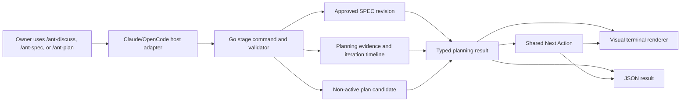

# Phase 200 — UI Design Contract

> Visual and interaction contract for the iterative Scout → Route-Setter planning journey on Claude Code and OpenCode. The terminal is the interface: the readable SPEC, preset choice, evidence cards, confidence movement, owner boundaries, candidate review, plan acceptance, revision impact, and visual/JSON parity are all UI concerns.

The plain-English contract is: show the owner how research changes the route, stop only for a real reason, and never make an unseen plan buildable. Scout brings evidence, Route-Setter changes the plan, the Queen explains the consequence, and Go decides which transition is valid.

All owner-visible behavior in `200-CONTEXT.md` decisions D-01 through D-16 is locked. Choices marked **rendering default** below use only the discretion granted for terminal spacing, color, evidence drill-down, and internal composition. They do not change planning, approval, acceptance, or authority policy.

---

## Design System

| Property | Value |
|----------|-------|
| Tool | Manual, compiled terminal design system in Go; no browser design system |
| Preset | Approved Phase 199 Aether house style: `renderBanner`, `renderStageMarker`, shared Next Up projection, compiled command/caste maps, semantic ANSI roles, and append-only scrollback |
| Component library | Cobra commands plus typed Aether rendering primitives; no new UI dependency |
| Icon library | Existing compiled `commandEmojiMap` and `casteEmojiMap`; add `spec` to that one map using `📜`, always paired with `Specification` text |
| Font | Host terminal monospace; Aether emits no font-family, font-size, or cursor-positioning escape sequences |
| State authority | Go-owned specification lineage, planning stages, iteration timeline, plan candidate, plan revision, approval and acceptance receipts |
| Platform adapters | Canonical `.aether/commands/{discuss,spec,plan}.yaml`, generating synchronized Claude Code and OpenCode `/ant-*` surfaces |
| Machine surface | JSON result envelopes, and typed NDJSON only where a real event exists, generated from the same Go result as human output |

### Design-system state detected

- No `components.json`, Tailwind config, PostCSS config, React, Next.js, Vite, TSX component tree, or browser stylesheet is present.
- shadcn initialization is not applicable. This phase adds no webpage, CSS token, registry block, font, or frontend dependency.
- Existing local visual primitives were inspected in `cmd/codex_visuals.go`: command and caste identity maps, letter-spaced banner, stage marker, Next Up translation, planning worker rows, plan renderer, ANSI detection, and plan revision presentation.
- Phase 199's approved terminal contract remains the baseline. Phase 200 adds planning primitives to the same vocabulary rather than creating a second style.

### Authority and presentation flow



- Wrappers may ask the host-native question and dispatch only a runtime-issued worker manifest. They may not calculate scores, classify materiality, alter a SPEC, invent a delta, choose a stop, approve a revision, or accept a plan.
- Go emits stable facts and action tokens; the Queen supplies clear advice by rendering the recommendation carried by that result.
- Human and machine surfaces are sibling projections. Neither is produced by parsing the other.
- Human-facing Claude Code and OpenCode copy uses `/ant-*`. Raw `aether ...` appears only in Codex/runtime, expert diagnostics, or machine execution fields.

**Sources:** `200-CONTEXT.md` D-01..D-16; `200-RESEARCH.md` Authoritative Flow and Core Contracts; `200-CLASSIC-SYNTHESIS.md` SYN-200-01..12; approved `199-UI-SPEC.md`; `cmd/codex_visuals.go`; `.aether/commands/{plan,discuss}.yaml`.

---

## Experience Principles

1. **Show causality, not activity theatre.** Each completed pass links new evidence to score movement and semantic plan change. A spinner, worker label, or restated source is not progress.
2. **One loop, two real specialists.** The visible rhythm is Scout evidence, Route-Setter synthesis, then one Go-validated card. Extra research remains attributable and does not obscure that sequence.
3. **The owner decides authority; the Queen runs the routine.** The owner chooses one preset, approves each material SPEC revision, answers material choices, and accepts an exact plan. Routine read-only investigation continues autonomously inside the selected budget.
4. **A stop is not acceptance.** Sufficiency, diminishing returns, stall, and the iteration cap produce a reviewable non-active candidate. Only a separate exact owner acceptance makes it buildable.
5. **History only grows.** Cards, evidence, SPEC revisions, candidates, and accepted plan revisions append or supersede by reference; the UI never erases an earlier fact to make the current result look cleaner.
6. **Progressive disclosure protects the story.** Default cards show fresh evidence, five score movements, the weakest gap, semantic changes, and the reason. Full citations, raw worker receipts, hashes, and detailed diffs remain one read-only drill-down away.
7. **Uncertainty stays named.** Below-target readiness, non-material residual gaps, missing provider evidence, stale owner answers, and unsupported platform behavior appear explicitly.
8. **Every ending preserves agency.** The last block says what changed, whether anything is active or accepted, and the one safe next action in the vocabulary of the platform the owner is using.

---

## Spacing Scale

Values are terminal display-cell columns, not CSS pixels. Phase 200 reuses the closed Phase 199 scale for every new planning layout.

| Token | Value | Usage |
|-------|-------|-------|
| xs | 4 columns | First-level indentation, score-to-evidence continuation |
| sm | 8 columns | Nested citation, consequence, or remaining-gap detail |
| md | 16 columns | Stable label column for `Requirements`, `Dependencies`, and card facts |
| lg | 24 columns | Compact value budget before a card row wraps |
| xl | 32 columns | Minimum useful measure for one plan-change item |
| 2xl | 48 columns | Narrow-card target and compact evidence summary |
| 3xl | 64 columns | Minimum measure for the five-dimension comparison table |

Exceptions: existing list prefixes, `before → after`, status symbols, one blank record separator, and the banner/divider grammar are syntax rather than spacing tokens. Unicode width is measured in display cells, not bytes or rune count. No Phase 200 view may require horizontal scrolling.

### Width behavior

| Available content width | Required rendering |
|-------------------------|--------------------|
| `< 48` columns | Fully stacked labels; each score, evidence summary, gap, and delta item gets its own line |
| `48–63` columns | Labeled rows with wrapped values; no multi-column table |
| `64–95` columns | Five-dimension table allowed; evidence and gap detail remains below the table |
| `≥ 96` columns | Compact evidence IDs and semantic delta columns may share a row when neither value truncates |

- Long goal text, evidence summaries, reasons, paths, and consequences wrap beneath their value start, never beneath the label.
- Score labels never abbreviate to ambiguous initials. Use `Knowledge`, `Requirements`, `Risks`, `Dependencies`, and `Effort` in full.
- Stable IDs, exact commands, stop labels, authority warnings, and candidate/spec hashes shown for acceptance are never ellipsized.
- A list may collapse non-critical detail after five entries as `(+N more — inspect with /ant-plan --show-iteration <N> --details)`. Material decisions, blockers, removed acceptance checks, and authority impacts are never collapsed.
- One blank line separates iteration cards. Cards use stage markers and whitespace rather than box-drawing borders that become illegible after wrapping.
- Append-only output never rewrites an earlier terminal row. A later status update prints a new row with the same stage/worker identity.

---

## Typography

Terminal typography uses one host-controlled cell size. Hierarchy comes from order, whitespace, labels, bold, rules, and explicit state words—not pixel-size escape sequences.

| Role | Size | Weight | Line Height |
|------|------|--------|-------------|
| Body | Host terminal default (`1em`) | Regular | 1 terminal row |
| Label | Host terminal default (`1em`) | Bold | 1 terminal row |
| Heading | Host terminal default (`1em`) | Bold | 1 terminal row |
| Display | Host terminal default (`1em`) | Bold | 1 terminal row |

- **Size tokens:** exactly one, inherited from the host terminal.
- **Weight tokens:** exactly two—regular and bold. ANSI dim is not a required weight and carries no meaning.
- Command banners retain the existing letter-spaced uppercase treatment. Stage/card titles use title case. Evidence, recommendations, consequences, and gaps use sentence case.
- Uppercase is reserved for compact truth tokens such as `DRAFT`, `APPROVED`, `NOT ACTIVE`, `STALE`, `PAUSED`, and `UNCHANGED`; never uppercase a paragraph.
- Numeric movement uses the fixed grammar `<before> → <after> (<signed delta>)`; unchanged is `<score> → <score> (—)`, not `+0`.
- A body paragraph is at most three wrapped rows before a labeled list or stage break.
- Do not render giant ASCII numerals, score gauges, five independent progress bars, or a repeated Aether wordmark. Planning uses the command banner once per invocation.

---

## Color

The 60/30/10 split describes emphasis in an ANSI-capable terminal; the host theme owns actual RGB colors.

| Role | Value | Usage |
|------|-------|-------|
| Dominant (60%) | Terminal default foreground/background | Goals, SPEC text, evidence summaries, plan content, commands, consequences, paths |
| Secondary (30%) | ANSI neutral/bright-black role (`90`) with plain fallback | Pass numbers, source kinds, timestamps, immutable IDs, prior values, provenance, non-current history |
| Accent (10%) | Existing semantic command/caste ANSI map (`31–37`, `90–96`) | Current Plan/Specification banner, actual Scout or Route-Setter caste label, current pass state, one weakest-gap anchor, one Next Up anchor |
| Destructive | ANSI red (`31`/`91`) with `⛔`, `STALE`, `CONFLICT`, or `REFUSED` text | Invalid approval/acceptance, changed base/spec, evidence mismatch, path escape, unsafe mutation refusal only |

Accent is reserved for: the current command banner, actual acting caste labels, current pass/stage, the single weakest material gap, the candidate's `NOT ACTIVE` state, exact approval/acceptance state, and the single Next Up anchor. Do not color every score, every changed item, whole evidence paragraphs, full plans, paths, or all choices.

Semantic roles:

- Green (`32`/`92`): validated evidence receipt, approved SPEC, accepted plan, sufficient target, or completed pass only.
- Yellow (`33`/`93`): owner decision required, below-target candidate, non-material residual gap, iteration cap, or revalidation attention.
- Red (`31`/`91`): refused, failed, conflicting, unsafe, stale exact token, or unauthorized mutation.
- Cyan (`36`/`96`): current stage/activity or informational provenance.
- Magenta (`35`/`95`): Queen recommendation label only; it never means approval.
- Scout retains green caste identity and Route-Setter retains bright blue caste identity from the existing maps. Caste color identifies the actor, not result quality.

Every color is redundant with a word and ordered placement. `NO_COLOR`, JSON mode, piping, or no ANSI support preserves all meaning, score signs, status, and ordering.

---

## Iconography and Planning Identity

Use one compiled map; do not create wrapper-local icons.

| Concept | Required treatment |
|---------|--------------------|
| Plan command | Existing `📋` plus textual `Plan` or `Plan Candidate` |
| Specification command | Add `spec: 📜` to `commandEmojiMap`; always print `Specification` |
| Scout | Existing `🔍 Scout <deterministic name>` from a runtime-issued worker record |
| Route-Setter | Existing `📋 Route-Setter <deterministic name>` from a runtime-issued worker record |
| Queen recommendation | `Queen recommends:` text; `Queen` is an actor only when runtime evidence records her |
| Evidence added | `+` plus evidence ID and source kind; symbol never appears alone |
| Semantic modification | `~ Changed` plus stable semantic ID and summary |
| Semantic removal | `− Removed` plus stable semantic ID and retained-history statement |
| Approval/acceptance | `✓ Approved` or `✓ Accepted` plus exact revision/candidate binding |
| Attention/pause | `⚠ Owner decision required` or `⚠ Below target` |
| Refusal | `⛔` plus specific failed check, state effect, and safe next action |

Emoji and symbols are decorative. Removing them leaves complete words and ordering. Do not use arrows as the only difference between accepted and pending state; print the state token too.

---

## Information Architecture

### Guided planning journey

```text
/ant-discuss resolves material intent
  └─ Go creates and immediately renders one DRAFT specification revision
       └─ /ant-spec opens, edits, revises, or explicitly approves it
            └─ /ant-plan asks for one preset only when valid flags are absent
                 └─ Scout stage gathers attributable evidence
                      ├─ first pass: one evidence-first material-decision batch, if needed
                      └─ Route-Setter stage proposes semantic plan changes
                           └─ Go appends one iteration card
                                ├─ continue at weakest gap
                                ├─ pause at a material owner boundary
                                └─ stop into a NOT ACTIVE candidate
                                     └─ owner accepts the exact candidate
                                          └─ accepted plan offers /ant-build and /ant-run equally
```

### Standing-to-focal-point map

| Planning standing | Primary focal block | Safe next action |
|-------------------|---------------------|------------------|
| Intent unresolved | Evidence-backed material questions | Answer the current `/ant-discuss` batch |
| Intent resolved, no SPEC | Newly created readable `DRAFT` SPEC | `/ant-spec` |
| SPEC draft | Requirements, exclusions, owner-checkable acceptance, revision state | Approve or revise through `/ant-spec` |
| SPEC approved, no run | Exact approved revision and absence of a planning run | `/ant-plan` |
| Preset required | Four named target/cap choices | Choose Fast, Balanced, Deep, or Exhaustive |
| Scout running | Actual Scout identity and the exact gaps/evidence target | Wait or `/ant-pause`; no fake percentage |
| First Scout decision boundary | Consolidated evidence-first owner-decision batch | Answer named choices; Route-Setter has not been preauthorized |
| Route-Setter running | Actual Route-Setter identity and bound Scout receipt | Wait or `/ant-pause` |
| Pass complete, continuing | Latest compact iteration card and weakest gap | Automatic next Scout stage within budget |
| Later material boundary | Completed pass card followed by owner-decision card | Answer/revalidate; active plan unchanged |
| Candidate ready | Exact final candidate marked `NOT ACTIVE`, full readiness history, gaps, Queen recommendation | Accept exact candidate or request revision |
| Candidate stale/refused | Failed binding and `State: unchanged` | Reopen current SPEC/plan state and create a fresh candidate |
| Plan accepted | Acceptance receipt and authoritative plan revision | `/ant-build 1` and `/ant-run` as coequal choices |
| Revision impact pending | Affected requirements/tasks/proof only | Approve SPEC draft, reconcile affected plan scope, then accept new candidate |

### Shared Phase 200 screen grammar

Every major Phase 200 view uses this order, omitting a slot only when it genuinely does not apply:

1. **Command/event banner** — existing `━━ {emoji} L E T T E R - S P A C E D   T I T L E ━━` grammar.
2. **Identity strip** — colony, goal, approved/draft SPEC revision, planning run, preset, pass/stage, and active-plan standing.
3. **Primary focal block** — readable contract, preset choice, iteration delta, owner decision, or plan candidate.
4. **Causal evidence** — fresh evidence, score movement, remaining gap, semantic changes, and authority impact.
5. **Open truth** — below-target state, residual gaps, stale answers, failures, blockers, unsupported behavior.
6. **State effect** — what was persisted and what explicitly remains unchanged or inactive.
7. **Next Up** — exact platform action, plus only genuinely secondary inspection/revision alternatives.

The default iteration card is the focal block after a completed pass; do not precede it with a protocol dump, raw manifest, full plan, or all historical cards. The full ordered timeline is shown in candidate review and read-only history/detail views.

---

## Interaction Contracts

### 1. Resolved `/ant-discuss` → readable draft SPEC

When the last current material intent question is resolved, Go creates or idempotently re-renders one draft revision. The same invocation immediately shows the readable projection; it does not merely print a file path.

Required choreography:

1. Render `✓ Intent resolved` with the bound goal/session.
2. Render `── Draft Specification ──` with revision ID, predecessor when present, scope (`whole goal` or exact feature/requirement IDs), and `Status: DRAFT`.
3. Present in order: outcome, included behavior, explicit exclusions, binding decisions, requirements with stable IDs, owner-checkable acceptance with stable IDs, negative/recovery expectations, and affected public paths when already known.
4. State `This draft does not authorize planning until the owner approves this exact revision.`
5. Close with `/ant-spec` to review/approve/revise. Do not route directly to planning while the SPEC is draft.

Exact settled transition:

```text
✓ Intent resolved
Draft SPEC: <spec-id> revision <N> [DRAFT]
This draft does not authorize planning until the owner approves this exact revision.
Next: /ant-spec
```

If no owner material question existed because evidence resolved the intent, the draft still requires explicit approval. If the same settled inputs replay, render `Draft already exists; the same revision was retained.` and create no duplicate.

### 2. `/ant-spec` open, edit, approve, and revise

`/ant-spec` is one real public command on Claude Code and OpenCode, with these owner-facing actions:

| Action | Interaction | State contract |
|--------|-------------|----------------|
| Open (`/ant-spec`) | Read current canonical projection, revision lineage, status, and plan impact | Read-only |
| Edit | Select stable requirement/acceptance ID or add one scoped item; state the intended wording/reason | Creates a successor `DRAFT`; never edits prior bytes |
| Revise | Select whole-goal or exact feature/requirement scope and explain why reality changed | Creates a predecessor-linked `DRAFT` with classified impact |
| Approve | Review exact revision/content hash and confirm | Marks only that revision `APPROVED`; idempotent exact replay |

#### SPEC header and body

```text
━━ 📜 S P E C I F I C A T I O N ━━
Goal: <goal>
SPEC: <spec-id> revision <N>
Status: DRAFT | APPROVED | SUPERSEDED
Scope: whole goal | feature <id> | requirements <ids>
Predecessor: <revision-id> | none

── What this goal delivers ──
<plain-language outcome>

── Included ──
REQ-...  <owner-readable behavior>

── Explicitly excluded ──
<scope exclusion>

── Owner-checkable acceptance ──
ACC-...  <observable outcome>
```

The default open view shows readable IDs, never raw JSON or content hashes in the body. The exact hash appears only in the approval block and detail view.

#### Revision delta

A successor SPEC renders this semantic classification before approval:

```text
── Revision Impact ──
Unchanged: <count> requirement(s), <count> acceptance check(s)
+ Added:      <stable IDs and summaries>
~ Modified:   <stable IDs and before/after meaning>
− Removed:    <stable IDs and retained-history note>
Plan impact: <affected task/proof IDs, or none>
Unaffected work: retained and still valid
```

Raw text diff is available only in the read-only detailed view. Removed items remain historical; never say `deleted forever`.

#### Approval confirmation and receipt

Exact prompt:

```text
Approve SPEC <spec-id> revision <N> (<short-hash>) as the planning contract? [y/N]
```

Exact success beat:

```text
✓ SPEC approved
Revision: <spec-id>:<N> (<short-hash>)
Plan impact: <none | N linked task/proof item(s) require reconciliation>
Next: /ant-plan
```

If approval token, predecessor, goal/session, or hash is stale, render a refusal with `State: unchanged`; never silently approve the latest revision instead.

### 3. `/ant-plan` preset selection

When no valid explicit quality flag is present, `/ant-plan` must stop before issuing any Scout and show one unbiased choice card. It replaces the current three-knob proposal as the normal first decision moment.

```text
━━ 📋 P L A N ━━
Goal: <goal>
Planning contract: SPEC <spec-id> revision <N> [APPROVED]

── Choose Planning Preset ──
Fast        Target 80   Up to 4 passes
Balanced    Target 90   Up to 6 passes
Deep        Target 95   Up to 8 passes
Exhaustive  Target 99   Up to 12 passes

Choose the planning preset: Fast, Balanced, Deep, or Exhaustive.
```

- No option is preselected, marked recommended, colored as preferred, or silently chosen after blank/unclear input.
- Invalid input re-renders the four valid names and starts no worker.
- Host-native option controls may be used, but the visible labels and target/cap facts remain exact.
- Explicit valid flags bypass the choice and render `Preset: <name/custom bounds> — supplied by owner flag.`
- A selected preset authorizes routine read-only research and every later gap-directed pass up to its cap. Do not ask separately for phase-research approval.
- Cancelling or interrupting at this card yields `Planning did not start. State: unchanged.`

### 4. Scout and Route-Setter stages

Worker progress uses actual runtime identities and append-only receipts.

```text
── Pass <N> · Scout ──
🔍 Scout <name> — Investigate <issued gaps or first-pass scope> [started]
Evidence sources: survey, SPEC, charter, context, research, Hive, outcomes <as actually issued>
```

On completion, append a new row rather than editing `[started]` in place:

```text
✓ Scout <name> [completed]
Fresh evidence: <count>
Remaining material questions: <count>
```

The first Scout checkpoint behaves differently by evidence, not by decoration:

- With material choices, show the consolidated decision batch before Route-Setter is issued.
- With none, print `Owner boundary: none — current evidence answers the planning choices.` and proceed without a prompt.
- Never show generic Project Direction, Quality, Constraints, or Custom menus.

Route-Setter begins only from the runtime-issued next stage bound to that Scout receipt:

```text
── Pass <N> · Route-Setter ──
📋 Route-Setter <name> — Improve the route from Scout receipt <short-id> [started]
```

Provider unavailable, interrupted, malformed, or stale worker results produce an error/pause block; they do not produce a synthetic completed card or confidence movement.

### 5. Compact iteration delta card

After every complete Scout → Route-Setter pass, Go appends and the UI renders exactly one compact card in this order:

```text
── Iteration <N> — Scout → Route-Setter ──
Fresh evidence
  + <evidence-id> [<source kind>] <one-line finding>

Planning readiness
  Knowledge       <before> → <after> (<delta>)
  Requirements    <before> → <after> (<delta>)
  Risks           <before> → <after> (<delta>)
  Dependencies    <before> → <after> (<delta>)
  Effort          <before> → <after> (<delta>)
  Overall         <derived score> / <preset target>

Weakest gap
  <dimension> <score> — <remaining gap>
  Evidence that would change it: <specific missing evidence>

Plan delta
  + Added: <semantic IDs and summaries, or none>
  ~ Changed: <semantic IDs and meaning, or none>
  − Removed: <semantic IDs and retained-history note, or none>
  Dependencies: <semantic changes, or none>
  Acceptance: <semantic changes, or none>
  Negative/recovery/public paths: <semantic changes, or none>
  Authority impact: <none | named owner boundary>

Decision
  <Continue | Stop | Pause> — <causal reason>
  Next research: <issued weakest-gap target, when continuing>
Details: /ant-plan --show-iteration <N> --details
```

Card rules:

- All five dimensions appear in the same fixed order on every card, including unchanged or decreased values.
- Scores are whole numbers from 0 through 100. The overall is Go-derived from the established 25/25/20/15/15 weights; it is not supplied by presentation code.
- Every changed dimension maps to at least one fresh applicable evidence ID. In the detail view, show `Evidence:` and `Remaining gap:` beneath each changed dimension.
- An unchanged dimension prints `(—)` and its current gap. It does not imply that dimension is complete.
- A decrease prints its negative delta and the evidence that invalidated the prior assessment. Negative movement is not styled as a runtime failure.
- `Fresh evidence` means newly admitted, current-scope evidence for this pass. Restated or inadmissible material is shown only in details as `Not score-changing`.
- Semantic deltas use stable IDs and owner-readable meaning, never a default raw Markdown diff.
- `Authority impact` is visually separate from ordinary plan changes. Any material impact routes to the decision card; it cannot be hidden in `Changed`.
- When a section has no changes, print `none` on the same line. Never omit a required section and make absence ambiguous.

### 6. Owner-decision checkpoint

The first-pass checkpoint consolidates every known material choice after Scout evidence. A later material discovery appears only after its full pass card, as D-06 requires.

Batch heading:

```text
⚠ Owner decisions required — <N> material choice(s)
Planning is paused at the completed pass boundary.
The active plan is unchanged.
```

Each decision card contains these labels in this exact order:

```text
Decision <stable-id>: <owner-readable question>
Why now: <what fresh evidence made it material>
Evidence: <short IDs and source summaries>
Queen recommends: <one viable choice and grounded rationale>
If <choice A>: <behavior/scope/risk/acceptance consequence>
If <choice B>: <behavior/scope/risk/acceptance consequence>
Prior answer: <answer and scope, or none>
Revalidation: <why still equivalent | why consequences changed>
Planning resumes: <exact next stage and target after the answer>
```

- The Queen recommends one choice when evidence supports it; she does not present an unlabeled neutral menu.
- Only viable choices appear. Evidence-answerable questions never appear in the batch.
- Multiple known choices are answered in one host-native interaction, then persisted individually against goal/session/revision.
- A previously answered decision is reused silently only when Go has established equivalent goal, meaning, and consequences. When revalidation is needed, show the prior answer and changed consequence before asking.
- Dismissing or interrupting the checkpoint preserves the completed pass and returns the same pending batch on replay.
- No next Scout or Route-Setter is issued across this boundary until the answer is valid.

### 7. Continue and stop reasons

The final `Decision` line of each card uses one of these public labels and exact semantic structures:

| Runtime reason | Owner-visible copy contract |
|----------------|-----------------------------|
| Continue | `Continue — <dimension> is weakest at <score>; Scout will investigate <specific gap>.` |
| Target sufficiency | `Stop: target sufficiency — readiness <score> meets the <preset> target <target>.` |
| Diminishing returns | `Stop: diminishing returns — fresh evidence no longer changes a material plan decision.` |
| Stall detected | `Stop: stall detected — <gap> remained unresolved across <count> grounded passes.` |
| Iteration cap | `Stop: iteration cap — <preset> used all <cap> permitted passes.` |
| Material decision | `Pause: owner decision required — <decision summary>. No plan candidate was activated.` |

- Do not collapse the four stop reasons into `done`, `accepted`, `finished`, or `max iterations`.
- A stop below target must add `Below target: <score>/<target>. Remaining gaps are non-material because <evidence-backed reason>.`
- Every stop shows residual gaps and `Evidence that would change this decision` even when the gap is non-material.
- A material residual gap never creates an acceptable candidate; it yields the decision checkpoint.
- Stopping creates a candidate only. It does not print build/run as Next Up.

### 8. Final plan candidate and exact acceptance

Candidate review is the only place the full ordered timeline is shown by default. It starts with the newest summary, then the chronological cards, then the plan.

```text
━━ 📋 P L A N   C A N D I D A T E ━━
Goal: <goal>
Candidate: <candidate-id> (<short-hash>) [NOT ACTIVE]
SPEC: <spec-id> revision <N> (<short-hash>) [APPROVED]
Base plan: <revision/hash or none>
Preset: <name> — target <N>, <used>/<cap> passes
Stopped: <target sufficiency | diminishing returns | stall detected | iteration cap>

── Readiness ──
<five final whole-number dimensions and derived overall>

── Remaining Gaps ──
<each gap, materiality, reason, and evidence that would change it>

── Iteration Timeline ──
Pass 1  <overall before→after>  <one-line evidence/delta/reason>
Pass 2  <overall before→after>  <one-line evidence/delta/reason>
...
Timeline: <count> cards, digest <short-digest>

── Proposed Plan ──
<phases, tasks, dependencies, acceptance, negative/recovery/public paths>

Queen recommends: <accept | revise> because <evidence-grounded reason>.
This candidate is not active and cannot be built yet.
```

Acceptance prompt:

```text
Accept plan candidate <candidate-id> (<short-hash>) against SPEC <spec-id>:<revision> and make it eligible for guided build or Autopilot? [y/N]
```

Success receipt:

```text
✓ Plan accepted
Plan revision: <revision-id>
Candidate: <candidate-id> (<short-hash>)
SPEC: <spec-id>:<revision> (<short-hash>)
Timeline: <count> pass(es), digest <short-digest>
State: accepted plan is READY
Next Up: choose an operating mode
  /ant-build 1
  /ant-run
```

- Build and Autopilot are coequal: same indentation, weight, color, and no recommended badge.
- A `No` or interruption retains the candidate as `NOT ACTIVE` and closes with `/ant-plan --candidate`.
- Exact replay after a committed acceptance renders `Already accepted; the existing plan revision and receipt were retained.`
- A stale candidate, changed SPEC/base plan/timeline, or mismatched token refuses with zero active-plan mutation and points to the exact fresh review command.
- SPEC approval never counts as plan acceptance. Preset choice, target sufficiency, cap, or a historical `--accept` flag never counts as plan acceptance.

### 9. Safe living-plan and SPEC revision

Feature-only changes and insertions reuse the same readable revision pattern:

1. Open the current approved SPEC and accepted plan identity.
2. Show the new evidence/reality that requires change.
3. Create a scoped successor SPEC draft when promised behavior or acceptance changes; preserve stable unaffected IDs/content.
4. Classify added/modified/removed requirements and acceptance checks.
5. Render affected task, dependency, proof, negative/recovery, and public-path links separately from unaffected work.
6. Require exact SPEC approval when the contract changed.
7. Produce a non-active plan revision candidate over affected unfinished scope only.
8. Require exact plan acceptance before activation.

Impact card:

```text
── Living Plan Impact ──
Why reality changed the route: <reason>
Evidence: <typed refs>
Affected requirements: <IDs>
Affected unfinished tasks: <IDs>
Affected proof links: <IDs>
Preserved completed work: <IDs/count>
Preserved unaffected work: <IDs/count>
Historical revision: retained as <revision-id>
Authority required: <SPEC approval | plan acceptance | material owner decision | none>
```

- `/ant-insert-phase` must not renumber and mutate the active plan directly. It enters this revision/candidate flow and explains why the phase is needed.
- An active immutable build attempt remains a hard refusal; the UI names the attempt and safe pause/finish action.
- Historical evidence is labelled `historical`, never `invalid` or deleted merely because a successor exists.
- Seal and build block only on unresolved affected current scope, while the impact card proves unaffected scope remains valid.

---

## Copywriting Contract

| Element | Exact copy |
|---------|------------|
| Primary CTA | `Review the draft specification — /ant-spec` |
| Approved-SPEC CTA | `Choose a planning preset — /ant-plan` |
| Empty state heading | `No planning run exists for this goal` |
| Empty state body | `Approve the current draft with /ant-spec, then start planning with /ant-plan.` |
| No-SPEC state | `Planning did not start. An approved specification is missing. State is unchanged. Run /ant-spec.` |
| Generic planning error | `Planning did not advance. <specific validation> failed. The active plan is unchanged. Run <exact safe command>.` |
| Candidate pending | `This candidate is not active and cannot be built yet.` |
| SPEC approval | `Approve SPEC <spec-id> revision <N> (<short-hash>) as the planning contract? [y/N]` |
| Plan acceptance | `Accept plan candidate <candidate-id> (<short-hash>) against SPEC <spec-id>:<revision> and make it eligible for guided build or Autopilot? [y/N]` |
| Destructive confirmation | Not applicable — no Phase 200 action deletes accepted history; revisions supersede by reference and preserve prior evidence |

### Vocabulary rules

- Use `planning readiness` for the five dimensions and `target` for the preset threshold. Do not call a score `certainty`, `probability of success`, or verification.
- Use the fixed dimension names: `Knowledge`, `Requirements`, `Risks`, `Dependencies`, `Effort`.
- Use `pass` in owner prose and `iteration` in stable IDs/headers where needed; never alternate among cycle, round, lap, and pass in one view.
- Use `fresh evidence`, not `new information`, when the runtime has admitted and scoped it. Use `restated`, `stale`, `inadmissible`, or `unreported` when that is the truth.
- Use `semantic plan change`, explained on first use as `a change to phases, tasks, dependencies, checks, or recovery—not merely rewritten prose`.
- Use `owner decision` only for behavior, authority, risk, scope, or acceptance choices. Do not promote routine implementation or research detail into that category.
- Use `SPEC` as the compact identity label and `specification` in explanatory prose. First use says `specification (the owner-readable contract for the goal)`.
- Use `draft`, `approved`, `superseded`, `not active`, and `accepted` as distinct exact states.
- Use `candidate` only for a persisted exact plan awaiting acceptance. A worker proposal is a draft/proposal, not a candidate until Go validates it.
- Use `target sufficiency`, `diminishing returns`, `stall detected`, and `iteration cap` exactly. Never show only an internal enum such as `target_reached` or `max_iterations`.
- Use `/ant-*` on Claude Code/OpenCode. Use raw `aether ...` only on runtime-native Codex or an explicitly marked expert/internal line.
- Avoid generic actions: `Submit`, `OK`, `Continue`, `Save`, `Accept all`, or `Approve changes`. Name the object: `Approve this SPEC revision`, `Accept this plan candidate`, `Revise requirement REQ-04`, `Keep candidate inactive`.
- The Queen speaks in concise advice: `Queen recommends: Accept this candidate because...`; she never claims `I approved`, `I decided for you`, or `100% safe`.

### Closeout slots

Major Phase 200 closeouts use these labels in order:

`Goal` → `SPEC` → `Planning run` → `What changed` → `Evidence` → `Planning readiness` → `Remaining gaps` → `State effect` → `Owner decision` → `Next Up`.

Empty optional slots are omitted. Required-but-unavailable facts use `Unreported`, `Unavailable`, `Unknown`, or `Stale`; never print an empty heading.

---

## Loading, Idle, Empty, Replay, and Failure States

### Loading/active

Phase 200 does not use indeterminate percentages or cursor-rewritten spinners. An actual issued worker may render:

```text
… Pass 2 · Scout started — targeting dependency and recovery gaps
```

It later appends a completion, failure, timeout, or interruption record with the same pass/stage/worker identity. In a host that supplies a native task panel, the panel may mirror the actual dispatch but cannot replace the durable completion card.

### Idle/paused

```text
Planning is paused at pass <N>.
Awaiting: <owner decision | SPEC approval | plan acceptance | safe resume>.
Active planning workers: none.
Completed evidence and iteration cards were retained.
Next: <exact /ant-* action>
```

Do not show `working`, `thinking`, a spinner, or an active ant when no current stage receipt proves one.

### Empty

```text
No planning run exists for this goal.
Approve the current draft with /ant-spec, then start planning with /ant-plan.
```

If no SPEC exists, replace the second line with `Resolve current intent with /ant-discuss; Aether will create the draft specification automatically.`

### Replay

- Replayed completed Scout/Route packets render `Already recorded; pass <N> stage <stage> was not duplicated.`
- Replayed draft creation renders the same revision.
- Replayed exact SPEC approval and plan acceptance return the existing receipt.
- Reopening a candidate or timeline is read-only and never restarts workers.
- A changed packet with a reused identity is `CONFLICT`, not replay; it fails with no mutation.

### Four-beat error grammar

```text
⛔ <Planning action> did not run | advance | apply
Because: <specific failed identity, evidence, scope, or authority check>
State: unchanged | prior pass retained | candidate retained | recovery required
Next: <exact /ant-* command or named owner decision>
```

| Error class | Required visible fact | State contract |
|-------------|-----------------------|----------------|
| Draft/missing SPEC | Exact current SPEC state | Zero planning-worker dispatch |
| Stale SPEC approval | Requested and current revision/hash | Zero approval mutation |
| Stale/wrong stage result | Run/pass/stage mismatch | Completed prior stages retained; no next-stage issue |
| Missing/inapplicable evidence | Dimension and rejected evidence ID/reason | No score or card mutation |
| Material choice unresolved | Decision, consequence, Queen recommendation | Completed pass retained; no unauthorized candidate |
| Provider unavailable/timeout | Worker stage and missing result | No synthetic completion or score movement |
| Candidate mismatch | Candidate, SPEC, base, or timeline mismatch | Active plan unchanged |
| Active build attempt | Exact attempt and affected scope | No plan/spec activation |
| Atomic persistence failure | Intended transaction and recovery receipt | Rollback or explicit recovery-required state |

Default human output hides stack traces, raw JSON, full hashes, provider internals, and protocol payloads. Detail/JSON may expose sanitized codes and complete identities, never secrets.

---

## Visual and Machine-Readable Parity

Visual and JSON output agree semantically, not byte-for-byte. Every visual claim below must be recoverable from a typed result; renderers decide no policy.

### Shared result contracts

| Result area | Required typed fields |
|-------------|-----------------------|
| Specification | `schema_version`, `spec_id`, `revision_id`, `status`, `scope`, `predecessor_id`, `content_hash`, `requirements`, `acceptance`, `exclusions`, `classified_delta`, `approval`, `plan_impact` |
| Preset | `preset_required`, `preset_options[] {id,label,target,max_iterations}`, `selected_preset`, `selection_source` |
| Planning stage | `planning_run_id`, `iteration`, `stage`, `manifest_id/hash`, `worker`, `issued_gaps`, `input_receipt_hash`, `status`, `state_effect` |
| Evidence | `evidence_refs[] {id,kind,summary,path/hash when allowed,scope,freshness,admissibility}`, plus rejected/restated reason |
| Dimension | `dimension`, `before`, `after`, `delta`, `fresh_evidence_ids`, `resolved_gap_ids`, `remaining_gap`, `rationale` |
| Semantic delta | Added/modified/removed stable IDs for phases, tasks, dependencies, acceptance, negative, recovery, and public paths; separate `authority_impacts` |
| Iteration card | `card_id/hash`, run/pass/stage receipt bindings, evidence, five dimensions, overall/target, weakest gap, semantic delta, decision, reason, `evidence_that_would_change` |
| Stop/pause | Exhaustive reason variant, residual gaps/materiality, below-target fact, candidate eligibility, owner boundary |
| Candidate | `candidate_id/hash`, `status`, approved SPEC/base/timeline bindings, plan content, stop reason, residual gaps, Queen recommendation, expiry/staleness |
| Acceptance/revision | Exact acceptance receipt, new PlanRevision identity, affected/preserved/superseded IDs, state effect, replay status |
| Navigation | Stable `next_action` and `alternatives`, each with runtime and platform display spelling |

### Output-mode rules

- Interactive TTY or `AETHER_OUTPUT_MODE=visual|human|pretty`: Phase 200 visual grammar.
- `AETHER_OUTPUT_MODE=json` or non-TTY/piped output: clean JSON with no ANSI, banners, or emoji-only meaning.
- Emit NDJSON only for real typed stage/worker events. Until Phase 202 provides the general live event bridge, do not claim full live/replay cockpit coverage; Phase 200 may show bounded planning stage receipts available from its own Go contracts.
- Quiet finalizers and read-only detail commands do not emit decorative progress.
- A visual `NOT ACTIVE`, below-target warning, owner boundary, stale token, state effect, residual gap, or Next Up must have an explicit machine field.
- The machine result may carry raw runtime argv for the host to execute. The human result carries `/ant-*` display spelling on Claude/OpenCode and `aether ...` on Codex.
- Failure/refusal uses a non-zero process result and stable error class. A successful no-op is success only when exact replay/idempotent retention satisfied the requested outcome.

---

## Terminal Accessibility and Adaptation

- Color, emoji, bold, and arrows are redundant. Plain output retains state words, signs, labels, order, and exact commands.
- Respect `NO_COLOR`, `AETHER_FORCE_COLOR`, `CLICOLOR_FORCE`, TTY detection, and JSON mode through the existing shared output path.
- Output is linear and append-only: heading → identity → evidence → readiness → delta → reason → state → Next Up. Do not use cursor-addressed panels or overwrite prior passes.
- Screen readers encounter every dimension in the fixed order, then the weakest gap and decision. Do not use spatial alignment as the only relationship.
- Every score includes numeric before/after text; color bars, sparklines, and gauge shapes are forbidden as sole indicators.
- Every evidence summary includes a stable text ID and source kind. Full path/citation is reachable from a read-only details command.
- Every prompt names the object and consequence. Approval/acceptance defaults to No and offers the non-mutating alternative (`Keep as draft` or `Keep candidate inactive`).
- Exact commands, IDs used for approval/acceptance, reasons, and blockers are copyable in full. Long paths preserve identifying start and end when a compact display is necessary; the details view prints the full path.
- Narrow rendering stacks table cells without losing an evidence link, remaining gap, authority impact, stop reason, or state effect.
- Plain and `NO_COLOR` corpus cases are mandatory; stripping ANSI and emoji must not merge `DRAFT` with `APPROVED`, `candidate` with `accepted`, or `stop` with `pause`.

---

## Ceremony Levels

| Level | Commands/events | Contract |
|-------|-----------------|----------|
| Queen-led planning ritual | discuss settled handoff, SPEC approval, preset selection, owner decision, final candidate, plan acceptance | One banner, grounded recommendation, exact authority/state, evidence-backed closeout |
| Worker theatre | Actual Scout/Route-Setter stage issue and completion | Deterministic identity, pass/stage, task, status, receipt; no invented chatter |
| Iteration progress | Completed pass card and autonomous next-pass transition | Compact causal card, append-only; no repeated wordmark/banner |
| Read-only inspection | SPEC open, iteration detail, timeline, candidate reopen, impact view | Quiet factual view; no mutation or worker animation |
| Quiet protocol | Stage finalizers, hashes, generated adapters, receipt validation | JSON/terse expert receipt; absent from normal owner UI |

Celebration is restrained: SPEC approval and plan acceptance may use a single green check, but only accepted plan activation offers build/run. A stopped candidate never receives completion art.

---

## Component Inventory

| Primitive | Reuse/create | Required behavior |
|-----------|--------------|-------------------|
| Command banner | Reuse `renderBanner` | One mapped emoji plus text; no repeated banner per pass |
| Stage marker | Reuse `renderStageMarker` | Pass/stage, readable card hierarchy, responsive width |
| Planning identity strip | Create over typed planning result | Goal, SPEC, run, preset, pass/stage, active/candidate standing |
| Specification view | Create | Readable stable IDs, state, scope, exclusions, acceptance, lineage |
| SPEC revision delta | Create | Unchanged/add/modify/remove plus affected/unaffected plan links |
| SPEC approval card | Create | Exact revision/hash, consequence, No-default prompt, idempotent receipt |
| Preset choice card | Replace normal three-knob card | Four unbiased exact target/cap rows; no default/recommendation |
| Worker stage row | Extend planning worker renderer | Actual stage-bound Scout/Route-Setter identity and append-only status |
| Material-decision batch | Extend pending-decision presentation | Evidence-first cards, Queen recommendation, consequences, scope/revalidation |
| Five-dimension table | Create | Fixed order, whole-number movement, evidence/gap detail, narrow stacking |
| Semantic plan delta | Create | Stable IDs; changes grouped by type; authority impact separate |
| Iteration card | Create | Compact causal pass record, persisted hash, read-only details route |
| Timeline summary | Create | Chronological cards, count/digest, latest result; never overwritten |
| Stop/pause block | Create exhaustive renderer | Distinct sufficiency/diminishing/stall/cap/material reasons |
| Plan candidate view | Create | `NOT ACTIVE`, bindings, gaps, full plan, Queen recommendation |
| Exact plan acceptance | Create | No-default prompt, stale-base checks, receipt, coequal build/run closeout |
| Living-plan impact card | Extend plan revision renderer | Affected closure plus preserved completed/unaffected work |
| Error/refusal block | Reuse Phase 199 grammar | Because/State/Next, stable machine error class |
| Next Up card | Reuse shared resolver | Platform spelling and exact standing; no build/run before acceptance |

No primitive reads storage, parses visual output, recomputes policy, or mutates state. It renders a typed result passed by the Go authority.

---

## Executable Experience Corpus

Extend `cmd/testdata/classic-contract/v1/`. Every Phase 200 case records historical anchor, synthesis decision, requirement/CAP IDs, public platform, invocation, initial typed state, expected semantic result, required/forbidden visual beats, pre/post state digest, created artifacts/receipts, and replay/fault result.

| Journey slice | Minimum executable cases |
|---------------|--------------------------|
| Discuss → SPEC | No material question; consolidated first-pass decisions; settled draft creation; exact replay; readable whole-goal and feature-scoped draft |
| SPEC lifecycle | Open draft/approved; edit creates successor; add/modify/remove classification; exact approval; stale approval; projection failure; legacy plan with no invented approval |
| Preset | No flags requires Fast/Balanced/Deep/Exhaustive choice; each exact target/cap; invalid/blank starts nothing; each valid explicit flag bypasses; no phase-research approval |
| Staged loop | First Scout; decision/no-decision checkpoint; Route-Setter bound to Scout; second gap-targeted Scout; provider failure; interruption/resume; wrong-stage/replay refusal |
| Confidence | All five dimensions; relevant fresh increase; decrease; unchanged; restatement; unrelated/missing/removed evidence; supplied-overall mismatch; materiality tie-break |
| Iteration card | Fresh evidence, semantic add/change/remove, authority split, weakest gap, continue reason, narrow width, `NO_COLOR`, detail drill-down |
| Stops | Target sufficiency; diminishing returns; stall; cap; each below target with non-material gaps; material gap pauses without candidate |
| Candidate/acceptance | Candidate is not active; build/run refusal; exact accept; No retains candidate; stale SPEC/base/timeline; acceptance replay; atomic failure |
| Revision/insert | Feature-only SPEC change; affected-only task/proof reconciliation; preserved completed/unaffected work; active-attempt refusal; accepted insertion through revision |
| Output states | Empty, loading/active, honest idle, paused, replay, conflict, provider timeout, recovery-required; visual and JSON agree |
| Platforms | Claude Code and OpenCode use equal `/ant-*` semantics over the same Go transitions; Codex direct output uses honest runtime spelling and limitation |

Required named public-path proofs from research remain visible in the corpus:

- `V-200-E2E-01`: discuss → draft → SPEC approval → two passes → candidate → exact acceptance → READY plan.
- `V-200-CONFIDENCE-01`: restated/unrelated evidence cannot raise readiness.
- `V-200-DECISION-01`: no generic/evidence-answerable question; first and later material boundaries occur at the correct stage.
- `V-200-STOP-01`: four distinct stops plus material pause; residual gaps remain visible.
- `V-200-ACCEPT-01`: no candidate is buildable before exact acceptance.
- `V-200-REVISION-01`: one changed requirement affects only linked tasks/proof.
- `V-200-REPLAY-01`: stale/replayed stage, approval, and acceptance cause zero canonical mutation.
- `V-200-PLATFORM-01`: generated Claude/OpenCode journeys make equal Go transitions and no wrapper writes state.

Assertions are semantic first: typed result, state/artifact digest, receipt bindings, and replay/fault invariants. Visual assertions pin required and forbidden beats, ordering, command spelling, and accessibility variants rather than brittle whole-screen snapshots.

---

## Platform Contract and Honest Limitations

| Platform | Public owner spelling | Phase 200 presentation contract |
|----------|-----------------------|---------------------------------|
| Claude Code | `/ant-discuss`, `/ant-spec`, `/ant-plan`, `/ant-build`, `/ant-run` | Full guided host interaction, runtime-issued workers/cards, thin wrapper, Go authority |
| OpenCode | `/ant-discuss`, `/ant-spec`, `/ant-plan`, `/ant-build`, `/ant-run` | Same semantics, ordering, choices, facts, and Go transitions as Claude Code |
| Codex CLI | `aether discuss`, `aether spec`, `aether plan`, then direct lifecycle commands | Runtime-native visual/JSON truth; no native `$ant-*` surface and no claim of Claude/OpenCode wrapper ceremony parity |

- Phase 200 must add `aether spec` as the Go-backed runtime path needed by all platforms, but it must not market a Codex-native `$ant-spec` skill or `$ant-*` suite.
- `cmd/command_guide.go` and existing Codex orchestration guidance remain aligned where current direct plan/discuss use them; richer Codex lifecycle-skill work is explicitly later.
- If Codex cannot host the same native option card, it prints the four choices and requires an explicit argument. It must not silently choose a preset.
- Supported-platform proof distinguishes equal authoritative outcomes from equal decorative ceremony.

---

## Phase Boundaries

- Phase 200 owns planning and SPEC presentation, not build/continue team sizing, verification fan-in, or worker turnaround; those remain Phase 201.
- Phase 200 may emit its own bounded typed stage receipts but does not claim the Phase 202 general live event bridge, Watch cockpit, substantive Swarm, or Oracle loop.
- Phase 200 may cite admissible Hive/context/survey/outcome inputs, but causal pheromone transport and biological recruitment remain Phase 203.
- Phase 200 does not promote learning or judge long-term outcome benefit; Phase 204 owns that governor.
- Final owner-watched restoration acceptance remains Phase 205.
- Codex-native `$ant-*` lifecycle skills remain a later milestone.
- No browser UI, shadcn component, CSS, full-screen TUI, external icon set, or third-party registry is introduced.

---

## Decision Traceability

| Decision | UI contract |
|----------|-------------|
| D-01 | One compact post-pass card shows fresh evidence, five movements, weakest gap, semantic changes, and continue/stop reason; details are read-only on demand |
| D-02 | Cards append in order, replay idempotently, and appear with digest on the accepted plan/candidate timeline |
| D-03 | Delta groups semantic phase/task/dependency/check/recovery/public-path changes and separates authority impact from ordinary change |
| D-04 | Fixed five-dimension order, whole-number before→after grammar, applicable fresh evidence and remaining gap for every movement |
| D-05 | First Scout evidence produces one consolidated material-decision batch only when needed; no generic/evidence-answerable menu |
| D-06 | Later material decision follows the completed iteration card and pauses before unauthorized candidate/revision acceptance |
| D-07 | Decision card uses Decision/Why now/Evidence/Queen recommends/Consequences/Resume labels in exact order |
| D-08 | Revalidation view shows prior answer and changed consequence; equivalent scoped answer reuses without prompting |
| D-09 | Settled discuss immediately renders the draft; real `/ant-spec` opens, edits, revises, and approves |
| D-10 | SPEC state is visibly DRAFT until exact No-default approval; only APPROVED identity may ground a new accepted plan |
| D-11 | SPEC header shows one lineage and scoped feature revision; unaffected IDs/content remain visible as preserved |
| D-12 | Semantic SPEC revision delta and living-plan impact show predecessor, history, affected-only invalidation, approval and reconciliation |
| D-13 | Unflagged plan shows unbiased Fast 80/4, Balanced 90/6, Deep 95/8, Exhaustive 99/12; invalid/blank has no default |
| D-14 | Selected preset starts autonomous routine evidence stages; no separate phase-research approval card |
| D-15 | Exact stop taxonomy, below-target/residual-gap disclosure, and material pause are separate exhaustive visual variants |
| D-16 | Candidate is marked NOT ACTIVE; exact owner acceptance is separate and only its receipt offers build/run |

### Requirement coverage

| Requirement | Covered by |
|-------------|------------|
| SYNTH-02 | Restored causal rhythm, explicit Classic/current design sources, corpus traceability, and no prompt-owned state |
| CEC-03 | Iteration card, decision card, stop taxonomy, `evidence that would change`, and Queen recommendation |
| PLAN-01 | Guided staged journey, actual worker rows, stage-bound manifests, persistent card |
| PLAN-02 | Five-dimension table, evidence causality, weakest material gap, preset target/cap |
| PLAN-03 | Semantic delta, chronological timeline, distinct continue/stop/pause copy |
| PLAN-04 | Evidence-first consolidated owner checkpoint, scoped answer/revalidation, no generic menus |
| PLAN-05 | Readable SPEC lifecycle, plan content contract, non-active candidate, exact acceptance |
| PLAN-06 | Attributable evidence inputs, revision-impact card, preserved history, affected-only reconciliation |

### Synthesis and capability linkage

| Synthesis/CAP | Visible contract |
|---------------|------------------|
| SYN-200-02/03 | Iteration card and evidence-backed five scores |
| SYN-200-04 / CAP-005 | Material decision batch and revalidation |
| SYN-200-05 / CAP-056 | Owner preset once, autonomous attributable evidence thereafter |
| SYN-200-06 | Honest stop → non-active candidate → exact acceptance |
| SYN-200-07 | Go-backed `/ant-spec` readable lineage |
| SYN-200-08 / CAP-012 | Requirement/task/proof impact closure |
| SYN-200-09 / CAP-010..012 | Living plan and insert flow through accepted revision |
| SYN-200-10 / CAP-056/061/069 | Typed source/freshness/admissibility evidence presentation |
| SYN-200-11/12 | Thin cross-platform renderers and semantic Classic corpus |

---

## Registry Safety

| Registry | Blocks Used | Safety Gate |
|----------|-------------|-------------|
| Aether compiled terminal house style | Existing local Go renderer, command/caste maps, Cobra outputs, canonical YAML generator | local source inspected — no external registry — 2026-09-07 |
| shadcn official | none | not applicable — non-web Go/Cobra CLI |
| Third-party registries | none | no third-party registry declared |

New primitives must remain local, typed render functions. They may not fetch themes, execute registry code, parse terminal escape input, read environment secrets, or load remote icons. ANSI values are selected only through the existing output-mode path.

---

## Checker Sign-Off

- [x] Dimension 1 Copywriting: PASS
- [x] Dimension 2 Visuals: PASS
- [x] Dimension 3 Color: PASS
- [x] Dimension 4 Typography: PASS
- [x] Dimension 5 Spacing: PASS
- [x] Dimension 6 Registry Safety: PASS

**Approval:** approved 2026-09-07
