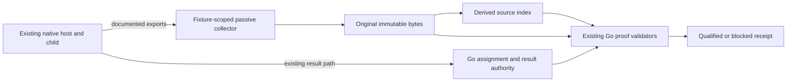

# Scoped native evidence collector

Date: 2026-09-18
Status: design complete; implementation and host qualification pending.
Owner decision: “Design a scoped evidence collector while preserving current proof requirements (Recommended).”

In plain English: retain original records from the actual worker session, show exactly which facts each record proves, and refuse completion when any required fact is missing. A better recorder cannot create evidence the host never exposes.

## Decision and authority

Design a passive, fixture-scoped collector beside the existing live harness. It receives supported host exports, preserves original bytes, and creates a separately derived index for the existing Go validators. It never launches helpers, sends answers, cancels workers, assigns work, writes runtime observations, or awards credit. The native host remains the sole helper launcher; Go remains the assignment, decision, journal and finalization authority.

The owner approved collector design, not a weaker acceptance contract, vendor upgrade, patched client, replacement control plane, credential inspection, traffic interception or deployment. D-01–D-10, ANT-04–07, the twelve acquisition obligations, all eleven final scenarios and Phase 205 boundaries remain unchanged. This decision resolves the choice of design direction; it does not resolve source availability or turn Plan 24 green.

## Architecture

The collector has three independent components:

1. **Raw sink:** a bounded local receiver and owned-file importer. It preserves raw transport bodies and source files before parsing; records framing, sizes, collector receive sequence and loss/errors; acknowledges an export only after durable persistence. Collector ordering is transport ordering, never inferred host ordering.
2. **Source adapters:** version-specific decoders for documented original events. They extract pointers and identities without claiming unsupported completeness. Capability states are `unavailable`, `candidate`, `demonstrated`, and `qualified`; only replay-verified actual evidence can advance the latter two.
3. **Offline verifier:** checks immutable inventory, original source semantics, identity joins and coverage. Derived envelopes are convenience indexes; they cannot authenticate themselves. This component neither supplies nor changes runtime results.

A collector is bound to one owned fixture/run. The existing harness owns its lifecycle and passes only child-local settings. Optional telemetry goes only to the fixture receiver. Configuration, logs and raw bodies stay outside shared homes and the checkout. No global watcher, remote telemetry destination or unrelated session ingestion is allowed.

## What can feed it

These are design candidates, not additions to the completed six-candidate discovery experiment. Preserve `204.2-ACQUISITION.md` and its blocked receipt. Any implementation feasibility pass gets a new run ID and evidence directory.

| Source | Proposed use | Admission boundary |
|---|---|---|
| Installed Codex rollout and documented read-only thread data | Parent/child linkage, original context/send fields and terminal candidates | Require actual non-null plaintext and exact child/turn correlation; never decrypt ciphertext or use reconstructed prompts |
| Codex documented telemetry | Supplemental settings and activity records | Current docs describe event metadata, prompt opt-in and asynchronous export; neither a flush nor a tool-result event establishes full request or write coverage |
| Claude raw API body export | Candidate full tools and requested-context source | Require installed-version support and actual request-to-child binding; request bytes alone do not prove acknowledgement or all effective host settings |
| Claude forwarded native child messages | Candidate delivery/answer ACK linkage | Preserve actual native child identity, message ordering and source bytes; child self-report alone cannot establish delivery |
| Host cancellation/coverage export | Required terminal and observation-end source | No qualified source established on either installed host; remain unavailable |

The [Claude monitoring reference](https://code.claude.com/docs/en/monitoring-usage) documents `OTEL_LOG_RAW_API_BODIES=file:<dir>`, untruncated body files referenced by `body_ref`, and redaction of extended thinking. Its `request_body_id` and response index linkage require 2.1.274; installed 2.1.272 cannot be assumed to provide them. Treat the export as a candidate until measured. Do not collect or attempt to recover private reasoning; if redaction removes required user-supplied context, that obligation remains unproved.

[Codex telemetry](https://learn.chatgpt.com/docs/config-file/config-advanced) documents model/permission metadata and selected prompt/tool events with asynchronous batching. [App-server documentation](https://learn.chatgpt.com/docs/app-server) describes thread reads and turn interruption. These do not establish a full model-facing tool inventory or complete post-cancel write interval. This is the design's inference from the documented scope, not a claim that no future host can expose them. Current documentation must be checked against the exact installed binary before enabling any source.

## Proof obligations, separately for each host

Each row below is evaluated once for Codex and once for Claude: twelve required results. No cross-host borrowing and no overall pass from a subset.

| Obligation | Required original evidence | Reject |
|---|---|---|
| Effective settings | Actual invocation-bound runtime settings plus model/effort provenance; absent effort stays absent | On-disk defaults, request model alone, settings from another attempt |
| Full model-facing tools | Complete actual request/boundary inventory and full parameter definitions, including built-ins and dynamic tools | Observed tool names, MCP-only inventory, configured allowlist, generated protocol schema, truncation |
| Delivered context | Full capsule, matched skills, steering and handoff bytes from actual delivery, joined to intended child and actual ACK | Expected prompt file, standalone renderer, ciphertext, correct bytes delivered to wrong child |
| Scoped answer and ACK | Current question/assignment and completed send, exact answer bytes and actual child ACK, with ordering | Stale/pre-question/replayed answer, parent-authored ACK, digest without plaintext |
| Cancelled terminal | Original request, same-child cancelled acknowledgement and corroborated Go terminal | Request accepted, interrupted state without established semantics, parent exit, killed collector |
| Complete no-write interval | Authentic host coverage contract, complete attributed records through explicit end after ACK, no post-ACK activity | Timer, quiet logs, receiver EOF, flush, file snapshot, self-declared collector end |

Preserve existing Unicode/whitespace equality, 2 MiB context bounds and no-leak challenge checks. Compare the decoded message bytes according to the demonstrated source encoding; retain original JSON too. Serialization differences cannot justify lossy normalization.

## Record and storage contract

Proposed Aether-owned manifest version: `aether-scoped-collector/v1`. This names our storage/index format, **not a vendor export or newly supported capture method**.

| Record | Required information |
|---|---|
| Run | Random run ID; fixture identity; source/input/capture digests; exact client executable/hash/version; launcher identity; argv and redacted environment configuration inventory |
| Raw artifact | Owned relative path; byte length; SHA-256; source transport and version; first/last receive sequence; original record framing; acquisition start/end; all loss/error indicators |
| Source reference | Raw artifact hash and byte span or documented field pointer; parent/child/session/task/attempt/turn/request/message identities actually present; absent values explicit |
| Obligation | Host; required predicate; status; source references; verified joins; refusal reasons; source-contract/version reference |
| Coverage | Host-authored scope, interval start/end and ordering, attributable activity streams, completeness/loss semantics and original boundary reference; unavailable unless source proves every field |
| Seal | Original artifact inventory digest and collector outcome (`captured`, `partial`, `failed`); never a host completeness attestation |

Use a durable unique directory under `~/.aether-backups/phase204-2-collector/<run-id>/` for future captures, separate from the existing `/private/tmp` evidence. Restrict directory/file modes to 0700/0600. Store raw bytes append-only, fsync before acknowledgement, then freeze inventory before any replay. A crash or disk-full event leaves a partial receipt; it never overwrites a prior run. On restart use a new segment and retain the interruption; do not silently bridge a coverage gap.

File import is limited to an explicit allowlisted fixture export root. Reject symlinks, path traversal, external `body_ref`, oversized content and files changing during import; use no-follow handles and verify stable identity/length. Retain raw references without following them until this check passes. Decode offline, disallow external schema resolution, and bound input size, decompression and record count. Exceeding a limit produces incomplete evidence, never silent truncation. Use existing context limits and measured raw-export sizes to set separate raw quotas before admission.

Use loopback binding and a per-run receiver capability if the installed exporter supports it; never log that capability or credential-bearing headers. Loopback/capability controls restrict ingestion but do not authenticate a host assertion: a worker could know inherited settings. Admit evidence only after demonstrating source origin, worker inability to alter the protected sink, and independent invocation correlation. If this isolation cannot be established in the fixture, leave source provenance unqualified. Hashes prove integrity after capture, not truth or author identity.

Exclude credentials and unrelated telemetry from collection. Exact context proof uses benign disposable inputs; any required redaction is recorded and blocks byte-exact claims for those fields. Do not copy shared authentication or inspect credentials to make telemetry work; use only the existing fixture-authorized mechanism.

## Cancellation: preserve the hard boundary

The existing `nativeGapCancellationFacts` demands a real host-derived observation end, not an Aether-authored marker. The collector therefore has **no API that manufactures an accepted observation end**. Its own seal/EOF only means recording stopped.

Filesystem snapshots or filesystem notifications can be retained as supplemental diagnostics but cannot establish the required absence of writes. An independent OS/process observer would require separately demonstrated descendant attribution, complete write-path coverage (including detached processes and remote tools), loss detection and an authenticated boundary. Even then it would not satisfy the current host-export requirement without a separately authorized proof-contract amendment. That amendment is outside this decision. No OS watcher is on the critical implementation path.

A future supported host source must establish ACK-to-end coverage for the actual child, including outstanding/background tool work and any post-ACK activity. Stream truncation, dropped records, unknown activity and ambiguous ordering force `NoPostAckWrites=false`. Resource timeout/cleanup may terminate only owned work, but never creates cancellation proof. Both installed hosts remain blocked here.

## Integration ownership and readiness

The proposed collector implementation is test infrastructure, initially `scripts/collect-native-host-evidence.py` with `scripts/test_collect_native_host_evidence.py`. It must use available dependencies; no package installation is implied. Its initial implementation can store/import/replay evidence offline without adding an accepted live capture method.

Later integration belongs to existing seams:

- `cmd/codex_native_worker_live_test.go`: fixture lifecycle and capture references only; retain sole native launcher.
- `cmd/codex_native_gap_host_capture_test.go`: supported source decoder and semantic/provenance checks only after actual acquisition proof.
- `cmd/codex_native_gap_context_test.go`: exact context/answer and child ACK joins.
- `cmd/codex_native_gap_controls_test.go`: actual terminal/coverage mapping only after proof; keep unconditional refusal until then.
- `cmd/codex_native_gap_evidence_test.go`: original inventory and replay binding.

`ready_for_adapter = all twelve obligations demonstrated and independently replay-verified and protected identities unchanged and no unknown source/loss/binding fields affecting proof`.

Collector unit tests, documentation and capability candidates do not enter this conjunction. Plan 24 remains incomplete without it. No Plan 24 SUMMARY, requirement completion or phase advancement follows from this design.

## Bounded implementation sequence

| Step | Deliverable | Exit check / stop rule |
|---|---|---|
| 1. Offline collector core | Durable sink/importer, immutable manifest, negative fixtures | Tests reject path escape, mutated files, truncation, overflow, crash/resume gaps, forged origin and ambiguous identity; synthetic data never accepted as live evidence |
| 2. Source feasibility amendment | Version-pinned source contract and narrow updated execution ownership | Check both hosts before live work. Claude body export is only a candidate; no upgrade or new control plane. Missing mandatory source stops live qualification |
| 3. Bounded actual acquisition | New disposable raw corpus per admitted mechanism, at most one 15-minute host probe per mechanism | Existing resource admission mandatory. Read-only/export-only setup; exact native launcher. Partial result retained, no unchanged expensive retries |
| 4. Independent replay | Twelve obligation results from immutable originals | Wrong host/child/attempt, omitted tool, swapped request, duplicate ACK, truncation, fake end, post-ACK activity and inserted artifacts must reject |
| 5. Existing plan chain | Renew Plan 24 acquisition; then 25 → 26 → 21 → 22 → 23 | Advance only when each actual prerequisite passes; all eleven scenarios and final four suites retained |

Before implementation, express Steps 1–2 as a narrow amendment to Plan 24 ownership and resource rules; do not silently add script writes to its current two-file scope. This design is that amendment's specification, not an executed plan. The design authorization does not claim source feasibility or authorize different host semantics.

## Design review and remaining risk

Inline design review (not independent agent review): all twelve obligations map to original evidence; collector seal cannot supply host coverage; telemetry does not prove full tool inventory; native launcher and Go ownership remain unchanged; exact context and no-leak checks survive; unavailable usage stays absent; installed release/Phase 205 are untouched.

The design is implementable as a recorder and rejecting verifier. **End-to-end qualification is not yet feasible from established installed-host sources.** The specific remaining dependencies are a complete Codex model-facing tools/settings source, demonstrated byte-exact delivery/answer joins on both hosts, and authentic cancellation coverage on both hosts. Claude raw-body export is a new documented candidate, not a verified solution. Building the collector core must not be sold as resolving these dependencies.
