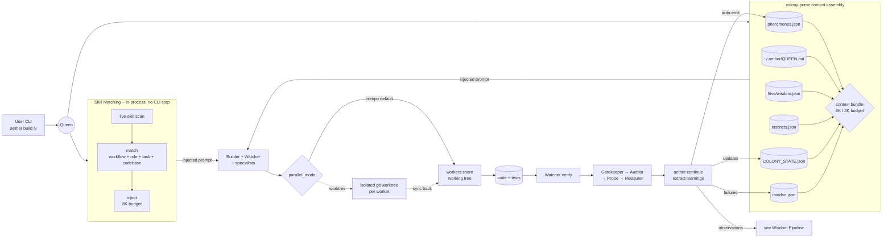
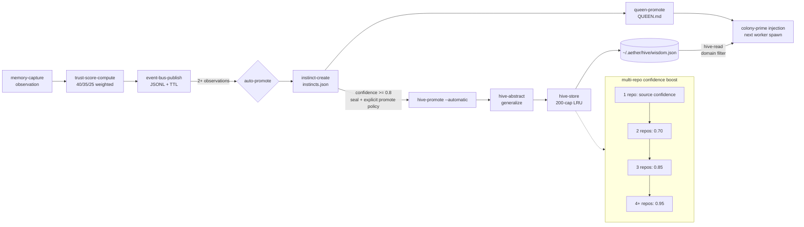

# AGENTS.md -- Aether Development Guide (Codex CLI)

> **Current Version:** v1.0.86
> **Last Updated:** 2026-07-27
> **Platform:** Codex CLI (OpenAI)

This file provides project-level instructions for Codex CLI, equivalent to
`CLAUDE.md` for Claude Code. Aether supports three platforms: Claude Code,
OpenCode, and Codex CLI.

## Platform Policy

- **Primary platforms:** Claude Code and OpenCode. These are the main maintained user surfaces.
- **Secondary platform:** Codex CLI. Codex has best-effort support for the direct `aether` workflow.
- **What that means for Codex:** keep the native CLI lifecycle, install/update flow, state integrity, and worker dispatch safe and usable. Codex UX polish and wrapper semantics may lag behind Claude/OpenCode.

---

## Quick Reference

| What | Count/Status |
|------|--------------|
| Version | v1.0.86 |
| Agent definitions | 27 castes; OpenCode also ships 1 restricted infrastructure router |
| Skills | 86 (55 colony + 31 domain) |
| Go binary | `aether` CLI (Go binary in cmd/) |
| Verification | `go test ./...` and `go test ./... -race` clean |
| Architecture doc | `RUNTIME UPDATE ARCHITECTURE.md` |

---

## How Aether Works in Codex CLI

Pick an ant skill in Codex to start the matching workflow. The skill reads Aether's
instructions; the `aether` executable still owns state, checks, and authorization.

Aether's Codex actions use skills, with exactly nine public names:

| Skill | Workflow |
|-------|----------|
| `$ant-init` | Start a colony |
| `$ant-discuss` | Clarify intent |
| `$ant-oracle` | Research a concern |
| `$ant-colonize` | Survey existing code |
| `$ant-plan` | Plan phases |
| `$ant-build` | Build a phase |
| `$ant-continue` | Verify and advance |
| `$ant-swarm` | Route work or watch workers |
| `$ant-seal` | Seal and retain work for review |

The remaining 55 action skills and native-worker parity belong to later inserted
phases. These nine names establish entrypoints, not complete lifecycle parity.

The selected installation root is `~/.codex/skills/aether/`, qualified with Codex
CLI 0.154.0. Each public `ant-<command>/SKILL.md` reads private support relative to
its own installed file, not the working directory:

- `support/aether-colony-creation.md`
- `support/aether-colony-research.md`
- `support/aether-colony-build-cycle.md`

These three ordinary files are private support, not public helper skills. Worker
skills still arrive automatically in runtime dispatch briefs. Start a fresh Codex
session after skill files are copied or removed; unchanged updates need no refresh.

When a user types a literal `aether ...` passthrough command such as `status`,
`update`, `focus`, `pheromones`, or `reference-list`, execute that exact command
first. The installed binary and `aether --help` are the runtime source of truth.

For the nine lifecycle actions above, run or inspect
`aether command-guide <command> --platform codex` and follow the matching public
skill and its private support. If the user explicitly says raw, exact,
no-interview, or no-orchestration, execute the requested CLI command directly.
Do not reinterpret a literal passthrough command as a vague workflow request.

For lifecycle shell execution, prefer `AETHER_OUTPUT_MODE=visual aether ...`
unless the user explicitly wants JSON. Preserve exact arguments. Do not preface
literal passthrough execution with repo archaeology or skill narration; the CLI
output is primary, with at most one short sentence of extra explanation.

Agent definitions live in `.codex/agents/*.toml` (TOML format) and Codex reads
them as part of its agent discovery system.

## UX Architecture

Codex gets runtime visuals from the Go renderer (`cmd/codex_visuals.go`).
The nine public skills coordinate entry into that runtime; their instructions
do not replace its state, authorization, verification, or completion evidence.

### Caste Identity System

Each worker caste has:
- **Emoji prefix** — decorative icon (e.g., `🔨` for Builder, `👁️` for Watcher)
- **ANSI-colored label** — the primary identity, colored by caste (e.g., "Builder" in yellow, "Watcher" in cyan)
- **Deterministic name** — hash-based per caste+task (e.g., "Mason-67", "Keen-6")

Visual format: `🔨 Builder Mason-67  Task description`

Color detection uses `NO_COLOR`, `AETHER_FORCE_COLOR`, `CLICOLOR_FORCE`, and TTY
checks. In non-TTY or JSON mode, colors are disabled and only plain text appears.

### Stage Markers

Build and continue output uses stage transition markers:
```
── Context ──
── Tasks ──
── Dispatch ──
── Verification ──
── Housekeeping ──
── Next Phase ──
── Colony Complete ──
```

### Output Modes

| Mode | When | Content |
|------|------|---------|
| Visual | `AETHER_OUTPUT_MODE=visual` or TTY | ANSI banners, emojis, colors, stage markers, context-clear guidance |
| JSON | `AETHER_OUTPUT_MODE=json` or piped | Structured data envelopes for programmatic use |

### Codex Orchestration Layer

Claude/OpenCode wrappers and the nine Codex skills coordinate runtime operations.
Codex uses `aether command-guide <command> --platform codex` plus the three
private support bodies listed above. Support IDs remain internal; users select
the public ant skill. Worker dispatch briefs receive matched worker skills
automatically, independently of public entrypoint discovery.

For pure visual/runtime polish, change `cmd/codex_visuals.go`. For intelligent
command behavior, keep the YAML source, Claude/OpenCode wrappers, Codex skill,
and `cmd/command_guide.go` aligned in the same change.

---

## Architecture Overview

```
+------------------------------------------------------------------+
|                     AETHER REPO (this repo)                       |
|                                                                   |
|   cmd/                 <- Go source code (primary)               |
|   +-- main.go         CLI entry point                            |
|   +-- *.go            Command implementations (80+ subcommands)  |
|                                                                   |
|   pkg/                 <- Shared Go packages                     |
|   +-- agent/          Agent pool, spawn tree, curation ants      |
|   +-- downloader/     Binary download + extraction               |
|   +-- events/         Event bus with TTL                         |
|   +-- exchange/       XML import/export                          |
|   +-- graph/          Knowledge graph persistence                |
|   +-- memory/         Learning pipeline, instincts, promotion    |
|   +-- storage/        JSON store, file locking                   |
|                                                                   |
|   .aether/             <- Source companion files for hub publish |
|   +-- commands/        YAML command wrapper source               |
|   +-- skills/          Shared skill source                       |
|   +-- docs/            Distributed documentation                 |
|   +-- templates/       Colony state, pheromones, etc.            |
|   +-- utils/           Runtime helper docs and transforms        |
|   +-- exchange/        XML exchange modules                      |
|                                                                   |
|   .aether/data/        <- LOCAL ONLY (gitignored)                |
|   .aether/dreams/      <- LOCAL ONLY (gitignored)                |
|                                                                   |
|   .claude/commands/ant/ <- Slash commands (Claude Code)          |
|   .claude/agents/ant/   <- Agent definitions (Claude Code)       |
|   .opencode/commands/ant/ <- Slash commands (OpenCode)           |
|   .opencode/agents/     <- Agent definitions (OpenCode)          |
|   .codex/agents/        <- Agent definitions (Codex CLI)         |
|                                                                   |
|   ~/.aether/           <- HUB (cross-colony, user-level)         |
|   +-- system/          Global agents, commands, skills, docs, templates |
|   +-- QUEEN.md         (wisdom + user preferences)               |
|   +-- hive/            (Hive Brain -- cross-colony wisdom)       |
|   |   +-- wisdom.json  (200-entry cap, LRU eviction)            |
|   +-- eternal/         (hive memory -- high-value signals)       |
|                                                                   |
+------------------------------------------------------------------+
```

Colony-prime assembles worker context from: QUEEN.md wisdom, eternal memory,
pheromone signals, phase learnings, key decisions, blocker flags, user preferences,
parallel mode, and context capsule -- all within a token budget (see Token Budget).

**See `RUNTIME UPDATE ARCHITECTURE.md` for complete distribution flow.**

### Runtime Lifecycle Diagram

One build cycle, model-agnostic. Shows both parallel modes in a single graph:
the `in-repo` path is solid, the `worktree` path with sync-back is dashed. The
Skill Matching sub-graph is the in-process matching-then-injection logic
called out in the Skills System section (no longer a standalone CLI step --
see that section for what changed in Phase 191).

For beginners: the Queen is the head chef, colony-prime is the whiteboard she
reads before giving each cook their recipe, the sub-graph labelled "Skill
Matching" picks which recipe cards (skills) to hand out, and the quality gates
at the end are the tasters before a plate leaves the kitchen.



Verify: every node maps to a real artifact. `pheromones.json`, `COLONY_STATE.json`,
`midden.json`, `instincts.json` live under `.aether/data/`. Global Queen wisdom
and `hive/wisdom.json` live under `~/.aether/`; repo-specific Queen wisdom lives
in `.aether/QUEEN.md`. Skill matching and injection are Go functions called
directly from the worker-brief assembler, not standalone subcommands (see
Skills System). Gate order matches the Quality Gates table.

---

## Development Workflow

### Editing System Files

| What you're changing | Where to edit | Why |
|---------------------|---------------|-----|
| Worker definitions | Aether repo `.aether/` `workers.md` | Source of truth, published to hub |
| Go commands | `cmd/` | Go source code |
| User docs | `.aether/docs/` | Distributed directly |
| Codex agent definitions | `.codex/agents/*.toml` | Codex CLI agent format |
| Claude Code commands | `.claude/commands/ant/` | Claude Code commands |
| OpenCode commands | `.opencode/commands/ant/` | OpenCode commands |
| Claude Code agents | `.claude/agents/ant/` | Claude Code agents |
| OpenCode agents | `.opencode/agents/` | OpenCode worker definitions |
| Your notes | `.aether/dreams/` | Never distributed |
| Dev docs | `.aether/docs/known-issues.md` | Distributed |

### Core Workflow

Codex currently exposes the core colony lifecycle directly:

```bash
aether lay-eggs
aether init "Build feature X"
aether discuss
aether colonize
aether plan
aether run --dry-run
aether swarm --watch
aether build 1
aether continue
aether seal
aether oracle "release concern"
```

Codex also exposes compatibility entrypoints for the flows users reach for most:
`aether run` for autopilot-style build/continue looping, `aether watch` for live
worker visibility, and `aether oracle` for the autonomous Oracle RALF research loop.
Treat these as supported best-effort compatibility entrypoints within Codex's
native CLI workflow, rather than strict mirrors of Claude/OpenCode slash-command UX.

### Publishing Changes

Authoritative runbook: `.aether/docs/publish-update-runbook.md`

```bash
# 1. Edit canonical source files in the Aether repo
vim .aether/commands/build.yaml

# 2. Commit changes
git add .
git commit -m "your message"

# 3. Publish the source checkout to the hub and rebuild the local binary
aether publish --channel stable --binary-dest "$HOME/.local/bin"

# 4. In other repos, pull hub-backed cleanup and guidance updates
aether update --force
```

Runtime note:
- `aether publish` is the primary publish command. It builds the binary, syncs companion files to the hub, and verifies version agreement automatically.
- `aether install --package-dir "$PWD"` still works for backward compatibility but does not include version verification.
- `aether update` in other repos only syncs companion files by default. It does not publish an unreleased local runtime change, and without `--force` it can leave stale Aether-managed files behind.
- `aether update --force --download-binary` is the published-release path when you also need the release runtime binary.
- For isolated source-development on this machine, publish the dev channel instead: `aether publish --channel dev --binary-dest "$HOME/.local/bin"` and then use `aether-dev update --force` in target repos. This keeps `~/.aether-dev/` and `aether-dev` separate from the public stable runtime.
- `.aether/version.json` is the source-checkout release version file. `npm/package.json` must match it exactly for published releases.
- If `aether update --force` shows `Commands (claude)` or `Commands (opencode)` as `0 copied, 0 unchanged`, the hub publish is incomplete. Republish from the Aether repo first, then rerun `aether update --force` in the target repo.
- If the change modifies publish/install/update logic, bootstrap once with `go run ./cmd/aether publish --channel stable --binary-dest "$HOME/.local/bin"` so the new logic publishes the hub and rebuilds the shared binary from source.
- Published release flow: bump `.aether/version.json` and `npm/package.json` to the same version, push the commit, then push tag `vX.Y.Z`.

---

## Aether CLI Commands

The nine public Codex skills use the `aether` CLI underneath. These are the
retained executable routes, also available for direct/raw invocation.

### Setup and Getting Started

| Command | Purpose |
|---------|---------|
| `aether lay-eggs` | Set up Aether in this repo (one-time, creates .aether/) |
| `aether init "Build feature X"` | Start a colony with a goal |
| `aether discuss` | Surface unresolved intent questions before planning and store clarifications |
| `aether colonize` | Analyze existing codebase |
| `aether plan` | Generate project phases |
| `aether build <phase>` | Execute a phase with Codex worker dispatch |
| `aether build <phase> --force` | Redispatch the current active phase after an interrupted build |
| `aether continue` | Verify work, extract learnings, advance |
| `aether run` | Autopilot the remaining build/continue loop |
| `aether swarm [problem]` | Route to the right explicit workflow step or watch active workers |
| `aether oracle [topic]` | Run or inspect the autonomous Oracle RALF research loop |

### Pheromone Signals

| Command | Priority | Purpose |
|---------|----------|---------|
| `aether focus "<area>"` | normal | Guide colony attention |
| `aether redirect "<pattern>"` | high | Hard constraint -- avoid this |
| `aether feedback "<note>"` | low | Gentle adjustment |
| `aether pheromones` | -- | View all active signals |
| `aether export-signals` | -- | Export signals to XML |
| `aether import-signals --file <path>` | -- | Import signals from XML |

### Status and Monitoring

| Command | Purpose |
|---------|---------|
| `aether status` | Colony dashboard |
| `aether watch` | Live worker activity compatibility view |
| `aether phase [N]` | View phase details |
| `aether flags` | List active flags |
| `aether flag "<title>"` | Create a flag |
| `aether history` | Browse colony events |
| `aether memory-details` | Drill-down memory view |
| `aether patrol` | System health check |

### Session Management

| Command | Purpose |
|---------|---------|
| `aether pause` | Stop at a safe boundary and save one resumable handoff |
| `aether resume` | Validate and restore the safest honest recovery point |

### Lifecycle

| Command | Purpose |
|---------|---------|
| `aether seal` | Seal colony (Crowned Anthill) |
| `aether skip-phase <phase> --force --reason "<why>"` | Emergency escape hatch for intentionally abandoning a blocked active phase |
| `aether update` | Update system files from hub |

### Advanced

| Command | Purpose |
|---------|---------|
| `aether preferences "text"` | Set user preference |
| `aether insert-phase` | Insert phase into plan |
| `aether data-clean` | Clean test artifacts from data files |
| `aether parallel-mode get` | Show the active parallel execution mode |
| `aether parallel-mode set <mode>` | Change between `in-repo` and `worktree` execution |

### Typical Workflow

```bash
# First time in a repo
aether lay-eggs

# Starting a colony
aether init "Build feature X"
aether discuss                           # optional but recommended before planning
aether colonize                          # if existing codebase
aether plan
aether watch                             # optional live worker view
aether focus "security"                  # optional guidance
aether build 1
aether continue
aether build 2                           # repeat until complete

# Or let Codex run the loop
aether run --max-phases 2

# After a session break
aether resume
aether status

# Research a release concern
aether oracle "release parity"

# After completing a colony
aether seal
```

### Sealed colony: review before archive

After `aether seal`, whether it is verified or a forced-incomplete closure, the
active colony remains retained for review; a forced-incomplete seal is never
verified completion.

1. First run `aether status` to review the retained sealed state.
2. `aether entomb` is an optional, explicit owner-invoked archive-and-clear
   alternative; it is never automatic or required after sealing.
3. A forced-incomplete marker remains visible in `aether status` and optional
   `aether entomb`.
4. Only after a successful archive-and-clear receipt has verified the archive
   and cleared active state may you run `aether init` for a new goal.

---

## Key Directories

### .codex/ (Codex CLI Agent Definitions)

```
.codex/
+-- agents/                # 27 agent definitions (TOML format)
|   +-- aether-builder.toml
|   +-- aether-watcher.toml
|   +-- aether-scout.toml
|   +-- ...
```

Each TOML file defines an agent with: name, description, nickname_candidates,
and developer_instructions. Codex reads these for agent discovery.

### .aether/ (Source of Truth)

```
.aether/
+-- workers.md           # Worker definitions, spawn protocol
+-- utils/               # Runtime utilities
|   +-- oracle/oracle.md # Oracle loop instructions
|   +-- queen-to-md.xsl  # XSL transform for queen wisdom export
+-- skills/              # 55 colony + 31 domain shipped skill definitions
+-- templates/           # 12 templates (colony-state, pheromones, etc.)
+-- docs/                # Distributed documentation
+-- exchange/            # XML exchange modules (pheromone-xml, wisdom-xml)
+-- data/                # LOCAL ONLY (never distributed)
|   +-- COLONY_STATE.json  # Colony state with phase tracking + parallel_mode
|   +-- pheromones.json
|   +-- constraints.json
|   +-- midden/          # Failure tracking
|   +-- survey/          # Territory survey results
+-- dreams/              # LOCAL ONLY (session notes)
+-- oracle/              # LOCAL ONLY (deep research)
```

### Split Playbooks (Reliability)

High-length commands are split into smaller execution playbooks:

- `.aether/docs/command-playbooks/build-prep.md`
- `.aether/docs/command-playbooks/build-context.md`
- `.aether/docs/command-playbooks/build-wave.md`
- `.aether/docs/command-playbooks/build-verify.md`
- `.aether/docs/command-playbooks/build-complete.md`
- `.aether/docs/command-playbooks/continue-verify.md`
- `.aether/docs/command-playbooks/continue-gates.md`
- `.aether/docs/command-playbooks/continue-advance.md`
- `.aether/docs/command-playbooks/continue-finalize.md`

Authority note:
- In Claude Code, `.claude/commands/ant/build.md` and `.claude/commands/ant/continue.md` are orchestrators only.
- Build/continue execution behavior is defined in `.aether/docs/command-playbooks/*.md`.
- OpenCode maintains separate command specs in `.opencode/commands/ant/*.md`.
- Codex uses nine public ant skills over the `aether` CLI; raw CLI invocation remains available.
- Agent parity model: `.claude/agents/ant/*.md`, `.opencode/agents/*.md`, and `.codex/agents/*.toml` are canonical platform sources. `aether publish` installs those sources into the global hub; there are no repo-local packaging mirrors.

---

## The 27 Agents

| Tier | Agent | TOML File | Role |
|------|-------|-----------|------|
| Core | Builder | `aether-builder.toml` | Implements code, TDD-first |
| Core | Watcher | `aether-watcher.toml` | Tests, validates, quality gates |
| Orchestration | Queen | `aether-queen.toml` | Orchestrates phases, spawns workers |
| Orchestration | Scout | `aether-scout.toml` | Researches, gathers information |
| Orchestration | Route-Setter | `aether-route-setter.toml` | Plans phases, breaks down goals |
| Orchestration | Architect | `aether-architect.toml` | Architecture design, structural planning |
| Surveyor | surveyor-nest | `aether-surveyor-nest.toml` | Maps directory structure |
| Surveyor | surveyor-disciplines | `aether-surveyor-disciplines.toml` | Documents conventions |
| Surveyor | surveyor-pathogens | `aether-surveyor-pathogens.toml` | Identifies tech debt |
| Surveyor | surveyor-provisions | `aether-surveyor-provisions.toml` | Maps dependencies |
| Specialist | Keeper | `aether-keeper.toml` | Preserves knowledge |
| Specialist | Tracker | `aether-tracker.toml` | Investigates bugs |
| Specialist | Probe | `aether-probe.toml` | Coverage analysis |
| Specialist | Weaver | `aether-weaver.toml` | Refactoring specialist |
| Specialist | Auditor | `aether-auditor.toml` | Quality gate |
| Specialist | Medic | `aether-medic.toml` | Colony health diagnosis and repair |
| Specialist | Fixer | `aether-fixer.toml` | Gate failure recovery |
| Niche | Chaos | `aether-chaos.toml` | Resilience testing |
| Niche | Archaeologist | `aether-archaeologist.toml` | Excavates git history |
| Niche | Gatekeeper | `aether-gatekeeper.toml` | Security gate |
| Niche | Includer | `aether-includer.toml` | Accessibility audits |
| Niche | Measurer | `aether-measurer.toml` | Performance analysis |
| Niche | Sage | `aether-sage.toml` | Wisdom synthesis |
| Niche | Oracle | `aether-oracle.toml` | Deep research, actionable recommendations |
| Niche | Ambassador | `aether-ambassador.toml` | External integrations |
| Niche | Chronicler | `aether-chronicler.toml` | Documentation |
| Delivery | Porter | `aether-porter.toml` | Publish, push, and deploy readiness |

---

## Pheromone System

User-colony communication via signals:

| Signal | CLI Command | Priority | Use For |
|--------|-------------|----------|---------|
| FOCUS | `aether focus "<area>"` | normal | "Pay attention here" |
| REDIRECT | `aether redirect "<avoid>"` | high | "Don't do this" (hard constraint) |
| FEEDBACK | `aether feedback "<note>"` | low | "Adjust based on this observation" |

**Before builds:** FOCUS + REDIRECT to steer
**After builds:** FEEDBACK to adjust
**Hard constraints:** REDIRECT (will break)
**Gentle nudges:** FEEDBACK (preferences)

**Viewing Signals:**
- `aether pheromones` -- Full table of all active signals
- `pheromone-display` subcommand -- Formatted output with strength % and decay

**Signal Injection:**
- Colony-prime injects active signals into worker prompts via `prompt_section`
- Builder, Watcher, and Scout agents have `pheromone_protocol` sections that instruct them how to act on injected signals
- Signals are grouped by type (FOCUS, REDIRECT, FEEDBACK) in the injected prompt section
- In Codex CLI, active pheromone signals are automatically injected into worker prompts during `build`, `colonize`, and `plan` dispatches

**Content Deduplication (v2.0):**
- Each signal gets a SHA-256 `content_hash` on creation
- Writing a duplicate (same type + content hash) reinforces the existing signal instead of creating a new one
- `suggest-analyze` deduplicates suggestions against existing active signals and session suggestions

**Prompt Injection Sanitization (v2.0):**
- Pheromone content is sanitized before storage: XML structural tags rejected, angle brackets escaped, shell injection patterns blocked
- Content capped at 500 characters

**Exchange:**
- `aether export-signals` -- Export pheromone signals to XML for cross-colony sharing
- `aether import-signals --file <path>` -- Import pheromone signals from XML

**Files:**
- `.aether/data/pheromones.json` -- Active signals
- `.aether/data/constraints.json` -- Focus areas and constraints (legacy, eventual deprecation)
- `.aether/docs/pheromones.md` -- Full guide

---

## Skills System

Skills provide reusable behavior modules and domain knowledge that workers can load
on demand. Two categories:

- **Colony skills** (55) -- Behavioral patterns that shape how workers operate
  (e.g., TDD discipline, error handling conventions, commit style)
- **Domain skills** (31) -- Technical knowledge for specific frameworks, languages,
  or tools (e.g., React patterns, Go idioms, database optimization)

### Where Skills Live

| Location | Purpose |
|----------|---------|
| `.aether/skills/` | Shipped skill source of truth in the Aether repo |
| `~/.aether/system/skills/` | Published hub mirror of shipped skills |
| `~/.aether/skills/domain/` | Custom user-created domain skills |
| repo `.aether/skills/` | Repo-specific custom skills only |
| `~/.codex/skills/aether/` | Nine public `ant-*/SKILL.md` entrypoints plus three private `support/*.md` bodies |

### How Matching Works

Matching and injection are Go functions (`matchSkillsForWorkflow`, `renderSkillInjectResult`
in `cmd/skills.go`) called directly, in-process, from the worker-brief assembler -- not a
separate CLI step. Phase 191 deleted the 8 standalone CLI wrappers that used to expose this
as `skill-index`/`skill-detect`/`skill-match`/`skill-inject`/`skill-list`/`skill-diff`/
`skill-parse-frontmatter`/`skill-cache-rebuild` (SKILL-01 -- confirmed dead CLI surface with
no caller anywhere; the underlying functions were preserved unconditionally since
`composeBuildManifestBrief` calls them for every worker brief). For each worker:

1. A live scan of installed skills is built (no separate index-build step)
2. Each skill is scored against the current worker using:
   - Workflow context (`build`, `colonize`, `plan`, `continue`)
   - Worker role (builder, watcher, etc.)
   - Task keywords from the worker assignment
   - Detected file/package patterns matched against the codebase
3. Top 3 colony skills + top 3 domain skills are selected per worker

### Skill Injection

- Own 8K character budget (independent of the colony-prime token budget)
- Injected into builder and watcher prompts automatically as part of brief assembly
- In Codex CLI, skills are automatically matched and injected into worker prompts during `build`, `colonize`, `plan`, and `continue` dispatches -- there is no separate command to fetch them

### Custom Skills

- Manual creation: add a `SKILL.md` file to `~/.aether/skills/domain/`
- A custom skill is picked up automatically the next time any worker's skill section is assembled -- there is no separate validation or cache-rebuild command to run

### Update Safety

- Repo-local Codex full-skill mirrors are retired; `aether update --force` prunes stale non-custom copies
- `aether update --force` refreshes tracked files from the hub and may discard local edits in managed paths
- User skills stored outside the tracked Aether paths remain untouched

---

## Token Budget

Colony-prime assembles worker context within a character budget to avoid prompt bloat:

| Mode | Budget | When |
|------|--------|------|
| Normal | 8,000 chars | Default |
| Compact | 4,000 chars | `--compact` flag or auto-detected |

**Retention priority** (highest packed first):
1. Blockers (never trimmed)
2. Pheromone signals
3. User preferences
4. Instincts
5. Colony state
6. Hive wisdom
7. Key decisions
8. Phase learnings

---

## Hive Brain (Cross-Colony Wisdom)

The Hive Brain stores generalized wisdom derived from colony instincts, scoped by
domain, and shared across all colonies on the same machine.

### Storage

```
~/.aether/hive/
+-- wisdom.json          # Cross-colony wisdom (200-entry cap, LRU eviction)
```

### Subcommands

| Subcommand | Purpose |
|------------|---------|
| `hive-init` | Initialize hive directory and empty wisdom.json |
| `hive-store` | Store wisdom entry with dedup and 200-cap enforcement |
| `hive-read` | Read wisdom with domain filtering and confidence threshold |
| `hive-abstract` | Generalize repo-specific instinct into cross-colony wisdom |
| `hive-promote` | Orchestrate abstract + store pipeline |
| `hive-revoke` | Revoke a wisdom entry by id (`--unrevoke` restores it) |

Automatic Hive influence is on by default (D-01/D-02):

- `AETHER_HIVE_POLICY` unset (or explicitly empty): resolves to `promote` — worker retrieval and automatic seal-time promotion are both enabled.
- `AETHER_HIVE_POLICY=read`: workers may retrieve Hive entries, but lifecycle commands do not promote project instincts globally.
- `AETHER_HIVE_POLICY=promote`: worker retrieval and automatic promotion are enabled explicitly (same effective behavior as unset).
- `AETHER_HIVE_POLICY=off`: worker retrieval and automatic promotion are both disabled; manual inspection and explicitly invoked promotion remain available.
- An unrecognized value (a typo) is treated as `off` and emits a one-line warning to stderr naming the offending value, rather than silently promoting.
- Automated wrapper/playbook promotion must pass `hive-promote --automatic`; the runtime then enforces this policy instead of trusting prompt instructions.

### Multi-Repo Confidence Boosting

| Repos Confirming | Confidence |
|-----------------|------------|
| 2 repos | 0.70 |
| 3 repos | 0.85 |
| 4+ repos | 0.95 |

**Confirmations are counted by stable repository identity, never by display
name.** Identity is derived from the normalized git remote URL, falling back to a
hash of the absolute path (`cmd/hive_repo_identity.go`). Promoting the same text
four times from one repository under four different labels earns no boost — this
is what stops a single colony inflating its own wisdom.

Confidence is never downgraded by re-promotion, but it **decays lazily on read**
with a 180-day half-life measured from `last_confirmed_at`. Entries whose
effective confidence falls below 0.3 are treated as dormant and are not injected.
The stored value is never rewritten by a read, so history stays auditable.

### Retrieval is on by default, through one switch

`AETHER_HIVE_POLICY` is the only control — there is no per-colony consent
mechanism and no opt-in command. The previous double gate (machine policy AND
a separate per-colony consent record) was retired in v1.25 Phase 162 per
decision D-02: it silently vetoed a policy the operator had explicitly
enabled, which is a worse security property than one honest switch.

- Unset means `promote`: cross-colony wisdom reaches worker context and
  high-confidence instincts promote to the Hive at seal, automatically.
- `AETHER_HIVE_POLICY=read` enables retrieval without seal-time promotion.
- `AETHER_HIVE_POLICY=off` disables both.
- An unrecognized value is treated as `off` and warns on stderr naming the
  value, so a typo cannot silently widen cross-repo data flow.

When wisdom is withheld, the reason surfaces unconditionally in colony-prime's
`warnings` — never silently, and no longer contingent on a consent state that
doesn't exist anymore.

### Contradiction and revocation

A new entry that shares most of its tokens with an existing same-domain entry but
disagrees on negation is stored **quarantined** and cross-linked to what it
contradicts. Neither side wins silently. Quarantined and revoked entries are
never retrieved, are evicted first under the 200-entry cap, and remain in the
file as an audit trail. Re-storing the exact text of a revoked entry fails rather
than resurrecting it.

Hive text is sanitized through the same `SanitizeSignalContent` path as pheromone
signals before storage — it is an untrusted cross-colony channel.

---

## User Preferences

Stored by `aether preferences` in the hub `~/.aether/QUEEN.md` under the
`## User Preferences` section. Colony-prime also honors repo-local preferences
from `.aether/QUEEN.md`.

- `aether preferences "text"` -- Add a user preference
- `aether preferences --list` -- List all user preferences

Colony-prime injects user preferences into worker context. Max 500 characters
per entry.

---

## Quality Gates

| Gate | Agent | Runs When | Purpose |
|------|-------|-----------|---------|
| Security | Gatekeeper | After verification | Scans for exposed secrets, debug artifacts |
| Quality | Auditor | After Gatekeeper | Analyzes code quality metrics |
| Coverage | Probe | After Auditor | Analyzes test coverage gaps |
| Performance | Measurer | After Probe | Performance analysis and metrics |

---

## Midden System (Failure Tracking)

- `.aether/data/midden/midden.json` -- Failure records
- `midden-write` -- Log a failure
- `midden-recent-failures` -- Query recent failures
- `midden-review` -- Review unacknowledged entries by category
- `midden-acknowledge` -- Mark entries as addressed
- `aether data-clean` -- Remove test artifacts from data files

---

## Milestone Names

| Milestone | Meaning |
|-----------|---------|
| First Mound | First runnable |
| Open Chambers | Feature work underway |
| Brood Stable | Tests consistently green |
| Ventilated Nest | Perf/latency acceptable |
| Sealed Chambers | Interfaces frozen |
| Crowned Anthill | Release ready |
| New Nest Founded | Next major version |

---

## Verification Commands

```bash
# Run Go tests
go test ./...

# Run Go tests with race detection
go test ./... -race

# Verify Go binary builds
go build ./cmd/aether

# Run Go vet
go vet ./...

# Verify goreleaser config
goreleaser check

# Assemble a version-coherent snapshot release (no tag or publication required)
AETHER_RELEASE_VERSION="$(node -p "require('./.aether/version.json').version")" goreleaser release --snapshot --clean

# Verify binary works
aether version
```

---

## Session Freshness Detection

All stateful commands use timestamp verification to detect stale sessions:

1. Capture `SESSION_START=$(date +%s)` before spawning agents
2. Check file freshness with `session-verify-fresh --command <name>`
3. Auto-clear stale files or prompt user based on command type
4. Verify files are fresh after spawning

**Protected Commands** (never auto-clear): `init`, `seal`

---

## Session Recovery

The runtime greets the owner itself. `aether hook-session-start` is registered
in `.claude/settings.json` for the three moments the owner arrives with no
context -- opening a chat, resuming one, and carrying one on after clearing it
-- and prints the shared "what next" card: the goal, how far along the work is,
the one command to run next, and a couple of alternatives. A folder with no
project set up in it is not greeted at all.

The greeting reads and never writes, and it decides nothing of its own: the card
comes from the same resolver every command's closing message comes from.

Locked by `TestSessionStartCardReflectsState`,
`TestSessionStartHookIsRegistered`, `TestSessionStartHookDoesNotMutate`, and
`TestSessionGreetingIsNotDelegatedToTheAssistant`.

---

## Wisdom Pipeline

The core learning loop: observations flow through the system and become reusable
wisdom.

| Stage | Subcommand | Output |
|-------|-----------|--------|
| 1. Observe | `memory-capture --type "learning" --content "..."` | Records observation |
| 1a. Trust score | `trust-score-compute` | Weighted trust score (40/35/25, 7 tiers) |
| 1b. Event bus | `event-bus-publish` | JSONL event bus with TTL |
| 2. Auto-promote | (internal) | Triggers after 2 observations |
| 3. Instinct | `instinct-create` | Stores in `instincts.json` |
| 4. QUEEN.md | `queen-promote` | Writes to QUEEN.md |
| 5. Inject | colony-prime | Injected into worker context |
| 6. Hive store | `hive-promote --automatic` | Abstracts to Hive only when confidence >= 0.8 and `AETHER_HIVE_POLICY=promote` |
| 7. Hive read | `hive-read` | Cross-colony retrieval by domain |

### Wisdom Pipeline Diagram

The same seven stages drawn as a flow. The multi-repo confidence sub-graph is
the boost table from the Hive Brain section -- one colony's observation becomes
stronger as more repos confirm the same pattern.

For beginners: think of it as a rumour travelling through a village. One person
notices something (observe), the village weighs how trustworthy they are (trust
score), it gets shouted in the square (event bus), and after two people say the
same thing it becomes common knowledge (instinct). Really solid rumours get
written into the village history book (Hive Brain) that neighbouring villages
also read.



Verify: every node maps to a real subcommand (`memory-capture`,
`trust-score-compute`, `event-bus-publish`, `instinct-create`, `queen-promote`,
`hive-promote`, `hive-abstract`, `hive-store`, `hive-read`) or a real file path.
Confidence thresholds match the Multi-Repo Confidence Boosting table.

**See `.aether/docs/structural-learning-stack.md` for full documentation.**

---

## Structural Learning Stack

Memory consolidation pipeline with trust scoring, graph relationships, and
automated curation.

Key additions:
- Trust scoring engine (40/35/25 weighted, 60-day half-life, 7 tiers)
- JSONL event bus with pub/sub and TTL cleanup
- Standalone instinct storage with full provenance
- 8 curation ants with orchestrated execution
- Lifecycle integration: `consolidation-phase-end` and `consolidation-seal` are available as `aether` subcommands, and both now have runtime callers — `aether continue` invokes phase-end consolidation on durable phase advance, `aether seal` invokes the full eight-ant seal pass, and both remain directly invocable as the manual inspection path. See `.aether/docs/learning-system-authority.md` for the authority decision and the named tests enforcing this

### Curation Ants

| Ant | Role |
|-----|------|
| orchestrator | Coordinates curation pipeline execution |
| archivist | Archives and retrieves historical observations |
| critic | Evaluates instinct quality and confidence |
| herald | Broadcasts high-confidence instincts to hive |
| janitor | Cleans stale events and expired TTL entries |
| librarian | Indexes and catalogs instinct relationships |
| nurse | Heals low-confidence instincts with supporting evidence |
| scribe | Records curation decisions and audit trail |
| sentinel | Guards against instinct corruption and conflicts |

---

## Parallel Execution Modes

Aether supports two parallel execution strategies:

| Mode | Value | Description |
|------|-------|-------------|
| In-repo (default) | `"in-repo"` | Workers share the working tree directly |
| Worktree | `"worktree"` | Each worker gets an isolated git worktree, then file and pheromone changes sync back into the main root |

- `aether parallel-mode get` -- Read current mode
- `aether parallel-mode set <mode>` -- Change mode

**In-repo** is simpler for most projects. **Worktree** provides isolation for
larger tasks with multiple workers touching different files, while keeping the
main root as the final source of truth after sync-back.

---

## The Core Insight

The system's pieces are now **connected**:
- Pheromones update context (colony-prime injects signals into worker prompts)
- Decisions become pheromones (auto-emit during builds)
- Learnings become instincts (observation to promotion pipeline)
- Midden affects behavior (threshold auto-REDIRECT)
- Hive Brain crosses colony boundaries (domain-scoped wisdom -> colony-prime)
- Instincts remain project-local at seal unless `AETHER_HIVE_POLICY=promote` explicitly enables automatic Hive promotion
- Multi-repo confirmation boosts confidence (2 repos = 0.7, 4+ = 0.95)
- User preferences shape worker behavior (QUEEN.md -> colony-prime)
- Codex uses the direct `build` -> `continue` -> `seal` lifecycle

**The ongoing challenge is maintenance** -- keeping documentation accurate,
data files clean, and test coverage comprehensive as features evolve.

---

## Platform Cross-Reference

| Concept | Claude Code | OpenCode | Codex CLI |
|---------|-------------|----------|-----------|
| Project instructions | `CLAUDE.md` | `.opencode/OPENCODE.md` | `AGENTS.md` |
| Agent definitions | `.claude/agents/ant/*.md` | `.opencode/agents/*.md` | `.codex/agents/*.toml` |
| Public actions | `.claude/commands/ant/*.md` | `.opencode/commands/ant/*.md` | Nine `$ant-*` skills; direct `aether` CLI retained |
| Rules | `.claude/rules/*.md` | `.opencode/rules/*.md` | `AGENTS.md` sections |

---

*Updated for Aether v1.0.86 — 2026-09-21*
