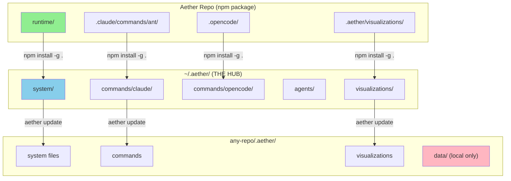
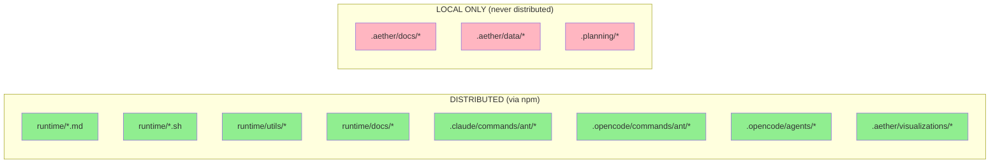
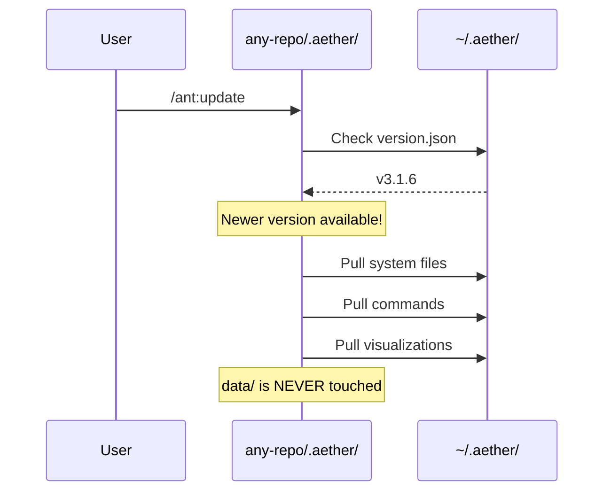
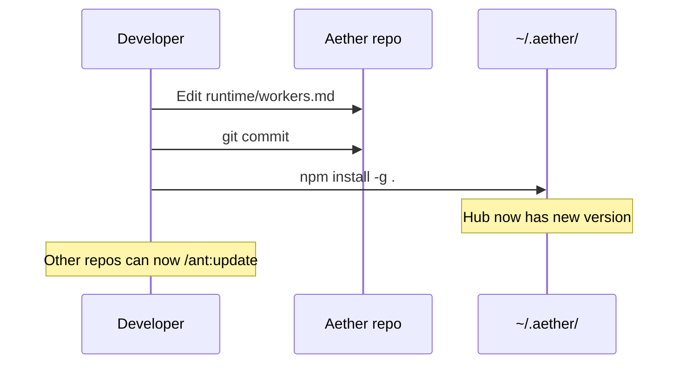

# Aether Architecture - How It Works

## The Core Concept

```
┌─────────────────────────────────────────────────────────────────┐
│                     AETHER REPO (this repo)                      │
│                                                                  │
│   runtime/              ← SOURCE OF TRUTH for distribution      │
│   ├── workers.md                                             │
│   ├── aether-utils.sh                                        │
│   ├── utils/                                                 │
│   └── docs/              ← Only docs for USERS go here         │
│                                                                  │
│   .claude/commands/ant/ ← Slash commands (Claude Code)         │
│   .opencode/commands/ant/ ← Slash commands (OpenCode)          │
│   .opencode/agents/     ← Agent definitions                    │
│                                                                  │
│   .aether/              ← YOUR LOCAL WORK (not distributed)    │
│   ├── docs/             ← Your personal notes                  │
│   ├── visualizations/   ← ASCII art (gets distributed)         │
│   └── data/             ← Colony state (never touched)         │
│                                                                  │
└─────────────────────────────────────────────────────────────────┘
```

## The Distribution Flow



## What Goes Where



## The Update Commands

### `/ant:update` (in any repo)
Pulls latest from hub into that repo's `.aether/`



### `npm install -g .` (in Aether repo)
Pushes to hub, making updates available to all repos



## Simple Rules

| Rule | Explanation |
|------|-------------|
| **Edit `runtime/`** | Changes that go to ALL users via npm |
| **Edit `.claude/commands/ant/`** | Slash commands for Claude Code |
| **Edit `.aether/visualizations/`** | ASCII art (special case - gets distributed) |
| **NEVER edit `.aether/` system files** | They get overwritten by updates |
| **`.aether/data/` is safe** | Colony state is never touched by updates |
| **`.aether/docs/` is yours** | Personal notes, not distributed |

## The Visualizations Exception

```
.aether/visualizations/ → DISTRIBUTED
.aether/docs/          → NOT distributed
.aether/data/          → NOT distributed (local state)
.aether/*.md           → NOT distributed (working copies)
```

Why? Visualizations are ASCII art assets needed by the `/ant:maturity` command, so they need to be distributed with the package.

## Quick Reference

```bash
# You changed something in Aether repo:
npm install -g .          # Push to hub

# You want updates in another repo:
/ant:update               # Pull from hub

# CLI equivalent:
aether update             # Same as /ant:update
aether update --force     # Stash changes and update
```
