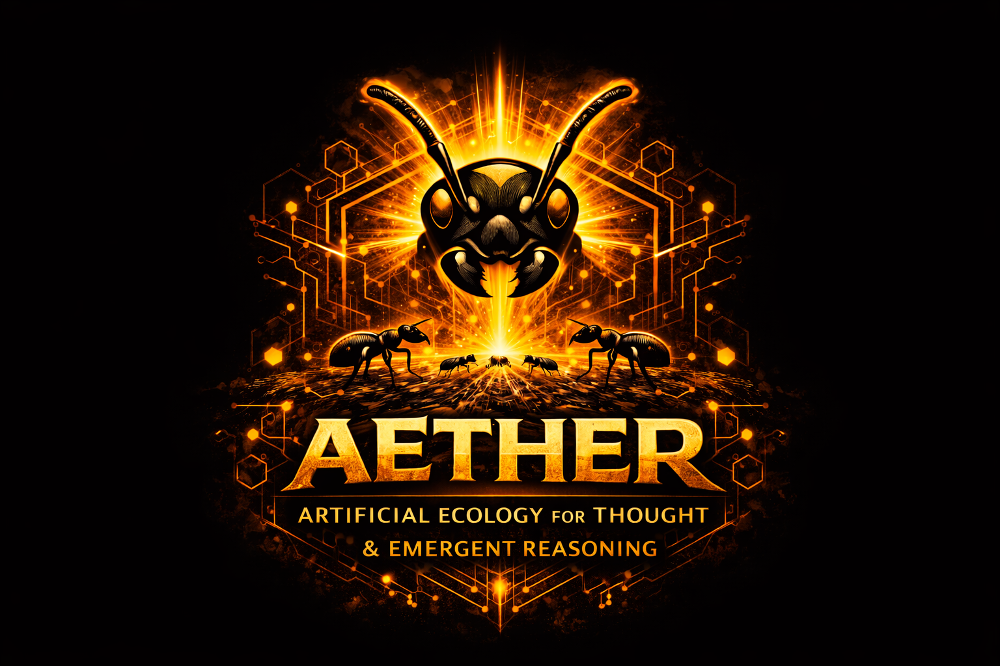

<div align="center">

```
      █████╗ ███████╗████████╗██╗  ██╗███████╗██████╗
     ██╔══██╗██╔════╝╚══██╔══╝██║  ██║██╔════╝██╔══██╗
     ███████║█████╗     ██║   ███████║█████╗  ██████╔╝
     ██╔══██║██╔══╝     ██║   ██╔══██║██╔══╝  ██╔══██╗
     ██║  ██║███████╗   ██║   ██║  ██║███████╗██║  ██║
     ╚═╝  ╚═╝╚══════╝   ╚═╝   ╚═╝  ╚═╝╚══════╝╚═╝  ╚═╝
```

**Multi-agent system using ant colony intelligence for Claude Code and OpenCode**

[](https://www.npmjs.com/package/aether-colony)
[](https://opensource.org/licenses/MIT)

**v2.0.0**
</div>

<p align="center">
  
</p>

---

## What Is Aether?

Aether brings **ant colony intelligence** to AI-assisted development. Instead of one AI agent doing everything sequentially, you get a colony of ~22 specialists that self-organize around your goal.

**The colony metaphor:** You are the Queen. You set the goal and steer with pheromone signals. Workers -- builders, watchers, scouts, and others -- spawn dynamically based on what the task needs. When a Builder hits something complex, it spawns a Scout to research. When code is written, a Watcher spawns to verify. The colony adapts to the problem.

**Pheromone signals** let you guide the colony without micromanaging:
- **FOCUS** -- "Pay attention here" (e.g., `/ant:focus "security"`)
- **REDIRECT** -- "Don't do this" (hard constraint, e.g., `/ant:redirect "no jQuery"`)
- **FEEDBACK** -- "Adjust based on this" (e.g., `/ant:feedback "prefer composition"`)

**Colony memory** persists across sessions. Wisdom, learnings, and instincts accumulate in QUEEN.md so the colony gets smarter over time. The **Hive Brain** shares wisdom across colonies on the same machine.

Works with **Claude Code** and **OpenCode**.

```
Queen (you)
   |
   v  pheromone signals guide the colony
   |
Workers spawn Workers (max depth 3)
   |
   |-- Builders     -- implement code (TDD-first)
   |-- Watchers     -- verify & test
   |-- Scouts       -- research docs and domains
   |-- Trackers     -- investigate bugs
   |-- Colonizers   -- explore codebases (4 parallel scouts)
   |-- Route-setters -- plan phases
   |-- Archaeologists -- excavate git history
   |-- Chaos Ants   -- resilience testing
   |-- Keepers      -- preserve knowledge
   +-- ...and more specialists (22 total)
```

---

## Quick Start

```bash
npm install -g aether-colony

# In your project repo:
/ant:lay-eggs                              # Set up Aether in this repo (one-time)
/ant:init "Build a REST API with auth"     # Start a colony with a goal
/ant:plan                                  # Generate phased roadmap
/ant:build 1                               # Execute phase 1 with workers
/ant:continue                              # Verify, learn, advance
```

---

## Full Workflow

The complete Aether lifecycle from setup to completion:

```
/ant:lay-eggs          # One-time setup: creates .aether/ in your repo
/ant:init "goal"       # Start colony with a mission
/ant:colonize          # (Optional) Analyze existing codebase with 4 parallel scouts
/ant:plan              # Generate phased roadmap with domain research
/ant:focus "area"      # (Optional) Steer colony attention via pheromone
/ant:build 1           # Execute phase 1 with parallel workers
/ant:continue          # 6-phase verification, extract learnings, advance
# ... repeat build/continue for each phase ...
/ant:patrol            # Pre-seal audit -- verify work against plan
/ant:seal              # Complete and archive colony
```

**Autopilot alternative** (replaces the build/continue loop):

```
/ant:run               # Auto build/verify/advance all phases with smart pausing
```

Autopilot pauses automatically on test failures, security gate failures, and quality issues.

---

## Key Features

- **22 Specialized Agents** -- Real subagents spawned via Task tool, from builders to archaeologists
- **~44 Slash Commands** -- Full lifecycle management across Claude Code and OpenCode
- **Skills System** -- 28 skills (10 colony + 18 domain) that inject domain knowledge into workers
- **Pheromone System** -- Guide the colony with FOCUS, REDIRECT, FEEDBACK signals; content deduplication and prompt injection sanitization
- **Per-Phase Research** -- Scouts investigate domain knowledge before task decomposition
- **Oracle Deep Research** -- Autonomous research loop (experimental/beta -- up to 50+ iterations)
- **6-Phase Verification** -- Build, types, lint, tests, security, diff gates before any phase advances
- **Quality Gates** -- Security (Gatekeeper, covers ~6 common antipatterns; not a comprehensive security scanner), quality (Auditor), coverage (Probe), performance (Measurer)
- **Colony Memory** -- Learnings persist across sessions via QUEEN.md wisdom
- **Hive Brain** -- Cross-colony wisdom sharing with domain-scoped retrieval and multi-repo confidence boosting
- **Autopilot** (`/ant:run`) -- Automated build-verify-advance loop with smart pause conditions
- **State Safety** -- File locking, atomic writes, state API facade, and session freshness detection
- **Pause/Resume** -- Full state serialization for context breaks
- **User Preferences** -- Colony adapts to your communication style and decision patterns
- **Pre-Seal Audit** (`/ant:patrol`) -- Verify work against plan before sealing

---

## Command Reference

### Core Lifecycle

| Command | Description |
|---------|-------------|
| `/ant:lay-eggs` | Set up Aether in this repo (one-time) |
| `/ant:init "goal"` | Initialize colony with mission |
| `/ant:plan` | Generate phased roadmap with domain research |
| `/ant:build N` | Execute phase N with worker waves |
| `/ant:continue` | 6-phase verification, advance to next phase |
| `/ant:pause-colony` | Save state for context break |
| `/ant:resume-colony` | Restore from pause |
| `/ant:run` | Autopilot -- build, verify, advance automatically |
| `/ant:patrol` | Pre-seal audit -- verify work against plan |
| `/ant:seal` | Complete and archive colony |
| `/ant:entomb` | Create chamber from completed colony |

Implementation note:
- In Claude Code, `.claude/commands/ant/build.md` is an orchestrator and executes split playbooks under `.aether/docs/command-playbooks/` (`build-prep.md`, `build-context.md`, `build-wave.md`, `build-verify.md`, `build-complete.md`).
- OpenCode has its own command spec at `.opencode/commands/ant/build.md`.

**Core Flow:**
```
/ant:lay-eggs -> /ant:init -> /ant:plan -> /ant:build 1 -> /ant:continue -> /ant:build 2 -> ... -> /ant:seal
```

**Autopilot Flow:**
```
/ant:lay-eggs -> /ant:init -> /ant:plan -> /ant:run -> /ant:seal
```

### Pheromone Signals

| Command | Description |
|---------|-------------|
| `/ant:focus "area"` | FOCUS signal -- "Pay attention here" |
| `/ant:redirect "pattern"` | REDIRECT signal -- "Don't do this" (hard constraint) |
| `/ant:feedback "note"` | FEEDBACK signal -- "Adjust based on this observation" |

**How pheromones work:**
- Before builds: Use FOCUS + REDIRECT to steer the colony
- After builds: Use FEEDBACK to teach preferences
- Signals persist in `.aether/data/pheromones.json`
- Auto-injected into worker prompts via `colony-prime`
- View active signals with `/ant:pheromones`
- Decay over time: FOCUS 30d, REDIRECT 60d, FEEDBACK 90d

### Research & Analysis

| Command | Description |
|---------|-------------|
| `/ant:colonize` | 4 parallel scouts analyze your codebase |
| `/ant:oracle ["topic"]` | Deep research with autonomous loop (experimental) |
| `/ant:archaeology <path>` | Excavate git history for any file |
| `/ant:chaos <target>` | Resilience testing, edge case probing |
| `/ant:swarm ["problem"]` | 4 parallel scouts for stubborn bugs |
| `/ant:dream` | Philosophical codebase wanderer |
| `/ant:interpret` | Grounds dreams in reality, discusses implementation |
| `/ant:organize` | Codebase hygiene report |

### Visibility

| Command | Description |
|---------|-------------|
| `/ant:status` | Colony overview with memory health |
| `/ant:pheromones` | View active signals (FOCUS/REDIRECT/FEEDBACK) |
| `/ant:memory-details` | Wisdom, pending promotions, recent failures |
| `/ant:watch` | Real-time swarm display |
| `/ant:history` | Recent activity log |
| `/ant:flags` | List blockers and issues |
| `/ant:help` | Full command reference |

### Coordination & Maintenance

| Command | Description |
|---------|-------------|
| `/ant:council` | Clarify intent via multi-choice questions |
| `/ant:flag` | Create project-specific flag (blocker/issue/note) |
| `/ant:data-clean` | Remove test artifacts from colony data |
| `/ant:export-signals` | Export pheromone signals to XML |
| `/ant:import-signals` | Import pheromone signals from XML |
| `/ant:preferences` | Add or list user preferences |
| `/ant:skill-create` | Create custom domain skill with Oracle research |

---

## The 22 Agents

| Tier | Agent | Role | Spawned By |
|------|-------|------|------------|
| **Core** | Queen | Orchestrates, spawns workers | You |
| **Core** | Builder | Writes code, TDD-first | `/ant:build` |
| **Core** | Watcher | Tests, validates | `/ant:build` |
| **Core** | Scout | Researches, discovers | `/ant:build`, `/ant:oracle`, `/ant:swarm` |
| **Orchestration** | Route-Setter | Plans phases | `/ant:plan` |
| **Surveyor** | surveyor-nest | Maps directory structure | `/ant:colonize` |
| **Surveyor** | surveyor-disciplines | Documents conventions | `/ant:colonize` |
| **Surveyor** | surveyor-pathogens | Identifies tech debt | `/ant:colonize` |
| **Surveyor** | surveyor-provisions | Maps dependencies | `/ant:colonize` |
| **Specialist** | Keeper | Preserves knowledge | `/ant:continue` |
| **Specialist** | Tracker | Investigates bugs | `/ant:swarm` |
| **Specialist** | Probe | Coverage analysis | `/ant:continue` |
| **Specialist** | Weaver | Refactoring specialist | `/ant:build` |
| **Specialist** | Auditor | Quality gate | `/ant:continue` |
| **Niche** | Chaos | Resilience testing | `/ant:chaos`, `/ant:build` |
| **Niche** | Archaeologist | Excavates git history | `/ant:archaeology`, `/ant:build` |
| **Niche** | Gatekeeper | Security gate | `/ant:continue` |
| **Niche** | Includer | Accessibility audits | `/ant:build` |
| **Niche** | Measurer | Performance analysis | `/ant:continue` |
| **Niche** | Sage | Wisdom synthesis | `/ant:seal` |
| **Niche** | Ambassador | External integrations | `/ant:build` |
| **Niche** | Chronicler | Documentation | `/ant:build`, `/ant:seal` |

---

## Architecture

Aether uses a **dispatcher + modules** pattern. The main file (`aether-utils.sh`) is a slim dispatcher (~5,200 lines) that loads domain modules on demand. Phase 13 extracted 9 domain modules from the original monolith (55% reduction).

```
.aether/                              # Colony files (repo-local)
+-- aether-utils.sh                   # Dispatcher (~5,200 lines)
+-- utils/                            # ~29 scripts
|   +-- Domain modules (9):            flag, spawn, session, suggest,
|   |                                   queen, swarm, learning, pheromone,
|   |                                   state-api
|   +-- Infrastructure:                 file-lock, atomic-write, error-handler,
|   |                                   hive, midden, skills
|   +-- XML utilities (5):              xml-parse, xml-write, xml-validate, ...
|   +-- Other:                          oracle, swarm-display
+-- docs/                             # Documentation
+-- templates/                        # 12 templates
+-- schemas/                          # 6 XSD schemas
+-- data/                             # Colony state (local only, never synced)
|   +-- COLONY_STATE.json             # Goal, plan, memory
|   +-- pheromones.json               # Signal tracking
|   +-- learning-observations.json    # Pattern observations
|   +-- midden/                       # Failure tracking
+-- skills/                           # 28 skills (10 colony + 18 domain)
+-- exchange/                         # XML exchange modules

~/.aether/                            # Hub (cross-colony, user-level)
+-- QUEEN.md                          # Wisdom + user preferences
+-- hive/wisdom.json                  # Cross-colony wisdom (200 cap)
+-- registry.json                     # All registered colonies
+-- skills/                           # Installed skills (shared)
```

---

## Spawn Depth

```
Queen (depth 0)
+-- Builder-1 (depth 1) -- can spawn 4 more
    +-- Scout-7 (depth 2) -- can spawn 2 more
    |   +-- Scout-12 (depth 3) -- no more spawning
    +-- Watcher-3 (depth 2)
```

- **Depth 1**: Up to 4 spawns
- **Depth 2**: Up to 2 spawns (only if genuinely surprised)
- **Depth 3**: Complete inline, no further spawning
- **Global cap**: 10 workers per phase

---

## 6-Phase Verification

Before any phase advances:

| Gate | Check |
|------|-------|
| Build | Project compiles/bundles |
| Types | Type checker passes |
| Lint | Linter passes |
| Tests | All tests pass |
| Security | No exposed secrets (check-antipattern covers ~6 common patterns; Gatekeeper agent provides additional LLM-based review) |
| Diff | Review changes |

---

## Colony Memory (QUEEN.md)

The colony learns and persists wisdom across sessions:

- **Philosophies** -- Core beliefs about how to build
- **Patterns** -- Reusable solutions that worked
- **Redirects** -- Things to avoid (hard constraints)
- **Stack Wisdom** -- Technology-specific learnings
- **Decrees** -- Immediate rules from user feedback

View memory: `/ant:memory-details`

---

## Safety & Reliability

- **File Locking** -- Prevents concurrent modification of state files
- **Atomic Writes** -- Temp file + rename pattern for crash safety
- **State Validation** -- Schema validation before modifications
- **State API Facade** -- Centralized COLONY_STATE.json access via state-api.sh
- **Error Handling** -- `_aether_log_error` infrastructure with SUPPRESS:OK annotations for intentional suppressions
- **Builder Output Verification** -- verify-claims subcommand validates builder outputs
- **Session Freshness Detection** -- Stale sessions detected and handled
- **Git Checkpoints** -- Automatic commits before phases

---

## CLI Commands

```bash
aether version              # View version
aether update               # Update system files from hub
aether update --all         # Update all registered repos
aether telemetry            # View usage stats
aether spawn-tree           # Display worker spawn tree
aether context              # Show context including nestmates
```

---

## License

MIT
