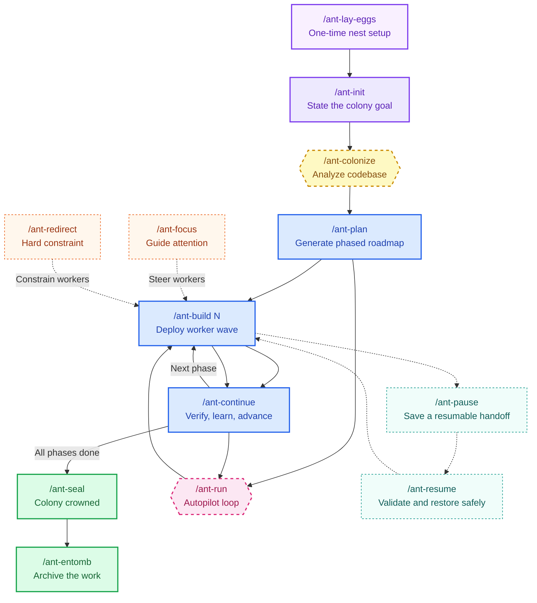

<div align="center">


# Aether

**Stop herding cats. Start a colony.**

### [aetherantcolony.com](https://aetherantcolony.com?utm_source=github&utm_medium=readme&utm_campaign=aether)

Aether is an open-source biomimetic AI colony that replaces deterministic agent frameworks with a self-organizing swarm. Instead of brittle DAGs where one failure crashes everything, 27 specialized worker castes (kinds of AI helper, each with one job) communicate through stigmergy — leaving plain-English Pheromone Signals (FOCUS, REDIRECT, FEEDBACK) that let the colony dynamically pivot without catastrophic failure. A built-in OODA loop treats errors as observations, not crashes: one Builder does the work by default, and a second reviewer joins only when the task touches a named risk (logins, payments, a release, deleting data, a database change), so verification scales with real risk instead of running a fixed loop on everything. The Hive Brain (shared memory across your projects) ensures knowledge compounds across sessions and projects — instincts extracted from real work are scored for trust, promoted to permanent memory, and shared colony-wide. The result: complex intelligence emerges from simple, localized rules, just like a real ant colony.

<br>

[](https://github.com/calcosmic/Aether/releases)
[](https://www.npmjs.com/package/aether-colony)
[](https://www.npmjs.com/package/aether-colony)
[](LICENSE)
[](https://github.com/calcosmic/Aether/stargazers)
[](https://github.com/sponsors/calcosmic?utm_source=github&utm_medium=readme&utm_campaign=aether)

[](https://goreportcard.com/report/github.com/calcosmic/Aether)

[](https://pkg.go.dev/github.com/calcosmic/Aether)

[](https://github.com/calcosmic/Aether#key-features)
[](https://github.com/calcosmic/Aether#command-reference)
[](https://github.com/calcosmic/Aether/releases)

<br>

*The whole is greater than the sum of its ants.*

<br>

<!-- VIDEO: Drag-and-drop The_Power_of_Absolute_Constraint.mp4 here on github.com to get a user-attachments URL with audio -->


</div>

---

## What Is Aether?

# Open-source colony orchestration for AI software delivery

If Claude Code, OpenCode, and Codex are the workers, Aether is the colony.

Aether is a Go runtime plus companion-file system that orchestrates 27 specialized worker castes across planning, building, verification, recovery, and release hygiene. It gives you a shared engineering lifecycle instead of a pile of disconnected agent tabs, ad hoc prompts, and fragile one-off scripts.

Manage engineering goals, not disconnected terminals.

## Aether Is Right For You If

- You run multiple AI coding sessions and keep losing track of who is doing what
- You want planning, build, verification, recovery, and update workflows to stay on one runtime truth
- You need Claude Code, OpenCode, and Codex CLI to stay aligned on the same system files and agent surfaces
- You want user steering, memory, release discipline, and quality gates built into the workflow
- You want a self-hosted open-source system for serious engineering work, not just prompt snippets

## Aether Is Not

- Not a drag-and-drop workflow builder
- Not just a prompt pack or agent template collection
- Not a hosted SaaS control plane
- Not the right tool if you only want a single disposable chat and no persistent workflow state

## 🐜 Why Aether

Every AI coding tool now has "agents." Most of them are the same thing repackaged — a loop that plans, executes, and checks. LangGraph uses strict directed state machines (DAGs). CrewAI uses top-down hierarchical delegation. AutoGen uses conversational group chats. That's not a colony. That's one ant doing laps.

Aether rejects all of these. It's an **Artificial Ecology** modeled on how real ant colonies work: no central brain, no single point of failure, no brittle JSON schemas. Instead, 27 specialized workers self-organize in parallel waves around your goal.

### Not Prompt Engineering — Stigmergy

Other approaches force LLMs to output and parse complex JSON schemas. One hallucinated bracket crashes the system. Aether abandons this entirely in favor of biological **stigmergy** — agents communicate indirectly by leaving plain-English Pheromone Signals (FOCUS, REDIRECT, FEEDBACK) in the environment. This "soft logic" steers the colony without catastrophic failures when unexpected edge cases arise.

### Right-Sized Verification, Not a Fixed Loop

Standard approaches either treat any LLM failure as fatal, or run the same fixed review loop on every task regardless of risk. Aether does neither: a routine build sends exactly one Builder — the worker who writes the code. A second reviewer joins only when the phase's own wording or its changed files name one of five specific risks (logins/credentials, payments, a release sign-off, deleting data, or a database migration), and that reviewer joins at the check step (`/ant-continue`), not the build itself. The program's own checks — does it build, do the tests pass, does it lint clean — run on every phase at every depth regardless of who else is sent. Only the owner, never the automatic Queen or autopilot, can decline a forced reviewer, and that decision is recorded.

### Platform-Enforced Discipline

Other tools give agents a system prompt but let them access every tool. Aether narrows what each caste (worker type) can do:

- The **Auditor** and **Gatekeeper** can read and grep the codebase, but their Write access is narrowed to their own findings ledger only — no Edit, no Bash. They cannot run commands or fix bugs, forcing purely static analysis
- The **Tracker** (bug hunter) has Bash for investigation but a Write scoped only to its own bug-tracking ledger — it does not modify your source files

### Memory That Compounds

The biggest flaw in standard AI tools: close the session, lose everything. Aether's **Colony Wisdom Pipeline** solves this permanently:

1. Agents log **observations** as they work
2. Observations are deduplicated and scored for trust by the Nurse agent
3. High-confidence observations are promoted into permanent **instincts**
4. Instincts are encoded into **QUEEN.md** by the Herald agent
5. Cross-project wisdom flows to the global **Hive Brain**

The colony genuinely gets smarter the more you use it — across sessions and across completely different projects.

---

<p align="center">
  
</p>

---

## 📦 Install

**Option 0: npx bootstrap (currently behind — read the warning first)**

```bash
npx --yes aether-colony@latest
```

The npm package is meant to be a thin bootstrap wrapper: it downloads the
matching Go release binary for your platform, installs it locally, and then
runs `aether install` for you. Its version is meant to track the published
Aether release, so `aether-colony@1.0.87` bootstraps Aether `1.0.87` — when
npm has actually been republished to match.

**It has not been, as of this writing.** The live npm package is stuck at
`1.0.22` while the source is many releases ahead (see the badge above) — months and dozens of
releases behind. `npx aether-colony@latest` installs that stale behavior
today, not current Aether. Use Option 1 below until npm is republished.

**Option 1: Go binary (build from a checkout for the current version)**

```bash
go install github.com/calcosmic/Aether/cmd/aether@latest
```

Requires [Go 1.26.5+](https://go.dev/dl/).

After installing the binary, publish the bundled companion files to your local
hub:

```bash
aether install
```

That single command populates `~/.aether/` and the platform-specific agent
directories from assets embedded in the Go binary. npm is not required for the
normal install path.

`go install .../cmd/aether@latest` installs the newest *tagged* version, and
the newest tag is currently `v1.0.43` (July 2026) — the same stale version as
the GitHub Release. To get the current state of this repository,
clone it and publish from the checkout instead (this needs only Go; it builds
the program and installs it in one step):

```bash
git clone https://github.com/calcosmic/Aether.git
cd Aether
go run ./cmd/aether publish --channel stable --binary-dest "$HOME/.local/bin"
```

Then run `aether update --force` in each project you use it from. See
`.aether/docs/publish-update-runbook.md` for the full publish/update
contract.

For maintainers, keep source-development isolated from the public runtime:
- stable/public: `aether` + `~/.aether/`
- dev/source checkout: `aether-dev` + `~/.aether-dev/`
- npm stays the stable/public bootstrap only

**Option 2: Download from GitHub Releases (also currently behind)**

Pre-built binaries for all platforms — no Go toolchain needed. **The newest
published release is v1.0.43 (July 2026)**, also months behind this
source checkout. Use it only if you deliberately want that older, frozen
version; for current behavior, use Option 1 instead.

| Platform | Architecture | Download |
|----------|-------------|----------|
| Linux | amd64, arm64 | [Latest release](https://github.com/calcosmic/Aether/releases?utm_source=github&utm_medium=readme&utm_campaign=aether) |
| macOS | amd64, arm64 (Apple Silicon) | [Latest release](https://github.com/calcosmic/Aether/releases?utm_source=github&utm_medium=readme&utm_campaign=aether) |
| Windows | amd64, arm64 | [Latest release](https://github.com/calcosmic/Aether/releases?utm_source=github&utm_medium=readme&utm_campaign=aether) |

Built with [GoReleaser](https://goreleaser.com).

After downloading the binary, run:

```bash
aether install
```

### ⚡ Quick start after install

```bash
# One-time per machine
aether install

# One-time per repo
cd ~/projects/my-app
aether lay-eggs

# Codex CLI (direct executable route)
aether init "Build X"
aether discuss
aether spec
aether plan
aether assumptions-analyze
aether run --dry-run
aether run --max-phases 2
aether status
aether watch
aether build 1
aether continue
aether profile-update
aether oracle "release concern"
aether seal

# Claude Code / OpenCode
/ant-init "Build X"
/ant-discuss
/ant-spec
/ant-plan
/ant-assumptions
/ant-build 1
/ant-continue
/ant-profile
/ant-seal
```

The Go binary is the source of truth. Claude Code and OpenCode also expose the
same lifecycle through slash commands after the repo is bootstrapped on the
primary platforms.

### Codex Skills

Pick an ant skill in Codex to start the matching workflow. The skill reads Aether's
instructions; the `aether` executable still owns state, checks, and authorization.

Aether's Codex actions use skills, with exactly nine public names:

| Skill | Workflow |
|-------|----------|
| `$ant-init` | Start a colony |
| `$ant-discuss` | Clarify intent |
| `$ant-oracle` | Research a concern |
| `$ant-colonize` | Survey existing code |
| `$ant-plan` | Plan phases |
| `$ant-build` | Build a phase |
| `$ant-continue` | Verify and advance |
| `$ant-swarm` | Route work or watch workers |
| `$ant-seal` | Seal and retain work for review |

The remaining 55 action skills and native-worker parity belong to later inserted
phases. These nine names establish entrypoints, not complete lifecycle parity.

The selected installation root is `~/.codex/skills/aether/`, qualified with Codex
CLI 0.154.0. Each public `ant-<command>/SKILL.md` reads private support relative to
its own installed file, not the working directory:

- `support/aether-colony-creation.md`
- `support/aether-colony-research.md`
- `support/aether-colony-build-cycle.md`

These three ordinary files are private support, not public helper skills. Worker
skills still arrive automatically in runtime dispatch briefs. Start a fresh Codex
session after skill files are copied or removed; unchanged updates need no refresh.

When a user types a literal `aether ...` passthrough command such as `status`,
`update`, `focus`, `pheromones`, or `reference-list`, execute that exact command
first. The installed binary and `aether --help` are the runtime source of truth.

For the nine lifecycle actions above, run or inspect
`aether command-guide <command> --platform codex` and follow the matching public
skill and its private support. If the user explicitly says raw, exact,
no-interview, or no-orchestration, execute the requested CLI command directly.
Do not reinterpret a literal passthrough command as a vague workflow request.

For lifecycle shell execution, prefer `AETHER_OUTPUT_MODE=visual aether ...`
unless the user explicitly wants JSON. Preserve exact arguments. Do not preface
literal passthrough execution with repo archaeology or skill narration; the CLI
output is primary — show the CLI's screen unchanged, then at most two short sentences of extra explanation.

### Tips

- Use `discuss` before planning when the goal has gray areas. It turns vague asks into explicit decisions instead of letting workers guess.
- Use `assumptions` right after planning to surface risky premises before the first build.
- Use `focus` and `redirect` before `build`; use `feedback` after `continue` when you want to steer the next phase.
- Use `run` when you want autopilot, and the explicit `build` -> `continue` loop when you want tight control over each phase.
- Use `profile` periodically to refresh learned preferences and push the top `[profiled]` directives into `QUEEN.md`.
- After changing Aether itself, run `aether publish --channel stable --binary-dest "$HOME/.local/bin"` so the binary, hub, and platform assets match the source checkout.
- For isolated source-development on the same machine, publish the dev channel instead: `aether publish --channel dev --binary-dest "$HOME/.local/bin"`, then use `aether-dev update --force` in target repos.
- After `aether install` or `aether update`, reopen Claude Code, OpenCode, or Codex if you need refreshed repo instructions, agents, or skills to load into a new session.

## Platform Support Policy

- **Primary platforms:** Claude Code and OpenCode. These are the main user surfaces.
- **Secondary platform:** Codex CLI. Codex has best-effort support for the native `aether` workflow.
- **Expectation:** Codex should stay safe, usable, and honest about its capabilities. When tradeoffs appear, prioritize Claude/OpenCode parity and treat Codex UX alignment as best-effort.

## ✨ Key Features

| | Feature | Description |
|---|---------|-------------|
| **Agents** | 27 Specialized Workers | Builder, Watcher, Scout, Tracker, Archaeologist, Oracle, Medic, Fixer, Porter, and more |
| **Commands** | 64 Slash Commands + Native CLI | Slash workflow for Claude Code and OpenCode; nine ant skills and retained `aether` CLI for Codex |
| **Signals** | Pheromone System | FOCUS, REDIRECT, FEEDBACK — guide colony attention |
| **Memory** | Colony Wisdom | Learnings and instincts persist via QUEEN.md |
| **Hive Brain** | Cross-colony | Domain-scoped wisdom sharing |
| **Autopilot** | `aether run` / `/ant-run` | Build-verify-advance loop with typed stops, morning queues, and normal endings |
| **Skills** | 86 Skills | 55 colony + 31 domain knowledge modules for workers |
| **Research** | Oracle + Scouts | Deep autonomous research before task decomposition |
| **Quality Gates** | One Builder by default | A reviewer joins only for a named risk (credentials, payments, release, deletion, migration), at the check step; build/test/lint run on every phase regardless |
| **Team & Jobs** | Check-in + Coherent Jobs | A one-worker build skips the pause; related tasks group into one job; a stuck helper can ask for backup via `aether recruit`, granted only by the program's own limits |
| **Self-Improvement** | `aether improve` | Reports how the colony's own past suggestions performed; can trial one declared change at a time |
| **Platforms** | Primary: Claude Code + OpenCode. Secondary: Codex CLI | Shared Go binary with platform-specific agents |

### 🐜 Worker Castes

| | Caste | Role |
|---|-------|------|
| 👑🐜 | **Queen** | Colony coordinator — orchestrates goals, manages phase progression, curates wisdom |
| 🔨🐜 | **Builder** | Implementation work — writes code following TDD discipline |
| 👁️🐜 | **Watcher** | Monitoring and verification — quality checks and independent testing |
| 🔍🐜 | **Scout** | Research and discovery — investigates unfamiliar territory |
| 📋🐜 | **Route Setter** | Direction setting — defines phase plans and task decomposition |
| 🏗️🐜 | **Architect** | Architecture design — maps structural tradeoffs and system boundaries |
| 🗺️🐜 | **Surveyor Nest** | Territory mapping — documents directory structure and project topology |
| 📏🐜 | **Surveyor Disciplines** | Practice mapping — documents coding, testing, and workflow conventions |
| 🧫🐜 | **Surveyor Pathogens** | Risk mapping — identifies technical debt, bugs, and health concerns |
| 📦🐜 | **Surveyor Provisions** | Dependency mapping — inventories stack, packages, and integrations |
| 📚🐜 | **Keeper** | Knowledge curation — manages instincts, patterns, and wisdom |
| 🐛🐜 | **Tracker** | Bug investigation — traces failures to root cause |
| 🧪🐜 | **Probe** | Test generation — writes and maintains test suites |
| 🔄🐜 | **Weaver** | Code refactoring — restructures and cleans codebases |
| 👥🐜 | **Auditor** | Code review and quality audits — catches maintainability risks |
| 🩹🐜 | **Medic** | Colony health — diagnoses and repairs corrupted or stale colony state |
| 🛠️🐜 | **Fixer** | Gate recovery — investigates failed checks and applies targeted fixes |
| 🎲🐜 | **Chaos** | Edge case testing — resilience and stress testing |
| 🏺🐜 | **Archaeologist** | Git history excavation — uncovers context from commit history |
| 📦🐜 | **Gatekeeper** | Dependency and supply-chain review — checks packages, versions, and release inputs |
| ♿🐜 | **Includer** | Accessibility audits — WCAG compliance and barrier identification |
| ⚡🐜 | **Measurer** | Performance profiling — benchmarks and optimization |
| 🧠🐜 | **Sage** | Wisdom synthesis — extracts patterns and release lessons |
| 🔮🐜 | **Oracle** | Deep research — autonomous research via RALF loop |
| 🔌🐜 | **Ambassador** | Third-party API integration — bridges external services |
| 📝🐜 | **Chronicler** | Documentation generation — produces docs, READMEs, and guides |
| 🚚🐜 | **Porter** | Delivery readiness — checks publish, push, and release handoff steps |

## ⚖️ Aether vs Others

| Dimension | Aether | CrewAI | AutoGen | LangGraph |
|-----------|--------|--------|---------|-----------|
| **Language** | Go | Python | Python | Python |
| **License** | Apache 2.0 | MIT | MIT | Open + paid tiers |
| **Architecture** | Biological colony — 27 specialized workers self-organize via pheromone signals | Role-based agents with sequential/task delegation | Multi-agent conversation framework (Microsoft) | Graph-based state machines with conditional edges |
| **Memory / Learning** | Colony Wisdom — learnings persist as instincts, promote to QUEEN.md, share cross-colony via Hive Brain | Short-term memory + optional long-term via integration | No built-in persistent memory | Checkpoint-based state persistence |
| **Agent Coordination** | Pheromone signals (FOCUS, REDIRECT, FEEDBACK) guide attention without rewriting prompts | Hierarchical task delegation between role-assigned agents | Turn-based conversation between agents | Explicit graph edges define control flow |
| **Workers / Agents** | 27 specialized castes (Builder, Watcher, Scout, Tracker, Oracle, Archaeologist, Medic, Fixer, Porter, etc.) | User-defined roles with goals and backstories | Configurable assistant and user proxy agents | Nodes as functions or LangChain runnables |
| **Commands / Control** | 64 slash commands on Claude/OpenCode + nine ant skills and `aether` CLI on Codex | Python SDK calls | Programmatic API | Python SDK + LangGraph Studio |
| **Autopilot** | `/ant-run` on Claude/OpenCode, `aether run` on Codex | Sequential task execution, no built-in loop | No built-in loop | Can loop via graph cycles, not opinionated |
| **Quality Gates** | One Builder by default; a reviewer joins only for a named risk, at the check step; build/test/lint run every phase | Optional human-in-the-loop review | No built-in gates | Manual checkpoint implementation |
| **Research** | Oracle + Scouts — autonomous deep research before task decomposition | No dedicated research agents | Group chat can approximate research | No built-in research pattern |
| **Platform Support** | Primary: Claude Code + OpenCode. Secondary: Codex CLI | Any Python environment | Any Python environment | Any Python environment |

## 🏗️ Architecture

```
.aether/                        Repo-local colony files
├── data/                       Colony state (local only)
├── dreams/                     Session notes (local only)
├── oracle/                     Research artifacts (local only)
├── locks/                      Runtime locks
├── QUEEN.md                    Repo-specific wisdom
└── skills/                     Custom repo skills only

.codex/                         Codex CLI agent definitions
└── agents/                     27 TOML agent files

~/.aether/                     Hub (cross-colony, user-level)
├── system/                   Companion file source (populated by install)
├── system/codex/             Codex agent mirror
├── QUEEN.md                 Wisdom + preferences
├── hive/wisdom.json         Cross-colony wisdom (200 cap)
```

**Runtime:** Go 1.26.5+  
**Distribution:** GoReleaser (Linux, macOS, Windows / amd64 + arm64)

  
### 🔄 Colony Lifecycle

Claude Code and OpenCode expose this flow as slash commands. Codex uses the
same core stages through its nine public skills, with `aether lay-eggs` for
setup and the direct executable routes still available.


```mermaid
flowchart TD
    %% Node styles
    node["/ant-lay-eggs\nOne-time nest setup"]:::setup
    node2["/ant-init\nState the colony goal"]:::init
    colonize{{"/ant-colonize\nAnalyze codebase"}}:::optional
    plan["/ant-plan\nGenerate phased roadmap"]:::phase
    build["/ant-build N\nDeploy worker wave"]:::phase
    continue["/ant-continue\nVerify, learn, advance"]:::phase
    seal["/ant-seal\nColony crowned"]:::complete
    entomb["/ant-entomb\nArchive the work"]:::complete

    %% Autopilot
    run{{"/ant-run\nAutopilot loop"}}:::autopilot

    %% Signals
    focus["/ant-focus\nGuide attention"]:::signal
    redirect["/ant-redirect\nHard constraint"]:::signal

    %% Session management
    pause["/ant-pause\nSave a resumable handoff"]:::session
    resume["/ant-resume\nValidate and restore safely"]:::session

    %% Connections
    node --> node2
    node2 --> colonize
    colonize --> plan
    plan --> build
    build --> continue

    continue -->|"Next phase"| build
    continue -->|"All phases done"| seal
    seal --> entomb

    %% Autopilot path
    plan --> run
    run --> build
    build --> continue
    continue --> run

    %% Signal inputs
    focus -.->|"Steer workers"| build
    redirect -.->|"Constrain workers"| build

    %% Session management
    build -.-> pause
    pause -.-> resume
    resume -.-> build

    %% Styling
    classDef setup fill:#f9f0ff,stroke:#7c3aed,stroke-width:2px,color:#5b21b6
    classDef init fill:#ede9fe,stroke:#7c3aed,stroke-width:2px,color:#5b21b6
    classDef phase fill:#dbeafe,stroke:#2563eb,stroke-width:2px,color:#1e40af
    classDef optional fill:#fef9c3,stroke:#ca8a04,stroke-width:2px,color:#854d0e,stroke-dasharray:5 5
    classDef complete fill:#dcfce7,stroke:#16a34a,stroke-width:2px,color:#166534
    classDef autopilot fill:#fce7f3,stroke:#db2777,stroke-width:2px,color:#9d174d,stroke-dasharray:5 5
    classDef signal fill:#fff7ed,stroke:#ea580c,stroke-width:1px,color:#9a3412,stroke-dasharray:3 3
    classDef session fill:#f0fdfa,stroke:#0d9488,stroke-width:1px,color:#115e59,stroke-dasharray:3 3
```

<div align="center">
<i>Bootstrap once, then drive the colony from goal to shipped.</i>
</div>

## 📡 Pheromone System

Every ant colony communicates through chemical signals. Aether works the same way — you guide workers with **pheromone signals**, not by micromanaging prompts. Emit a signal before a build, and every worker in the next wave sees it.

Three signal types, three levels of control:

| Signal | Priority | Purpose | Command |
|--------|----------|---------|---------|
| **FOCUS** | normal | "Pay extra attention here" | `/ant-focus "<area>"` |
| **REDIRECT** | high | "Don't do this — hard constraint" | `/ant-redirect "<pattern to avoid>"` |
| **FEEDBACK** | low | "Adjust your approach based on this" | `/ant-feedback "<observation>"` |

Signals expire at the end of the current phase by default. Use `--ttl` for wall-clock expiration (e.g., `--ttl 2h`, `--ttl 1d`). Run `/ant-status` anytime to see active signals.

### 🎯 FOCUS — Guide Attention

FOCUS tells the colony where to spend extra effort. It's like shining a spotlight on an area you care about.

```
/ant-focus "database schema -- handle migrations carefully"
/ant-focus "auth middleware correctness"
/ant-build 3
```

**Don't overdo it.** One or two FOCUS signals per phase is the sweet spot. Five signals means no signal at all.

### 🚫 REDIRECT — Hard Constraints

REDIRECT is the strongest signal. Workers actively avoid the specified pattern — it's a hard constraint, not a preference.

```
/ant-redirect "Don't use jsonwebtoken -- use jose library instead"
/ant-build 2
```

**Rule of thumb:** Use REDIRECT for things that *will break* if ignored. For preferences, use FEEDBACK instead.

### 💬 FEEDBACK — Gentle Course Correction

FEEDBACK adjusts the colony's approach. It's not a command — it's an observation that influences how workers make decisions.

```
/ant-feedback "Code is too abstract -- prefer simple, direct implementations"
```

### 🔀 Putting It Together

```
/ant-focus "payment flow security"
/ant-redirect "No raw SQL -- use parameterized queries only"
/ant-build 4
```

### 🤖 Auto-Emitted Signals

The colony also emits signals on its own. After every phase, it produces FEEDBACK summarizing what worked and what failed. If errors recur across builds, it auto-emits REDIRECT signals. You don't manage these — they're part of the colony's self-improvement loop.

## 🧠 Colony Wisdom Pipeline

Aether does not just complete tasks — it learns from them. Every build produces observations. Those observations are deduplicated, trust-scored, and promoted through a multi-stage pipeline that turns raw experience into actionable wisdom.

```
Raw observations  -->  Trust scoring  -->  Instinct store  -->  QUEEN.md  -->  Hive Brain
(anecdotal)           (0.2-1.0)         (50 cap)          (high-trust)    (cross-colony)
```

Only instincts scoring 0.80+ (trusted) or 0.90+ (canonical) are promoted to QUEEN.md. The Critic ant catches contradictions. Stale instincts are archived, not acted on.

```bash
# Read trusted instincts for worker priming
aether instinct-read-trusted --min-score 0.6

# Run full curation (also runs automatically at every /ant-continue check, not only at seal)
aether curation-run --verbose

# Read QUEEN.md wisdom
aether queen-read
```

<div align="center">
  
</div>

## 🔗 Context Continuity

Aether keeps colony context alive across `/clear`, context switches, and long conversations — without blasting full history into every prompt. It assembles a compact "context capsule" from the colony state, active pheromone signals, open flags, and the latest rolling summary.

```bash
# Generate a compact context capsule
aether context-capsule

# Resume colony after a /clear or session break
aether resume
```

## 🚀 Autopilot Mode

`aether run` chains build, verification, and phase advancement. Claude Code and
OpenCode expose the same flow as `/ant-run`.

For beginners: things only you can judge are put on a morning list; broken or
unsafe work still stops. A normal boundary, such as your `--max-phases` limit
or completing the colony, also ends the invocation without pretending that
anything failed.

| Kind of event | Headless run | Interactive run |
|---|---|---|
| Owner judgement: visual check, hands-on runtime verification, or a lesson-backed replan suggestion | Saves one durable decision and continues | Pauses for the owner |
| Genuine problem: deterministic checks still fail, Auditor score is below 60, a Critical finding appears, blocker count grows or gains escalation, state is not runnable, or the provider is unavailable | Stops | Stops |
| Normal boundary: cancellation, worker timeout, `--max-phases`, or colony completion | Ends normally | Ends normally |

Auditor score 60 passes. High findings stay visible in the morning report but
do not stop by severity alone; Critical findings do. An ordinary blocker that
already existed at a run stage boundary remains visible and unresolved, but it
stops the run only if the count grows or new escalation evidence appears.
Direct `aether continue` remains stricter and will not advance with any open
blocker. Replan cadence is also not enough by itself: headless replanning needs
at least one confirmed lesson created after the active plan revision.

```bash
# Preview phases and the exact trigger/disposition table without changing state
aether run --dry-run

# Run all remaining phases without interactive prompts
aether run --headless

# Or put an explicit limit on this invocation
aether run --headless --max-phases 2
```

### Morning handoff

`aether run` never seals automatically. When it finishes, review the frozen run
report and the live decision list. The list is an identity-and-evidence view:
it deliberately does not expose reusable authorization. Review any replan
note, then ask seal to issue fresh owner commands:

```bash
aether status
aether pending-decision-list --unresolved
aether plan        # only when the morning list contains a replan suggestion
aether seal
```

When owner checkpoints remain, `aether seal` refuses and emits one exact,
capability-bearing `decision-answer` command for each checkpoint. Copy each
emitted command verbatim, run it, then rerun `aether seal`. Do not construct an
answer command from the redacted decision list: the fresh capability in seal's
immediate output is what authorizes the exact checkpoint. Queued morning work
is therefore never mistaken for approval. Status reads the stored last-run
report rather than recalculating its elapsed time, measured/unreported token
usage, findings, or blocker movement from newer data.

<div align="center">
  
</div>

## 🔌 Works With

- **[Claude Code](https://docs.anthropic.com/en/docs/claude-code?utm_source=github&utm_medium=readme&utm_campaign=aether)** - primary platform, 64 slash commands + 27 agent definitions
- **[OpenCode](https://github.com/opencode-ai/opencode?utm_source=github&utm_medium=readme&utm_campaign=aether)** - primary platform, 64 slash commands + 28 agent definitions (the 27 worker castes plus one OpenCode-only routing helper)
- **Codex CLI** - secondary platform, nine public ant skills, native `aether` lifecycle, `aether run`, `aether watch`, `aether oracle`, and 27 TOML agent definitions

<div align="center">
  
</div>

## 📋 Command Reference (Claude Code / OpenCode)

<details>
<summary>64 slash commands for Claude Code and OpenCode — click to expand</summary>

Aether provides 64 slash commands organized into seven categories for Claude
Code and OpenCode. This section is the slash-command reference for the primary
platforms.

Codex exposes the nine [public skills](#codex-skills) over the Go runtime. The
remaining 55 action skills and native-worker parity are later work. The retained
executable routes include:
`aether install`, `aether lay-eggs`, `aether init`, `aether discuss`,
`aether plan`, `aether assumptions-analyze`, `aether run`, `aether watch`,
`aether build <phase>`, `aether continue`, `aether profile-read`,
`aether profile-update`, `aether oracle`, `aether seal`, `aether focus`,
`aether redirect`, `aether feedback`, `aether status`, and `aether update`.

---

### 🚪 Setup and Getting Started

These commands set up, initialize, and drive the core colony workflow from first use through phase completion.

| Command | Description |
|---------|-------------|
| `/ant-lay-eggs` | Set up Aether in this repo -- creates `.aether/` with all system files, templates, and utilities. Run once per repo. |
| `/ant-init "<goal>"` | Initialize a colony with a goal. Scans the repo, generates a charter for approval, creates colony state. Supports `--no-visual`. |
| `/ant-colonize` | Survey the codebase with 4 parallel scouts, producing 7 territory documents (PROVISIONS, TRAILS, BLUEPRINT, CHAMBERS, DISCIPLINES, SENTINEL-PROTOCOLS, PATHOGENS). Flags: `--no-visual`, `--force-resurvey`. |
| `/ant-discuss` | Capture clarifications before planning. Stores clarification decisions in `pending-decisions.json` and emits `REDIRECT` pheromones for resolved hard constraints. |
| `/ant-spec` | Draft, review, revise, and explicitly approve the owner-readable specification. Required before `/ant-plan` in the normal journey. |
| `/ant-plan` | Generate or display a project plan. Uses an iterative research loop (scout + planner per iteration) to reach a confidence target. Flags: `--fast`, `--balanced`, `--deep`, `--exhaustive`, `--target <N>`, `--max-iterations <N>`, `--accept`, `--no-visual`. |
| `/ant-assumptions` | Surface current plan assumptions, write `assumptions.json`, and auto-emit `FOCUS` / `FEEDBACK` pheromones from the analysis. |
| `/ant-build <phase>` | Execute a phase. Sends one Builder by default; a reviewer joins only when the phase names one of five risks (credentials, payments, release sign-off, data deletion, database migration), and only at the next check step, never here. Shows a team check-in card before dispatch unless it is a single decision-free worker, in which case it shows the plan and proceeds without a pause (`--checkin` forces the pause anyway, `--no-checkin` always skips it). Related tasks that genuinely share files or depend on each other are grouped into one job for one worker. |
| `/ant-continue` | Verify completed build, reconcile state, and advance to the next phase. Runs entirely inside the Go runtime with no manifest/playbook step by default; `--classic-ceremony` opts into the older heavy-review manifest path. Enforces quality gates and credits a task only once its claimed files are actually present in the project. |
| `/ant-run` | Autopilot mode -- chains build and continue. Headless visual/runtime/lesson-backed-replan work queues for morning review; genuine failures stop; limits and completion end normally. Flags: `--max-phases N`, `--replan-interval N`, `--continue`, `--dry-run`, `--headless`, `--verbose`. |
| `/ant-profile` | Read or refresh the behavioral profile. `profile-update` consolidates observations and promotes top `[profiled]` directives into `QUEEN.md`. |

---

### 📡 Pheromone Signals

Pheromones are the colony's guidance system. They inject signals that workers sense and respond to, without hard-coding instructions. Signals decay over time: FOCUS 30 days, REDIRECT 60 days, FEEDBACK 90 days.

| Command | Description |
|---------|-------------|
| `/ant-focus "<area>"` | Emit a FOCUS signal to guide colony attention toward an area. Priority: normal. Strength: 0.8. Flag: `--ttl <value>` (default: `phase_end`). |
| `/ant-redirect "<pattern>"` | Emit a REDIRECT signal to warn the colony away from a pattern. Priority: high. Strength: 0.9. Flag: `--ttl <value>` (default: `phase_end`). |
| `/ant-feedback "<note>"` | Emit a FEEDBACK signal with gentle guidance. Priority: low. Strength: 0.7. Creates a colony instinct. Flag: `--ttl <value>` (default: `phase_end`). |
| `/ant-pheromones [subcommand]` | View and manage active pheromone signals. Subcommands: `all` (default), `focus`, `redirect`, `feedback`, `clear`, `expire <id>`. Flag: `--no-visual`. |
| `/ant-export-signals [path]` | Export colony pheromone signals to portable XML format. Default output: `.aether/data/pheromones-export.xml`. Requires `xmllint`. |
| `/ant-import-signals <file> [colony]` | Import pheromone signals from another colony's XML export. Second argument is an optional colony name prefix to prevent ID collisions. Requires `xmllint`. |

---

### 📊 Status and Monitoring

These commands provide visibility into colony state, phase progress, flags, event history, and live activity.

| Command | Description |
|---------|-------------|
| `/ant-status` | Colony dashboard at a glance -- goal, phase/task progress bars, focus and constraint counts, instincts, flags, milestone, vital signs, memory health, pheromone summary, data safety. |
| `/ant-phase [N\|list]` | View phase details (tasks, dependencies, success criteria) for a specific phase by number, or `list`/`all` for a summary of all phases grouped by status. |
| `/ant-flags` | List project flags (blockers, issues, notes). Flags: `--all`, `--type <blocker\|issue\|note>`, `--phase N`, `--resolve <id> "<msg>"`, `--ack <id>`. |
| `/ant-flag "<title>"` | Create a new flag. Flags: `--type <blocker\|issue\|note>` (default: `issue`), `--phase N`. Blockers prevent phase advancement until resolved. |
| `/ant-history` | Browse colony event history. Flags: `--type <TYPE>`, `--since <DATE>`, `--until <DATE>`, `--limit N` (default: 10). Dates accept ISO format or relative values like `1d`, `2h`. |
| `/ant-watch` | Show one honest live screen in the terminal you're already in -- no tmux, no second window: a live cockpit while something is running, a replay of the most recent run once it finishes, or an idle card if nothing has run yet. Flags: `--interval`, `--once`. |
| `/ant-maturity` | View colony maturity journey through 6 milestones (First Mound, Open Chambers, Brood Stable, Ventilated Nest, Sealed Chambers, Crowned Anthill) with ASCII art anthill and progress bar. |
| `/ant-memory-details` | Drill-down view of colony memory -- wisdom entries by category from QUEEN.md, pending promotions, deferred proposals, and recent failures from the midden. |

---

### 💾 Session Management

Manage session state for handoff between conversations, so you can safely `/clear` and resume later.

| Command | Description |
|---------|-------------|
| `/ant-pause` | Stop at a safe boundary and save one structured, resumable handoff -- a receipt that also serves as an idempotency key, so re-running pause returns the same receipt instead of creating a second one. |
| `/ant-resume` | Validate and restore the safest honest recovery point: a clean handoff is **Confirmed**; unclean interruptions may be **Reconstructed** from durable evidence; **Conflicting** or **Unknown** evidence stops without changing state. |

---

### 🔄 Lifecycle

These commands manage the beginning and end of a colony's life.

| Command | Description |
|---------|-------------|
| `/ant-seal` | Seal the colony with the Crowned Anthill milestone ceremony. Promotes colony wisdom to QUEEN.md, spawns a Sage for analytics, a Chronicler for documentation audit, exports XML archives, and writes CROWNED-ANTHILL.md. Flags: `--no-visual`. Sealing also writes a dated entry (the goal and one line per phase) to the project's own CHANGELOG.md, creating the file if there is none. |
| `/ant-entomb` | Archive a sealed colony into `.aether/chambers/`. Requires the colony to be sealed first. Copies all colony data, exports XML archives, records in eternal memory, and resets colony state for a fresh start. Flag: `--no-visual`. |
| `/ant-update` | Update Aether system files from the global hub. Uses a transactional updater with checkpoint creation, safe sync, and automatic rollback on failure. Flag: `--force`. |

---

### 🧪 Advanced

Power-user commands for deep research, philosophical exploration, resilience testing, and specialized analysis.

| Command | Description |
|---------|-------------|
| `/ant-swarm "<bug>"` | Deploy 4 parallel investigators (Archaeologist, Pattern Hunter, Error Analyst, Web Researcher) to investigate and fix stubborn bugs. Cross-compares findings, ranks solutions by confidence, applies the best fix with an automatic checkpoint-and-rollback safety net, and writes up a plain-language case if the same bug survives three attempts. Pass `--watch` to inspect a live swarm instead of launching a new run. |
| `/ant-oracle` | Deep research agent using an iterative RALF loop. Guided by a scoping ritual (`oracle propose` suggests output shape, sources, depth and accuracy target; `oracle brief` records the approved core question; `oracle --from-brief` refuses to run without one). Subcommands: `propose`, `brief`, `status`, `stop`, `recover`, `save`, `promote`, `selftest`. Flags: `--depth`, `--confidence-target`, `--scope`, `--template`, `--max-iterations`, `--background`, `--follow`, `--from-brief`. |
| `/ant-dream` | The Dreamer -- a philosophical wanderer that observes the codebase and writes 5-8 dream observations to `.aether/dreams/`. Categories: musing, observation, concern, emergence, archaeology, prophecy, undercurrent. May suggest pheromones. Flag: `--no-visual`. |
| `/ant-interpret [date]` | The Interpreter -- grounds dreams in reality by validating each dream observation against the actual codebase. Rates each dream as confirmed, partially confirmed, unconfirmed, or refuted. Can inject pheromones or add items to TO-DOS based on findings. |
| `/ant-chaos <target>` | The Chaos Ant -- resilience tester that probes 5 categories (edge cases, boundary conditions, error handling, state corruption, unexpected inputs) for a given file, module, or feature. Produces a structured report with severity ratings and reproduction steps. Auto-creates blocker flags for critical/high findings. Flag: `--no-visual`. |
| `/ant-archaeology <path>` | The Archaeologist -- git historian that excavates commit history for a file or directory. Analyzes authorship, churn, tech debt markers, dead code candidates, and stability. Produces a full archaeology report with tribal knowledge extraction. Flag: `--no-visual`. |
| `/ant-organize` | Codebase hygiene report -- spawns an archivist to scan for stale files, dead code patterns, and orphaned configs. Report-only (no files modified). Output saved to `.aether/data/hygiene-report.md`. Flag: `--no-visual`. |
| `/ant-council` | Convene a council for intent clarification. Presents multi-choice questions about project direction, quality priorities, or constraints, then translates answers into FOCUS, REDIRECT, and FEEDBACK pheromone signals. Supports `--deliberate "<proposal>"` mode for Advocate/Challenger/Sage structured debate. Flag: `--no-visual`. |
| `/ant-improve` | Check how the colony's own past suggestions have been doing, or declare and compare one change by hand. Read-only unless you pass `--declare`/`--compare`. |

---

### 🔧 Utilities

Maintenance, introspection, and convenience commands for operating the colony system.

| Command | Description |
|---------|-------------|
| `/ant-data-clean` | Scan and remove test/synthetic artifacts from colony data files (pheromones.json, QUEEN.md, learning-observations.json, midden.json, spawn-tree.txt, constraints.json). Runs a dry-run first, then asks for confirmation. |
| `/ant-help` | Display the full system overview -- all commands by category, typical workflow, worker castes, and how the colony lifecycle, pheromone system, and colony memory work. |
| `/ant-insert-phase` | Insert a corrective phase into the active plan after the current phase. Collects a brief description of what is not working and what the fix should accomplish. |
| `/ant-migrate-state` | One-time migration from v1 (6-file) state format to v2.0 (consolidated single-file) format. Creates backups in `.aether/data/backup-v1/`. Safe to run multiple times. |
| `/ant-patrol` | Comprehensive pre-seal colony audit -- verifies plan vs codebase reality, documentation accuracy, unresolved issues, test coverage, and colony health. Produces a completion report at `.aether/data/completion-report.md` with a seal-readiness recommendation. Flag: `--no-visual`. |
| `/ant-preferences` | Add or list user preferences in the hub `~/.aether/QUEEN.md`. Use `--list` to view current preferences, or provide text to add a new one. |
| `/ant-quick "<small job>"` | Does one small job with a single builder, then runs the project's own checks over whatever it changed. No plan, no check-in, no build ceremony. Use `/ant-quick --question "<question>"` (or `/ant-ask`) for a read-only scout query instead. |
| `/ant-run` | Autopilot mode -- see Setup and Getting Started above. Listed in both categories because it is the primary execution driver. |
| `/ant-skill-create "<topic>"` | Create a custom domain skill via Oracle mini-research and a guided wizard. Researches best practices, asks about focus area and experience level, then generates a SKILL.md in `~/.aether/skills/domain/`. |
| `/ant-tunnels [chamber] [chamber2]` | Browse archived colonies in `.aether/chambers/`. No arguments shows a timeline. One argument shows the seal document for that chamber. Two arguments compares chambers side-by-side with growth metrics and pheromone trail diffs. |
| `/ant-verify-castes` | Display the colony caste system -- all 27 castes with their model slot assignments (opus, sonnet, inherit), system status (utils, proxy health), and current model configuration. |

</details>

## 🎬 Colony in Action

<div align="center">
  <a href="https://github.com/calcosmic/Aether#colony-in-action">
    
  </a>
  <em>Click to learn more about Aether's colony architecture</em>
</div>

## 🛤️ Use Case: From Zero to Shipped

You have a blank directory and an idea: a REST API for a task management app. Users can create accounts, manage projects, and track tasks. Nothing fancy -- just solid, tested, shipped.

Here is what it looks like to build it with Aether, start to finish.

> 📍 **The Roadmap:** 🔧 Install → 🥚 Lay Eggs → 🎯 Goal → 🔍 Colonize → 🗺️ Plan → 🧭 Steer → 🔨 Build → ✅ Continue → 🔁 Repeat Per Phase → 👑 Seal

---

The walkthrough below uses the shared `aether` CLI for the core lifecycle so it
works in Codex as written. Claude Code and OpenCode also expose equivalent
slash commands for the same phases.

### 🔧 Step 0 -- Install Aether

```bash
go install github.com/calcosmic/Aether/cmd/aether@latest
aether install        # Publish the bundled companion files to your local hub
```

One-time machine setup. The colony hub lives at `~/.aether/` and persists
across every project you work on. Companion files are published there from the
Go binary itself.

---

### 🥚 Step 1 -- Lay Eggs

```bash
cd ~/projects/task-api
aether lay-eggs
```

```
Colony nest initialized.
  .aether/            Repo-local state only
  global platform homes   Agents and commands installed once
  .aether/data/       Colony state
  .aether/QUEEN.md    Repo-specific wisdom
```

This creates the nest -- the directory structure the colony needs to operate. You only run this once per repo. Think of it as setting up an ant farm before the colony moves in.

---

### 🎯 Step 2 -- State the Goal

```bash
aether init "Build a REST API for task management with user auth, project CRUD, and task tracking"
```

```
Colony initialized.
  Goal: Build a REST API for task management with user auth, project CRUD, and task tracking
  Phase: 0/0
  Workers: standing by
```

The colony now has a purpose. Every worker that spawns from this point knows the goal. No repeating yourself in prompts, no copy-pasting context into new threads.

---

### 🔍 Step 3 -- Colonize (Optional, but Smart)

```bash
aether colonize
```

```
Colonizing...
  Scanning codebase...
  Found: 0 files (new project)
  Language: Go (detected from go.mod)
  Framework: None detected
  Dependencies: None
  Structure: Empty project

Recommendation: New project. Route Setter should generate a full phased plan.
```

Since this is a new project, there is not much to map. But if you were adding Aether to an existing codebase, this is where the Colonizer ant would catalog your structure, identify patterns, and flag potential hazards before work begins.

---

### 🗺️ Step 4 -- Plan

```bash
aether plan
```

<details><summary>Generated phased roadmap (click to expand)</summary>

```
Generating phased roadmap...

Phase 1: Foundation
  - Project scaffolding (Go module, directory structure)
  - Database setup and connection layer
  - User model and migration

Phase 2: Authentication
  - JWT token generation and validation
  - Login and registration endpoints
  - Auth middleware

Phase 3: Projects
  - Project model and CRUD endpoints
  - User-project association
  - Input validation

Phase 4: Tasks
  - Task model and CRUD endpoints
  - Task-project association
  - Status workflow (todo, in-progress, done)

Phase 5: Integration and Polish
  - End-to-end testing
  - Error handling consistency
  - API documentation
```

</details>

The Route Setter ant analyzed the goal and broke it into phases. Each phase has clear deliverables. The colony will not jump ahead -- it builds phase 1 first, verifies it works, then moves on.

You can adjust the plan. Add phases, remove them, merge them. The colony follows your lead.

---

### 🧭 Step 5 -- Steer with Pheromones

Before the first build, you set the guardrails:

```bash
aether focus "database migrations -- use versioned migrations, no schema drift"
aether redirect "No raw SQL in application code -- use parameterized queries only"
aether feedback "Prefer standard library where possible -- minimize dependencies"
```

```
Signal emitted: FOCUS "database migrations -- use versioned migrations, no schema drift"
Signal emitted: REDIRECT "No raw SQL in application code -- use parameterized queries only"
Signal emitted: FEEDBACK "Prefer standard library where possible -- minimize dependencies"

Active signals: 3
  FOCUS:    1
  REDIRECT: 1
  FEEDBACK: 1
```

These signals are visible to every worker in the next build wave. The FOCUS signal tells builders to be careful with migrations. The REDIRECT signal is a hard constraint -- no builder will write raw SQL. The FEEDBACK signal gently nudges toward minimal dependencies.

Signals expire at the end of the current phase. You can also set a wall-clock expiration with `--ttl 2h` if you want a signal to persist longer.

---

### 🔨 Step 6 -- Build Phase 1

```bash
aether build 1
```

<details><summary>Phase 1 build output (click to expand)</summary>

```
Team check-in: one worker, nothing pending -- dispatching.
  Chip-12 (Builder) -> Foundation: scaffolding, database layer, and tests
    (grouped into one job -- these tasks share the same files)

Deploying worker wave for Phase 1: Foundation...

[Chip-12] go.mod created: module github.com/you/task-api
[Chip-12] db/connection.go created -- uses pgxpool
[Chip-12] db/migrations/001_create_users.up.sql created
[Chip-12] db/connection_test.go created
[Chip-12] models/user_test.go created

Build complete. 4 files created, 6 tests passing.
Phase 1 status: VERIFIED
```

</details>

This phase touches none of the five risk signals (logins, payments, a release, deleting data, a database migration), so the Queen sent one Builder and nothing else -- no team check-in pause, because there was nothing left for you to decide. Related tasks that shared the same files were grouped into one job for Chip-12 instead of one worker per task. The REDIRECT signal about raw SQL was still active -- Chip-12 used `pgxpool` with parameterized queries instead. The program's own build and test checks ran regardless.

---

### ✅ Step 7 -- Continue (Verify, Learn, Advance)

```bash
aether continue
```

```
Verifying Phase 1...
  Build: PASS
  Tests: 6/6 passing
  Coverage: 78%

Extracting learnings...
  [instinct] pgxpool connection pooling works well with this project structure (confidence: 0.85)
  [instinct] Versioned migrations prevent schema drift effectively (confidence: 0.90)

Advancing to Phase 2: Authentication
  Active signals: 2 (expired: 1 FOCUS -- end of phase)
```

The colony ran a six-point verification before advancing: build check, test pass, coverage gate, file existence, no regressions, and human review trigger. It also extracted instincts -- observations about what worked that will inform future builds.

The FOCUS signal about migrations expired because the phase ended. If you want it to persist into the next phase, emit it again.

---

### 🔨 Step 8 -- Build Phase 2

You emit new signals for the auth phase:

```bash
aether focus "JWT token security -- use short expiry, secure refresh flow"
aether redirect "Never store passwords in plain text -- always bcrypt"
aether build 2
```

<details><summary>Phase 2 build output (click to expand)</summary>

```
Team check-in: one worker, nothing pending -- dispatching.
  Chip-71 (Builder) -> Authentication: JWT tokens, auth endpoints, middleware, and tests
    (grouped into one job)
  Note: this phase touches logins and passwords -- a security reviewer
  (Gatekeeper) joins automatically at the next `aether continue`, not here.

Deploying worker wave for Phase 2: Authentication...

[Chip-71] internal/auth/jwt.go created -- RS256 signing, 15min access tokens
[Chip-71] handlers/auth.go created -- /register, /login endpoints
[Chip-71] middleware/auth.go created -- token validation middleware
[Chip-71] internal/auth/jwt_test.go created -- 12 tests
[Chip-71] handlers/auth_test.go created -- 8 tests

Build complete. 5 files created, 20 tests passing.
Phase 2 status: VERIFIED
```

</details>

The REDIRECT signal about bcrypt was active during the build. Because this phase names a real risk -- logins and passwords -- the next `aether continue` automatically adds a security reviewer (Gatekeeper) to check for exactly that, named by the signal it matched, not guessed at. Only the owner can decline that forced reviewer, and declining is recorded. The program's own build and test checks ran regardless of who else was sent.

---

### 📋 Steps 9-12 -- Phases 3, 4, and 5

The pattern repeats. `aether build N`, then `aether continue`. Each phase
builds on the verified output of the last. Instincts accumulate. The colony
gets smarter about your project's patterns.

On Codex, select `$ant-build 3`, then `$ant-continue`, or use the direct loop:

```bash
aether build 3
aether continue
aether build 4
aether continue
```

Or hand the next stretch to the native Codex autopilot:

```bash
aether run --dry-run
aether run --max-phases 2
aether status
```

In headless mode, visual or hands-on checks are saved for the owner instead of
stopping healthy work. Use the exact morning `decision-answer` flow documented
in [Autopilot Mode](#-autopilot-mode), then run `aether seal` yourself when the
colony is complete and the queued work is resolved.

<details><summary>Phase progression output (click to expand)</summary>

```
[Phase 3: Projects]
  Building... PASS
  Continue... advanced to Phase 4

[Phase 4: Tasks]
  Building... PASS
  Continue... advanced to Phase 5
```

</details>

Claude Code and OpenCode also support `/ant-run` for autopilot on top of this
same phase model.

---

### ☕ The Session Break

Now suppose you close your laptop. The next morning, you open Claude Code in the same directory. You have lost your conversation context. No problem.

```bash
aether resume
```

```
Previous colony session detected: "Build a REST API for task management..."

Restoring context...
  Phase: 4/5 complete
  Files created: 14
  Tests passing: 58/58
  Active instincts: 7
  Open flags: 0

Resume from Phase 5: Integration and Polish
  aether build 5 to continue
```

The colony reconstructed its full context from the colony state file, active signals, and accumulated instincts. You did not need to re-explain the project or paste your plan. The colony remembered.

---

### 🏁 Step 13 -- Build Phase 5 (Final)

```bash
aether focus "API documentation -- generate OpenAPI spec from handlers"
aether build 5
```

<details><summary>Phase 5 build output (click to expand)</summary>

```
Team check-in: one worker, nothing pending -- dispatching.
  Chip-44 (Builder) -> Integration and Polish: e2e tests, API docs, and a final pass
    (grouped into one job)

Deploying worker wave for Phase 5: Integration and Polish...

[Chip-44] tests/integration_test.go created -- 22 e2e tests
[Chip-44] docs/api.yaml created -- OpenAPI 3.0 spec
[Chip-44] docs/README.md created -- Getting started guide

Build complete. 3 files created, 80 tests passing.
Build/test checks: all endpoints documented, error responses consistent, no hardcoded secrets found.
Phase 5 status: VERIFIED
```

</details>

---

### 👑 Step 14 -- Seal the Colony

```bash
aether seal
```

<details><summary>Colony seal output (click to expand)</summary>

```
Colony sealed.

Summary:
  Goal: Build a REST API for task management with user auth, project CRUD, and task tracking
  Phases completed: 5/5
  Files created: 17
  Tests passing: 80/80
  Instincts recorded: 9

Wisdom promotion:
  3 instincts promoted to QUEEN.md (score >= 0.80)
  0 instincts promoted to Hive Brain (score >= 0.90)

Colony status: CROWNED
```

</details>

The colony ran a final curation pass. Repo-specific lessons were preserved in
the local QUEEN.md, and cross-colony wisdom can be promoted to the hub-global
QUEEN.md and Hive Brain so other projects on your machine can reuse it.

### Sealed colony: review before archive

After `/ant-seal`, whether it is verified or a forced-incomplete closure, the
active colony remains retained for review; a forced-incomplete seal is never
verified completion.

1. First run `/ant-status` to review the retained sealed state.
2. `/ant-entomb` is an optional, explicit owner-invoked archive-and-clear
   alternative; it is never automatic or required after sealing.
3. A forced-incomplete marker remains visible in `/ant-status` and optional
   `/ant-entomb`.
4. Only after a successful archive-and-clear receipt has verified the archive
   and cleared active state may you run `/ant-init` for a new goal.

---

### ⚡ The Shortcut: Autopilot from Start (Claude Code / OpenCode)

If you trust the plan and want hands-off execution on Claude Code or OpenCode,
you can skip the manual loop entirely:

```bash
aether lay-eggs
/ant-init "Build a REST API for task management"
/ant-plan
/ant-focus "database migrations -- use versioned migrations"
/ant-redirect "No raw SQL in application code"
/ant-run
```

Autopilot runs every remaining phase. In headless mode it queues visual,
hands-on runtime, and lesson-backed replan work for morning review; failed
verification, unsafe review evidence, a newly worse blocker state, or an
unavailable provider still stops immediately. It never seals for you.

Codex now supports both the explicit `aether build` -> `aether continue`
loop and a native `aether run` autopilot path, plus `aether watch` for live
worker visibility and `aether oracle` for research workspace management.

---

<div align="center">

### 🚀 Ship software while you sleep

Five commands from zero to deployed. The colony writes code, verifies quality, and advances through phases — while you focus on what matters.

<br>

<code>go install github.com/calcosmic/Aether/cmd/aether@latest</code>

<br>

[📦 View Releases](https://github.com/calcosmic/Aether/releases) &nbsp;·&nbsp; [⭐ Star on GitHub](https://github.com/calcosmic/Aether/stargazers) &nbsp;·&nbsp; [🌐 aetherantcolony.com](https://aetherantcolony.com)

</div>

---

## 🗺️ Roadmap

### 🎉 v1.0.63-1.0.67 -- Team Check-In, Coherent Jobs, and the Live Colony

- A build now sends one Builder by default; a second reviewer joins only for one of five named risks (credentials, payments, release sign-off, data deletion, database migration), and only at the check step (`/ant-continue`), never during the build itself.
- Related tasks that are genuinely connected are grouped into one job for one worker instead of one worker per task, and completion is credited only from files actually present afterward -- never from a worker's own claim alone.
- `aether watch` became one honest live screen (a live cockpit, a replay of the last run, or an idle card) in the terminal you're already in -- no second tmux window.
- `/ant-swarm` gained four parallel bug investigators with an automatic checkpoint-and-rollback safety net; `/ant-oracle` became an iterative research loop whose answer leads with the recommendation, not the source list.
- Session start now greets you with a short card: what the project is, how far along it is, and what to run next.

### 🎉 v1.0.68-1.0.79 -- Classic Visual Voice, Biological Runtime, and the Learning Governor

- Every everyday screen (plan, build, continue, seal, status) got a consistent plain-symbol line-by-line style, locked by a structural test so it cannot silently fade again.
- A stuck helper can ask the program for backup (`aether recruit`); the program, never the assistant, decides using real limits (chain depth, run budget, duplicate work), and you see a live line for every request and refusal.
- The program's own steering notes now gain or lose trust based on whether they actually helped, and a lesson only reaches the shared instruction file once it has genuinely helped at least once, checked against real evidence rather than a helper's own word.
- Per-build and per-check cost tracking landed, using the AI platform's own reported usage instead of a rough character-count guess.

### 🎉 v1.0.80-1.0.83 -- First Real Trial Fixes

- Fixed a finished-and-archived project reading as damaged, a long project path blocking the clarification step, the updater refusing after Aether's own helper-package installs, and the closing status/resume cards disagreeing about an archived project.
- **v1.0.84:** sealing a project also writes a dated entry to that project's own CHANGELOG.md, and this README was corrected against the current program.

### 📅 Near-Term

- Additional platform support beyond Claude Code, OpenCode, and Codex CLI
- Enhanced Hive Brain cross-colony sharing -- richer wisdom exchange between projects with domain scoping
- More domain skills -- expanding the current 31 domain knowledge skills to cover additional frameworks, languages, and ecosystems
- Community-contributed castes -- allowing teams to define and share custom worker roles

### 🔮 Future

- Multi-user colony collaboration -- enabling teams to work within the same colony simultaneously
- Plugin marketplace -- a curated registry for community skills, castes, and extensions
- IDE integration beyond Claude Code and OpenCode -- native support for additional development environments

(A real-time view of worker activity already shipped as `aether watch` -- see v1.0.63-1.0.67 above.)

---

*Have ideas for what should come next? [Open an issue](https://github.com/calcosmic/Aether/issues) or [start a discussion](https://github.com/calcosmic/Aether/discussions) -- the colony listens.*

## 🤝 Contributing

<details>
<summary>🤝 Fork, branch, test, PR — click to expand</summary>

Aether is shaped by its community. Whether you are fixing a bug, adding a command, or improving documentation, every contribution strengthens the colony. Here is how to get started.

### ✅ Prerequisites

- **Go 1.26.5+** -- [Install Go](https://go.dev/dl/) if you don't have it
- **Git** -- For cloning and branching
- **Node.js 18+** -- Optional for future rich ceremony narration and the npm
  bootstrap; the bundled narrator runtime is plain JS and does not require
  `npm install`; Go-only installs keep working without Node

### 🛠️ Development Setup

```bash
git clone https://github.com/calcosmic/Aether.git
cd Aether
make build
```

That's it. The `make build` target compiles the binary with version injection from `.aether/version.json`. You will find the `aether` binary in the project root.

### 🏗️ Build, Test, Lint

| Command | What it does |
|---------|-------------|
| `make build` | Compile the binary (`go build` with version ldflags) |
| `make test` | Run all tests with race detection (`go test -race -count=1 ./...`) |
| `make lint` | Static analysis with `go vet ./...` |
| `make clean` | Remove the compiled binary |
| `make install` | Build and install the binary to `$GOPATH/bin` |

Run `make test` and `make lint` before every commit. CI will do the same.

### 📁 Project Structure

```
cmd/aether/          CLI entry point (main.go)
cmd/                 Go implementation -- one flat package, one file per feature
pkg/                 Shared Go packages -- agent pool, memory, storage, graph, events
.aether/commands/    YAML source definitions for slash commands (64 files)
.aether/             Colony system files -- templates, skills, agent definitions, docs
.claude/, .opencode/, .codex/   Platform-specific agents and commands, generated from .aether/
```

The Go code lives flat under `cmd/` (there is no `internal/` package) with shared logic in `pkg/`. The colony's agent definitions, skills, templates, and command YAML files live under `.aether/`.

### 📝 Contributing Workflow

1. **Fork the repo** and clone your fork locally
2. **Create a feature branch** -- `git checkout -b my-feature`
3. **Make your changes** with tests covering new behavior
4. **Run `make test` and `make lint`** -- fix anything that breaks
5. **Submit a pull request** against `main` with a clear description of the change

Keep pull requests focused. One feature or fix per PR makes review easier and history cleaner.

### ➕ Adding Commands

Aether commands are defined as YAML files in `.aether/commands/` at the repo root. Each YAML file describes the command name, description, agent caste, and prompt template. The Go implementation lives flat in `cmd/` as a matching command file (there is no `internal/` package).

To add a new command:

1. Create a YAML definition in `.aether/commands/`
2. Implement the Go handler in `cmd/`
3. Register the command in the root command registry
4. Add tests in a `_test.go` file alongside the implementation
5. Run `make test` and `make lint`

### 📜 Code of Conduct

We are committed to providing a welcoming and inclusive experience for everyone. A Code of Conduct will be added before community contributions open.

---

*The colony grows when new ants join. Welcome to the swarm.*

</details>

## 💬 Support

If Aether has been useful to you:

**[Sponsor on GitHub](https://github.com/sponsors/calcosmic?utm_source=github&utm_medium=readme&utm_campaign=aether)**

<details>
<summary>Crypto</summary>

| Network | Address |
|---------|---------|
| **ETH** | `0xE7F8C9BE190c207D49DF01b82747cf7B6Bd1c809` |
| **SOL** | `6DVTdoZvvi9siUpgmRJZxk5Kqho8TZiN2ZzyVUVC9gX8` |

</details>

[PayPal](https://www.paypal.com/ncp/payment/RENG7ZMW5F59L?utm_source=github&utm_medium=readme&utm_campaign=aether) | [Buy Me a Coffee](https://buymeacoffee.com/music5y?utm_source=github&utm_medium=readme&utm_campaign=aether)

## 📄 License

Apache 2.0

---

<div align="center">

[](LICENSE)
[](https://go.dev/)
[](https://github.com/calcosmic/Aether/releases)

<br>

<em>The whole is greater than the sum of its ants.</em>

<br>

[🌐 aetherantcolony.com](https://aetherantcolony.com) &nbsp;·&nbsp; Made with 🐜 by the Aether colony

</div>
