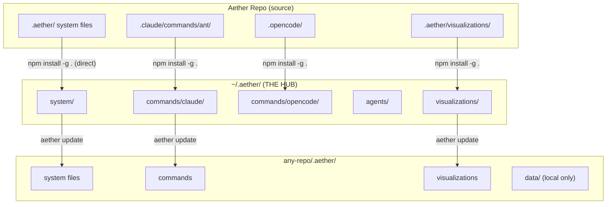
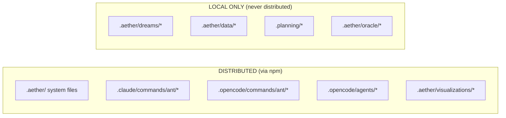
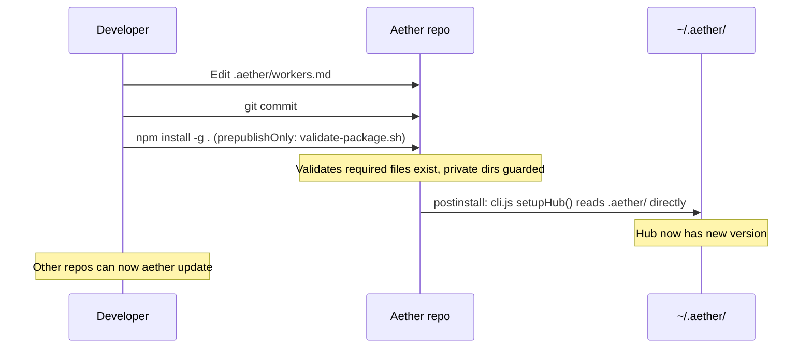
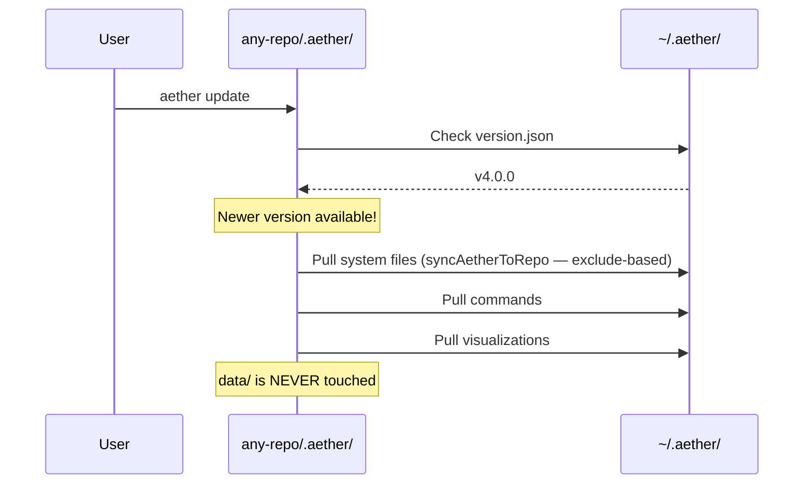

# Aether Architecture - How It Works (v4.0)

> **Historical note:** Prior to v4.0, a `runtime/` staging directory was used as an intermediary between `.aether/` and the npm package. This was removed in v4.0 to eliminate maintenance burden and the destructive update loop risk. `.aether/` is now packaged directly.

## The Core Concept

```
┌─────────────────────────────────────────────────────────────────┐
│                     AETHER REPO (this repo)                      │
│                                                                  │
│   .aether/             ← SOURCE OF TRUTH (packaged directly)    │
│   ├── workers.md       (edit here)                              │
│   ├── aether-utils.sh                                           │
│   ├── utils/                                                    │
│   └── docs/                                                     │
│                                                                  │
│   .aether/data/        ← LOCAL ONLY (excluded by .npmignore)    │
│   .aether/dreams/      ← LOCAL ONLY (excluded by .npmignore)    │
│                                                                  │
│   .claude/commands/ant/ ← Slash commands (Claude Code)          │
│   .opencode/commands/ant/ ← Slash commands (OpenCode)           │
│   .opencode/agents/     ← Agent definitions                     │
│                                                                  │
└─────────────────────────────────────────────────────────────────┘
```

## The Distribution Flow



## What Goes Where



## The Update Commands

### `npm install -g .` (in Aether repo)
Validates `.aether/` via `bin/validate-package.sh`, then pushes directly to hub



### `aether update` (in any repo)
Pulls latest from hub into that repo's `.aether/`



## Simple Rules

| Rule | Explanation |
|------|-------------|
| **Edit `.aether/` system files** | Source of truth in the Aether repo |
| **Edit `.claude/commands/ant/`** | Slash commands for Claude Code |
| **Edit `.opencode/agents/`** | Agent definitions |
| **`.aether/data/` is safe** | Colony state is never touched by updates |
| **In other repos, don't edit `.aether/`** | Working copies get overwritten by `aether update` |

## The Validation Script

`bin/validate-package.sh` runs before packaging to verify the `.aether/` directory is ready.

- Runs automatically as npm `prepublishOnly` hook
- Checks required files exist (workers.md, aether-utils.sh, etc.)
- Guards against private data exposure (verifies .aether/.npmignore covers data/, dreams/, oracle/, etc.)
- Supports `--dry-run` mode for pre-commit checks

```bash
# Manual run (normally automatic via npm install -g .)
bash bin/validate-package.sh

# Dry-run mode
bash bin/validate-package.sh --dry-run

# Verify what npm would actually package
npm pack --dry-run
```

## The Hub Sync (setupHub)

`bin/cli.js setupHub()` distributes content from the installed package to the hub (`~/.aether/`):

- **System files:** Walks `.aether/` directly using exclude-based approach (`HUB_EXCLUDE_DIRS`) — no allowlist
- **Claude commands:** Copies `.claude/commands/ant/` → `~/.aether/commands/claude/`
- **OpenCode commands + agents:** Copies from `.opencode/` directories
- **Rules:** Dedicated step copies `.claude/rules/` → `~/.aether/commands/rules/`

## The Target Repo Sync (syncAetherToRepo)

`bin/lib/update-transaction.js syncAetherToRepo()` distributes from hub to target repos:

- Exclude-based approach (`EXCLUDE_DIRS`) — no allowlist
- Excludes: data/, dreams/, oracle/, archive/, chambers/, locks/
- Only system files are distributed; local data is never touched

## The Visualizations

```
.aether/visualizations/ → DISTRIBUTED
.aether/dreams/         → NOT distributed (excluded by .npmignore)
.aether/data/           → NOT distributed (excluded by .npmignore)
```

Why? Visualizations are ASCII art assets needed by the `/ant:maturity` command, so they need to be distributed with the package.

## Quick Reference

```bash
# You changed system files in .aether/:
npm install -g .          # Validate + push to hub

# You want updates in another repo:
/ant:update               # Pull from hub

# CLI equivalent:
aether update             # Same as /ant:update
aether update --force     # Stash changes and update
```
