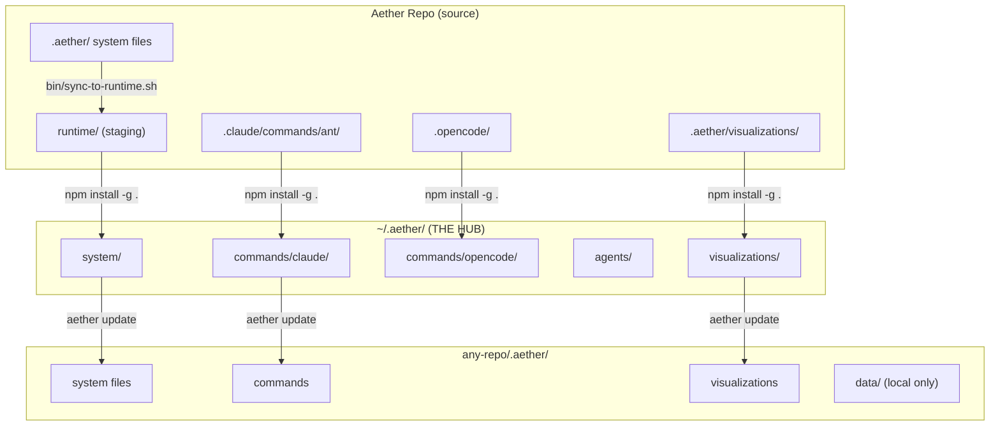
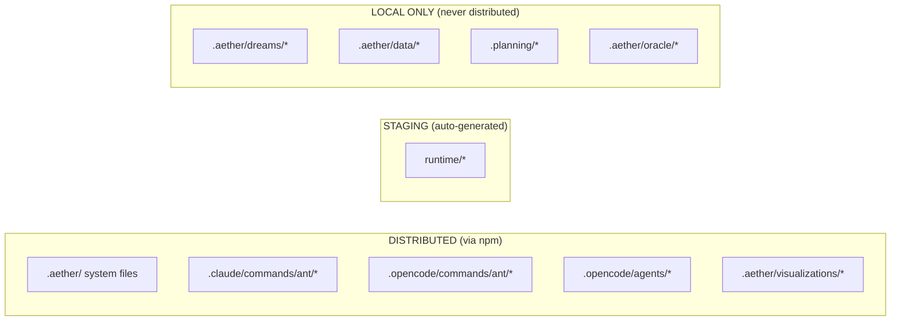
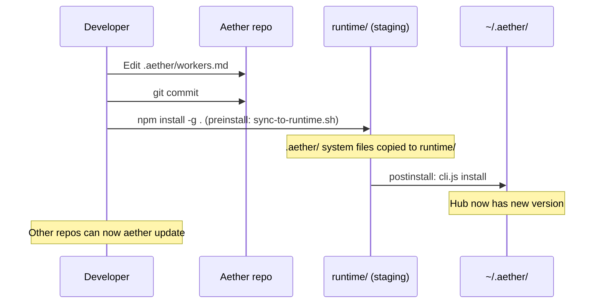
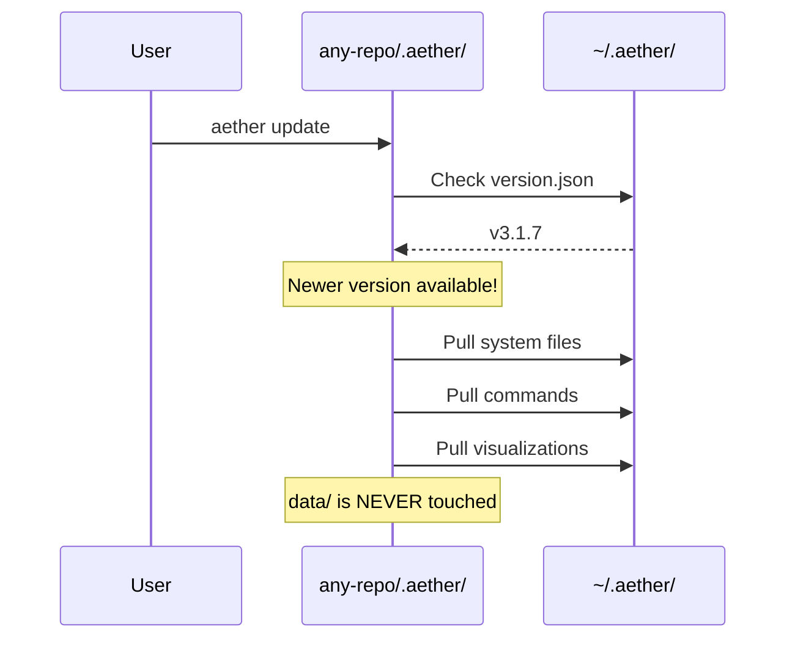

# Aether Architecture - How It Works

## The Core Concept

```
┌─────────────────────────────────────────────────────────────────┐
│                     AETHER REPO (this repo)                      │
│                                                                  │
│   .aether/             ← SOURCE OF TRUTH for system files       │
│   ├── workers.md       (edit here)                              │
│   ├── aether-utils.sh                                           │
│   ├── utils/                                                    │
│   └── docs/                                                     │
│                                                                  │
│   runtime/             ← STAGING (auto-populated, don't edit)   │
│                                                                  │
│   .claude/commands/ant/ ← Slash commands (Claude Code)          │
│   .opencode/commands/ant/ ← Slash commands (OpenCode)           │
│   .opencode/agents/     ← Agent definitions                     │
│                                                                  │
│   .aether/data/        ← LOCAL ONLY (colony state, never sync)  │
│                                                                  │
└─────────────────────────────────────────────────────────────────┘
```

## The Distribution Flow



## What Goes Where



## The Update Commands

### `npm install -g .` (in Aether repo)
Syncs .aether/ to runtime/, then pushes to hub



### `aether update` (in any repo)
Pulls latest from hub into that repo's `.aether/`



## Simple Rules

| Rule | Explanation |
|------|-------------|
| **Edit `.aether/` system files** | Source of truth in the Aether repo |
| **Edit `.claude/commands/ant/`** | Slash commands for Claude Code |
| **Edit `.opencode/agents/`** | Agent definitions |
| **Don't edit `runtime/` directly** | It's auto-populated from `.aether/` on publish |
| **`.aether/data/` is safe** | Colony state is never touched by updates |
| **In other repos, don't edit `.aether/`** | Working copies get overwritten by `aether update` |

## The Sync Script

`bin/sync-to-runtime.sh` copies allowlisted system files from `.aether/` to `runtime/`.

- Runs automatically as npm `preinstall` hook
- Uses the same allowlist as `update-transaction.js`
- Only copies changed files (hash comparison)
- Never deletes extras in `runtime/` (templates, signatures, etc.)

```bash
# Manual run (normally automatic)
bash bin/sync-to-runtime.sh

# Reverse sync (seed .aether/ from runtime/, one-time use)
bash bin/sync-to-runtime.sh --reverse
```

## The Visualizations Exception

```
.aether/visualizations/ → DISTRIBUTED
.aether/dreams/         → NOT distributed
.aether/data/           → NOT distributed (local state)
```

Why? Visualizations are ASCII art assets needed by the `/ant:maturity` command, so they need to be distributed with the package.

## Quick Reference

```bash
# You changed system files in .aether/:
npm install -g .          # Auto-sync + push to hub

# You want updates in another repo:
/ant:update               # Pull from hub

# CLI equivalent:
aether update             # Same as /ant:update
aether update --force     # Stash changes and update
```
