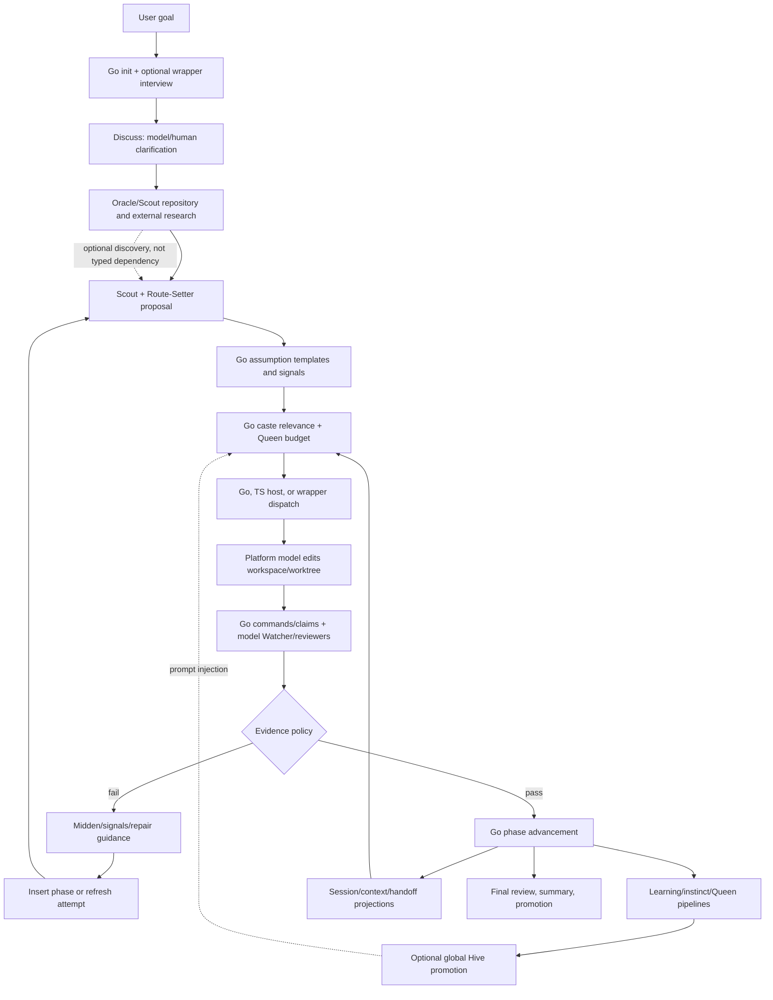
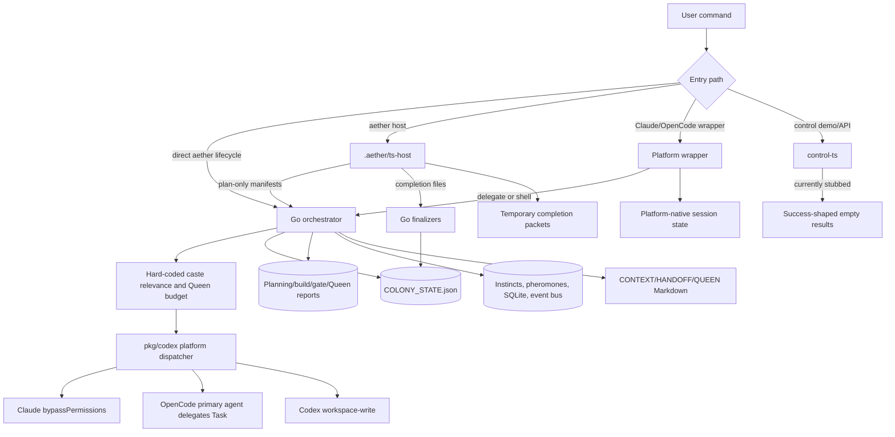
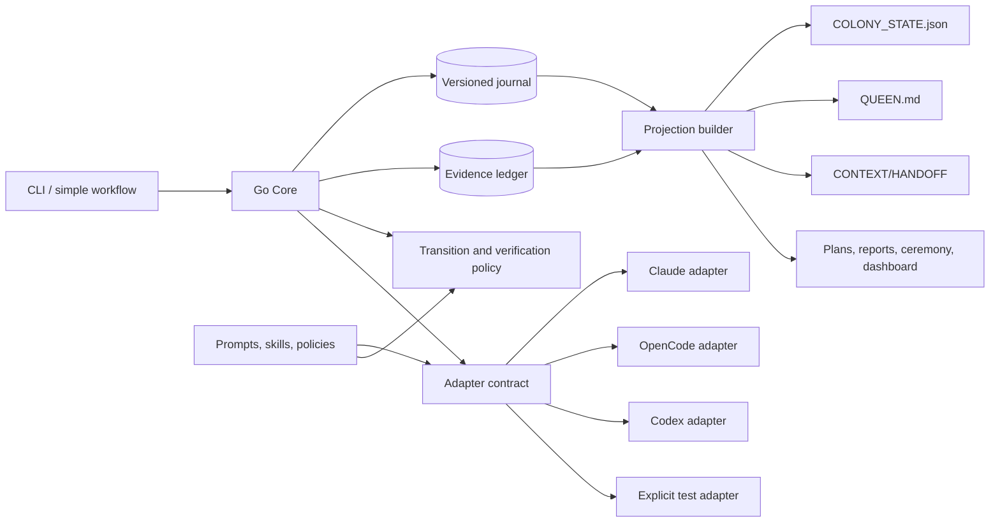

# Current Architecture And Runtime Truth

## Executive Map

Aether currently has four behavioral layers:

1. **Go CLI and runtime**: Cobra registration, state, direct lifecycle orchestration, worker selection, subprocess dispatch, verification, memory, install/update, and visuals.
2. **Mature TypeScript host** in `.aether/ts-host`: calls Go plan-only/finalizer commands, dispatches workers, runs lifecycle/Oracle/watch/swarm flows, and renders ceremony.
3. **New TypeScript control plane** in `control-ts`: schemas, orchestration scaffold, stub adapters, and in-memory event stubs.
4. **Platform/editable assets**: Claude/OpenCode wrappers, Codex TOML agents, YAML command sources, skills, playbooks, Queen/context Markdown, and generated companion files.

The public `aether` command does not consistently route all lifecycle work through one of these layers. This is the central split-brain condition.

## Requested End-To-End Data Flow

The dotted edges are the weakest advertised loops: research-to-plan is not a required typed dependency, and Hive influence is prompt injection rather than validated policy.

## Entry Points And Registration

- Binary: `cmd/aether/main.go` calls `cmd.Execute()`.
- Root/Cobra setup: `cmd/root.go`.
- Shared data store: initialized by `PersistentPreRunE` for most commands.
- Public surface: `aether audit-catalog` reports 396 entries: 22 lifecycle, 356 utility, 9 aliases, 2 internal runtime, and 7 unclassified.
- Direct lifecycle implementations: `cmd/codex_{init,colonize,plan,build,continue,seal}*.go` plus Oracle and discuss commands.
- Host lifecycle: `cmd/host_cmd.go` launches `.aether/ts-host` for colonize, plan, build, continue, seal, lifecycle, Oracle, watch, and swarm.
- Wrapper lifecycle: `.claude/commands/ant/*.md` and `.opencode/commands/ant/*.md` interpret YAML/playbook guidance and may use platform-native agents.

## Current Data Flow

## Lifecycle Transition Map

| Transition | Current owner(s) | Reads | Writes | Reasoning | Interruption/retry truth |
| --- | --- | --- | --- | --- | --- |
| Goal -> initialization | Go `init`; wrappers may interview first | hub assets, existing state, Git | state, session, charter, context, scaffold | Human/model wrapper plus deterministic Go | State backup exists; repeated init is protected, but setup files appear as unreconciled work |
| Initialization -> discussion | Go `discuss`, platform wrapper | goal, charter, prior clarifications | clarifications, long-lived REDIRECT signals | Model/human | Retry can duplicate policy intent through signals; questions can be generic |
| Discussion -> research | Standalone Go Oracle or wrapper/TS host | goal, context, repo, Oracle state | `.aether/oracle/*`, events | Model loop; Go state machine | Durable iterations exist; incomplete results remain, but consumer link is optional |
| Research -> planning | Direct Go plan workers, TS host, wrapper | state, survey, context; workers can discover Oracle files | planning reports, phase plan, then canonical state | Scout/Route-Setter model synthesis plus Go finalizer | High-quality reports can exist without canonical plan; retry clears/overwrites them |
| Plan -> assumptions | Go `assumptions-analyze` | plan text | `assumptions.json`, FOCUS/FEEDBACK | Deterministic templates/heuristics | Safe to rerun imperfectly; findings do not transactionally invalidate plan |
| Plan -> worker selection | Go `caste_relevance.go` and build policy | phase text, mode, depth | manifest, Queen selection metadata | Keyword scoring and hard-coded rules | Deterministic, inspectable in manifest; can over-select severely |
| Selection -> dispatch | Direct Go, TS host, or wrappers | prompts, agents, skills, context, signals | process logs, spawn tree, worker results | Platform model | Platform behavior differs; cancellation can still lead to `BUILT` |
| Dispatch -> implementation | Platform worker | full workspace/worktree | repo files and claims | Model with tools | In-repo serializes task workers; worktrees run parallel but overlapping merge can lose data |
| Implementation -> verification | Build watcher and `continue` | Git/files, claims, manifests, inferred commands | reports, gate results, Queen decisions | Deterministic checks plus model reviewers | Strong stale/path checks; unresolved commands are marked skipped and can still permit advance |
| Verification -> feedback/replan | continue, suggestions, signals | reports/failures | midden, pheromones, task state | Heuristics/model | Failure can keep phase active; completed phases cannot be replanned in place |
| Advancement -> memory | continue learning pipeline | claims, worker summaries, gates | state memory, `instincts.json`, Queen, event bus, SQLite | Deterministic scoring plus model text | Multiple pipelines diverge; uncached memory test currently fails |
| Project -> Hive | `hive-promote` | supplied instinct/source string | global `hive/wisdom.json` | String replacement and source-count tiers | No lock, evidence validation, contradiction, revocation, or project relevance gate |
| Session -> resume | `resume`, session/context/handoff helpers | state, `HANDOFF.md`, `CONTEXT.md`, session, Git | state/session/context, deletes handoff | Deterministic projection recovery | Can recover goal while losing plan; freshness and displayed handoff truth can conflict |
| Completion -> seal | direct/host/wrapper seal | state, final review, gates, Git | seal reports, Queen/Hive promotions | Deterministic plus model review | Broad surface; cannot be trusted until completion policy is repaired |

## Transition Safety Matrix

| Transition | Interrupted state | Idempotent now? | Stale-state risk | Platform divergence | Safe retry now? |
| --- | --- | --- | --- | --- | --- |
| Setup/init | Backups and partial scaffold may remain | Mostly for setup; init protected | Generated files can appear as work | Asset destinations differ | Usually, with manual awareness |
| Discuss | Clarifications/signals may be partially persisted | Not fully specified | Long-lived answers can outlive intent | Wrapper interview differs from direct CLI | Limited |
| Oracle | Iteration artifacts/state remain | Iteration finalizer has guards | Incomplete/low-confidence synthesis can persist | Host/wrapper/direct entry differs | Usually within Oracle, not consumer link |
| Plan | Worker reports may exist without accepted state | No universal operation ID | Retry may clear better artifacts | Delegate/host/direct synthesis differs | No, observed data loss |
| Assumptions | Separate assumptions and signals remain | Re-run regenerates template IDs/content | Assumptions do not track plan revision | Mostly Go-shared | Limited |
| Selection | Plan-only manifest is nonmutating | Deterministic for same inputs | Global skills/signals may change inputs | Host platform diagnosis/fallback differs | Yes for plan-only |
| Dispatch/build | Partial edits, worktrees, failed results and `BUILT` may remain | Task force retry exists, not universal | Claims/process/state can disagree | Process, permissions and delegate path differ | No, inspect continue/reconcile |
| Verification | Reports may be partially replaced/cleared | Some stale checks and cached-step behavior | Skipped/stale commands and claims | Watcher availability/permissions differ | Limited |
| Advance | Multiple reports and state write boundary | Finalizer freshness checks exist | Projection can disagree after partial write | Wrapper/host can choose different review path | Limited |
| Learn/promote | Some stores updated before others | Dedup varies by store | Contradictions and old conventions persist | Shared Go paths, prompt influence differs | No universal transaction |
| Resume | Handoff may be consumed/deleted | Repeated resume changes projections | Branch/baseline and lost plan risk | Platform session history is outside Go | Partial only |
| Seal | Final reports/promotions may be partial | Protected command, many substeps | False COMPLETED input and stale evidence | Wrapper/host ceremony differs | Unproven end to end |

## State Stores And Competing Truth

| Store | Intended role | Current issue | Canonical future status |
| --- | --- | --- | --- |
| `.aether/data/COLONY_STATE.json` | Colony lifecycle | Broad but missing artifact/evidence/rationale links; some paths bypass transaction | Canonical materialized state derived from journal |
| `.aether/data/session.json` | Resume summary/freshness | Duplicates goal, next action, phase, baseline | Derived projection only |
| `.aether/CONTEXT.md` | Model-readable capsule | Can be stale and was pre-existing dirty during audit | Derived projection with source revision/run ID |
| `.aether/HANDOFF.md` | Cross-session recovery | Can reconstruct only a reduced state and is deleted on resume | Derived recovery view; never sole backup |
| planning reports and `phase-plan.json` | Worker synthesis/evidence | May be newer and better than canonical plan; retry deletes them | Evidence attachments linked to planning transaction |
| build manifest, claims, result collection | Dispatch and evidence | Strong structure, but terminal build state is not derived strictly from it | Canonical run/evidence records |
| gate, Queen decision, recovery, audit files | Verification decision | Multiple phase files summarize the same transition | One decision record with projections |
| `instincts.json` and state memory | Project learning | Duplicate pipelines and schemas | Evidence-backed project knowledge records |
| `colony.db` | Learning/query store | Parallel projection with separate lifecycle | Optional index rebuilt from journal |
| local/global `QUEEN.md` | Wisdom/preferences/identity | Mixes user preferences, project lessons, and global lessons | Readable projection; separate typed sources |
| global Hive JSON | Cross-project wisdom | Unsafe confidence and no contradiction/provenance | Optional, quarantined evidence-backed store |
| Oracle directory | Research state/artifacts | Useful durable state but weak plan linkage | Canonical research records plus rendered artifacts |
| platform sessions | Native agent context | Not visible to Go state; platform-dependent | Adapter telemetry only, never lifecycle state |
| Git worktree | Actual implementation | Can contradict claims/state; manual edits and branches complicate baseline | External evidence source with recorded commit/tree fingerprints |

## Canonical State Recommendation

Use one append-only, versioned **colony journal** plus a materialized `COLONY_STATE.json` view. Every state-changing command performs:

1. Load state and current Git/workspace fingerprint.
2. Acquire colony transition lock.
3. Validate expected state and idempotency key.
4. Append `transition.started` with run ID and input artifact hashes.
5. Produce manifests without advancing lifecycle state.
6. Accept adapter results into an evidence ledger.
7. Evaluate deterministic policy and model-review evidence separately.
8. Append exactly one `transition.committed`, `transition.paused`, or `transition.aborted` event.
9. Rebuild state and human-readable projections atomically.

`QUEEN.md`, `CONTEXT.md`, `HANDOFF.md`, session JSON, planning reports, ceremonies, dashboards, and SQLite are projections. They may be deleted and rebuilt without losing lifecycle truth.

## Recommended Target Boundary

### Go Core Owns

- Schemas, migrations, locks, journal, idempotency, state projection.
- Manifest/result validation, evidence hashes, path safety, Git fingerprints.
- Lifecycle transition policy, recovery, install/update/rollback, checksums.
- Exit codes and JSON/visual truth.

### Adapter Owns

- Platform preflight and explicit selection.
- Model/session launch, native subagent mapping, streaming, cancellation, timeout.
- Enforced capability and permission declaration.
- Structured result and telemetry delivery.

### Editable Assets Own

- Prompt content, role guidance, skill content, routing policy inputs, ceremony copy.
- They cannot mutate state or define success without a validated policy schema.

## Current Cross-Platform Contract Matrix

| Surface | Claude Code | OpenCode | Codex CLI | Current authority / truth |
| --- | --- | --- | --- | --- |
| Installation | Global Markdown commands/agents | Two global command/agent destinations | Global TOML agents + generated skills | Go install copies assets; version set can skew |
| Agent definitions | 27 Markdown agents | 27 Markdown agents | 27 TOML agents | Three canonical-looking copies, no single generator |
| User commands | Slash-command wrappers plus `aether` | Slash-command wrappers plus `aether` | Direct `aether`; no slash wrappers | YAML/playbooks, wrappers and Go overlap |
| Init/discuss | Wrapper can interview before Go | Same copied workflow | Codex skill orchestration or direct Go | Intent quality is wrapper/skill-dependent |
| Colonize | Native agent/delegate or host | Native primary agent delegates | Direct subprocess/fallback | Go state/finalizer; reasoning path differs |
| Planning | Wrapper/host/direct paths | Wrapper/host/direct paths | Direct Go workers or Codex skill | Go commits plan, but proposal generation differs |
| Research | Wrapper/TS Oracle and Go loop | Wrapper/TS Oracle and Go loop | Direct Go Oracle/Codex worker | Oracle state is Go-owned; lifecycle link optional |
| Worker selection | Go Queen budget plus wrapper behavior | Same Go scoring plus indirect delegation | Go hard-coded scoring | Go selection metadata is inspectable |
| Worker spawn | Named Claude `--agent` | Primary OpenCode agent instructed to spawn Task | `codex exec` per worker | `pkg/codex` implementations differ materially |
| Tool permissions | `bypassPermissions` in Go dispatcher | Primary agent permissions/config | `workspace-write` for all castes | Prompt role restrictions are not enforced |
| Signals | Prompt section injected | Prompt section injected | Prompt section injected | Go storage/context; model interpretation differs |
| Build | Direct Go, host, or wrapper delegate | Direct Go, host, or wrapper delegate | Direct Go primarily | Multiple execution owners possible |
| Continue/verification | Deterministic Go plus native reviewers | Deterministic Go plus indirect reviewers | Deterministic Go plus Codex watcher | Go advancement, but reviewer availability/skip differs |
| Context capsule | Shared Go projection plus Claude memory | Shared projection plus OpenCode session | Shared projection plus Codex context | Platform session state is not canonical or portable |
| Resume | Wrapper may restore native context plus Go | Same conceptual wrapper | Go `resume` and Codex skill | No contract for native session equivalence |
| Memory/Queen/Hive | Shared files injected through wrapper/prompt | Shared files injected | Shared files injected | Go/file stores; influence is model-dependent |
| Seal | Wrapper choreography + Go | Wrapper choreography + Go | Direct Go/skill | Completion input is not yet trustworthy |
| Ceremony | Wrapper prose plus runtime events | Wrapper prose plus runtime events | Go visual renderer | Can diverge from actual terminal state |
| Errors | Wrapper may parse JSON/exit | Same | Direct shell exit | `outputError` often exits 0 everywhere |
| Autopilot | Wrapper/host/run options | Wrapper/host/run options | `aether run` compatibility | Inherits core false-completion risk |

Future parity must require invariant state/evidence behavior and disclose allowed presentation/native-capability differences. Byte-identical prompts or role files are not the contract.

### Queen Owns

- A project-facing coordination projection: goal, current decision, open uncertainty, workers, evidence, blockers, signals, and next transition.
- Queen does not own global preferences, Hive confidence, low-level locks, or an independent state machine.

## Idempotency And Retry Contract

Every lifecycle request needs a stable operation ID from command, colony session, phase, task set, input state revision, and platform. Retrying the same operation must either return the committed result or resume incomplete dispatch collection. It must not delete better artifacts, redispatch completed tasks, or advance from a new Git baseline without explicit reconciliation.

Branch or rebase changes invalidate workspace-bound evidence. Manual changes create a reconciliation event, not automatic implementation credit. A stale lock is recoverable only after the owning process/run is proven dead and its transition is paused.

## Security Boundaries

- `pkg/storage.Store.resolvePath` accepts absolute paths and `..`; internal callers currently rely on some absolute access, so containment must be introduced through explicit scoped stores rather than a breaking blanket check.
- Claude workers run with `--permission-mode bypassPermissions`; Codex uses `workspace-write` for every caste. "Read-only" is prompt text, not enforcement.
- Repository documents, skills, research sources, Queen/Hive text, and signals enter prompts. Sanitizers cover some structural injection, not semantic instruction attacks.
- `hive/wisdom.json` uses direct read/write with no global lock, allowing lost updates.
- Release downloads verify SHA-256 checksums, a capability to preserve.
- No non-fixture secret was found by the audit's repository scan; `govulncheck` was unavailable, so dependency vulnerability status is unproven.

## Current Test Truth

- `go build ./cmd/aether`: pass.
- `go vet ./...`: pass.
- `goreleaser check`: pass.
- `go test ./... -count=1`: fail in `pkg/memory/TestPipeline_Consolidation`.
- `go test ./... -race`: same memory failure. The targeted non-race test also failed 5/5, so this is not race-only.
- `.aether/ts-host`: 512 tests pass; typecheck passes. Much dispatch coverage uses fake invokers.
- `control-ts`: typecheck passes; tests fail because integration cleanup targets the live repository state file. Its adapters and event bridge remain explicit stubs.
- npm bootstrap unit tests: 7 pass, but the real public npm install fails. Unit fixtures did not cover the `v1.0.22` archive member casing.
